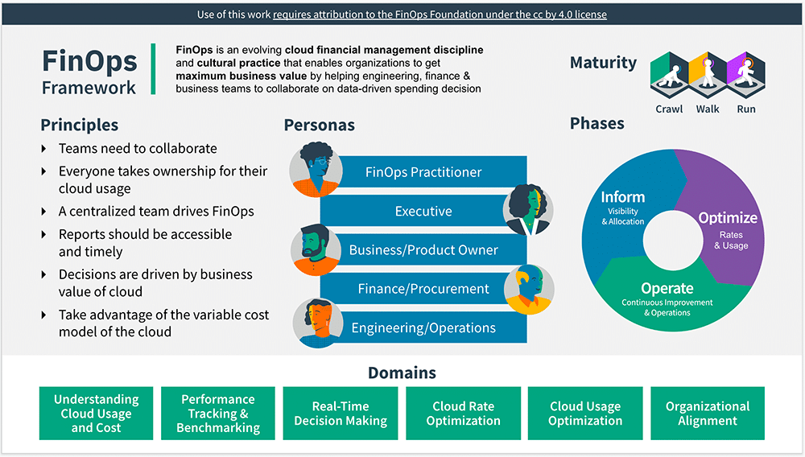

# FinOps 맛보기

## FinOps 소개
초기 기업들은 단순히 아래의 용어들을 사용하였습니다.
- 클라우드 비용 관리
- 클라우드 비용 최적화
- 클라우드 재무관리

AWS Public Sector Summit DevSecOps talk에서 FinOps라는 용어를 처음 언급하였습니다.
```text 
- 데브옵스 DevOps: 개발(Development)와 운영(Operation) 간의 공동 작업 관계를 요구/주장하는 최근 업무방식
- 핀옵스 FinOps: 데브옵스(DevOps)와 재무(Finance) 간의 공동 작업 관계를 요구/주장하는 최근 업무 방식
```
FinOps란 분산된 여러 팀이 속도, 비용, 품질 간에 비즈니스 균형을 이룰 수 있도록 가변적 지출 클라우드 모델에 재정적 책임을 부여하는 업무 방식(practice)입니다.

- 핀옵스는 단순한 비용절감이 아니라 클라우드를 '잘' 쓰는 것입니다
- 다시 말해서 클라우드의 장점을 최대한 활용하여 혁신을 가속화 하는 것입니다

## [FinOps 원칙 6가지](https://www.finops.org/framework/principles/)
FinOps 원칙은 핀옵스 실무의 활동을 안내하는 북극성(north star) 역할을 합니다.

```text
1. 팀은 서로 협력해야 합니다.
- 클라우드가 리소스별, 초 단위로 운영되므로 재무, 기술, 제품 및 비즈니스 팀은 준 실시간으로 협력합니다.

2. 클라우드의 비즈니스 가치에 따라 의사결정이 이루어집니다.
- 단위 경제 및 가치 기반 지표는 총 지출보다 비즈니스에 미치는 영향을 더 잘 보여줍니다.

3. 누구나 클라우드 사용에 대한 소유권을 갖습니다.
- 엔지니어는 아키텍처 설계부터 지속적인 운영에 이르기까지 비용을 소유함으로써 사용량과 비용에 대한 책임을 가집니다.

4. 핀옵스 보고서는 적절한 시기에 접근 가능해야 합니다.
- 비용 데이터는 생성되는 대로 되는 처리되고 공유해야 합니다.

5. 중앙집중화된 팀이 핀옵스를 주도합니다
- 핀옵스의 중앙집중화된 자동화로 중복 작업을 중일 수 있습니다

6. 클라우드의 가변 비용 모델을 활용합니다.
- 클라우드의 가변 비용 모델은 위험이 아닌 더 많은 가치를 제공할 수 있는 기회입니다.
```

## [클라우드 단위 경제학](https://www.finops.org/wg/introduction-cloud-unit-economics/)
- 클라우드 단위 경제학은 조직이 핀옵스 목표뿐만 아니라 시장에서 비즈니스로서의 성과를 얼마나 잘 달성하고 있는지에 대한 객관적인 측정을 기반으로 수익을 극대화하는 시스템으로 정의할 수 있습니다.
- 단위 경제학에서 '단위'는 판매와 관련된 비용과 수익을 계산할 수 있는 고객, 제품, 서비스 또는 기타 항목으로 정의합니다.
- 다시 말해서 클라우드를 '잘' 쓰고 있는지에 대한 지표로 사용할 수 있습니다.
- ex) 활성사용자 / 클라우드 비용 => 클라우드 비용 1달러로 얻을 수 있는 활성사용자 
- ex) 사업 매출 / 클라우드 비용 => 클라우드 비용 1달러로 얻을 수 있는 매출

## [FinOps 프레임워크](https://www.finops.org/framework/)

FinOps 프레임워크는 핀옵스 실행을 확립하고 탁월하게 실행하는 방법에 대한 운영 모델을 제공합니다.
 
### [FinOps 페르소나](https://www.finops.org/framework/personas/)
핀옵스에는 다양한 이해관계자들이 존재합니다. 모든 회사에는 다음과 같은 방식으로 조직이 구성되어있지는 않지만 누군가는 아래의 업무를 수행하기에 각자의 관심사와 이해관계를 이해하는 것이 중요합니다.

#### FinOps 실무자
- 교육, 표준화, 문화적 성장 및 지원을 통해 FinOps 모범 사례를 조직에 도입하려고 합니다.
- 주로 CTO의 직속 조직에 있습니다.

#### 경영진
- CEO: 클라우드 투자가 비즈니스 목표에 부합하도록 보장합니다.
- CTO/CIO: 기술을 활용하여 비즈니스에 시장과 경쟁 우위를 제공하려고 합니다.
- CFO: 조직 전반의 다른 비용 중에서도 클라우드 사용 비용을 관리하고 비용이 현명하게 지출되도록 합니다.

#### 프로덕트 오너
적절한 가격으로 새로운 제품과 기능을 신속하게 시장에 출시하려고 합니다.

#### 재무팀
- 클라우드 비용 관련하여 적절한 예산을 책정하고 예측하고 보고서를 작성합니다.

#### 조달팀
- 클라우드 공급자와의 관계를 관리합니다.

#### 엔지니어링
- 일상적인 비즈니스를 유지하면서 조직에 더 빠르고 고품질의 서비스를 제공하려고 합니다.

### [FinOps 성숙도 모델](https://www.finops.org/framework/maturity-model/)
기기, 걷기, 달리기 순으로 조직은 소규모로 FinOps 활동을 시작하여 비즈니스 가치에 따라 기능적 활동의 성숙도에 따라 규모, 범위, 복잡성을 확장할 수 있습니다.
모든 영역이 같은 성숙도일 수는 없고 각 영역마다 기기, 걷기, 달리기의 순서로 FinOps 활동을 진행합니다.

#### 기기(crawl)
- 리포트가 도구가 거의 없는 단계
- 수동
#### 걷기(walk)
- 조직 내 일부 팀이 FinOps 역량을 가지고 있고
- 자동
#### 뛰기(run)
- 조직 내 모든 팀이 FinOps 역량을 이해하고 준수합니다
- 자동을 넘어서 예측

### [FinOps 수명주기 3단계](https://www.finops.org/framework/phases/)
FinOps는 아래의 3단계 수명주기를 반복합니다.

#### 정보제공(inform)
이 단계는 핀옵스 여정의 첫 번째 단계로, 조직과 팀이 가시성, 할당, 벤치마킹, 예산 책정 및 예측을 통해 역량을 강화할 수 있도록 지원합니다.
- 비용발생 원인 이해 및 지출액 할당

#### 최적화(optimize)
조직과 팀이 권한을 부여받은 후에는 클라우드 공간을 최적화해야 합니다. 클라우드 제공업체는 최적화를 위한 다양한 수단을 제공합니다.
- 클라우드 사용량 최적화 작업 진행

#### 실행(operate)
조직은 비즈니스 목표와 이러한 목표에 대해 추적하고 있는 지표, 그리고 이러한 지표의 추세를 지속적으로 평가하기 시작합니다.
- 사업적 목표를 기준으로 핀옵스 활동에 대한 평가

## 참고
- https://www.finops.org/introduction/what-is-finops/