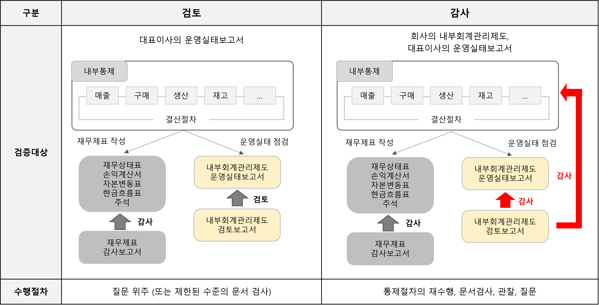

# ITGC 소개

## 내부회계관리제도
- 기업의 재무 정보상 신뢰성 확보를 위해 회사가 갖추고 지켜야 하는 내부 통제제도
- 재무제표를 신뢰할 수 있는 시스템을 가지고 있는지 점검하는 것
- 내부회계관리제도의 대상과 시점은 [다음](https://partner.polarisofficecorp.com/atlassian/pages/viewpage.action?pageId=4523303)을 참고

## 검토 vs. 감사
- 내부회계관리제도 수준이 '검토'에서 '감사'로 강화되고 감사 대상이 확대됨에 따라서 국내 상장사는 큰 변화를 맞이하게 됨
- 2023년부터 모든 상장사가 내부회계관리제도 외부감사의 대상이 되면에 이를 대응하기 위한 IT시스템 구축에 많은 관심이 모이고 있음

<center>(출처) https://partner.polarisofficecorp.com/atlassian/pages/viewpage.action?pageId=4523303</center>

- 검토는 문답 위주 방식인 반면 감사는 증적 자료의 점검, 통제활동의 재수행, 감사인의 방문 관찰이 포함된 강화된 절차로 이루어짐

## 내부회계관리제도의 IT 통제부문: ITGC vs. ITAC
- 기업에서 IT 시스템 운영 및 환경이 차지하는 비중이 증가하면서 IT 통제 부문의 감사가 중요해지고 있음

### ITGC (IT General Control)
- 정보기술 일반 통제
- 전산에 대한 권한 관리, 서버에 대한 정기적인 백업, 방화벽 및 해킹 방지 등 전사을 운영하기 위한 일반적인 업무 원칙에 대한 통제를 수립하는 것
- ex) 소스코드에 대한 변경, 프로그램 배포, DB 접근 및 데이터 변경은 권한을 가진 사람이 승인 하에 이루어져야 함
- 주로 IT오피스(전산), 보안, 인프라 엔지니어(DevOps, SRE), HR 조직 해당 

### ITAC (IT Application Control)
- 정보기술 자동 통제
- 재무제표에 반영되는 숫자의 정확성을 톺이기 위해 IPE나 EUC에 의해 값이 입력되는 것이 아니라 전표 자동 생성 혹은 환차손 자동 계산 등 정보기술을 이용하여 값이 자동으로 반영될 수 있도록 설계하거나 원칙적으로 접근제어를 이용하여 모든 사용자 기록을 남기고 외부침입자의 접근을 자동으로 막는 것을 뜻함
- IPE(Information Produced by Entity): 실무자가 실무를 하는 과정에서 회사의 IT 통합 시스템을 통해 전산적으로 만들어 내는 자료가 아니라 개인의 엑셀, 워드 자료 등 실무자 개인의 PC에서 회사의 IT 통합시스템을 통하지 않고 만들어내는 모든 종류의 문서  
- EUC(End User Computing): 마지막 실무자가 IPE를 IT통합 시스템에 입력하는 행위
- 내부회계관리제도에서는 실무자가 직접 자료를 만들어서 입력하는 행위가 심각한 에러를 발생할 수 있음을 인지하고 이를 통제하는 절차를 수립하게 됨
- ex) 재무담당자가 엑셀로 작성한 내용을 그대로 회계시스템에 반영하는 것은 위험하며 이를 통제할 필요가 있음
- 주로 상품, 물류, 주문, 영업 등 재고/자산에 영향을 미치는 시스템을 다루는 조직 해당

## ITGC의 순서
- 통제활동의 범위를 정하고: Scoping
- 각 통제활동을 점검함: APD, PD, PC, CO

### Scoping
1. 재무제표 중요 계정 선정
  - 계정의 명칭을 '계정과목'이라고 하며, 계정과목은 종류나 성질이 다른 다양한 거래를 일관된 기준으로 정리할 수 있도록 하는 기본단위임
2. 중요 계정과 관련된 Process, Subprocess/Transaction에 대한 연결부 파악
3. Transaction과 연관되어있는 risk에 대한 예방 및 발견하기 위한 IT의존통제(ex. 접근제어솔루션), 수동/자동통제 설계(ITAC)
4. 선정됨(In-Scope) 시스템에 대하여 GITC(=ITGC) 감사 수행

### 각 통제활동
#### APD (Access to Program Data, 프로그램 및 데이터 접근) 
- 데이터에 대한 승인되지 않은 접근으로 데이터가 위조, 변조, 훼손 및 파기될 위험 통제
- 아무나 데이터에 접근할 위험은 있는가?
```text
- Application, Database, OS 권한 생성 및 회수
- Application, Database, OS 사용자 계정 및 권한 모니터링
- Application, Database, OS, Network 패스워드 정책
- Application(특수계정보유여부), Database(DML 권한 여부), OS(root 권한 여부), Network(특수계정보유여부) 특수 권한자 파악
- 보안 모니터링 : OS, DB, 내부망 불법접근 모니터링
- 물리적 보안 : 서버실 접근 기록 및 시건장치여부
```

#### PC (Program Changes, 프로그램 변경)
- 승인되지 않은 시스템 및 프로그램의 수정 위험 통제
- 아무나 시스템을 변경할 위험은 없는가? 
```text
- Application 형상변경 절차(일반/긴급) : 요청 > 개발 > 테스트 > 이관, 개발자/이관자 분리여부, 개발환경/운영환경 분리여부
- Application 형상변경 이관자 : 이관 수행자는 개발자가 아니어야함.
- 데이터 원장 변경 절차 : 요청 > 제3자검토 > 반영, 중요 데이터 전/후 기록여부, 원장 변경 권한 보유자
- 인프라 변경 절차 : 주요 Application에 대한 OS, DB 최종변경일자를 확인하여 테스트, 승인 등의 작업계획서 확인(버전 취약점 방지)
```

#### CO (Computer Operation, 컴퓨터 운영)
- 데이터 유실 위험 또는 필요한 데이터를 사용하지 못할 위험 통제
- 데이터는 안전한가?
```text
- 배치작업 등록 및 변경 : 요청 > 승인(배치담당자) 여부
- 배치작업 관리자 : 배치작업 등록/변경/삭제 권한 보유자 모니터링 여부
- 배치작업 모니터링 : 정상/오류 건에 대한 상위권자 보고 및 문서화 여부
- 데이터 백업 모니터링 : 정상/오류 건에 대한 상위권자 보고 및 문서화 여부
- 데이터 백업 관리자 : 백업 등록/변경/삭제 권한 보유자 모니터링 여부
- 장애 관리 : 보고절차 및 모니터링을 통한 이력 관리 여부
- 재해복구훈련 : 계획서 및 결과서
- 취약점 진단 : 계획서 및 결과/이행 계획
```

#### PD (Program Development, 프로그램 개발)
- 새롭게 적용된 시스템에 오류 등의 사유로 불완전하고 부정확하게 데이터가 생성될 위험 통제
```text
- 프로그램 개발 절차 : 착수준비 > 분석 및 설계 > 구축 > 테스트 및 검증 > 데이터 변환 및 이관 > 적용 > 사용자 교육 및 메뉴얼
- 운영서비스 업체 선정 및 평가 모니터링 절차 및 승인
```

### [성공적인(?) ITGC를 위한 몇 가지 요소 (by Atlassian)](https://partner.polarisofficecorp.com/atlassian/pages/viewpage.action?pageId=4523303)
1. 절차적 프로세스 구현
```text
- 변경 사유에 대한 명확한 요구사항 수집
- 관리자 측면에서의 개발 현황 모니터링
- 프로세스에 대한 역할/권한 분리
- ex) 이슈 생성 -> 개발진행 -> 테스트/빌드/배포
```

2. 변경 행위에 대한 증적 기록 및 분석
```text
- 소스 변경에 대한 히스토리 관리
- 빌드 및 배포에 대한 히스토리 관리
- 변경 이력에 대한 기록 추출
- ex) 머지/배포/DB변경 기록이 모두 남아야 함
```  

3. 개발자 및 배포자(결재권자)의 분리
```text
- 절차와 통제에 따른 업무 분장 
- Pull Request를 통한 승인 절차 부여
- ex) 머지/배포/DB변경 요청자와 승인자는 달라야 함
```

## 참고
- [내부회계관리제도 IT감사 요구사항 및 대응방안](https://partner.polarisofficecorp.com/atlassian/pages/viewpage.action?pageId=4523303)
- [ITGC란? IT General Control(정보기술 일반통제)](https://m.blog.naver.com/run7572/222831565137)
- [내부회계관리제도, IT시스템 통제는 왜 필요한가?](https://www.pwc.com/kr/ko/insights/sgc/samilpwc_ksox-series_aug2023.pdf)
- [스타트업 상장 준비 중이라면 꼭 체크! 내부통제제도](https://info.bridgepartners.kr/hc/ko/articles/21467106377241-%EC%8A%A4%ED%83%80%ED%8A%B8%EC%97%85-%EC%83%81%EC%9E%A5-%EC%A4%80%EB%B9%84-%EC%A4%91%EC%9D%B4%EB%9D%BC%EB%A9%B4-%EA%BC%AD-%EC%B2%B4%ED%81%AC-%EB%82%B4%EB%B6%80%ED%86%B5%EC%A0%9C%EC%A0%9C%EB%8F%84)
- [내부회계관리제도 주요 용어 정리(RCM, ELC, PLC, FC, MRC, ITGC, EUC, IPE 등등)](https://ong75.tistory.com/58)
- [[내부회계관리제도] IT통제감사 ITGC, ITAC](https://newdevsimple.tistory.com/13)
- [ITGC 대상 System Scoping과 ITGC 구성 주요 통제항목의 이해](https://gogetem.tistory.com/397)
- [계정과목을 알아보자 (재무상태표 계정과목 표로 정리)](https://papasean.tistory.com/17)
- [[공부] 내부회계관리제도 IT감사, GITC(ITGC) 및 ITAC 요약 -1편-](https://goddoeun.tistory.com/72)
