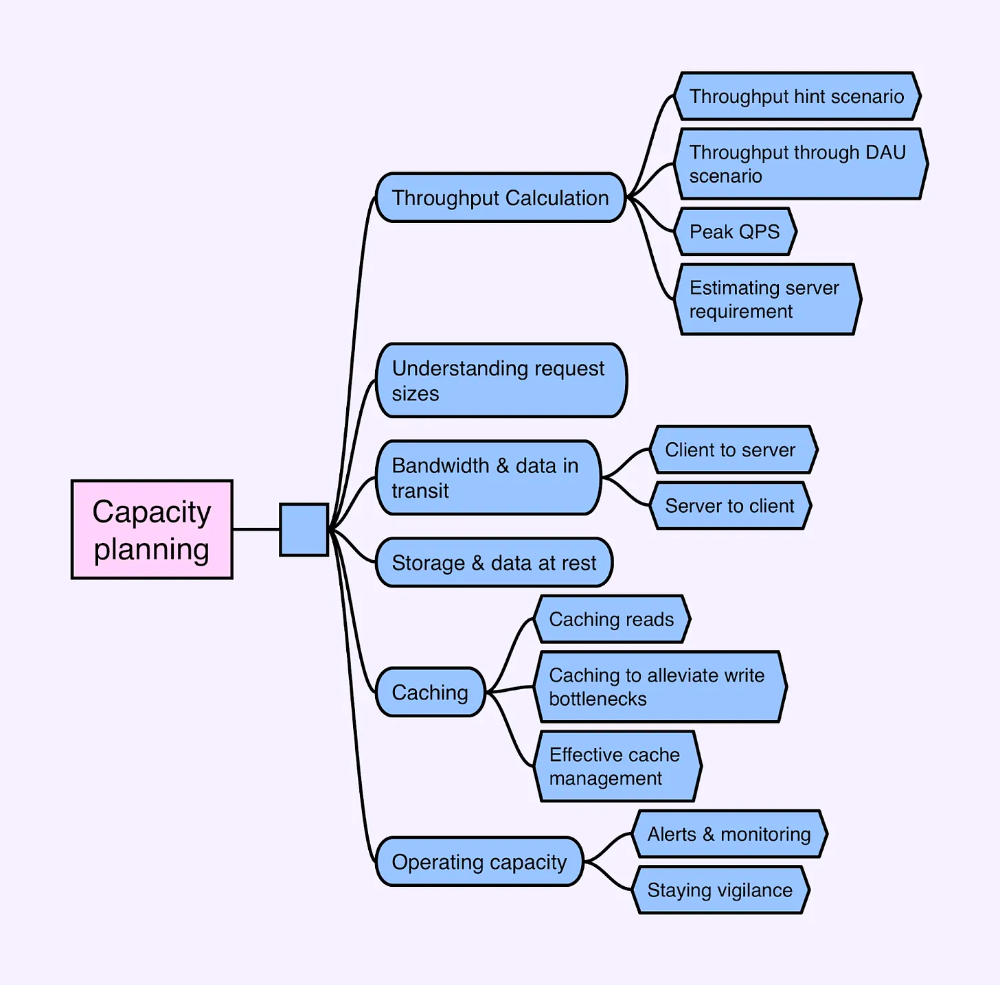

# [번역] 용량 계획 (Capacity Planning)

> 이 글은 [Capacity Planning
](https://blog.bytebytego.com/p/capacity-planning)을 번역하였습니다

이 뉴스레터는 Spotify의 시니어 엔지니어링 매니저인 [Diego Ballona](https://blog.bytebytego.com/p/capacity-planning)가 게스트 저자 참여하여 작성했습니다.
자세한 내용은 Diego를 트위터에서 팔로우하세요.

용량 계획은 실제 시스템 설계 환경에서 필수적인 역할을 합니다. 이 복잡한 작업은 단순한 이론적 고려 사항이 아니며, 엔지니어가 제안한 시스템의 용량 요구 사항을 정확하게 예측하는 데 필수적입니다.

시스템 설계에서 용량 계획의 중요성을 강조하는 몇 가지 이유가 있습니다:

- 용량 계획을 통해 제안된 설계가 실현 가능한지 여부를 알 수 있습니다. 이를 통해 엔지니어는 시스템 성능 또는 확장성의 잠재적 병목 현상을 예측하고, 데이터 스토리지 요구 사항, 네트워크 대역폭 요구 사항을 평가하고, 예상 리소스 비용을 예측할 수 있습니다. 이를 통해 지연 시간, 처리량, 가용성과 같은 측면이 비기능적 요구사항과 일치하는지 확인합니다.
- 어떤 설계는 기능적으로 실현 가능해 보이지만 운영상 문제가 있을 수 있습니다. 예를 들어, 시스템에서 급증하는 수요를 처리해야 하는 경우 많은 추가 리소스가 필요할 수 있습니다. 이로 인해 운영 비용이 엄청나게 높아질 수 있습니다.
- 효과적인 용량 계획은 시스템 설계에 대한 깊은 이해를 보여줍니다. 이는 엔지니어가 다양한 설계 옵션과 기술에 대한 지식과 각각의 장단점을 알고 있음을 나타냅니다. 또한 잠재적인 문제를 예측하고 적절한 해결책을 찾는 능력도 반영합니다. 이는 더 잘 작동하고 더 효율적인 시스템 개발로 이어질 수 있습니다.

따라서 대규모 시스템을 설계할 때는 처음부터 용량 계획에 대해 고려하는 것이 중요합니다. 엔지니어는 시스템에서 수행해야 하는 작업과 필요한 성능을 이해함으로써 확장 가능하고 효율적인 시스템을 계획하고 구축할 수 있습니다.

이제 실제 시스템 설계에서 용량 계획이 어떻게 작동하는지 살펴보겠습니다.


<center>(출처) https://blog.bytebytego.com/p/capacity-planning</center>

# 처리량 계산 (Throughput Calculation)

대규모 시스템을 설계할 때는 처음에 시스템 규모를 추정하는 것이 중요합니다. 요구 사항이 처리량을 암시하거나 일일 활성 사용자 수와 같은 관련 메트릭을 통해 추론해야 할 수도 있습니다.

## 처리량 산정 시나리오 (Throughput hint scenario)

예제 1 - 모니터링 시스템용 온도 센서를 살펴봅시다. 이 시스템은 약 1,000만 개의 센서를 사용하여 카운티 전체의 온도 변화를 측정해야 합니다. 이러한 센서는 5초마다 변화를 보고합니다. 분석가는 이 시스템을 사용하여 보고서를 표시하는 대시보드를 사용하여 날씨를 예측합니다.

이러한 요구 사항을 통해 시스템 용량에 대한 몇 가지 사항을 유추할 수 있습니다. 다음과 같이 처리량을 추정할 수 있습니다:

- 극단적인 경우 모든 센서가 동기화되면 초당 쿼리 수(QPS)가 1,000만 개에 달할 수 있습니다. 하지만 이는 가능성이 희박한 에지 케이스입니다.
- 센서에서 서버로의 각 요청이 200ms 지속된다고 가정하면, 보다 현실적인 평균은 2백만 QPS입니다.

따라서 이 시스템에서 예상되는 적정 처리량은 약 2백만 QPS입니다.

## DAU 시나리오를 통한 처리량 (Throughput through DAU scenario)

때로는 처리량이 요구 사항에 명확하지 않을 수 있습니다. 예제 2 - 소셜 미디어 뉴스 피드를 살펴봅시다:

이 시스템을 통해 사용자는 시간순으로 정리된 프로필 타임라인에 텍스트, 이미지, 동영상을 게시할 수 있습니다. 사용자는 다른 사용자를 팔로우하고 자신의 타임라인에서 팔로우하는 사용자의 관련 게시물을 볼 수 있습니다.

용량 계획을 알리기 위해 다음과 같이 질문할 수 있습니다:
- 이 시스템의 일일 활성 사용자 수는 몇 명인가요?
- 2~5년 후 예상되는 사용자 기반 증가율은 얼마인가요?

그런 다음 기능 요구 사항에 따라 처리량을 계산합니다. 가장 관련성이 높은 글이 홈 페이지의 타임라인에 표시되면 모든 일일 활성 사용자가 해당 글과 상호 작용할 가능성이 높습니다. 각 사용자가 하루에 특정 횟수(예: 10회)로 상호 작용한다고 가정하면 하루에 50억 페이지 뷰, 즉 약 6만 QPS를 의미합니다.

```text
500M users @ 10x pageviews/user = 5B timeline pageviews/day
5B pageviews / 86400 seconds (1 day = 24 * 60 * 60) = ~57.8k QPS
Round up to 60k QPS
```

프로필 방문은 홈페이지 방문보다 빈도가 낮을 가능성이 높습니다. 각 사용자가 하루에 프로필 페이지를 두 번 방문한다고 가정하면 평균 QPS는 약 12,000입니다.

```text
단순계산: 20% of 60k (previous example) = 12k QPS

혹은:

500M users @ 2x pageviews/user = 1B profile pageviews/day
1B pageviews / 86400 seconds (1 day = 24 * 60 * 60) = ~11.5k QPS
Round up to 12k
```

게시물의 경우, 평균적으로 일일 활성 사용자의 10%만이 하루에 한 번씩 게시물을 작성한다고 가정해 보겠습니다. 이는 평균 QPS가 약 6천이라는 것을 의미합니다.

```text
단순계산: 10% of 60k (previous example) = 6k QPS

혹은:

500M users * 10% = 50M new posts/day
50M new posts / 86400 seconds (1 day = 24 * 60 * 60) = ~5.7k QPS
Round up to 6k
```

이는 대략적인 추정치라는 점을 기억하세요. 대부분의 시스템 설계에서는 이 정도면 충분합니다. 좋은 팁은 보수적인 추정을 위해 반올림하여 숫자를 반올림하는 것입니다.


## 피크 QPS (Peak QPS)

피크 QPS를 계산하는 것은 종종 설계의 용량 요구 사항을 결정하기 때문에 중요합니다. 피크 QPS는 시스템이 쿼리를 처리할 것으로 예상되는 최고 속도를 의미하며, 사용량이 많거나 트래픽이 급증하는 시기에 주로 발생합니다. 이는 평균 속도보다 훨씬 높을 수 있습니다. 그렇기 때문에 특별한 주의가 필요합니다.

피크 QPS를 결정하는 일반적인 방법 중 하나는 과거 데이터 분석을 이용하는 것입니다. 여기에는 며칠, 몇 주 또는 몇 달과 같은 특정 기간 동안 인프라가 처리하는 쿼리 수를 추적한 다음 가장 높은 값을 선택하는 것이 포함됩니다. 이 방법은 데이터의 가용성과 시스템의 과거 성능에 의존합니다.

인프라를 오버프로비저닝하거나 자동 확장 기능을 활용하는 것도 피크 QPS를 처리하는 데 도움이 될 수 있습니다. 이러한 전략을 사용하면 시스템의 용량을 일시적으로 늘려 예기치 않은 트래픽 급증을 처리할 수 있습니다. 그러나 이러한 전략에는 자체 비용이 수반되므로 신중한 비용 편익 분석이 필요합니다.

최대 QPS는 비즈니스 요구 사항이나 예측 가능한 사용 패턴의 영향을 받을 수도 있습니다. 예를 들어:

- 이벤트 기반 피크: 주요 제품 출시 또는 마케팅 이벤트로 인해 짧은 시간 내에 시스템에 가입하거나 사용하는 사용자가 급증할 수 있습니다. 이러한 이벤트를 예측하고 대비하면 수요가 급증하는 동안 서비스 품질을 유지하는 데 도움이 될 수 있습니다.

- 시간 기반 피크: 일부 시스템에서는 일별 또는 주별로 예측 가능한 사용량 변동이 발생할 수 있습니다. 예를 들어, 비즈니스 중심 애플리케이션의 경우 늦은 저녁이나 이른 아침에 비해 근무 시간 동안 트래픽이 크게 증가할 수 있습니다.

최대 QPS를 추정하기 위해 예상되는 분포 특성을 기반으로 계산하는 경우가 많습니다. 예를 들어, 하루 방문의 80%가 20%의 시간 내에 발생한다고 가정할 수 있습니다(파레토 원칙의 변형). 예상치 못한 급증을 처리하고 원활한 사용자 경험을 제공하기 위해 약간의 버퍼 용량을 추가합니다.

예제 2 - 소셜 미디어 뉴스 피드에서 타임라인 페이지뷰의 80%가 8시간 이내에 발생한다고 예상하면 이 기간의 최대 QPS는 약 13만 8천 건으로 계산할 수 있습니다. 하지만 이는 시작점일 뿐이므로 처음에는 초과 프로비저닝하고 데이터를 모니터링한 다음 실제 사용 패턴에 따라 조정하는 것이 항상 좋은 관행입니다.

```text
500M users @ 10x page views / user = 5B timeline pageviews/day

80% of pageviews = 4B timeline pageviews
Per hour over a period of 8 hours = 4B page views / 8 hours = 500M / hour

Average Peak QPS = 500M / 3600 (60 minutes in seconds) = 138k
```

최대 QPS에 대비하면 부하가 가장 많은 상황에서도 시스템의 안정성과 응답성을 유지할 수 있습니다. 이는 더 나은 사용자 경험과 시스템 안정성에 기여합니다.

## 서버 요구 사항 예측 (Estimating server requirement)
예상 처리량과 응답 시간을 통해 애플리케이션을 실행하는 데 필요한 서버 수를 예측할 수 있습니다.

예시 1 - 온도 센서에서 시스템의 평균 응답 시간은 200ms이고 2M QPS를 처리해야 하며 각 애플리케이션 서버는 160 QPS를 처리하는 32명의 작업자를 관리할 수 있으므로 약 12.5만 개의 서버 인스턴스가 필요합니다.

```text2M QPS, 200ms avg response time per request
Each instance has 32 workers
Each worker can handle 5 queries per second (200ms*5)
Each instance can handle then 160 QPS
2M (average QPS) / 160 = 12.5k instances
```

전체 시스템의 규모를 추정했으니 이제 요청 크기 조정부터 시작하여 설계 중인 시스템의 세부 사항에 집중해 보겠습니다.

# 요청 크기 이해 (Understanding request sizes)

요청 크기를 평가하는 것은 대역폭과 스토리지 요구 사항을 결정하는 데 매우 중요합니다. 시스템 설계 시 시스템 부하에 큰 영향을 미칠 수 있는 다양한 요청 유형을 수용해야 하는 경우가 많습니다. 이러한 요청은 데이터를 검색하는 GET 요청처럼 단순할 수도 있고 대용량 멀티미디어 파일을 포함하는 POST 요청처럼 복잡할 수도 있습니다.

초기 요구 사항에는 특정 요청 크기가 포함되지 않을 수 있지만, 시스템의 기능과 처리하는 데이터의 특성을 기반으로 정보에 입각한 가정을 할 수 있습니다.

요청 규모를 예측할 때 시스템 유형에 따라 당연히 기대치가 달라집니다. 지금까지 논의한 두 가지 예를 살펴보겠습니다: 온도 센서와 소셜 미디어 뉴스 피드입니다.

예제 1 - 온도 센서와 같은 시스템의 경우 전송되는 데이터가 상대적으로 작을 수 있습니다. 데이터가 JSON 형식으로 전송된다고 가정하면 각 필드의 크기를 추정할 수 있습니다. 온도는 실수(4바이트)로 보고되고, 센서 ID는 UUID(16바이트)이며, 추가로 4바이트 필드 3개가 있습니다. JSON 형식을 고려하면 총 요청 본문 크기는 100바이트 미만입니다. HTTP 헤더(일반적으로 200바이트에서 400바이트 사이)를 포함하면 각 요청 크기는 보수적으로 약 0.5KB로 추정할 수 있습니다. 이는 매우 작은 크기입니다. 그러나 수백만 개의 센서를 다룰 때는 이렇게 작은 데이터 요청도 합산될 수 있으므로 이를 고려해야 합니다.

예시 2 - 소셜 미디어 뉴스 피드와 같은 시스템에서는 텍스트, 이미지, 동영상 등 다양한 유형의 콘텐츠를 처리합니다. 텍스트 게시물은 몇 KB에 불과할 수 있지만 이미지 파일은 수백 KB, 동영상 파일은 몇 MB에 달할 수 있습니다. 이러한 시나리오에서 평균 요청 크기는 다양한 콘텐츠 유형의 분포와 크기를 고려해야 합니다.

텍스트만 있는 글은 사용자 아이디(UUID)와 평균 250자의 자유 형식 문자열을 포함하여 약 1KB라고 보수적으로 추정해 봅시다. 이미지 및 동영상의 경우 10개의 글마다 3개의 이미지(압축 후 평균 300KB 크기)와 1개의 동영상(평균 1MB 크기)이 있다고 가정해 봅시다. 계산을 단순화하기 위해 이러한 모든 미디어 유형을 평균으로 합산할 수 있습니다. 이렇게 하면 게시물당 평균 요청 크기가 약 200KB가 됩니다.

```text
10개 글의 경우:
- Every post has 1KB (text) = 10KB
- Three have an image = 300KB * 3 = 900KB
- One has a video = 1000KB

~191KB, round up to 200KB
```

## 요청 크기 조정 시 고려 사항 (Considerations for Request Sizing)

요청 크기를 이해하는 것은 방정식의 일부에 불과합니다. 데이터 형식, 직렬화/역직렬화, 대역폭 및 처리 요구사항에 미치는 영향과 같은 요소도 고려해야 합니다.

- 데이터 형식: 전송되는 데이터 형식은 필요한 대역폭에 큰 영향을 미칠 수 있습니다. XML과 같이 더 자세한 데이터 형식은 JSON과 같이 덜 자세한 형식에 비해 더 많은 대역폭을 소비할 수 있습니다. 유사한 형식 중에서도 바이너리 JSON(BSON)과 같은 옵션이 더 효율적일 수 있습니다.

- 직렬화/역직렬화: 데이터를 쉽게 전송하거나 저장할 수 있는 형식으로 변환(직렬화)한 다음 다시 원래 형식으로 되돌리려면(역직렬화) 상당한 리소스가 필요할 수 있습니다. 방법마다 비용과 이점이 다릅니다. 예를 들어 직렬화 및 역직렬화 시 Protobuf가 JSON보다 빠르지만, 사람이 더 읽기 쉽고 디버깅하기 쉬운 것이 JSON입니다.

- 압축: 데이터 압축을 구현하면 요청 크기를 효과적으로 줄이고 대역폭을 절약할 수 있습니다. 추가적인 처리 오버헤드가 발생하지만, 특히 페이로드가 큰 경우 이 정도는 감수할 수 있거나 오히려 이득이 될 수도 있습니다.

- 네트워크 프로토콜: 네트워크 프로토콜(HTTP/1.1, HTTP/2, gRPC 등)의 선택은 헤더의 차이, 헤더 압축 기능 및 기타 요인으로 인해 요청의 전체 크기에 영향을 미칠 수도 있습니다.

요청 크기 조정은 용량 계획의 중요한 측면입니다. 가정을 전제로 해야 하지만 이러한 정보에 기반한 추측은 시스템의 요구 사항을 예측하는 데 도움이 됩니다. 이를 통해 예상되는 부하와 트래픽 패턴을 처리할 수 있는 만반의 준비를 갖출 수 있습니다.

# 전송 중인 대역폭 및 데이터 (Bandwidth & data in transit)

각 레코드의 비용을 이해하는 것은 기본입니다. 클라이언트에서 서버로(인그레스), 서버에서 클라이언트로(이그레스) 양방향으로 작업당 대역폭을 고려해야 합니다.

## 클라이언트에서 서버 (ingress)

예제 1 - 온도 센서에서 센서가 애플리케이션으로 전송하는 데이터를 수신, 즉 애플리케이션의 네트워크로 들어오는 데이터라고 합니다. 각 센서 요청이 0.5KB이고 평균 QPS가 400k라고 가정하면 평균 인그레스 대역폭은 초당 약 200MB입니다. 대시보드 등에 대한 읽기 경로는 용량에 큰 영향을 미치지 않으므로 논의를 단순화할 수 있습니다.

고려해야 할 흥미로운 측면은 서버에 데이터를 얼마나 자주 전송해야 하는가입니다. 모든 데이터가 즉각적인 전송을 필요로 하는 것은 아닐 수 있습니다. 예를 들어 온도 센서는 온도 변화가 크게 일어났을 때만 데이터를 보고하면 될 수도 있습니다. 온도 상태를 센서에 로컬로 저장하고 변화가 있을 때만 전송하면 잠재적으로 용량 부하와 비용을 줄일 수 있습니다.

하지만 센서가 서버에 보고하지 않고 사용할 수 있는 최대 시간을 설정하는 것이 중요합니다. 이렇게 하면 오작동하거나 오프라인 상태인 센서를 즉시 파악할 수 있습니다.

## 서버에서 클라이언트 (egress)

예제 2 - 소셜 네트워킹 뉴스 피드와 같은 시스템을 고려할 때 콘텐츠를 게시하는 것은 인그레스 트래픽과 동일합니다. 이전 추정치에 따라 각 게시물의 크기가 1KB이고 평균 QPS가 6k라고 가정하면 인그레스 대역폭은 초당 약 6MB입니다.

송신, 즉 서버에서 클라이언트로 전송되는 데이터는 더 복잡할 수 있습니다. 시스템이 20개의 게시물마다 페이지 매김을 하고 서버가 매번 원시 파일 버전을 렌더링한다고 가정해 보겠습니다. 이 시나리오에서는 평균 송신 대역폭이 초당 250GB로 매우 높아집니다:

```text
500M users @ 10x pageviews/user = 5B timeline pageviews/day
Average post request size: 200KB
Assuming every time timelines are rendered the server sends everything to the client.

20 posts * 200 KB = 4MB
5B pageviews * 4MB = 20PB
20PB / 86400 (1 day = 24 * 60 * 60) = ~231GB/s

Round up to ~250GB/s
```

하지만 이그레스 트래픽을 줄이기 위한 최적화 전략이 있습니다:
- 콘텐츠 다듬기: 기본적으로 글 콘텐츠의 전체 텍스트를 보내지 않음으로써 데이터 부하를 줄일 수 있습니다. 이렇게 하면 텍스트 크기를 절반으로 줄일 수 있습니다.
- 이미지 최적화: 처음에는 저품질 이미지 플레이스홀더를 전송하고 사용자 상호 작용 및 뷰포트 가시성에 따라 고품질 이미지를 점진적으로 로드할 수 있습니다.
- 비디오 최적화: 동영상 자동 재생을 끄고 기본적으로 썸네일만 로드할 수 있습니다. 전체 비디오는 필요에 따라 스트리밍할 수 있으므로 초기 데이터 부하를 크게 줄일 수 있습니다.

대략적인 계산은 다음과 같습니다:
- 트위터 사용자 중 80%는 타임라인에서 다섯 번째 게시물을 넘기지 못합니다;
- 텍스트의 일부만 발췌하여 보내면 텍스트 크기가 50% 줄어듭니다;
- 클라이언트에 전송되는 썸네일 크기를 플레이스홀더로 30KB로 줄이고 뷰포트에 표시되는 내용은 온디맨드(300KB)로만 로드합니다.
- 동영상은 재생 시에만 로드되며(자동 재생 없음), 기본적으로 이미지와 동일한 썸네일을 점진적으로 로드합니다. 사용자의 10%만이 동영상을 재생합니다.