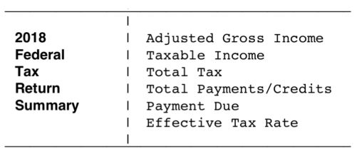
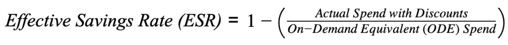
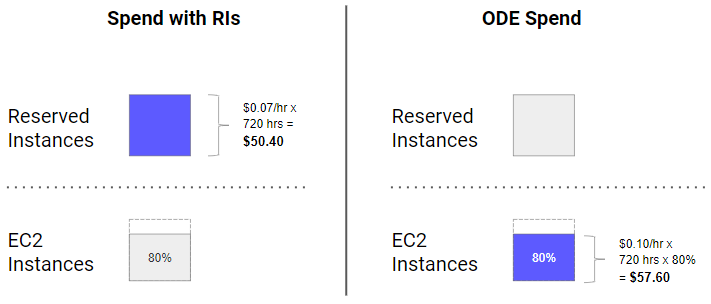
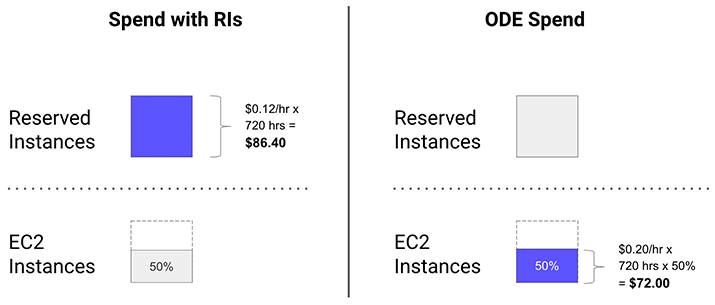
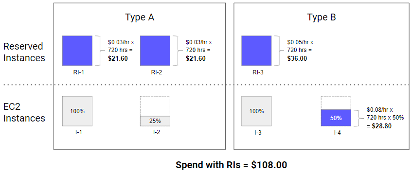
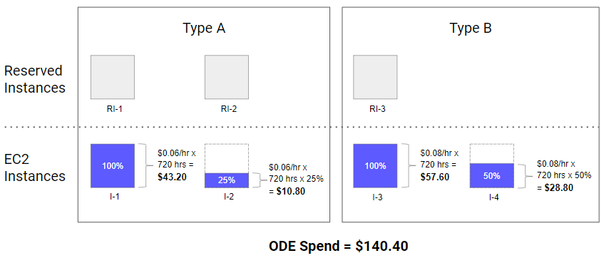

# 유효 절감률: 우리가 놓치고 있는 가장 중요한 AWS 비용 절감 지표

> 이 글은 [Effective Savings Rate: The most important AWS savings metric you aren’t tracking](https://www.prosperops.com/blog/effective-savings-rate/)을 번역하였습니다

- 사용률(utilization) 및 충당률(coverage)와 같은 지표로 예약 인스턴스(RI) 및 절감형 플랜(Savings Plan)을 관리하는 것은 전체 맥락을 전달하지 않으며 오해의 소지가 있습니다.
- ESR(유효 저축률)은 절감형 플랜의 ROI(투자 수익률)이며, 실제 절감 성과를 측정하는 데 사용할 수 있는 유일한 결과 지표입니다.
- 대부분의 사람들은 자신의 ESR을 모르고 실제 절감률을 과대평가합니다.

이 글은 유효 절감률(ESR, Effective Savings Rate)의 개념을 소개하는 세 개의 포스팅 중 1부입니다. 이 게시물인 1부에서는 문제를 다루고, ESR 공식을 소개하며, ESR 계산이 어떻게 이루어지는지 이해하도록 도와드립니다. 2부에서는 기존 절감형 플랜의 지표의 한계와 ESR이 궁극적으로 중요한 지표인 이유를 살펴봅니다. 마지막으로 3부에서는 ESR을 벤치마킹하고 우수, 평균, 저조한 ESR에 대해 논의합니다.


## 문제
우리는 개인 투자 세계의 비유를 통해 [ProsperOps](https://www.prosperops.com/) 예약 인스턴스 및 절감형 플랜을 포함한 절감 포트폴리오를 관리하는 철학을 설명하고자 합니다. 투자자와 재무 자문가 사이의 다음 대화를 생각해 보세요:

> 투자자: 저의 투자는 어떻게 진행되고 있나요?
>
> 자문가: 양호합니다. 투자하신 금액의 93%를 투자했으며 다양한 자산군에 투자했습니다.
>
> 투자자: 좋아요. 얼마나 벌었나요?
>
> 자문가:  이번 분기에 4% 성장한 스몰캡(small cap, 소형주) 인덱스 펀드에 15%, 리츠(REITS)에 10%를 투자하고 있습니다.
>
> 투자자: 네, 그런데 저의 전체 수익률은 얼마입니까?
> 
> 자문가:  흠, 잘 모르겠습니다. 우리는 그 지표를 추적하지 않습니다.

이 대화는 실제로는 절대 일어나지 않겠지만(그러기를 바라지만), 투자에는 많은 입력 지표가 있지만 궁극적으로 중요한 지표는 출력 지표인 투자 수익률(ROI)이라는 점을 잘 보여줍니다. 직접 투자하든, 인간 어드바이저를 이용하든, 로보 어드바이저를 이용하든, 목표는 주어진 위험 프로필(risk profile)에 대해 최대한의 ROI를 달성하는 것입니다. ROI는 기본적으로 투자 성과를 평가하는 방식입니다.
이 대화는 실제로는 절대 일어나지 않겠지만(그러기를 바라지만), 투자에는 많은 입력 지표가 있지만 궁극적으로 중요한 지표는 출력 지표인 투자 수익률(ROI)이라는 점을 잘 보여줍니다. 직접 투자하든, 인간 어드바이저를 이용하든, 로보 어드바이저를 이용하든, 목표는 주어진 위험 프로필(risk profile)에 대해 최대한의 ROI를 달성하는 것입니다. ROI는 기본적으로 투자 성과를 평가하는 방식입니다.

AWS 사용자들과 절감 성과에 대해 항상 이야기를 나누는데, 현재 전략의 효과를 정량화할 수 있는지 물어보면 그들은 ROI를 모릅니다. 지금까지는 사용률이나 충당률와 같은 입력 메트릭을 기준으로 이야기했습니다. 이러한 지표가 중요하지 않은 것은 아니며, 공정하게 말하자면 AWS도 이러한 용어로 설명하지만 절감 성과에 대한 근본적인 질문에는 답하지 못합니다. 탁월한 절감 성과를 거두고 있는지, 평균적인 절감 성과를 거두고 있는지, 아니면 잠재력에 크게 못 미치는 성과를 거두고 있는지 어떻게 알 수 있을까요?

## 유효 절감률 소개
[ProsperOps](https://www.prosperops.com/)는 자동화된 절감 결과를 제공하기 때문에(수동적인 추천이 아닌) 알고리즘의 효과를 평가할 수 있는 정량화 가능한 지표를 정의했습니다. 우리는 이 메트릭을 유효 절감률(ESR, Effective Savings Rate)이라고 부르며, ROI와 마찬가지로 최종(bottom-line) 절감 성과를 측정하는 하나의 수치입니다.

재무 분석에서 “유효” 절감률을 사용하는 것은 매우 일반적입니다. 예를 들어, TurboTax 사용자의 경우 완료된 세금 신고서에는 다음과 같은 요약이 포함됩니다:


- Adjusted Gross Income: 조정 총소득, 납세자의 총 총소득에서 특정 공제를 뺀 금액
- Taxable Income: 과세 소득, 세금 계산 시 실제 과표가 되는 소득
- Total Tax: 총 세금
- Total Payments/Credits: 총 납부액 / 크레딧
- Payment Due: 납부 기한
- Effective Tax Rate: 실효 세율

마지막 항목인 '실효 세율'에 주목하세요. 세금 신고에는 누진세율, 장단기 자본 소득, 소득 공제 및 세액 공제 등 납부할 세액에 영향을 미치는 여러 가지 요소가 있습니다. 그러나 모든 것을 고려했을 때 실효 세율을 알고 싶을 수도 있습니다.

절감 상품도 마찬가지입니다. RI를 예로 들어보겠습니다. RI 사용률, RI 충당률, 다양한 할인율을 가진 다양한 RI 유형 등이 있습니다. 그러나 모든 것을 고려했을 때 가장 중요한 것은 유효 절감률입니다. EC2, Fargate, Lambda의 절감형 플랜과 예약 인스턴스를 모두 포함하는 유효 절감률은 다음과 같이 계산할 수 있습니다:



```
유효 절감률 = 1 - (할인을 적용한 실제 지출 / 온디맨드에 상응하는 지출)
```

할인이 적용된 실제 지출액은 RI 및 세이빙 플랜으로 지불한 금액으로, 선불 요금을 상각한 금액입니다.

온디맨드 상응(ODE) 지출은 할인이 적용되지 않았을 경우 지불했을 금액입니다.


## 유효 절감률 이해하기

간단한 예시를 통해 ESR의 개념이 어떻게 작동하는지 살펴봅시다.

위젯을 구매한다고 가정해 보겠습니다. 처음 4개는 정가 $10이고 다음 6개는 할인된 가격인 $7입니다. 할인이 적용된 가격은 위젯 4개 @ 위젯당 $10 + 위젯 6개 @ 위젯당 $7 = $82입니다. 총 정가(할인 없이 지불했을 가격)는 위젯 10개 @ 위젯당 $10 = $100입니다. 따라서 ESR = 1 - 할인가 / 정가 = 1 - $82 / $100 = 18%가 됩니다. 간단하죠?

RI/SP을 더 복잡하게 만드는 것은 해당 EC2 인스턴스가 주어진 시간(또는 경우에 따라 초) 동안 존재하는지 여부에 따라 할인율이 달라질 수 있다는 점입니다. 다시 말해, RI/SP에는 '사용률'이 있습니다. 몇 가지 RI 예시를 통해 설명해 보겠습니다.

### 예시 1

시간당 가격이 $0.07인 단일 RI를 구매합니다(선불이 없다고 가정). 주어진 30일 동안 해당 월의 80% 동안 일치하는 인스턴스가 실행됩니다(이것이 RI 사용률입니다). 인스턴스 온디맨드 가격은 시간당 $0.10입니다. 최대 RI 할인은 30%($0.07 대 $0.10)일 경우 유효 절감률은 얼마인가요?



ESR = 1 - 할인 적용 실제 지출 / 온디맨드 상응 지출 = 1 - $50.40 / $57.60 = 12.5%


### 예시 2

시간당 가격이 $0.12인 단일 RI를 구매합니다(선불이 없다고 가정). 주어진 30일 동안 해당 월의 50% 동안 일치하는 인스턴스가 실행됩니다(이것이 RI 사용률입니다). 인스턴스 온디맨드 가격은 시간당 $0.20입니다. 최대 RI 할인은 40%($0.12 대 $0.20)이지만 유효 절감률은 얼마인가요?



ESR = 1 - 할인 적용 실제 지출 / 온디맨드 상응 지출 = 1 - $86.40 / $72.00 = -20%

절감율이 마이너스라는 것은 완전 온디맨드보다 RI로 운영하는 것이 더 비싸다는 뜻입니다. 주의하지 않으면 RI/SP로 손해를 볼 수 있습니다! 이는 낮은 사용률로 인해 할인 혜택이 상쇄될 때 발생합니다. ESR이 마이너스인 고객을 만나는 것은 드문 일이 아니므로 생각보다 흔한 경우입니다.

### 예시 3

이제 좀 더 복잡한 예를 살펴보겠습니다. 다음과 같은 RI를 구매합니다:

- 유형 A: RI-1 및 RI-2를 각각 1년 동안 $262.80에 선불로 구매했습니다. 시간당 가격을 계산하려면 해당 기간 동안 비용을 상각합니다. 시간당 가격 = 연간 $262.80 / 하루 24시간 / 연간 365일 = 시간당 $0.03.
- 유형 B: 시간당 가격이 $0.05로 선불이 없는 RI-3.

주어진 30일 동안 다음 인스턴스를 실행합니다:

- 유형 A: 한 달 전체에 대해 I-1, 한 달의 25%에 대해 I-2. 온디맨드 가격은 시간당 $0.06입니다.
- 유형 B: I-3은 한 달 전체, I-4는 한 달의 50%를 사용합니다. 온디맨드 가격은 시간당 $0.08입니다.

복잡성이 높아진 상황에서 유효 절감률은 얼마인가요?




ESR = 1 - 할인 적용 실제 지출 / 온디맨드 상응 지출 = 1 - $108.00 / $140.40 = 23.1% = 1 - ($21.60 + $21.60 + $36.00 + $28.80) / ($43.20 + $10.80 + $57.60 + $28.80)

ESR은 개별 RI 할인율보다 낮다는 점에 유의하세요(RI 유형 A는 최대 50%, RI 유형 B는 최대 37.5%). **RI 사용자에게 자신의 ESR을 알고 있는지 물어보면, 아는 경우는 드물지만 일반적으로 실제보다 더 높다고 추정합니다.**

이는 ESR을 설명하기 위한 몇 가지 예시일 뿐입니다. 개념은 간단하지만 실제 환경에서는 RI/SP 대규모 절감 포트폴리오, 동적 컴퓨팅 제품군(예: EC2, Fargate, Lambda), 초당 과금, 인스턴스 크기 유연성 등으로 인해 더 복잡한 경우가 많습니다.


## 마무리

ESR(유효 절감률)은 절감 방법의 ROI(투자 대비 효과)입니다. 이는 사용 중인 절감 전략(애드혹 스크립트, AWS 비용 탐색기, 클라우드 관리 플랫폼 등)에 관계없이 효과를 측정하는 데 사용할 수 있는 유일한(the one) 절감 지표입니다.

[다음 ESR 포스팅](https://www.prosperops.com/blog/effective-savings-rate-part-2/)에서는 사용률 및 적용 범위와 같은 입력 지표의 한계와 이러한 지표가 어떻게 ESR이 좋지 않은데도 놀랍도록 건전해 보일 수 있는지 살펴봅니다.