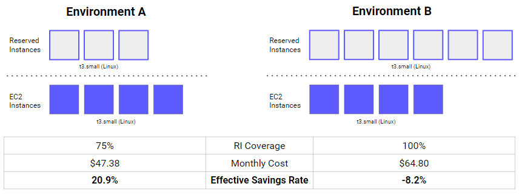
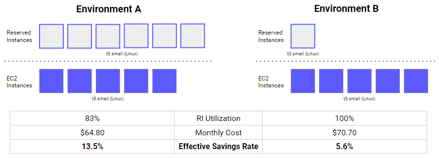
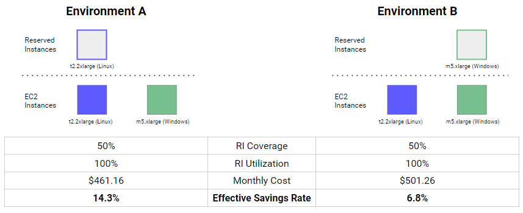
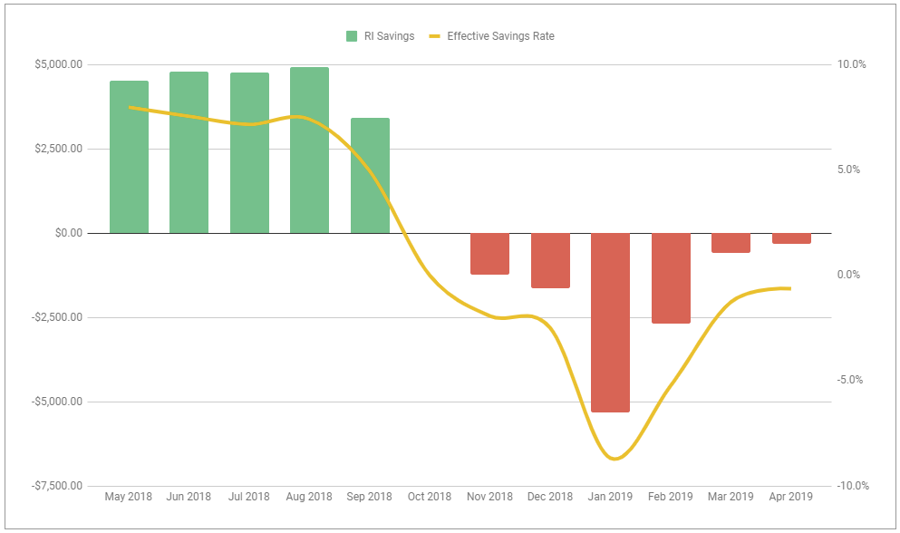

# 유효 절감률 2부: 기존 클라우드 비용 최적화 지표의 눈속임

> 이 글은 [Effective Savings Rate: Your cloud financial optimization metrics could be deceiving you](https://www.prosperops.com/blog/effective-savings-rate-part-2/)을 번역하였습니다

- 사용률 및 충당률과 같이 일반적으로 사용되는 지표가 항상 절감 효과와 상관관계가 있는 것은 아닙니다. 사용률과 충당률이 낮을수록 절감액이 높아질 수 있습니다.
- ESR(유효 절감률)은 항상 실제 절감률을 반영하는 단순한 유일 지표입니다. 절감 성과를 측정하기 위해 최대한 활용하고 사용하고자 하는 하나의 지표가 되어야 합니다.
- ESR을 모른다면 생각보다 절약이 덜 되고 있을 가능성이 높습니다. ProsperOps는 약정 없이 무료로 제공되는 계산된 절감액 분석을 통해 과거 ESR 추세는 물론, ProsperOps에서 적극적으로 관리하는 절감 계획 및 RI 포트폴리오를 통한 향후 절감 가능성을 보여줍니다.

> 이 글은 유효 절감률(ESR)의 개념을 소개하는 3부 시리즈 중 2부입니다. [1부](https://www.prosperops.com/blog/effective-savings-rate/)에서는 ESR이 무엇인지, 왜 필요한지, 어떻게 계산하는지에 대해 설명했습니다.
> 현재 2부에서는 기존의 비용 최적화 지표가 어떻게 오해의 소지가 있는지, 그리고 ESR이 절감 성과를 측정할 때 중요한 지표인 이유를 살펴봅니다.
> [3부](https://www.prosperops.com/blog/effective-savings-rate-part-3/)에서는 ESR을 벤치마킹하고 우수, 평균, 낮은 ESR에 대해 논의합니다.

"사용률이 95%라서 괜찮습니다." 이런 말을 자주 듣게 되는데, 저희의 대답은 대개 "높은 사용률을 원하시나요, 아니면 높은 절감을 원하시나요?"입니다. (사용률 대신 충당률로 대체할 수도 있습니다.) 사람들은 일반적으로 높은 사용률 또는 충당률 높은 절감을 동일시하기 때문에 이 질문에서 잠시 멈칫합니다. 누구나 높은 절감을 원하지만 사용률과 충당률을 통해 이를 측정합니다. 이러한 접근 방식의 문제점은 사용률과 충당률 모두 실제 절감액과 관련하여 오해의 소지가 있을 수 있다는 것입니다. 절감액을 극대화하는 것이 목표라면 항상 절감액과 상관관계가 있는 지표가 필요합니다. 이것이 바로 ESR(유효 절감률)입니다.

"ESR이 그렇게 중요하다면 왜 이전에는 아무도 도입하지 않았을까요?"라고 회의적으로 생각할 수도 있습니다. 활용률과 충당률은 AWS와 모든 리포팅 도구가 강조하는 것 같은데, 우리도 잘하고 있지 않나요?"라고 생각할 수 있습니다.

정답은 “아니오!”입니다. 계속 읽어보시면 그 이유를 증명해 드리겠습니다(저희도 원래 회의론자입니다). 왜 지금까지 ESR이 도입되지 않았는지 잘 모르겠습니다. 어쨌든 완전 자동화된 할인 관리 서비스로서 가능한 모든 포트폴리오 조합의 절감 효과를 정량화할 수 있는 확실한 방법이 필요했습니다. ESR은 이러한 필요성에서 탄생했으며, 시간이 지남에 따라 다른 RI 지표가 얼마나 신뢰할 수 없는지 알게 되었습니다. ESR이 정말 중요한 지표인 이유를 살펴보겠습니다.

간단히 요약합니다: ESR은 모든 것이 완료되었을 때 전체 컴퓨팅 제품군(EC2, Fargate 및 Lambda)에 걸쳐 RI 및 [절감형 플랜](https://www.prosperops.com/blog/aws-savings-plans/)를 통해 받는 할인 비율을 나타냅니다. 여러 AWS 계정에서 리소스가 왔다 갔다 하고, 할인 상품이 구매, 수정, 교환, 만료되고, 각각 다른 할인율이 적용되기 때문에 실제 절감률을 파악하는 것은 쉬운 일이 아닙니다. 이것이 바로 ESR이 하는 일이며, 궁극적인 절감 효과를 알려주는 도구입니다(ESR에 대한 자세한 배경은 이 시리즈의 1부를 읽어보세요).

## 충당률의 한계

충당률은 일반적인 메트릭으로, RI 또는 절약 요금제로 “충당된” 컴퓨팅 리소스의 비율을 나타냅니다. 저축 요금제에도 비슷한 개념이 있지만 지금은 RI를 고려해 보겠습니다. EC2 인스턴스 10개와 그에 해당하는 RI가 5개인 경우, RI 충당률은 50%입니다. 4개는 일치하지만 1개는 일치하지 않는 경우 RI 충당률은 40%입니다. 등등.

RI는 할인을 제공하므로 RI 충당률이 높을수록 더 많은 금액을 절약할 수 있겠죠? 저축을 극대화하는 것이 궁극적인 목표라면 RI 충당률이 높을수록 더 많은 저축을 할 수 있을까요? (힌트: 트릭 질문입니다.)

각각 동일한 유형과 수의 EC2 인스턴스로 구성된 다음 두 환경을 고려해 보겠습니다:

환경 A에서는 4개의 t3.small 인스턴스 중 3개를 RI로 커버하고 있으며 충당률은 75%입니다. 그리 나쁘지 않습니다. 이 설정을 사용하면 월 비용은 $47.38입니다.

환경 B에서는 4개의 t3.small 인스턴스 모두에 RI를 적용하여 RI 충당률이 100%입니다. 멋지네요! 하지만 해당 인스턴스가 없는 2개의 추가 t3.small RI 약정도 있습니다. 이 환경의 월 비용은 $64.80로 더 높습니다.

두 환경 모두 4개의 t3.small 인스턴스를 실행하고 있지만 충당률이 낮은 환경의 절감액이 더 높습니다. 이는 RI 충당률만으로는 절감 효과를 극대화할 수 없다는 것을 의미합니다.

또 한 가지 분명하지 않을 수 있는 점은 환경 B에서 RI 충당률이 100%인 경우에도 모든 것을 온디맨드 방식으로 실행했을 때보다 RI를 사용함으로써 월 55.90달러의 비용을 더 지불했다는 점입니다. 완벽한 RI 충당률에도 불구하고 손해를 본 것입니다!

이제 두 환경의 ESR을 살펴보겠습니다. 환경 A에서는 20.9%를 절약한 반면, 환경 B에서는 -8.2%의 절약률을 보였습니다. 충당률과 달리 ESR은 현재 진행 중인 절감 동학을 정확하게 반영합니다. 충당률은 절감액과 상관관계가 없지만 ESR은 항상 상관관계가 있습니다.

결론: 충당률이 아닌 ESR을 최대화하세요.

## 사용률의 한계

두 번째 공통 메트릭은 사용률입니다. 이는 RI 또는 저축 플랜의 몇 퍼센트가 “사용”되고 있으며 해당 컴퓨팅 리소스와 일치하는지를 나타냅니다. 간단하게 설명하기 위해 RI 예시를 계속 이어가겠습니다. EC2 인스턴스 4개와 일치하는 RI가 5개인 경우, RI 사용률은 80%입니다. 동일한 RI 포트폴리오에 일치하는 EC2 인스턴스가 하나만 있는 경우 RI 사용률은 20%입니다.

충당률과 마찬가지로 사용률이 높을수록 비용 절감 효과가 높을 것으로 예상할 수 있습니다. 지금쯤이면 항상 그렇지는 않다는 것을 깨달았을 것입니다.

각각 동일한 유형과 수의 EC2 인스턴스로 구성된 다음 두 환경을 고려해 보겠습니다:

환경 A에서는 5개의 t3.small 인스턴스를 모두 RI로 커버하지만 활용되지 않은 t3.small RI가 하나 있습니다. 6개의 RI 중 5개가 해당 인스턴스를 가지고 있으므로 결과적으로 RI 사용률은 83%입니다. 나쁘지 않습니다. 환경의 월 비용은 $64.80입니다.

동일한 수의 t3.small 인스턴스가 있는 환경 B에는 단일 t3.small RI가 있습니다. RI가 일치하기 때문에 RI 사용률은 100%이지만 월 비용은 $70.70으로 더 높습니다.

t3.small 인스턴스 5개를 100% 온디맨드 방식으로 한 달 동안 실행하면 $74.88의 비용이 발생합니다. 환경 A와 환경 B RI 포트폴리오 모두 비용을 절감했지만, RI 사용률이 낮은 환경의 절감액이 더 높았습니다. 다시 말하지만, 충당률과 마찬가지로 사용률만으로는 절감 효과를 극대화할 수 없습니다.

ESR을 살펴봅시다. 이 수치가 실제 절감 효과를 파악하는 데 도움이 될까요? ESR은 환경 A의 경우 13.5%, 환경 B의 경우 5.6%이므로 사용률과 달리 ESR은 절감 성과를 정확하게 반영합니다. 사용률은 절감 효과와 상관관계가 없지만 ESR은 항상 상관관계가 있습니다.

결론: 사용률이 아닌 ESR을 극대화하세요.

## 충당률과 활용률의 한계를 함께 고려하여

눈치 빠른 독자들과 핀옵스 실무자들은 “높은 충당률과 높은 활용도를 함께 극대화해야 한다”고 말할 수 있습니다. 그렇다면 어떻게 하는 것이 가장 좋을까요? 예를 들어, 사용률이 80%이고 충당률이 90%인 환경을 원하시나요, 아니면 사용률이 90%이고 충당률이 80%인 환경을 원하시나요? 어느 쪽이 더 뛰어난 절감 효과를 가져다주는지 명확하지 않습니다. 항상 비용 절감과 상관관계가 있는 하나의 지표로 단순화할 수 있는데 왜 두 가지 지표를 다룰까요? 간단히 말해, ESR을 최대화하면 항상 최대의 절감 효과를 얻을 수 있습니다.

또한 사용률과 충당률을 함께 고려하더라도 절감 효과를 높일 수 있는 다른 방법도 있습니다. 예를 들어, 각각 동일한 유형과 수의 EC2 인스턴스로 구성된 다음 두 환경을 생각해 보겠습니다:

환경 A에서는 Linux t2.2xlarge 인스턴스를 RI로 커버하고, 환경 B에서는 대신 Windows m5.xlarge 인스턴스를 커버합니다. 두 환경의 RI 충당률과 RI 사용률은 동일하지만 환경 A의 월 비용은 $461.16이고 환경 B는 월 $501.26으로 더 비쌉니다. RI 충당률과 RI 사용률이 동일하더라도 절감액은 달라질 수 있습니다!

다시 한 번 말씀드리지만, ESR은 비용 절감에 대한 가이드이자 진실입니다. 환경 B의 ESR은 6.8%인 반면 환경 A는 14.3%로 두 배 이상 높습니다.

여기서 주목할 점은 두 환경 모두 AWS에 거의 동일한 온디맨드 동등한 금액을 커밋하고 있다는 점입니다. 환경 A에서는 연간 온디맨드 비용이 3,251.71달러인 Linux t2.2xlarge 인스턴스를 커버하고 있으며, 환경 B에서는 연간 온디맨드 비용이 3,293.76달러인 Windows m5.xlarge 인스턴스를 커버하고 있습니다. 모든 것이 동일하다면, RI 할인율이 더 높기 때문에 Linux 인스턴스를 보장하는 것이 훨씬 낫습니다. RI 충당률과 RI 사용률의 조합으로는 절감 효과를 극대화하는 데 필요한 데이터를 제공하지 못하지만 ESR은 제공합니다.

결론: 충당률과 활용도를 함께 고려하지 말고 ESR을 극대화하세요.

위의 예는 사용률과 충당률에 의존할 때의 함정을 설명하기 위한 간단한 예일 뿐입니다. 현실은 더 복잡하지만 이러한 메트릭의 근본적인 문제는 여전히 남아 있으며 실제로는 더욱 확대되는 경우가 많습니다.

## 실제로 적용하기

우리는 많은 고객과 AWS 절감 도구에 대해 이야기합니다. 비용 절감을 위한 현재 전략과 도구의 효과에 대해 물어보면 일반적으로 몇 가지 사항을 확인할 수 있습니다:
- 효과성은 거의 항상 충당률 및 사용률 측면에서 언급되는데, 위에서 살펴본 바와 같이 실제 절감 효과와 반드시 상관관계가 있는 것은 아닙니다.
- 효과적인 절감률은 알려지지 않았습니다(저희는 이를 파악하기 위해 노력하고 있습니다).
- ESR의 추정치는 측정된 실제 ESR보다 거의 항상 더 높습니다. 절감 도구 관리는 어렵고 복잡한 작업입니다!

과거 저축 패턴이 다음과 같이 나타나는 경우도 드물지 않게 볼 수 있습니다:

RI는 약 7%까지의 적당한 ESR을 생성하는 데 사용되었지만([3부](https://www.prosperops.com/blog/effective-savings-rate-part-3/)에서 좋은 ESR과 나쁜 ESR에 대해 설명하겠습니다), RI가 만료되고 환경이 더 복잡하고 탄력적으로 변하는 등의 문제가 발생했습니다. 결국 ESR이 마이너스로 바뀌었고, 이는 이제 RI 사용 비용이 모든 인스턴스를 온디맨드 방식으로 실행하는 비용을 초과한다는 것을 의미합니다.

ESR을 알고 계신가요? 그렇지 않다면 생각보다 적은 비용을 절약하고 있거나 오히려 손해를 보고 있을 수도 있습니다. ProsperOps의 목표는 절약 환경을 단순화하고(시간 절약), 절약 효과를 극대화하는 데 필요한 복잡한 작업을 자동화하며(비용 절감), 궁극적으로 클라우드에서 비즈니스 발전에 기여하는 것입니다.

약정 없이 무료로 제공되는 절감 분석은 과거 ESR 추세와 향후 절감 잠재력을 보여주는 절감 계획 및 예약 인스턴스 포트폴리오를 통해 ProsperOps에서 적극적으로 관리합니다.