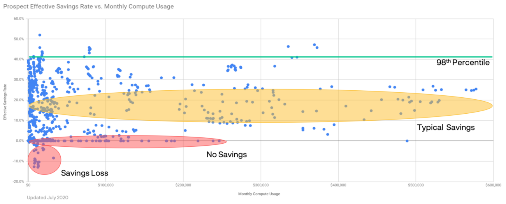

# 유효 절감률 벤치마킹하기: 귀사의 순위는 어느 정도인가요?

> 이 글은 [Benchmarking Effective Savings Rates: Where does your company rank?](https://www.prosperops.com/blog/effective-savings-rate-part-3/)을 번역하였습니다

- 평균 ESR(유효 절감률)은 10.5%이며, AWS 고객의 80% 이상이 25.5% 미만의 ESR을 달성합니다.
- 상위 2%만이 40% 이상의 ESR을 달성하며, 이는 매달 유지하기가 어렵습니다.
- ProsperOps는 AI, 최적화 알고리즘, 실시간 실행을 사용하여 위험은 낮추고 지속적인 노력 없이도 40% 이상의 ESR 결과를 일관되게 제공합니다.
---

이 글은 유효 절감률(ESR)의 개념을 소개하는 3부 시리즈 중 3부입니다. 1부에서는 ESR의 정의와 필요성, 계산 방법에 대해 설명합니다. 2부에서는 기존의 재무 최적화 지표가 오해의 소지가 있는 방법과 ESR이 항상 실제 절감액을 반영하는 유일한 지표인 이유를 살펴봅니다. 시리즈의 3부에서는 ESR을 벤치마킹하고 높은 ESR과 낮은 ESR에 대해 논의합니다.

---

## 배경
2019년 초에 클라우드 가격 최적화와 관련하여 가장 중요한 ROI 지표라고 주장하는 ESR(유효 절감률) 개념을 도입한 이후, 저희는 예약 인스턴스 및 절감 요금제와 같은 재무 도구를 사용하여 기업이 클라우드 지출을 얼마나 잘 최적화하는지 더 잘 이해하기 위해 수많은 AWS 고객을 평가했습니다. 처음으로 이 데이터를 공유하여 현재 가격 최적화의 현황을 파악하는 데 도움을 드리고자 합니다.

데이터에 대해 자세히 알아보기 전에 ESR(유효 절감률)의 기본 개념에 대해 간단히 살펴보겠습니다. 현재 저축 상품 사용 현황을 파악하는 데 도움이 되는 여러 입력 지표(예: 사용률, 충당률)가 있습니다. 하지만 이러한 지표 중 어느 것도 “나의 전체 저축률은 얼마인가?”라는 근본적인 질문에 대한 답을 제공하지는 못합니다. (현재 KPI의 한계에 대해 자세히 알아보려면 2부를 참조하세요). 글로벌 컴퓨팅 지출에서 온디맨드 가격에서 받는 혼합 할인 비율을 측정하는 ESR은 모든 입력 지표를 하나로 묶어 지출 수준과 무관한 단일 절감 성과 측정치를 제공합니다(즉, 컴퓨팅 지출이 월 1만 달러이든 월 1천만 달러이든 ESR이 높으면 좋은 것입니다). ESR은 궁극적인 절감 효과를 알려주는 지표로, ESR이 높을수록 더 많은 비용을 절감할 수 있습니다.

## 유효 절감률 벤치마킹

참고: 이 데이터 세트에는 2019년과 2020년에 실행된 ProsperOps 잠재 고객 비용 절감 분석의 1,300개 이상의 데이터 포인트가 포함되어 있습니다. 차트의 가독성을 높이기 위해 월 60만 달러까지의 컴퓨팅 사용률만 표시했지만, 월 수백만 달러에 이르는 더 큰 지출 금액에서도 결론은 유효합니다.

다음 단계는 무엇이 높고 낮은 ESR을 구성하는지 이해하는 것입니다. 이를 위해 2019년과 2020년 동안 서비스를 평가한 모든 잠재 고객의 과거 ESR과 월별 컴퓨팅 사용률을 도표로 만들었습니다. 이를 바탕으로 ProsperOps가 고객을 위해 자율적으로 생성한 ESR 결과와 대조해 볼 수 있습니다. 이를 통해 ESR 범위와 분포, 그리고 궁극적으로 가능한 것을 이해할 수 있습니다.

위 차트에서 X축은 정규화된 온디맨드 환산(ODE) 달러로 환산한 월별 컴퓨팅 사용률(EC2, Fargate, Lambda)입니다. 즉, 모든 컴퓨팅 지출을 '정가'로 되돌리고, 적용된 할인을 모두 해제하고, 사용하지 않은 약정을 제거하고, 30일 단위로 정규화했습니다. 이는 현재 저축 상품을 얼마나 잘 활용하고 있는지에 관계없이 사용률을 볼 수 있는 가장 순수한 방법입니다. Y축에는 고객이 과거에 당사 서비스 없이 달성한 해당 ESR이 표시됩니다. 어떤 고객은 스프레드시트를 사용했고, 어떤 고객은 임시 스크립트를 작성했으며, 어떤 고객은 AWS Cost Explorer 권장 사항을 사용했고, 어떤 고객은 CloudHealth, CloudCheckr 또는 Cloudability와 같은 클라우드 관리 플랫폼을 사용했습니다.

### 데이터 세트의 평균 ESR은 10.5%입니다.

## 조사 결과

다음은 5가지 주요 조사 결과입니다:

1. 손실이 발생할 수 있습니다. (차트에서 빨간색 “저축 손실” 원 참조) 실제 사용률과 일치하지 않는 약정을 체결하여 모든 것을 온디맨드 방식으로 실행할 때보다 약정으로 더 많은 비용을 지불하는 경우가 발생할 수 있습니다. 이 경우 ESR은 마이너스입니다! 이는 절약형 요금제에서도 생각보다 많이 발생합니다. 이런 일이 발생할 수 있지만 일반적으로 월 사용률이 35,000달러 미만인 소규모 고객으로 제한됩니다.

2. 많은 사용자가 아무것도 하지 않습니다. (차트에서 빨간색 '저축 없음' 타원 참조) 월 사용률이 최대 25만 달러(50만 달러 미만의 이상값이 하나 있음)인 경우, 일부 사용자는 저축 상품을 아예 포기하고 ESR이 0%가 되기도 합니다. 인식 부족, 복잡성, 향후 사용률의 불확실성, 약정에 대한 두려움 등이 이러한 비활동의 요인으로 언급되었습니다.

3. 대다수가 10~25% 사이를 저축합니다. (차트에서 노란색 '일반적인 절약' 타원 참조) 평균 예상 ESR은 10.5%이며 80%의 기업은 25.5% 이하를 절약합니다. 이 범위는 일반적인 기업이 온디맨드 요금 할인을 받을 것으로 기대할 수 있는 범위를 나타냅니다(AWS는 최대 75% 할인을 선전하지만 실제로 이를 달성하는 기업은 없습니다). 또한 이 범위의 ESR은 컴퓨팅 사용률이 적든 많든 간에 널리 퍼져 있다는 점에 유의하세요.

4. 높은 ESR을 달성하는 것은 규모 면에서 어렵습니다. 지출 규모가 커질수록 역동성이 증가하고, 사용률 패턴이 다양해지고, 회사 내 여러 팀/제품(때로는 다른 회사)에서 여러 AWS 계정을 사용하는 등 여러 가지 문제가 발생합니다. 용량 계획을 세우고 위험과 보상의 균형을 정당화하기가 점점 더 어려워지므로 기업은 약정을 헤지합니다. 월 40만 달러 이상의 사용률을 기록한 기업(현재 차트에서 제외된 두 개의 대규모 사용량 이상값 제외)의 경우 27% 이상의 ESR을 달성한 기업은 없었습니다.

5. 엘리트 ESR은 40% 이상이며 지속적으로 달성하기 어렵습니다. (차트에서 녹색 '98번째 백분위수' 선 참조) 단 2%의 기업만이 40.5% 이상의 ESR을 달성했습니다. 사용률이 월 15,000달러로 상대적으로 적었지만 표준 RI로 사용률의 100%를 커버하여 50% 이상의 ESR을 달성한 고객은 단 한 곳뿐이었습니다. 데이터에서는 명확하지 않지만, 몇 달 후 같은 고객을 평가한 결과 환경이 바뀌고 RI가 활용되지 않아 ESR이 크게 떨어졌습니다. ESR 40%를 돌파하는 것은 어려울 뿐만 아니라 매달 유지하기란 쉽지 않습니다.

최대 ESR은 지역과 플랫폼에 따라 영향을 받는다는 점에 유의해야 합니다. 잘 알려지지 않은 지역에서 운영되는 Windows 전용 스토어(둘 다 할인율이 낮은 지역)의 경우 3년의 모든 선불 약정으로 충당률과 사용률을 100%로 완벽하게 달성하더라도 ESR은 당연히 제한됩니다.

## 누구나 안전하고 일관되게 세계적 수준의 ESR을 달성할 수 있습니다

우리는 모든 사람에게 세계 최고 수준의 절감 성과를 제공하기 위해 ProsperOps를 설립했습니다. 최고의 보고 도구와 교육에도 불구하고 평균 이하의 절감 성과를 지속적으로 달성하는 고객들의 모습에 좌절감을 느꼈습니다. 더 나은 방법이 있을 거라고 생각했고, AI, 최적화 알고리즘, 실시간 실행 엔진이 가장 뛰어난 핀옵스 실무자조차도 능가하는 완벽한 할인 관리 결과를 제공할 수 있다는 것을 알았습니다(체스에서는 결국 컴퓨터가 인간을 능가하는 것처럼).

하지만 막상 실행에 옮기고 나서야 깨닫게 된 또 다른 중요한 요소는 바로 리스크였습니다. 40% 이상의 ESR을 달성하려면 완벽에 가까운 사용률과 매우 높은 충당률로 큰 폭의 할인을 달성해야 합니다. 하지만 어떻게 하면 이를 안전하게 달성할 수 있을까요? 대부분의 기업은 리스크를 관리하기 위해 충당률을 헤지하지만(물론 당연한 일이지만), 이렇게 해서는 결코 세계 최고 수준의 절감 성과를 달성할 수 없습니다.

저희 서비스의 독특하고 강력한 측면 중 하나는 필요한 경우 약정을 줄일 수 있다는 점입니다. 즉, 사용률의 95% 이상에 대해 거의 실시간으로 사용률의 상승과 하락에 따라 안전하게 할인을 제공할 수 있습니다. 이 외에도 당사가 활용하는 다른 많은 고급 기술을 통해 Linux 고객에게는 최소 40% 이상의 ESR 결과를, Windows 고객에게는 30% 이상의 ESR 결과를 보장하고 요금은 받지 않습니다. 저희 서비스를 이용하면 별도의 노력 없이도 매월 자동으로 세계 최고 수준의 ESR을 달성하는 것은 시간 문제일 뿐입니다. 할인 관리보다 더 중요한 업무가 있습니다. 프로스퍼옵스 서비스에 맡기세요.

## 영향

평균 ESR이면 충분하다고 생각하실 수도 있습니다. 그렇다면 귀하는 저희의 고객이 아닐 수도 있으며, 시애틀의 선량한 직원들은 귀하의 성원에 감사드립니다. 하지만 비용 절감 효과를 극대화하는 동시에 위험과 노력을 줄이고 싶다면 ESR 개선의 효과를 쉽게 정량화할 수 있습니다. 월 컴퓨팅 사용률이 $100,000이고 현재 ESR이 15%라고 가정해 보겠습니다. 즉, 한 달에 평균보다 높은 15,000달러를 절약하고 있다는 뜻입니다. 나쁘지 않죠. 하지만 ProsperOps를 사용하면 ESR을 40%(요금 청구 후)까지 끌어올릴 수 있으며, 이는 월 $25,000 또는 연간 $300,000의 순 절감액이 증가한다는 의미입니다. 이는 다른 서비스, 고용, 마진 개선 등 원하는 곳에 사용할 수 있도록 예산에 다시 추가되는 실제 금액입니다.

사용률이 높을 때는 ESR 바늘을 몇 포인트만 움직여도 상당한 금액의 절감 효과를 얻을 수 있습니다. 컴퓨팅에 월 300만 달러를 지출하고 있고 ESR이 35%라고 가정해 보겠습니다. 이를 40%로 올리면 연간 180만 달러를 추가로 절감할 수 있습니다!

눈으로 확인하면 믿음이 생깁니다. 과거 ESR을 파악하고 ProsperOps가 어떤 도움을 줄 수 있는지 알고 싶으시다면 완전 무료로 제공되는 간편한 절감 분석 서비스를 이용해 보세요. 저희의 사명은 모든 비즈니스가 클라우드에서 번창할 수 있도록 세계적 수준의 절감 성과를 달성하도록 돕는 것이며, 여러분을 위해 그렇게 하고 싶습니다.

