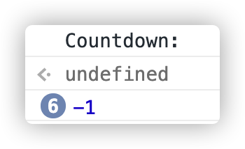

# 자바스크립트 비동기적 프로그래밍

> 자바스크립트는 단일 스레드로 동작하기 때문에 비동기 제어가 중요합니다.  
> 자바스크립트로 하는 비동기 프로그래밍이 어떻게 발전해 나갔는지 보는 글을 <러닝 자바스크립트> 책을 기반으로 작성하였습니다.

## 목차

1. 개요
2. 콜백
3. 프라미스
4. 제너레이터

## 1. 개요

### 자바스크립트 비동기적 프로그래밍의 패러다임

1. 콜백
   - 이벤트 처리, Promise, 제너레이터에 사용
2. Promise
   - 콜백에 의존.
3. 제너레이터
   - 제너레이터 자체는 비동기적 프로그래밍을 지원하지 않음.
   - 제너레이터를 비동기적으로 사용하려면 콜백과 Promise를 함께 사용해야 함.

### 비동기를 사용해야 하는 경우

1. 네트워크 요청
2. 파일시스템 작업
3. 의도적으로 시간 지연을 사용할 때 (알람 기능)

## 2. 콜백

- 자바스크립트에서 가장 오래된 `비동기적 메커니즘`
- 나중에 호출할 함수
- 콜백 함수 자체에는 특별한 것이 없고, 일반적인 자바스크립트 함수임

### 용도

- 다른 함수에 넘기기
- 객체의 프로퍼티
- 배열

### 형태

- 보통 `익명 함수`

### 요점

- 비동기적 실행은 어떤 것도 차단하지 않음
- 비동기는 동기적 프로그램처럼 한 가지 일을 하기 위해 멈춰 있는 상태를 막아줌

### 예제: setTimeout

- 콜백의 실행을 지정된 밀리초만큼 지연하는 내장 함수

```jsx
console.log("First");

setTimeout(() => {
  console.log("Last");
}, 1000);

console.log("hi");
console.log("hello");
```

- 위의 예제 코드는 어떤 순서대로 `실행`되고, 어떤 순서로 `출력`될까?

    실행 순서(Call Stack에 담기는 순서)

    ```jsx
    console.log("First"); 
    => setTimeout(f, 1000); 
    => console.log("hi");
    => console.log("hello");
    ```

    출력 순서

    ```jsx
    First
    hi
    hello
    Last
    ```

- setTimeout은 비동기적으로 실행하기 때문에 `hi`와 `hello`가 먼저 출력된다.

### 예제: setInterval & clearInterval

- setInterval은 콜백을 정해진 주기마다 호출하며 clearInterval을 사용할 때까지 멈추지 않음

`setTimeout, setInterval, clearInterval`: **전역 객체**에 정의되어 있음

### 스코프와 비동기적 실행

- 함수를 실행하면 항상 클로저가 만들어져 **비동기적 실행에도 영향을 미친다.**
- 콜백이 어느 스코프에서 선언됐느냐에 따라 접근할 수 있는 값이 달라진다.

```js
// 예제
function countdown() {
  let i;
  console.log("Countdown:");
  for(i = 5; i >= 0; i--) {
    setTimeout(() => {
      console.log(i === 0 ? "GO!" : i);
    }, (5 - i) * 1000);
  }
}
countdown();
```

위의 예제의 결과는 어떨까?

5부터 1까지 카운트되고 마지막에 GO!가 나오는 결과를 예상하지만 아니다.

- 결과: -1이 6번 반복해서 출력된다.



- 이유: `i`를 for 문 밖에 선언했기 때문이다. ⇒ **i가 for문을 다 돈 후 -1이 되었을 때 콜백이 시작됨**

    ⇒ i를 for문 안에 선언하면 원하는 결과가 출력된다.

### 오류 우선 콜백

- 콜백을 사용하면서 예외 처리를 할 수 있도록 만든 패턴
  오류가 발생한 경우 첫 번째 인수로, 요청의 결과를 추가 인수로 사용하여 함수를 실행하는 것으로 구성한다.

```js
const fs = require('fs');
const fname = 'may_or_may_not_exist.txt';

fs.readFile(fname, function(err, data) {
  if(err) return console.error(`error reading file ${fname}: ${err.message}`);
  console.log(`${fname} contents: ${data}`);
});
```

- 콜백의 첫 번째 매개변수에는 여러 객체를 쓴다.
- `에러 === null || undefined` ⇒ 에러가 없는 것
- 에러 매개변수를 체크하고 그에 맞게 반응하게 해야 한다.
- 가장 먼저 하는 일: err이 참 같은 값인지 확인

⇒ 참이면 오류 보고

(강력 권장) 콜백을 사용하는 인터페이스를 만들 때, 오류 우선 콜백 사용하기

### 콜백 지옥


#### 문제점

- 콜백이 두 번 호출되거나 호출되지 않는 경우를 방지하는 안전장치가 없음
- 자바스크립트는 콜백이 정확히 한 번 호출되는 것을 보장하지 않음

⇒ `Promise 등장 배경`

## 3. Promise

> 일반적으로 안전하고 관리하기 쉬운 코드를 만들 수 있게 하는 **객체**

#### 개념과 특징


- 콜백을 대체하는 것이 아니고, 콜백을 예측 가능한 패턴으로 가능하게 만들어 콜백만 사용할 때의 버그를 줄여 줌
- Promise 기반 **비동기적 함수** 호출 ⇒ 함수: `Promise 인스턴스 반환`
- ***성공(resolve), 실패(reject)*** 두 가지 경우만 존재하고, ***단 한 번***만 발생함
- 성공과 실패를 판별하는 역할(Promise 상태 관리)을 할 뿐, **함수를 멈추지는 않음**
- 현재 진행 상황을 알 수 없음(성공, 실패 여부만 알 수 있음)
- 객체이기 때문에 어디든 전달 가능함

**예제1**

```js
function countdown(seconds) {
  return new Promise(function(resolve, reject) {
    for(i = seconds; i >= 0; i--) {
      setTimeout(() => {
        if (i > 0) console.log(i);
        else resolve(console.log("GO!"));
      }, (seconds - i)*1000);
    }
  });
}
countdown(5).then(
  function() {
    console.log("countdown completed");
  },
  function(err) {
    console.log("countdown error" + err.message);
  }
);
```

#### 실행 결과


#### 예제2

```js
fetch(url, { method: "GET" })
  .then(response => response.json())
  .catch(error => console.error(error));
```

### 이벤트

> 이벤트가 일어나면 이벤트 발생을 담당하는 **개체(emitter)**에서 이벤트가 일어났음을 알림

**개념과 특징**

- 필요한 이벤트를 모두 **주시(listen)** 가능함
- How to **listen**? ⇒ `Callback`
- 노드: 이벤트를 지원하는 **EventEmitter** 모듈 내장

**EventEmitter**

- 상속받거나 import해서 이벤트 발생 가능

사용 방법

```jsx
const EventEmitter = require("events").EventEmitter;

const myEmitter = new EventEmitter("myEvent1", "myEvent2");

myEmitter.on("myEvent1", function(arg) {
  console.log("myEvent1 fired with " + arg);
});

myEmitter.emit("myEvent1", "an arg");
// 출처: https://fuseopen.com/docs/fusejs/eventemitter.html
```

### Promise Chaining

- 프라미스는 체인으로 연결 가능함
- 프라미스가 완료되면 다른 프라미스를 반환하는 함수를 즉히 호출할 수 있음
- 프라미스 사용시 *모든 단계*에서 에러 캐치할 필요는 없음

```jsx
new Promise(function(resolve, reject) {
  setTimeout(function() {
    resolve(1);
  }, 2000);
})
  .then(function(result) {
    console.log(result); // 1
    return result + 10;
  })
  .then(function(result) {
    console.log(result); // 11
    return result + 20;
  })
  .then(function(result) {
    console.log(result); // 31
  });
```

### 결정되지 않는 Promise 방지하기

- Promise는 **resolve, reject**를 호출하지 않아 `Promise 상태가 결정되지 않는 문제`를 자동으로 해결하지 못함
- 에러가 일어나지 않아 찾기 어려움
- 방지 방법: **setTimeout** 사용 ⇒ 정해진 시간이 지나면 자동으로 reject하게 만듦

### 제너레이터

- 함수와 호출자 사이의 `양방향 통신`을 가능하게 함
- Promise와 결합하면 비동기 코드를 효율적으로 관리할 수 있음
- 동기적인 생각처럼 비동기 코드를 작성할 수 있게 됨

**제너레이터 + 프라미스**

> yield를 호출해 멈춘 Generator을 Promise가 제어하도록 하는 것  

1. 노드의 오류 우선 콜백 ⇒ 프라미스
2. 오류 우선 콜백의 패턴을 따르지 않는 setTimeout의 기능을 가진 ptimeout(promise timeout) 함수 생성
3. 제너레이터 실행기 (동기적인 제너레이터와 통신을 관리하고 비동기적 호출을 처리하는 함수) 생성
4. 콜백 지옥보다 훨씬 낫고, 프라미스 하나만 쓸 때보다 단순한 코드 작성 가능해짐
   - 비동기적으로 실행하면서도 동기적인 동작을 유지해서 `try/catch`를 써서 예외처리할 수 있다.

#### 제너레이터 실행기

- 제너레이터와 호출자의 통신을 관리하고, 비동기적 호출 처리하는 grun 함수 만들어 이용
- `co나 Koa`라는 이미 만들어진 생성기를 사용해도 된다.

```js
function grun(g) { 
    const it = g();
    (function iterate(val){
        const x = it.next(val);
        if(!x.done) {
            if(x.value instanceof Promise) {
                x.value.then(iterate).catch(err => it.throw(err));            
            }else{
                setTimeout(iterate,0,x.value);
            }
        }
    })();
}
```

#### 예제 

```js
function* theFutureIsNow() {
  const data = yield Promise.all([
    nfcall(fs.readFile, 'a.txt'),
    nfcall(fs.readFile, 'b.txt'),
    nfcall(fs.readFile, 'c.txt')
  ]);
  yield ptimeout(60 * 1000);
  yield nfcall(fs.writeFile, 'd.txt', data[0] + data[1] + data[2]);
}
```

## 정리

- 자바스크립트 비동기적 실행은 콜백을 통해 이루어진다.
- Promise도 콜백을 사용한 패턴이다.(콜백의 단점을 보완한 것이다.)
- Promise는 체인으로 연결할 수 있다.
- 제너레이터 + 프라미스 => 비동기적 실행의 장점 유지 + 동기적인 사고 방식으로 문제 해결 가능

### 참고링크
- https://vanayun.netlify.app/til/2019-02-15-es6_14/
- https://suhwan.dev/2018/04/18/JS-async-programming-with-promise-and-generator/