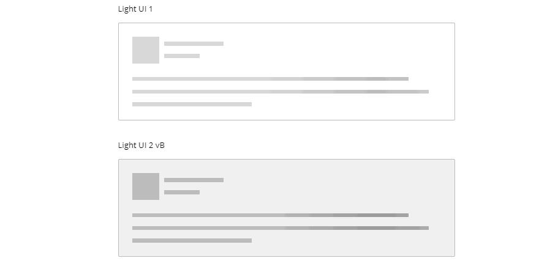
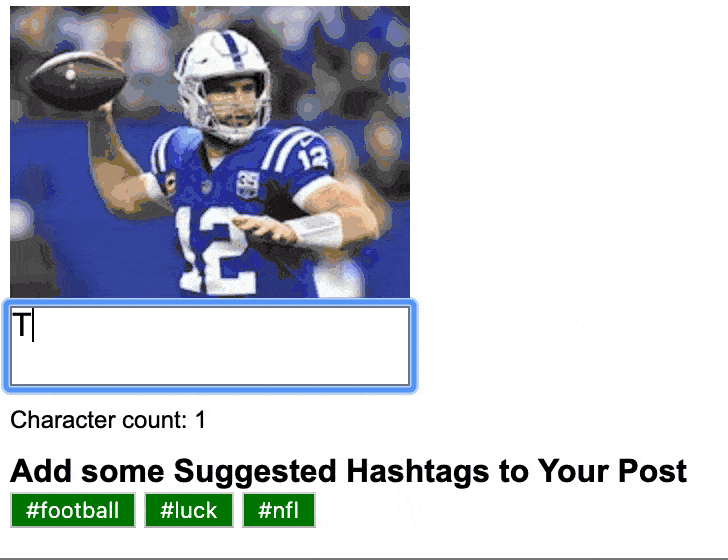
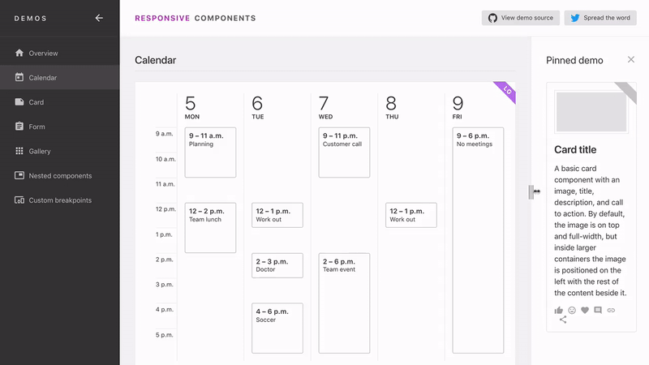
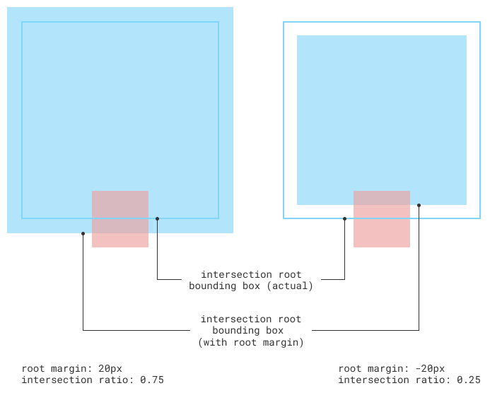
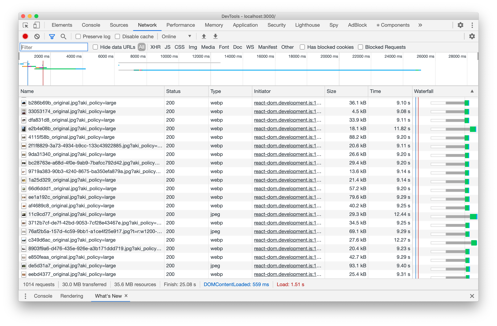
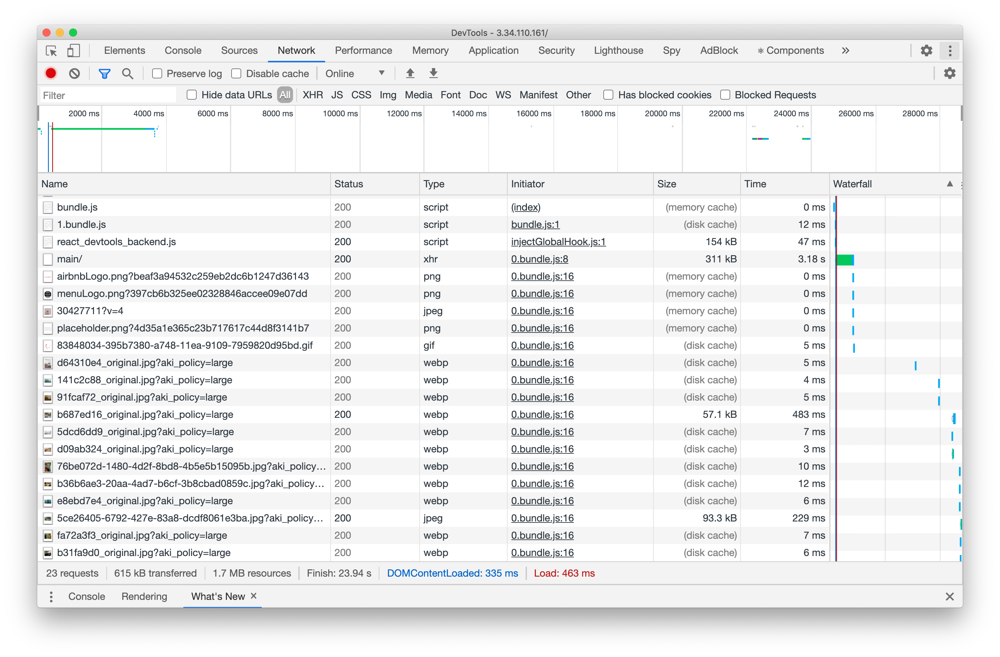
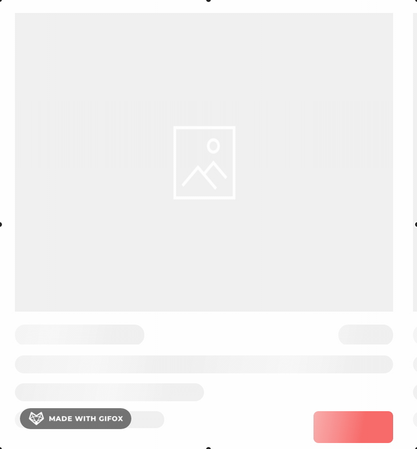

# [React] Infinite Scroll과 Skeleton Loading 만들기

> 아무리 빠른 인터넷 환경이라고 해도 수백 개, 1,000개 이상의 데이터를 받는 데에는 시간이 오래 걸립니다.
> 오늘 포스팅에서는 많은 데이터를 하나의 페이지에 랜더링해야 할 때 어떻게 지연 로딩을 할 수 있는지 알아보겠습니다.

## 개요

1. Infinite Scroll과 Skeleton Loading은 무엇일까?
2. 자바스크립트에서 지원하는 Observer API
3. Intersection Observer를 자세히 알아 보자.
4. Infinite Scroll 만들기
5. Skeleton Loading 만들기

## 1. Infinite Scroll과 Skeleton Loading은 무엇일까?

### Infinite Scroll

- Infinite Scroll, 즉 무한 스크롤을 의미합니다. 페이스북, 인스타그램과 같이 계속해서 콘텐츠를 보여주는 사이트가 예입니다.
- 아래와 같이 콘텐츠가 없을 때까지 계속해서 스크롤을 늘려 가면서 로딩이 됩니다.

<p class="codepen" data-height="265" data-theme-id="dark" data-default-tab="result" data-user="Goji" data-slug-hash="Kpgegd" style="height: 265px; box-sizing: border-box; display: flex; align-items: center; justify-content: center; border: 2px solid; margin: 1em 0; padding: 1em;" data-pen-title="Responsive Masonry + Filter (isotope) + Infinite Scroll + Effect">
  <span>See the Pen <a href="https://codepen.io/Goji/pen/Kpgegd">
  Responsive Masonry + Filter (isotope) + Infinite Scroll + Effect</a> by Goji (<a href="https://codepen.io/Goji">@Goji</a>)
  on <a href="https://codepen.io">CodePen</a>.</span>
</p>
<script async src="https://static.codepen.io/assets/embed/ei.js"></script>

### Skeleton Loading

- 데이터가 아직 로딩중일 때 해당하는 영역이 렌더링된 상태가 되도록 하는 것입니다.
- 스켈레톤 로딩을 사용하지 않으면 데이터가 비동기로 로딩되고 랜더링될 때 화면이 밀려나는 현상이 있어 UX 관점에서 좋지 않습니다.



## 2. 자바스크립트에서 지원하는 Observer API

> `Observer pattern`은 객체의 상태 변화를 관찰하는 관찰자들(옵저버)을 등록하여 상태 변화가 있을 때마다 각 옵저버에게 알리는 디자인 패턴입니다.
> 이러한 옵저버 패턴을 기반으로 한 자바스크립트 내장 `Observer API`들을 간단하게 살펴보겠습니다.

### MutationObserver

- DOM 변경을 모니터링하는 옵저버입니다. 변경이 잦은 부분에서 사용할 수 있습니다.
- 크게 아래와 같은 변경을 감지합니다.

1. 요소가 삽입/삭제될 때
2. 요소가 수정된 경우 (속성과 내용 모두)
3. 요소의 자식이 수정된 경우



### ResizeObserver

- 타겟 요소의 크기가 변경될 때마다 알려 주어 크기를 모니터링할 수 있게 하는 옵저버입니다.
- 화면의 전체 크기 뿐만 아니라 일부의 크기를 조작했을 때 반응형으로 보이게 할 때 유용하게 쓸 수 있습니다.



### IntersectionObserver

- `타겟 요소`와 상위 요소 또는 최상위 document 의 `viewport` 사이의 intersection(교차 지점)의 변화를 비동기적으로 관찰합니다.
- 타겟 요소가 화면에 얼만큼 보이는지에 따라 다양한 이벤트를 줄 수 있습니다. Observer API 중에서 Infinite Scroll과 Skeleton Loading에 가장 적합합니다.


## 3. Intersection Observer를 자세히 알아 보자.

> Intersection Observer는 타겟 요소의 영역이 얼마나 많이 보이는지에 대한 변경 사항을 보고합니다.
> 어떻게 써야 하는지 자세히 알아 봅시다.

우선 Intersection한다는 것은 `눈에 보이는 영역(혹은 지정한 영역)`에 타겟 요소가 `교차`한다는 것을 말합니다.

아래 이미지와 함께 보면 하늘색이 모니터, 분홍색이 관찰하고 있는 타겟 요소입니다. 우리는 여기서 교차 비율(얼마만큼 교차했는지 0~1까지의 정도)에 따라서 어떤 행동을 실행할지도 정할 수 있습니다.


### ① Intersection Observer 생성하기

Intersection Observer는 callback 함수와 option을 인자로 넣어 생성합니다.

```jsx
let observer = new IntersectionObserver(callback, options);
```

#### callback

교차 지점에 들어섰을 때 실행되는 함수입니다. 색을 변화시키거나 로딩을 완료시키는 등의 필요한 코드를 작성하변 됩니다.

#### options

옵션은 다음과 같이 설정할 수 있는데, 옵션을 설정하게 되면 옵저버가 실행되는 환경이 설정한 대로 변경됩니다.

```jsx
let options = {
  root: document.querySelector("#scrollArea"),
  rootMargin: "0px",
  threshold: 1.0,
};
```

아래 설명을 통해 옵션으로 어떤 것을 설정할 수 있는지 보겠습니다.

1. `root`: 교차 지점을 감시하는 영역을 설정할 수 있습니다. 위의 코드로 보면 scrollArea라는 id를 가진 요소가 루트로 설정되는 것입니다. 설정하지 않거나 null로 설정하면 브라우저 뷰포트(웹페이지가 사용자에게 보여지는 영역)가 기본값입니다.
2. `rootMargin`: root가 가지는 여백을 설정할 수 있습니다. CSS의 margin 속성과 비슷하며, 기본값은 0입니다. 양의 값으로 확장, 음의 값으로 축소시킬 수 있습니다.

   

3. `threshold`: 타겟 요소가 얼마나 보이고 있는지에 대한 퍼센트를 나타내는 단일 숫자 혹은 숫자 배열입니다. 지정한 숫자 퍼센트까지 화면에 보이지 않으면 콜백 함수가 실행되지 않습니다.

   

### ② Observer 등록하기

생성한 옵저버는 observe 메소드를 통해 인자에 타겟 요소를 넣어 관찰을 시작할 수 있습니다.

```jsx
observer.observe(target);
```

### ③ callback 함수 지정하기

콜백함수는 `IntersectionObserverEntry 객체 목록`과 `관찰자`를 파라미터로 받습니다.

- `IntersectionObserverEntry 객체 목록` 에서 주로 쓰이는 객체는 intersectionRatio와 isIntersectiong입니다.
  - intersectionRatio: 콜백함수가 실행된 지점에서의 교차하는 비율 값을 말합니다.
  - isIntersectiong: 타겟 요소가 현재 교차 루트와 교차하는지 여부를 boolean 값으로 알 수 있습니다.

```jsx
let callback = (entries, observer) => {
  entries.forEach((entry) => {
    // 타겟 요소가 바뀔 부분
  });
};
```

> 이제 Intersection Observer 실제 프로젝트에 적용해 보도록 하겠습니다.
> 저는 숙소 예약 프로젝트에서 숙소 데이터가 1,000개 이상이었기 때문에 이를 적용했습니다.

## 4. Infinite Scroll 만들기

데이터가 스크롤 끝에 갈 때마다 9개씩 로딩되도록 할 예정입니다.

1. 우선 `IntersectionObserver`를 등록합니다. useEffect 안에서 콜백으로 등록했는데, ref에 변화가 생기면 실행됩니다.

- `ref`를 컴포넌트의 최하단에 넣게 되면 스크롤이 가장 마지막으로 갔을 때 ref에 값이 담기게 되어 useEffect가 실행됩니다.

```jsx
useEffect(() => {
  let observer;
  if (ref) {
    observer = new IntersectionObserver(checkIntersect, option);
    observer.observe(ref);
  }
  return () => observer && observer.disconnect();
}, [ref]);
```

1. 옵저버에서 실행될 콜백 함수입니다. 타겟 요소(ref)가 뷰포트와 교차하게 되면 현재 타겟을 unobserve하고, fetchItems를 실행시켜 9개가 추가된 데이터를 기반으로 다시 observe합니다.

- 여기서 fetchItems는 `const fetchItems = async () => setItemCount((prev) => prev + 9);`로, 이전 아이템 개수보다 9개 추가시키는 함수입니다.

```jsx
const checkIntersect = ([entry], observer) => {
  if (entry.isIntersecting) {
    async (entry, observer) => {
      observer.unobserve(entry.target);
      await fetchItems();
      observer.observe(entry.target);
    };
  }
};
```

3. 옵저버를 통해 주어진 아이템으로 랜더링합니다. 아이템 개수만큼 slice하여 랜더링하면 DevTool의 Network 탭에서도 9개씩 받아오게 됩니다.

```jsx
return (
  <>
    <Wrapper>
      data.rooms .slice(0, itemCount) .map((list) => (
      <Accommodation roomData={list} key={list.roomId} />
      ))
      <div ref={setRef} />
    </Wrapper>
  </>
);
```

- 1,000개의 전체 데이터를 받아올 때 - 26000ms 가까이 로딩되는 것을 볼 수 있습니다.



- Intersection Observer 적용하여 9개씩 받아올 때 - 데이터가 9개씩 다른 시간대에 받아오는 것을 볼 수 있습니다.



## 5. Skeleton Loading 만들기

데이터를 스크롤에 따라 나누어 받아오는 것은 성공했지만 로딩할 때 어딘가 부자연스러워 보이기도 합니다. 이를 해결하기 위해 역시 Intersection Observer를 사용해 Skeleton Loading을 구현해 보겠습니다.

원하는 형태는 다음과 같습니다.



- 로딩 형태는 크기와 색 정도만 다르고 비슷하기 때문에 재사용 스타일 컴포넌트를 생성합니다.
- keyframe과 linear-gradient를 사용하면 계속해서 흘러가는 느낌을 주는 애니메이션을 만들 수 있습니다.

```jsx
import styled, { keyframes } from "styled-components";

const shine = keyframes`
  to {
    background-position:
      100% 0,
      200px 0;
  }
`;

const Skeleton = styled.div`
  &:empty {
    border-radius: 15px;
    background-repeat: repeat-x;
    background-image: linear-gradient(
        100deg,
        rgba(255, 255, 255, 0),
        rgba(255, 255, 255, 0.5) 50%,
        rgba(255, 255, 255, 0) 80%
      ), linear-gradient(#eeeeee 20px, transparent 0);
    background-size: 200px 70px, 200px 300px;
    background-position: 0 0, 200px 0;
    animation: ${shine} 1s infinite;
  }
`;

export default Skeleton;
```

- useRef를 2개 선언합니다. 하나는 Skeleton Loading을 작성할 컴포넌트의 위치를 구하기 위함이고, 하나는 observer의 위치를 구하기 위함입니다.

```jsx
const imgRef = useRef(null);
const observerRef = useRef();
```

- Infinite Scroll과 같이 useEffect의 콜백 함수에서 옵저버를 등록하지만, 여기서는 초기에 한 번만 등록합니다. 한 번 로딩이 되고 나면 다시 실행될 필요가 없기 때문입니다.

```jsx
useEffect(() => {
  if (!observerRef.current) {
    observerRef.current = new IntersectionObserver(onIntersection, option);
  }

  imgRef.current && observerRef.current.observe(imgRef.current);
}, []);
```

- 옵저버가 실행될 때 실행되는 콜백 함수입니다. 교차 지점이 되면 타겟을 unobserve하고 로딩이 완료되었다는 의미에서 isLoad를 true로 변경합니다.

```jsx
const [isLoad, setIsLoad] = useState(false);

const onIntersection = (entries, io) => {
  entries.forEach((entry) => {
    if (entry.isIntersecting) {
      io.unobserve(entry.target);
      setIsLoad(true);
    }
  });
};
```

- 옵저버가 실행되어 isLoad가 true가 되기 전까지는 skeleton 코드를 작성합니다. 로딩 완료 후와 크기와 위치를 동일하게 하고, 위에서 만든 Skeleton 재사용 스타일을 mixin 방식으로 사용하면 됩니다.

```jsx
return (
  <>
    <Wrapper ref={imgRef}>
      {isLoad ? <>// 로딩 완료 후 컨텐츠 작성 부분</> : <>// 로딩 완료 전 Skeleton 작성 부분</>}
    </Wrapper>
  </>
);
```

## 6. 결과


- Intersection Observer를 사용하여 Infinite Scroll과 Skeleton Loading을 구현해 보았습니다.
- 자바스크립트의 옵저버 API를 사용하여 성능을 향상시킬 수 있습니다.

## 참고

- [https://www.huskyhoochu.com/js-observers/](https://www.huskyhoochu.com/js-observers/)
- [https://blog.arnellebalane.com/the-intersection-observer-api-d441be0b088d](https://blog.arnellebalane.com/the-intersection-observer-api-d441be0b088d)
- [https://wit.nts-corp.com/2018/11/19/5371](https://wit.nts-corp.com/2018/11/19/5371)
- [https://godsenal.com/posts/React-Intersection-Observer를-사용하여-인피니트-스크롤-구현하기/](https://godsenal.com/posts/React-Intersection-Observer%EB%A5%BC-%EC%82%AC%EC%9A%A9%ED%95%98%EC%97%AC-%EC%9D%B8%ED%94%BC%EB%8B%88%ED%8A%B8-%EC%8A%A4%ED%81%AC%EB%A1%A4-%EA%B5%AC%ED%98%84%ED%95%98%EA%B8%B0/)
- [http://blog.hyeyoonjung.com/2019/01/09/intersectionobserver-tutorial/](http://blog.hyeyoonjung.com/2019/01/09/intersectionobserver-tutorial/)
- [https://developer.mozilla.org/ko/docs/Web/API/Intersection_Observer_API](https://developer.mozilla.org/ko/docs/Web/API/Intersection_Observer_API)
