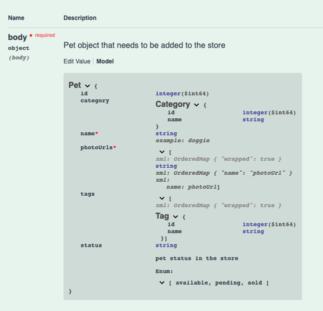
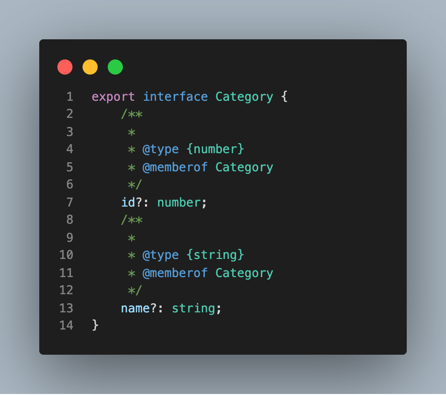
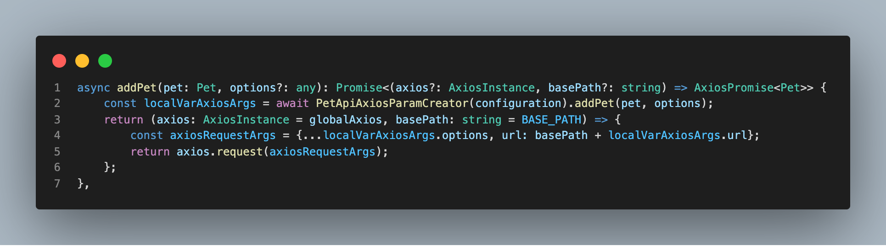

# OpenAPI Generator 사용하기 - Typescript
 
 
 ## 개요
 
 1. Typescript에서의 api type 정의 반복
 2. OpenAPI Generator 장단점
 3. OpenAPI Generator 사용하기
 4. 정리
 
 ---
 
 ### 1. Typescript에서의 api type 정의 반복
 
 > 백엔드에서 api가 개발되면 swagger와 같은 문서 툴로 받게 됩니다. 자바스크립트에서라면 바로 fetch 혹은 axios로 api에 요청하는 코드를 작성하면 됩니다. 
 > 타입스크립트의 경우는 어떤지 살펴 봅시다.
  
 #### Request와 Response 타입 정의하기
 
 - 우리는 swagger에 명시된 타입을 바탕으로 타입을 정의해야 합니다. 아래와 같이 명세를 펼치면 알맞는 타입을 알 수 있습니다. 
 
 
 캡처 출처: https://petstore.swagger.io/#/pet/addPet
 
 - 그렇게 타입을 아래와 같이 정의했습니다. (github의 issue 상세 페이지를 예상하고 간략하게 작성했습니다.)
 
 ```ts
 interface GetApiRequest {
   params: {
     postNo: string;
   }
 }
 
 interface GetApiResponse {
   contents: GetApiResponseContents[];
 }
 
 interface GetApiResponseContents {
   ...
   name: string;
   title: string;
   milestones: {
     milestoneId: number;
     milestoneName: string;
     isChecked: boolean;
   }
   ...
 }
 ```
 
 - 하나의 GET 요청/응답에는 한두개부터 수십개까지 갈 수 있고, 개수가 많아지면 휴먼에러도 많이 발생하게 됩니다. 생산성에도 영향이 있을 것입니다.
 - 이런 불편함을 느끼던 중에 FEConf 2020에서 [OpenAPI Specification으로 타입-세이프하게 API 개발하기: 희망편 VS 절망편](https://www.youtube.com/watch?v=J4JHLESAiFk&ab_channel=FEConfKorea)를 보게 되었습니다. OpenAPI는 사용하고 있으니 툴만 잘 사용하면 되는 상황이었습니다. 그럼 이제 그 툴인 OpenAPI Generator의 장단점에 대해 알아보도록 하겠습니다.
 
 > 참고: 이 포스팅에서 OpenAPI는 공개된 API가 아닌 OAS를 얘기합니다.
 
 ### 2. OpenAPI Generator 장단점
 
 > OpenAPI를 사용하기 위해서는 백엔드와의 협업도 중요합니다. 백엔드와 프론트엔드의 입장에서 각각 장단점을 살펴 보도록 하겠습니다.
 
 **백엔드**
 
 #### 장점
 
 - 구현할 때 안정적입니다.
 - OAS의 오픈 소스 환경에 있어 협력적인 개발을 할 수 있습니다.
 - API 테스트 진행 시 신뢰도가 높습니다.
 - API 문서를 자동으로 생성할 수 있습니다.
 
 #### 단점
 
 - OAS를 능숙하게 사용하려면 리소스에 적응할 러닝 커브가 존재합니다.
 - spec 작성 시 오류가 발생하면 Generator로 생성된 코드에도 오류가 발생하게 됩니다.
 
 ---
 **프론트엔드**
 #### 장점
 
 - 수동으로 타입을 정의하고 API 호출 코드를 작성하지 않음으로 인해 휴먼에러가 감소하고 생산성이 증가됩니다.
 - 기본적으로 제공되는 템플릿이 안정적이고 하나의 언어에도 여러 상황을 선택할 수 있습니다.
 - 자동화까지 진행하면 더 빠른 진행이 가능해 집니다.
 
 #### 단점
 
 - 기존 작업 내역이 존재하거나 패턴, 코딩 스타일이 다르면 도입하기 힘들 수 있습니다.
 
 ### 3. OpenAPI Generator 사용하기
 
 #### 1) 설치(Mac)
 
 - Homebrew를 통한 설치가 가능합니다. `openapi-generator`를 실행하기 위해서는 OpenJDK 환경이 필요하니 같이 설치합니다. 
 
 ```bash
 brew install openapi-generator
 brew tap AdoptOpenJDK/openjdk
 brew cask install adoptopenjdk12
 export JAVA_HOME=/Library/Java/JavaVirtualMachines/jdk-12.0.2.jdk/Contents/Home/
 brew install maven
 ```
 
 - 설치 후에는 버전을 확인해 설치를 확인합니다.
 
 ```
 $ openapi-generator version
 4.3.1
 ```
 
 #### 2) yml 파일 다운로드
 
 - 코드 생성을 위해서는 OAS가 적힌 `yml 파일`이 필요합니다. 파일은 swagger와 같은 API 문서 툴에서 다운받을 수 있습니다.
 
 아래는 [공개된 swagger](https://petstore.swagger.io/#/pet/addPet)의 yml 파일 일부입니다.
 
 
 
 #### 3) 실행
 
 - `-i`: 포함할 파일 목록 작성
 - `-g`: generator 이름([generator 리스트](https://openapi-generator.tech/docs/generators))
 - `-o`: 저장할 디렉토리 이름
 
 yml 파일을 다운받고 `typescript` 중에서도 `axios` 방식으로 통신을 진행하도록 설정해서 generator를 실행합니다.
 
 ```
 openapi-generator generate -i petstore.yaml -g typescript-axios -o petstore
 ```
 
 타입 인터페이스가 아래와 같은 형태로 작성되었습니다.
 
 
 
 통신 코드도 axios 타입을 `AxiosPromise`와 `AxiosInstance`로 axios에서 제공하는 타입을 가져와 사용하는 코드로 생성되었습니다.
 
 
 
 ### 4. 정리
 
 - OpenAPI를 사용하면 프론트의 Typescript 환경에서 생성기(generator)를 사용할 수 있습니다.
 - 기업에서 다량 작업이 필요할 때 환경이 맞으면 큰 도움이 될 것이라고 생각됩니다.
 
 ## Reference
 
 - https://www.youtube.com/watch?v=J4JHLESAiFk
 - https://github.com/OpenAPITools/openapi-generator
 - https://nordicapis.com/what-should-you-consider-before-openapi-adoption/
 - https://medium.com/bigdecimal/code-that-codes-pros-and-cons-of-code-generators-15b2e571281a
 - https://www.altexsoft.com/blog/openapi-specification/
