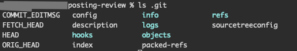
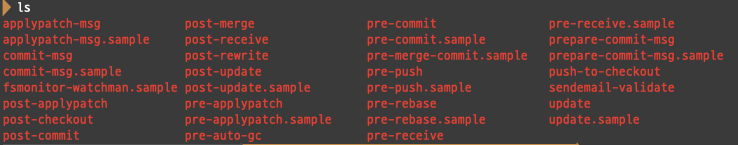
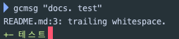

# 프로젝트 관리를 위한 Git Hooks 간단 정리

> 우리는 프로젝트 버전 관리를 하기 위해 주로 Git을 사용하죠. repository를 만들어 클론하거나 git init 명령을 통해 시작합니다.
> 그러면 프로젝트 내부에 `.git 디렉토리`가 생기게 되는 것을 알고 계셨나요?
> git에서 커스텀해서 사용할 수 있는 `git hooks` 중 몇가지를 알아보도록 하겠습니다.

## 개요

1. git hooks란?
2. git hooks 종류
3. 정리

---

### 1\. git hooks란?

* git으로 관리하는 프로젝트에서 .git을 조회하면 아래와 같습니다.
* 아래 리스트 중 이번 포스팅에서는 hooks의 종류와 쓰이는 상황을 알아보겠습니다.
* git hooks는 특정 상황일 때 스크립트를 실행하게 하여 사용자가 규칙을 정해 사용할 수 있게끔 해 줍니다.
* 어찌 보면 사전에 코드를 검사해 주는 Prettier나 lint와도 비슷하다고 할 수 있겠습니다.

* hooks를 조회화면 하나의 이름에 두 파일씩 있습니다. 같은 이름으로 확장자가 .sample 인 파일과 확장자가 없는 파일이 있는 것입니다.

* 확장자가 없는 파일은 현재 특정 상황에서 실행되는 기본 스크립트가 있습니다. cli로 git 명령어를 입력할 때 나오는 메시지들이 이 스크립트를 통해 보여지는 것입니다.
* 이 파일을 수정하거나 sample 확장자를 지워서 사용할 수 있습니다.
* 아래는 sample 파일에서 확장자를 지우고 커밋했을 때의 결과입니다.
* 수정시킨 파일의 라인과 수정된 부분이 출력되었습니다.

### 2\. git hooks 종류
 
- 주요 hook에 대해 의미와 주로 사용되는 상황에 대해 정리해 보겠습니다\.
 
| hook | 의미 | 용도 |
| --- | --- | --- |
| pre-commit | 커밋할 때 가장 먼저 실행되는 훅   | 코드 스타일 검사(lint 등)  공백 문자 검사  주석 검사 |
| prepare-commit-msg | 커밋 메시지를 생성하고 편집기를 실행하기 전에 실행되는 훅 | 커밋 메시지 템플릿 적용   Merge, Squash, Amend 커밋 템플릿 적용 |
| post-merge | Merge가 끝나고 나서 실행되는 훅 | 파일 권한 추적   Merge로 Working Tree 변경 시 파일의 배치 검사 |

- git hook을 편하게 사용하도록 도와주는 [husky](https://github.com/typicode/husky)와 커밋 메시지를 관리해 주는 [commitlint](https://github.com/conventional-changelog/commitlint)와 같은 라이브러리들도 있습니다.

####

### 3\. 정리

- git을 계속 써왔지만 어떤 기능이 동작하고 어떻게 커스텀하는지에 대해서는 잘 몰랐었습니다.
- git의 내부 동작에 관해서도 알고 싶어지네요.

### 참고

- [훅으로 Git에 훅 들어가기](https://woowabros.github.io/tools/2017/07/12/git_hook.html)
- [8.3 Customizing Git - Git Hooks](https://git-scm.com/book/en/v2/Customizing-Git-Git-Hooks)
- [https://www.huskyhoochu.com/npm-husky-the-git-hook-manager/](https://www.huskyhoochu.com/npm-husky-the-git-hook-manager/)
- [https://library.gabia.com/contents/8492](https://library.gabia.com/contents/8492)
- [https://woowabros.github.io/tools/2019/08/05/swiftlint-githooks.html](https://woowabros.github.io/tools/2019/08/05/swiftlint-githooks.html)
- [https://github.com/typicode/husky/tree/master](https://github.com/typicode/husky/tree/master)
- [https://git-scm.com/book/ko/v2/분산-환경에서의-Git-프로젝트-관리하기](https://git-scm.com/book/ko/v2/%EB%B6%84%EC%82%B0-%ED%99%98%EA%B2%BD%EC%97%90%EC%84%9C%EC%9D%98-Git-%ED%94%84%EB%A1%9C%EC%A0%9D%ED%8A%B8-%EA%B4%80%EB%A6%AC%ED%95%98%EA%B8%B0)