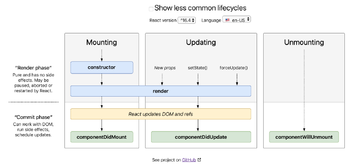
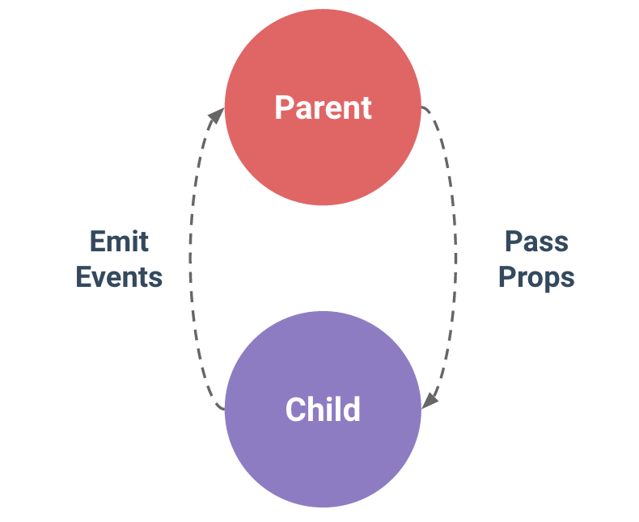

# 회원가입 기능 만들며 React와 Vue 비교하기

> 저는 기존에 React를 중심으로 페이지 개발을 해 왔습니다. 
> 그리고 Vue는 React와 닮은 점이 많습니다. 가장 큰 것은 View를 중심으로 컴포넌트를 쪼개서 관리할 수 있다는 것이죠.
> 다른 점은 어떤 것이 있는지 간단한 회원가입 기능을 React와 Vue로 각각 만들어 비교해 보겠습니다.

참고

- `React`: 16.13버전, Function component
- `Vue`: 2.6버전, Single File component
- 사용법 차이 위주로 설명하고 있습니다.
- 스타일은 동일하게 적용했습니다.

## 개요

1. 전체 코드
2. 기본 구성과 형태
3. 라이프 사이클
4. props
5. 이벤트 전달

## 1. 전체 코드

### React

Codesandbox 링크: [https://codesandbox.io/s/react-sign-up-6yyh4](https://codesandbox.io/s/react-sign-up-6yyh4)

### Vue

Codesandbox 링크: [https://codesandbox.io/s/vue-sign-up-9gius?file=/src/views/SignupForm.vue](https://codesandbox.io/s/vue-sign-up-9gius?file=/src/views/SignupForm.vue)

## 2. 기본 구성과 형태

> 공식으로 제공하는 보일러 플레이트와 랜더링하는 기본 방식에 대해 비교해 봅시다.

### 보일러 플레이트

리액트와 뷰에서는 환경 설정에 대한 시간을 줄이고 바로 시작할 수 있도록 도와주는 템플릿인 보일러 플레이트를 제공합니다. 사용법은 키워드 정도만 다릅니다.

#### React

```jsx
// cra를 일회성으로 사용할 경우
npx create-react-app react-sign-up

// npm을 사용해 global 설치해 사용할 경우
npm install -g create-react-app
create-react-app react-sign-up
```

#### Vue

```jsx
// vue create를 일회성으로 사용할 경우
npx @vue/cli create vue-sign-up

// npm을 사용해 global 설치해 사용할 경우
npm install -g @vue/cli
vue create vue-sign-up
```


기본 설정 외에 다른 의존성을 추가하려고 한다면 리액트는 `--typescript` 와 같이 간단한 옵션을 지정할 수 있고, 뷰는 설치 시 `직접 설정`할 수 있습니다. 개인적으로는 뷰에 선택지가 더 많아서 라우팅과 vuex까지 편하게 시작할 수 있어 편리했습니다. 만약 직접 설정하는 경우라면 환경 구성은 비슷하게 이루어질 것 같습니다.

설치 후 config를 수정하기 위해서는 리액트는 `eject` 기능으로, 뷰는 `vue.config.js`로 진행 가능합니다.

### 기본 형태

> 리액트와 뷰의 컴포넌트를 작성할 때 주의할 점은 태그를 작성하는 부분에서 로직이 많이 들어가면 성능 면에서 좋지 않습니다. 
리액트에서는 변수 혹은 함수화하기를 권장하고 뷰에서는 computed를 활용하여 계산되는 부분을 스크립트 부분에서 처리하도록 권장하고 있습니다.

리액트는 최근 버전에서 함수형 컴포넌트를 사용하길 권장하고 있고, 뷰는 클래스 형태라는 점에서 다릅니다.

그리고 타입스트립트를 도입할 때 개인적으로 뷰가 더 도입하기 까다롭다는 생각이 들었습니다. 리액트는 기존 형태에 타입 지정만 추가해 주면 되는 반면 뷰는 vue-property-decorator라는 별도의 의존성을 사용해야 해서 JS일 때와 TS일 때의 기본 형태가 달라 처음에 혼선을 겪었습니다. 

#### React

- 태그 작성 부분: 컴포넌트의 `return` 부분에 태그를 작성합니다. 단, 전체를 감싸는 하나의 태그가 필요합니다. `<></> 형태`로 감싸도 가능하고 다른 태그도 가능합니다.
    - 태그 안에서 값 사용 시 `{value}`와 같은 형태로 써서 사용합니다.
- 로직 작성 부분: 태그가 리턴되기 전의 부분에 함수, 변수를 작성합니다. 컴포넌트 안에서 사용하는 데이터는 보통 useState를 사용합니다.

```jsx
import React from 'react';

const App = () => {
  const value = 1;

  return (
    <div>
      <h1>{value}</h1>
    </div>
  );
};

export default App;
```

#### Vue

- 태그 작성 부분: `<template> 태그` 안에 작성합니다. template 태그는 html로 변환될 때 태그로 포함되지 않아서 template 태그 안에 중첩시키지 않는다면 사용할 수 있습니다.
    - 태그 안에서 값 사용 시 `{{ value }}`와 같은 형태로 사용합니다.
- 로직 작성 부분: `<script>` 태그 안에 정해진 형식으로 작성합니다. template에서 사용하는 데이터는 `data() {}`, 이벤트 관련 로직은 `methods` 객체 안에 함수로 넣고 태그 넣습니다.

```jsx
<template>
  <h1>{{ value }}</h1>
</template>

<script>
export default {
	data() {
		return {
			value: 1
		}
	}
}
</script>

<style>

</style>
```

## 3. 라이프 사이클

- React와 Vue는 모두 가상 DOM의 탐색하는 데 사용할 수있는 라이프 사이클을 가지고 있습니다.
- 가본적인 워크플로우는 리액트와 뷰 모두 비슷한 양상을 띠고 있고, 제공하는 메소드 각각에 따라 장단점이 있습니다.

#### React



- `Mounting`: 컴포넌트가 처음 실행될 때
- `Updating`: props나 state가 업데이트될 때
- `Unmounting`: 컴포넌트가 제거될 때

#### Vue


- `created`: 이벤트와 데이터 등이 초기화되고 화면에 주입된다. 아직 화면이 나타나기 전이다.
- `mounted`: 화면이 값을 가지고 나타나게 된다.
- `updated`: 재랜더링 된 이후에 실제 DOM이 되었을 때 호출된다.
- `destroyed`: 컴포넌트, 인스턴스, 디렉티브 등이 모두 해제된다.

## 4. Props

리액트와 뷰에서 부모에서 자식 컴포넌트로 props를 넘겨주는 방법은 비슷합니다. 

다른 점이 있다면 리액트에서는 컴포넌트 형태로 된 props를 넘길 수 있지만 뷰에서는 불가능합니다. (html로 넘겨서 v-html로 랜더시키는 것까지는 가능)

#### React

```tsx
<SignUpForm data={data} />
```

#### Vue

```tsx
<SignUpForm :data="data" />
```

## 5. 이벤트 전달

개발하다 보면 하위 컴포넌트에서 일어나는 데이터 변경에 대해 감지하고 처리해야 할 때가 있습니다. 

리액트와 뷰에서는 처리 방식이 서로 조금 다릅니다.

#### React

- 변하는 상태와 로직 처리 부분인 함수를 props로 넘겨 해당 함수가 데이터가 변경될 때 실행되도록 합니다.

#### Vue

- 아래 사진과 같이 Emit이라는 Vue 지원 이벤트를 만들면 변하는 값을 부모 컴포넌트에서 받아서 쓸 수 있습니다.



### 참고

- [https://ash.ms/2019-02-19/vue-react-lifecycle-method-comparison/](https://ash.ms/2019-02-19/vue-react-lifecycle-method-comparison/)
- [https://medium.com/@erwinousy/난-react와-vue에서-완전히-같은-앱을-만들었다-이것은-그-차이점이다-5cffcbfe287f](https://medium.com/@erwinousy/%EB%82%9C-react%EC%99%80-vue%EC%97%90%EC%84%9C-%EC%99%84%EC%A0%84%ED%9E%88-%EA%B0%99%EC%9D%80-%EC%95%B1%EC%9D%84-%EB%A7%8C%EB%93%A4%EC%97%88%EB%8B%A4-%EC%9D%B4%EA%B2%83%EC%9D%80-%EA%B7%B8-%EC%B0%A8%EC%9D%B4%EC%A0%90%EC%9D%B4%EB%8B%A4-5cffcbfe287f)
- [https://kr.vuejs.org/v2/guide/components-props.html](https://kr.vuejs.org/v2/guide/components-props.html)
- [https://reactjs.org/docs/react-component.html#render](https://reactjs.org/docs/react-component.html#render)