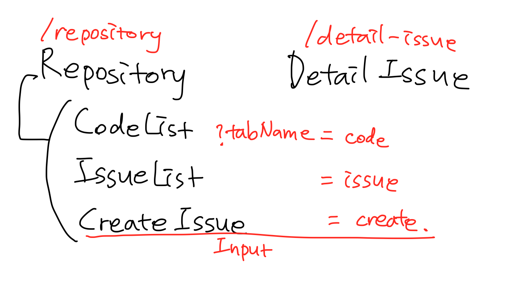
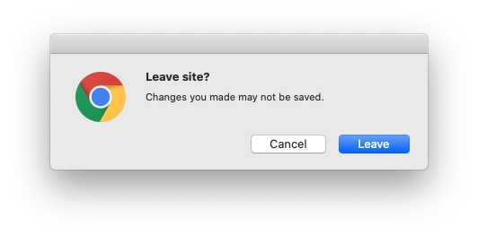
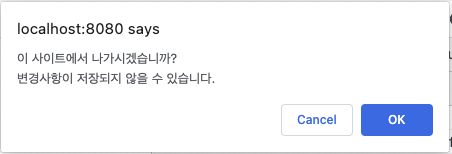
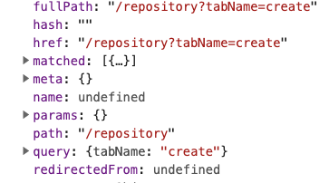

# Vue에서 'Leave Site?'를 구현하는 3가지 방법

> 웹사이트에서 내용을 입력하다가 창을 벗어나려고 하면 `이 사이트에서 나가시겠습니까?`와 같은 경고창을 본 적이 있을 것입니다.
이번 포스팅에서는 Vue를 사용하여 사이트를 벗어나지 못하도록 막는 방법 3가지를 간단한 예제 사이트를 만들면서 알아보겠습니다.

## 개요

1. 예제 사이트 구성
2. 다른 사이트로 나가는 것 감지하기 - `beforeunload` 이벤트
3. 다른 라우터 주소로 이동하는 것 감지하기 - vue-router의 `beforeRouteLeave` 
4. 다른 쿼리스트링 주소로 이동하는 것 감지하기 - `custom method`

## 1. 예제 사이트 구성

> 다양한 상황에서 경고창을 띄우기 위해 라우터를 나누어 구성하였습니다.

path: repository와 detail-issue로 설정했습니다. `localhost:8080/repository`와 같은 주소에서 설정한 컴포넌트를 볼 수 있습니다.

```jsx
routes: [
  {
    path: "/repository",
    component: Repository
  },
  {
    path: "/detail-issue",
    component: DetailIssue
  }
]
```

query: 탭을 3가지 만들어 vue-router에서 지원하는 router-link로 query를 만들어 줍니다. query는 `/repository?tabName={type}`과 같은 주소로 보여집니다.

```html
<router-link :to="{ path: $route.path, query: { tabName: type } }" @click="checkCanLeavePage()">
  {{ name }}
</router-link>
```

아래와 같은 라우터로 구성되어 있습니다. Input 태그가 있는 CreateIssue 컴포넌트가 사이트 나가기를 결정지어야 하는 곳입니다. 값이 입력되면 사이트를 바로 나갈 수 없게 막아야 하기 때문입니다.



Git Repository 링크: [https://github.com/choisohyun/leave-site-example](https://github.com/choisohyun/leave-site-example)

## 2. 다른 사이트로 나가는 것 감지하기 - `beforeunload` 이벤트

가장 먼저 쉽게 할 수 있는 방법입니다. window에서 지원하는 beforeunload 이벤트인데요. document가 언로드되기 전에 호출되는 이벤트입니다. 

beforeunload 이벤트는 구체적으로 다음과 같은 상황에서 발생합니다.

- 사이트 창을 닫으려고 할 때
- 다른 주소로 이동하려고 할 때
- 같은 주소여도 새로고침하려고 할 때(이 때는 `Reload site?` 문구가 뜹니다)



이제 코드를 작성해 봅시다. 

여기서 Input을 감지하기 위해 v-model과 watch로 값의 변화를 감지하고 `canLeaveSite`라는 boolean 값으로 결정하도록 합니다. 

그리고 vue의 라이프 사이클 주기 중에서 mounted될 때와 beforeUnmount될 때 이벤트를 등록하고 해지시키도록 합니다. 

```jsx
	mounted() {
    window.addEventListener('beforeunload', this.unLoadEvent);
  },
  beforeUnmount() {
    window.removeEventListener('beforeunload', this.unLoadEvent);
  },
```

이벤트를 등록할 때 아래 unLoadEvent를 두 번째 인자로 넣어 실행되게 합니다. input이 변경되지 않은 경우에는 early return하여 경고창이 뜨지 않습니다.

표준에 따라 기본 동작을 방지하기 위해 preventDefault를, Chrome에서 동작하기 위해 returnValue 설정을 합니다.

```jsx
methods: {
    unLoadEvent: function (event) {
      if (this.canLeaveSite) return;

      event.preventDefault();
      event.returnValue = '';
    },
}
```

## 3. 다른 라우터 주소로 이동하는 것 감지하기 - vue-router의 `beforeRouteLeave`

위의 이벤트로 모두 동작할 것 같지만 Vue와 같은 SPA에서는 동작하지 않는 부분이 있습니다.

`/repository`에서 `/detail-issue`로 이동하려고 할 때가 문제인데요. 브라우저에서는 이를 같은 페이지로 인식하고 있어서 beforeunload 이벤트가 발생하지 않습니다.

그래서 vue-router에서 지원하는 `beforeRouteLeave`라는 라이프사이클 메소드가 있습니다. 

`beforeRouteLeave` 는 인자를 3개 가지고 있습니다.

- to: 이동할 라우터 정보
- from: 현재 라우터 정보
- next: 함수입니다. 인자에 공식 홈페이지에서 제공하는 값을 넣을 수 있습니다. 인자를 넣지 않으면 다음 훅이 실행됩니다. next는 사이클 안에 한 번만 실행되어야 합니다.

위에서 작성한 이벤트와 다른 점은 confirm을 직접 띄워야 한다는 것입니다.

```jsx
	beforeRouteLeave(to, from, next) {
    if (this.canLeaveSite) next();
    else if (confirm('이 사이트에서 나가시겠습니까?\n변경사항이 저장되지 않을 수 있습니다.')) {
      next();
    }
  }
```

Input을 입력하고 다른 라우터 페이지로 이동하려고 하면 아래와 같은 컨펌창을 볼 수 있습니다.



## 4. 다른 쿼리스트링 주소로 이동하는 것 감지하기 - `custom method`

`beforeRouteLeave` 에서 감지를 못하는 부분이 또 있습니다. 바로 query string입니다.

$route 값을 찍어 보면 path에는 쿼리가 포함되어 있지 않은 것을 볼 수 있습니다. 라우터 변화를 감지할 때 쿼리가 포함되어 있지 않기 때문에 감지하지 못합니다.



그러면 쿼리로 이동되는 것은 막을 수 없을까요?

저는 주소가 변하기 전에 체크해서 false가 되면 이동할 수 없도록 했습니다. 더 복잡한 상황이 왔을 때를 생각하면 더 좋은 해결법을 생각해야 할 것입니다.

router-link를 사용하면서 클릭 이벤트를 넣었습니다. 링크 네비게이션을 트리거 할 수있는 이벤트를 지정할 수 있기 때문입니다.

```jsx
<router-link :to="{ path: $route.path, query: { tabName: type } }" @click="checkCanLeavePage()">
```

조건에 맞지 않으면 return시켜 페이지가 이동되지 않도록 합니다.

```jsx
	checkCanLeavePage: function () {
      if (!this.canLeaveSite) {
        if (!confirm('이 사이트에서 나가시겠습니까?\n변경사항이 저장되지 않을 수 있습니다.')) return;
        this.canLeaveSite = true;
      }
    }
```

## 정리

쉽게 생각했다가 생각지도 못하게 고난을 많이 겪었던 사이트 나가기 관련 내용을 정리해 보고자 간단한 예제를 만들고 설명을 적어 보았습니다.

만들면서 버그가 있는 것을 확인했습니다. 이런 방법이 있구나 정도로 읽어 주시면 좋을 것 같습니다.(시간 날 때 보고 고쳐 보겠습니다..)

## 참고

- [https://developer.mozilla.org/ko/docs/Web/API/Window/beforeunload_event](https://developer.mozilla.org/ko/docs/Web/API/Window/beforeunload_event)
- [https://router.vuejs.org/guide/advanced/navigation-guards.html#in-component-guards](https://router.vuejs.org/guide/advanced/navigation-guards.html#in-component-guards)
