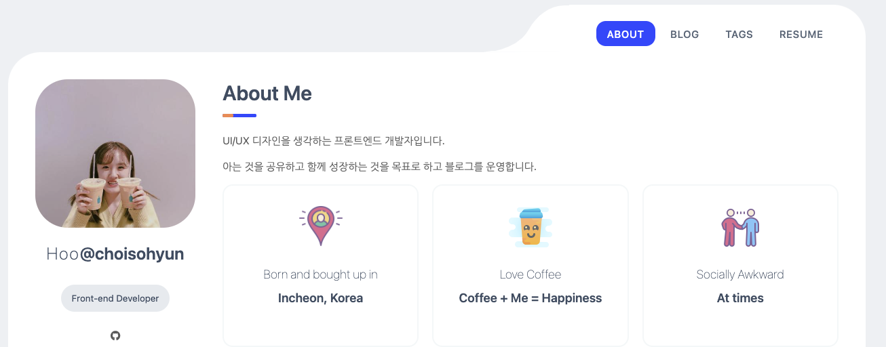
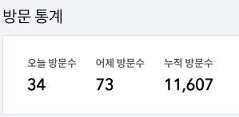

> 2020년은 개발자로 시작하는 한 해였다고 할 수 있습니다. 
올해를 몇 가지 키워드로 정리하고 성과와 개선점을 KPT(Keep, Problem, Try) 방식으로 작성해 보도록 하겠습니다.

## 개요

1. 2020년 정리
2. Keep
3. Problem
4. Try

## 1. 2020년 정리

### 코드스쿼드

1월부터 6월까지 코드스쿼드 프론트엔드 마스터즈 과정을 수료했습니다.

짧은 프로젝트가 반복되면서 배우는 타이트한 일정이라 일정 관리와 기록, 그리고 멘탈 관리가 중요했습니다. 시작점에서 지치면 오랜 기간의 교육이 힘들기 때문입니다.

멘탈 관리는 블로그에 회고를 비정기적으로 적으면서 개선 방향을 잡으려고 했습니다. 특히 힘들었던 3월 말에는 [3개월 회고](https://egg-programmer.tistory.com/220)를 작성해 보면서 나의 현재를 가시적으로 측정했습니다. 저에게는 회고 활동이 긍정적인 영향으로 다가와서 현재는 노트필기와 캘린더를 사용해 간단히 기록하고 있습니다. 

일정관리와 기록도 멘탈 관리와 비슷한 맥락인데, 코드스쿼드를 다니면서 제가 정리하고 문서화하는 것을 잘한다는 것을 알게 되었습니다. 장점을 인식하고 더 발전시키려고 노력하는 계기가 되었습니다.

### 스터디

코드스쿼드 기간이 끝나고 나서 지난 프로젝트와 JS, React 개념들을 정리했습니다. 그리고 가만히 외우기만 하는 공부를 싫어하는 저는 스터디를 꾸준히 참여하면서 공부했습니다.

두 개의 스터디를 가장 꾸준히 했는데 [알고리즘 스터디](https://github.com/ProblemSolvedStudy/problem-solved)와 [블로그 포스팅 스터디](ttps://github.com/Blog-Posting/posting-review)입니다. 

알고리즘 스터디는 작년 말부터 올 초까지 okky를 통해 백준 사이트에서 약 50문제 이상 풀며 성공적으로 마쳤던 기억을 바탕으로 코드스쿼드 멤버들과 꾸렸습니다. 1차, 2차에 나누어 4월부터 8월까지 약 4개월 정도 꾸준히 진행됐습니다. 지금은 알고리즘 스터디를 하고 있지 않은데 꾸준히 해야 새로 나오는 문법도 익힐 기회가 될 것 같아 내년 목표 중 하나가 알고리즘 스터디입니다.

블로그 포스팅 스터디는 7월부터 지금까지 정말 많은 공부를 할 수 있는 스터디입니다. (😀) 블로그를 운영하고 있었는데 마침 okky에서 모집글을 보게 되어 시작하게 되었습니다. 주 1회 포스팅과 발표를 진행하는데 생각보다 짧은 주기에 써야 합니다. 포스팅을 계기로 프로젝트를 돌아보고 특히 흥미로웠던 부분들을 정리할 수 있어서 이력서를 작성할 때도 도움이 되었습니다. 최근에는 개인적으로 쓰고 싶은 글감이 없어 글을 안 쓰고 있는데 더 많이 찾아보면서 영감을 얻어야겠습니다.

### 취업

9월 말에 감사하게도 취직을 했습니다. 입사 첫 주는 멘붕 그 자체였는데 3개월이 지나고 나니 어느 정도 요령이 생기는 것 같습니다. 그리고 매일 배우고 깨닫는 점이 많습니다. '신입으로 입사하게 되면 6개월 동안은 일만 해도 배운다'는 말을 본 적이 있는데 맞는 것 같습니다. 

최근 느끼는 가장 중요한 부분은 숲을 볼 줄 알아야 한다는 것입니다. 저는 지금도 `내가 개발하는 화면`만 신경쓰려는 경향이 있습니다. 그래서 코드 리뷰를 해도 다른 파트의 코드는 로직적으로 완전히 이해하지 못하고 있습니다. 그리고 기획자, 퍼블리셔, 백엔드 개발자와 소통할 일이 점점 생기는데, 이들의 업무 프로세스를 더 잘 알아야 커뮤니케이션하기 좋겠다는 생각도 듭니다. 

## Keep

### 블로그

블로그는 이상하게(?) 집착을 가지고 많은 삽질을 했습니다. 첫 번째는 디자인인데.. 사실 지금도 마음에 썩 들진 않지만 개츠비로의 마이그레이션에 실패해서 무료 스킨에 색만 편집해서 사용하고 있습니다. 아마도 나중에 예쁜 스킨을 사게 되지 않을까 싶습니다..ㅎㅎ..

- 개츠비의 템플릿을 사용해 만들어 본 블로그입니다. 티스토리 글을 JSON으로 받아와 넣어 보았지만 사진 엑박 현상으로 대참사하고 방치상태

그리고 블로그를 운영하면서 또 하나의 소소한 재미가 있습니다. 블로그 통계와 수익 내역을 보는 것입니다. 입출금통장 이자가 매일 붙는 느낌이 듭니다.(매일 알림톡이 오거든요)

최근 누적 방문수가 10,000을 넘었는데 뿌듯함도 있네요. 내년에는 질 좋은 글을 한 달에 1개 정도 다듬어서 작성해 보는 것이 목표입니다.

### 코드리뷰

코드리뷰는 개발자들이 협업할 때 쓰는 최고의 문화 아닐까 싶습니다. 작업량이 많고 협업자가 많을수록 장점이 극대화되는 것 같습니다. 그리고 돌아보면 가장 낯설었던 문화에서 가장 익숙한 문화로 변화와 성장이 가장 많았습니다.

코드스쿼드에서 코드리뷰를 처음 겪었을 때는 80%는 거의 크롱 마스터에게 **받는** 입장이었습니다. 이 때에는 의식적으로 다른 멤버들의 코드를 보려고 노력은 했었는데 사실 조금만 모르는 부분이면 외계어를 읽는 느낌이었습니다. 그래서 마지막 프로젝트에서는 페어와 함께 주고받는 리뷰를 시작했습니다. 처음에는 곁에 있기 때문에 대면으로 얘기하는 것이 편하다고 생각했는데, 리뷰를 하다 보니 나중에 되짚어볼 수 있는 기록이 남는다는 점에서 매력적이었습니다.

그리고 최근에는 회사에서 코드리뷰로 정말 많이 배우고 있습니다. 저희 팀의 코드리뷰 룰 중 하나가 `출근하고 30분~1시간 정도는 코드리뷰를 되도록 하자` 입니다. 입사 첫 달에는 올라오는 PR 코드와 내가 올린 PR의 리뷰만 반영해도 엄청나게 할 일이 많았습니다. 

11월 초부터 새로운 프로젝트로 들어가게 되었는데, 기반부터 리팩토링도 해보고 의견도 내 보면서 시작했더니 코드를 볼 때 전체적인 이해도가 높아졌습니다. 그래서 최근에는 리뷰를 습관처럼 달고 참고도 많이 하면서 진행하고 있는 것 같습니다. 

내년에 더 시도해 볼 부분은 '코드'만 봤을 때의 리뷰를 넘어서 설계적인 관점에서 어떤지를 보는 것입니다. 숲을 보는 것과 비슷한 맥락인데 쓰여지는 상황과 프로세스에 대해서도 어느 정도 이해를 하고 있어야 합니다. 이런 흐름이 반복되면 하나의 큰 서비스를 이해할 수 있겠죠?

## Problem

### 새로운 것

프론트엔드는 워낙 빠르게 기술이 변하고 새로운 기술도 많이 생기고 있습니다. 기술이 너무 많으니 '내가 할 수 있을까?' 하는 두려움이 먼저 생기게 되는 것 같습니다. 

이런 두려움을 깨기 위해 평소 흥미가 조금씩 있었던 `graphQL`과 `Next.js`를 사용한 프로젝트나 예제 풀이를 해 보려고 합니다. 

이런 새로운 이름의 기술뿐만 아니라 사용하고 있는 프레임워크인 Vue나 React부터 ECMAScript까지 계속 업데이트되기 때문에 꼭 짚고 넘어가야 자바스크립트와 웹시장의 흐름을 파악할 수 있을 것 같습니다.

### 꾸준함

저에게 정말 어려운 숙제입니다. 자의로 꾸준하게 무언가를 이어서 하는 것이 가장 어렵습니다. 흥미로워 하는 주제가 계속 바뀌는 성격 때문이기도 하겠지만, 동기부여가 계속해서 되지 않으면 실행 자체가 힘들어집니다. 

그래서 어느 정도 강제성이 있는 스터디 활동이 잘 맞았습니다. 스터디를 계속 해 오다 보니 다른 방법으로도 공부하고 이득을 얻는 방법을 찾고 싶습니다. 

2021년에는 꾸준하기 위한 새로운 방법을 찾아서 회고로 적을 수 있었으면 좋겠습니다. 

## Try

- CS 공부하기<책>
    - 클린 아키텍처
    - GoF의 디자인 패턴
    - 함수형 자바스크립트
    - 자바스크립트 패턴과 테스트
- 사이드 프로젝트 하기
- 알고리즘 스터디

두서없는 회고글 읽어주셔서 감사합니다. 🙇🏻‍♀️ 새해 복 많이 받으세요 🎉