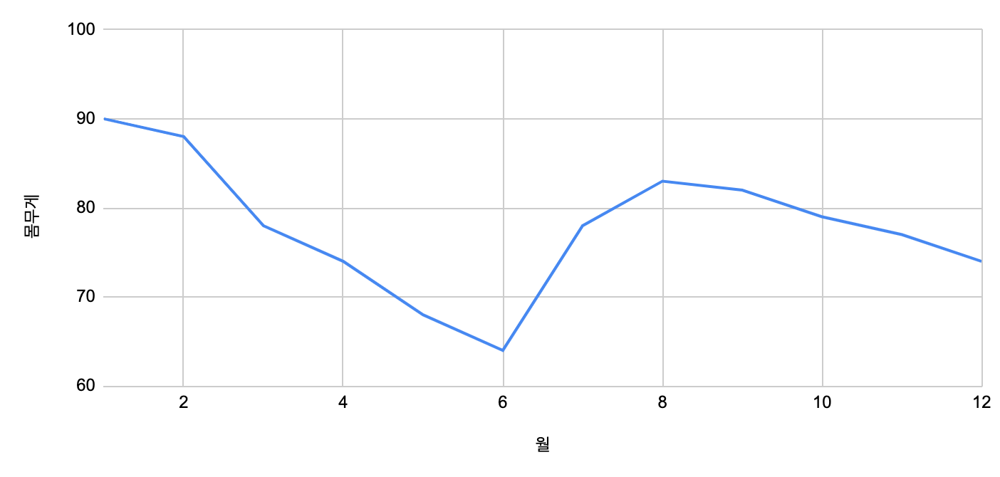
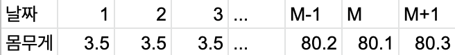
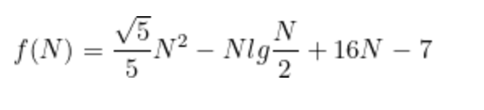

# 알고리즘 - 시간 복잡도 분석

알고리즘을 평가하는 두 가지 큰 기준은?

**시간과 공간**

프로그래밍 대회에서 알고리즘 점수의 중요한 기준은 **속도**다.

특히, 동적 계획법은 공간(메모리 사용량)을 더 사용하여 수행 속도를 높인다.

프로그램의 실행 시간이 알고리즘의 속도와 같을까?

아니다.

- 운영체제, 하드웨어, 컴파일러 등 외부 요인에 의해 속도는 달라질 수 있다.
- 프로그램의 실제 수행 시간은 입력을 다르게하면 달라진다. (입력의 크기나 특성을 다르게 해서 프로그램을 수행해 보아라)


## 알고리즘의 수행 시간 기준

자전거는 자동차에 비해 효율적인 부분이 몇가지 있다.

- 시동 거는 데 걸리는 시간이 없다
- 문을 열고 닫는데 걸리는 시간이 없다.
- 운전석 등받지 조절에 걸리는 시간이 없다.

하지만, 누구도 서울에서 부산까지 가는데 자전거를 타지 않을 것이다.

**왜냐하면, 자동차의 속도라는 한 가지 항목이 전체의 대소를 지배(dominate) 하기 때문이다.**

자동차를 비유로 두었다. 그렇다면 알고리즘은 어떤 것이 전체의 대소를 지배할까? **반복문이다.**

입력의 크기가 커지면 커질 수록 반복문이 알고리즘의 수행 시간에 큰 영향을 받기 때문이다.


## 선형 시간 알고리즘

### 이동 평균 계산하기

이동 평균이란?

시간에 따라 관찰된 숫자들이 주어질 때 M-이동 평균은 마지막 M 개의 관찰 값의 평균이다.

다음 그래프는 매월 몸무게를 기록한 그래프다.



N개의 측정치가 주어 질 때 매달 M 달 간의 이동 평균을 계산하는 프로그램을 작성하자.

예를 들어, 1월 부터 12월 까지의 12개의 측정치가 주어진다면 3달 동안의 이동평균은 각각 1,2,3월에 하나의 이동평균을 구하고, 그 다음 2,3,4월의 이동평균을 구하는 방식이다. 

```java
// 실수 배열 A 가 주어질 때, 각 위치에서 M 이동 평균 값을 구한다.
public static List<Double> movingAverage(List<Double> A, int M) {
    List<Double> result = new ArrayList<>();
    int N = A.size();

    for (int i = M-1; i < N; i++) {
        // A[i] 까지의 이동평균을 구한다.
        double partialSum = 0;
        for (int j = 0; j < M; j++) {
            partialSum += A.get(i-j);
        }
        result.add(partialSum / M);
    }
    return result;
}
```

결과 값을 확인하는 테스트를 작성해보자

```java
public static void main(String[] args) {
      List<Double> result1 = movingAverage(List.of(1D, 2D, 3D), 1);
      System.out.println(result1); // [1.0, 2.0, 3.0]

      List<Double> result2 = movingAverage(List.of(1D, 2D, 3D), 2);
      System.out.println(result2); // [1.5, 2.5]

  }
```

코드의 수행 시간은 두 개의 for문에 의해 지배된다.

j를 사용하는 반복문은 항상 M 번 실행되고 i를 사용하는 반복문은 N-M+1 번 실행되므로, 

전체 반복문은 M * (N-M+1) = N * M - M^2 + M 번 반복된다.

위 예제는 입력의 크기가 매우 작다. 하지만 입력의 크기가 크다면 매우 느리다.

좀 더 빠른 프로그램을 작성할 수 없을까?

다음 표를 살펴보자.



M만큼의 이동 평균을 계산한다고 하자.

1일 부터 M일 까지의 몸무게를 구해야지 M 만큼의 이동 평균을 계산할 수 있다.

그 다음 날짜의 이동 평균은 2일부터 M+1일 까지의 평균을 계산해야 한다.

여기서 사용할 수 있는 트릭은 다음 날짜로 옮겨 갈 때 이전 날짜와의 차이점을 보는 것이다.

1일 부터 M까지와 2일부터 M+1 일까지의 차이점은 1과 M+1이다.

따라서, 다음 날짜를 계산하려면 이전 날짜의 가장 앞 날짜(1일)의 몸무게를 빼고 다음 날짜의 가장 마지막 날짜(M+1)의 몸무게를 더하면 된다.


## 시간 복잡도

시간 복잡도는 가장 많이 사용되는 알고리즘의 수행 시간 기준이다.

시간 복잡도는 알고리즘이 실행되는 동안 수행하는 **기본적인 연산의 수**를 입력 크기에 대한 함수로 표현한 것이다.

여기서 "**기본적인 연산**"이란 무엇일가?

더 작게 쪼갤 수 없는 최소 크기의 연산을 의미한다.

예를 들어,

- 두 부호 있는 32비트 정수의 사칙 연산
- 두 실수형 변수의 대소 비교
- 한 변수에 다른 변수 대입하기

기본적인 연산이 아닌것은 어떤 것이 있을까?

- 정수 배열 정렬하기
- 두 문자열이 서로 같은지 확인하기
- 입력된 수 소인수 분해하기

시간 복잡도가 낮다고 해서 시간 복잡도가 높은 알고리즘보다 항상 빠르게 동작할까?

입력의 크기가 충분히 작을 때는 시간 복잡도가 높은 알고리즘이 더 빠르게 동작할 수 있다.

예를 들어, A와 B 알고리즘이 있다고 하자.

- A 알고리즘은 1240+35 x logN
- B 알고리즘은 2N^2

N이 10이라면 B가 훨씬 빠르다. 

1240+35x3.xxxx은 대략 1345이다.

B의 알고리즘으로 계산하면 (2x10)^2=400 이 더 작다.

입력의 크기가 시간 복잡도에 영향을 주는 유일한 요소일까?

입력의 형태 구성도 수행 시간에 영향을 준다.

예를 들어, 배열에서 주어진 숫자를 찾아 그 위치를 반환하는 함수를 작성해보자.

```java
int firstIndex(int[] arr, int e) {
      for (int i = 0; i < arr.length; i++) {
          if (arr[i] == e) {
              return i;
          }
      }
      return -1;
  }
```

이 알고리즘의 반복문이 실행되는 횟수는 우리가 찾아야할 원소의 위치에 따라 달라진다.

입력의 종류에 따라 수행 시간이 달라진다면 시간 복잡도를 어떻게 계산해야할까?

최선/ 최악의 경우와 평균적인 경우에 대한 수행 시간을 각각 따로 계산하는 것이 일반적이다.

- 최선의 수행시간: 찾으려는 원소가 배열 맨앞에 있을 경우, 수행 횟수는 1이다.
- 최악의 수행 시간: 배열에 찾으려는 원소가 없을 때 배열 크기 N 만큼 수행하고 종료한다.
- 평균적인 경우의 수행 시간: 평균적인 경우는 N/2 가 된다.


## 점근적 시간 표기: O 표기

시간 복잡도는 여러 이유로 사용하기 어렵다.

- 알고리즘이 실행될 때, 필요한 명령어의 수를 예측하기 어렵다.
- 알고리즘이 복잡할 때, 시간복잡도를 하나하나 계산하기 어렵다.

따라서, 시간 복잡도를 간단하게 표현한 대문자 O 표기법(Big-O Notation)을 사용한다.

O 표기법은 주어진 함수에서 가장 빨리 증가하는 항만을 남기고 나머지는 제거하는 표기법이다.

예를 들어, 알고리즘의 수행 시간이 다음과 같을 때

```latex
f(N) = \frac{\sqrt{5}}5 N^2 - Nlg\frac{N}2 + 16 N - 7
```



여기에는 4개의 항이 있다. N이 증가할 때 가장 빠르게 증가하는 항은 무엇인가? 첫 번째 항이다.

여기서 상수를 떼어네면 N^2이 된다. 

따라서, 우리는 이 알고리즘의 수행 시간을 O(N^2) 이라고 쓴다.


## 시간 복잡도 분석 연습

다음은 선택정렬 알고리즘과 삽입 정렬 알고리즘이다.

```java
void selectionSort(int[] a) {
      for (int i = 0; i < a.length; i++) {
          int minIndex = i;
          for (int j = i + 1; j < a.length; j++) {
              if (a[minIndex] > a[j]) {
                  minIndex = j;
              }
          }
          swap(a, i, minIndex);
      }
  }
  void insertSort(int[] a) {
      for (int i = 0; i < a.length; i++) {
          int j = i;
          while (j > 0 && a[j-1] > a[j]) {
              swap(a, j-1, j);
              j--;
          }
      }
  }
  
  private void swap(int[] a, int i, int j) {
      int temp = a[i];
      a[i] = a[j];
      a[j] = temp;
  }
```

선택 정렬의 시간 복잡도는 배열에 포함된 원소들과는 상관없이 배열의 크기 N에 의해서만 결정된다. 

따라서, 최악의 경우와 최선의 경우의 시간 복잡도가 같다.

반면, 삽입 정렬의 while 문은 `a[j]` 에 있는 숫자보다 작은 숫자를 만날 때 까지 `a[j]` 를 앞으로 옮긴다.

while 문의 수행 횟수는 입력 배열의 순서에 따라 비교 횟수가 달라진다.

삽입 정렬의 최선의 경우는 언제일까?

입력할 배열이 이미 정렬된 경우 최선이다. 

더 정확히 계산하면, while문의 시간 복잡도는 O(1)이며, i에 대한 for문은 배열의 갯수만큼 반복하므로 O(N)이 삽입 정렬의 최선의 경우다.

최악의 경우는 역순으로 배열이 정렬된 경우이다. while문을 항상 j를 0까지 줄이며 정렬할 숫자를 맨앞으로 끌고 간다. 최악의 경우의 시간 복잡도는 O(N^2) 이 된다.


## 수행 시간 어림짐작하기

1차원 배열에서 연속된 부분 구간 중 그 합이 최대인 구간을 찾는 문제를 풀어보자.

예를 들어, 배열 [-7, 4, -3, 6, 3, -8, 3, 4]에서 최대 합을 갖는 구간은 [4, -3, 6, 3]으로 합이 10이다.

가장 무식한 방법으로 해결한 알고리즘은 다음과 같다.

```java
int inefficientMaxSum(int a[]) {
        int N = a.length;
        int ret = Integer.MIN_VALUE;

        for (int i = 0; i < N; i++) {
            for (int j = i; j < N; j++) {
                // a[i..j] 까지의 합
                int sum = 0;
                for (int k = i; k <= j; k++) {
                    sum += a[k];
                }
                ret = Math.max(ret, sum);
            }
        }
        return ret;
    }

int betterMaxSum(int a[]) {
    int N = a.length;
    int ret = Integer.MIN_VALUE;

    for (int i = 0; i < N; i++) {
        int sum = 0;
        for (int j = i; j < N; j++) {
            sum += a[j];
            ret = Math.max(ret, sum);
        }
    }
    return ret;
}
```

inefficientMaxSum() 은 O의 N^3 의 시간 복잡도이다.

이것을 O(N^2)으로 개선한 것이 아래의 betterMaxSum() 알고리즘이다.

반복문 두 개가 겹쳐 있으므로, 이 알고리즘의 시간 복잡도는 O(N^2)이 된다.

더 개선할 수 있을까?

분할 정복 기법을 사용하면 O(NlgN) 으로 개선할 수 있다.

재귀 호출과 탐욕법을 적절히 사용하는 것이다.

```java
int fastMaxSum(int[] a, int lo, int hi) {
      if (lo == hi) {
          return a[lo];
      }

      int mid = (lo + hi) / 2;

      int left = Integer.MIN_VALUE;
      int right = Integer.MIN_VALUE;
      int sum = 0;

      // a[i..mid] 에서 최대 구간을 찾는다.
      for (int i = mid; i >= lo; i--) {
          sum += a[i];
          left = max(left, sum);
      }

      // a[mid+1...j] 에서 최대 구간을 찾는다.
      sum = 0;
      for (int j = mid+1; j <= hi; j++) {
          sum += a[j];
          right = max(right, sum);
      }
      int single = max(fastMaxSum(a, lo, mid),
              fastMaxSum(a, mid+1, hi));
      return max(left + right, single);
  }
```

동적 계획법으로 구현한 알고리즘은 O(N)까지 시간 복잡도를 줄일 수 있다.

```java
int fastestMaxSum(int a[]) {
    int N = a.length;
    int ret = Integer.MIN_VALUE;
    int psum = 0;
    
    for (int i = 0; i < N; i++) {
        psum = max(psum, 0) + a[i];
        ret = max(psum, ret);
    }
    return ret;
}
```


---

알고리즘 문제 해결 전략. 2012. 구종만. 인사이트.