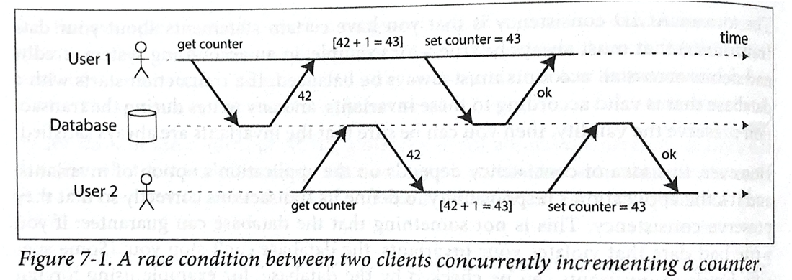
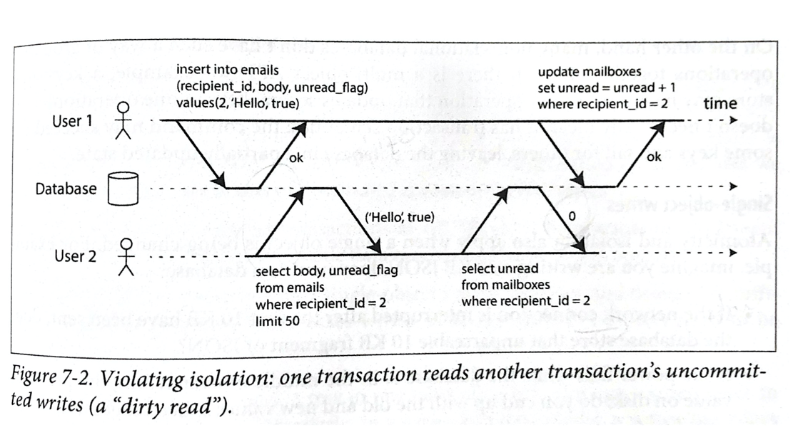
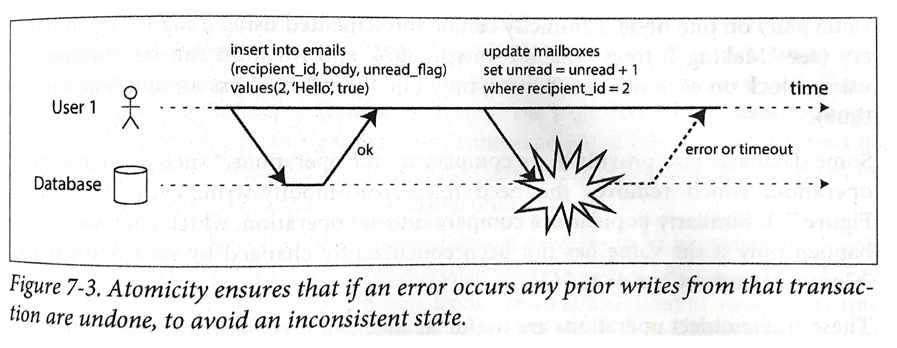
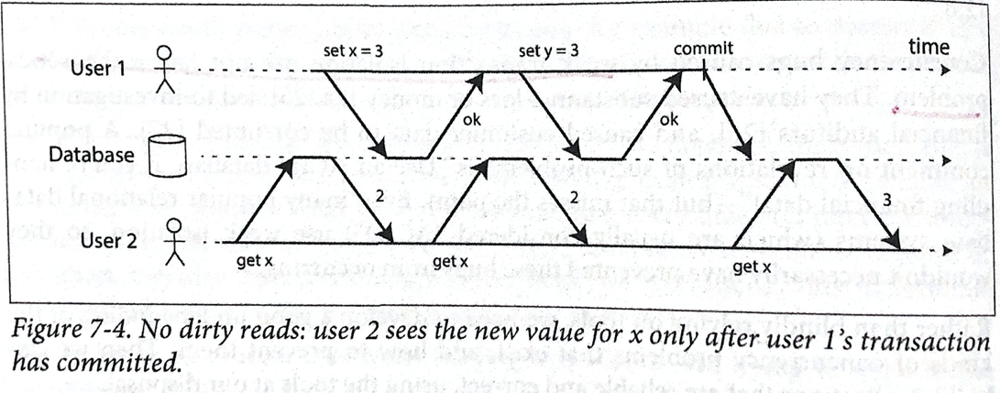
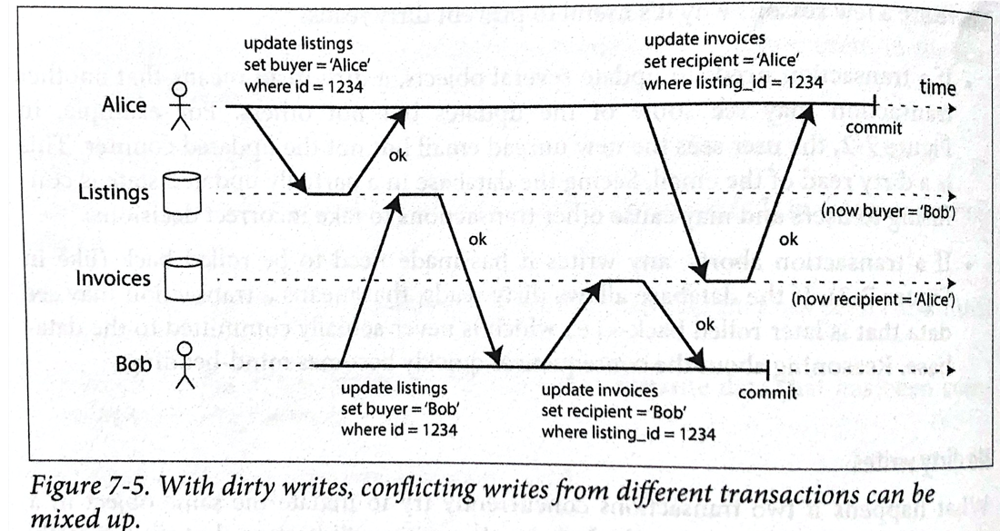
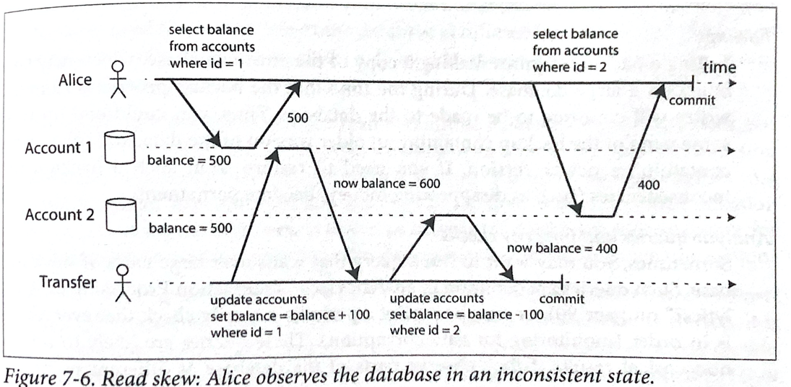
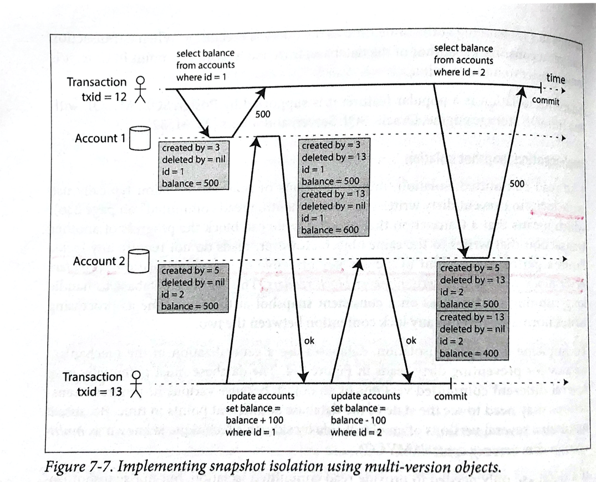

# 관계형 데이터베이스의 고립성(Isolation) of ACID 


우리는 데이터베이스 트랜잭션을 처리하면서 데이터의 일관성이 지켜지는 것을 당연하게 생각하지만, 트랜잭션은 자연의 법칙이 아니다. 개발자가 작성하는 애플리케이션은 동시성 문제나 잠재적 에러 상황들을 신경쓰지 않고도 트랜잭션을 처리할 수 있다. 다만 데이터베이스가 그것을 대신해주는 것이다. 

데이터베이스 동시성 제어의 핵심이 되는 것은 ACID 중에서도 I에 해당하는 고립성(Isolation)이다. 고립 성의 레벨에는 read committed, snapshot isolation, 그리고 serializability가 있다.

## ACID의 의미

ACID는 원자성(Atomicity), 일관성(Consistency), 고립성(Isolation), 영속성(Durability)의 약자로, 1983년 Theo Harder 와 Andreas Reuter가 만들었다. ACID가 관계형 데이터베이스의 트랜잭션의 안정성을 보장하는 의미로 통용되고 있다. 하지만, ACID는 데이터베이스가 구현을 어떻게 하느냐에 따라 달라진다. 

- 원자성(Atomicity): 멀티-스레드 프로그래밍의 원자성과는 다르다. 하나의 스레드가 원자적인 연산을 수행한다는 것은 다른 스레드가 이 결과의 절반만 완료된 결과를 볼 수 없음을 의미한다. 하지만 데이터베이스의 원자성은 이런 동시성과는 다르다. 오히려 I에 해당하는 고립성(Isolation)에 가깝다. 한 클라이언트가 여러번 쓰기를 실행하는 도중 실패했을 때 이 트랜잭션은 완전히 커밋(commit)되거나 취소(abort)되어야 함을 의미한다. 그런 의미에서 원자성(atomicity)라는 단어보다 중단성(abortability)이라는 단어가 어울린다.
- 일관성(Consistency) : ACID의 일관성은 데이터가 정확한 상태를 유지하는가를 의미한다. 하지만 트랜잭션이 정확하게 사용되어야함은 데이터베이스가 보장할 수 있는 것이 아니다. 만약 불량 데이터를 데이터베이스에 쓴다면, 일관성을 위반할 것이다. 이것은 데이터베이스가 제어 할 수 없다.
- 고립성(Isolation) : 대부분의 데이터베이스 시스템은 다수 사용자가 동시에 접근할 수 있다. 하지만 같은 데이터베이스 레코드에 여러 사용자가 접근한다면 동시성 문제가 발생한다. 아래의 그림을 보면, 두 사용자가 동일한 하나의 값에 접근하여 1씩 증가시키고 저장한다고 가정하자. 이 때 실제로 저장되는 값은 2가 증가되지 않고 1만 증가하였다. 고립성은 동시에 수행되는 트랜잭션이 서로 고립되어 있음을 의미한다. 가장 초기의 데이터베이스는 **직렬화가능성(serializability)**을 전제로 하였다. 직렬화가능성이란 동시에 수행되는 트랜잭션이 마치 나란히(serially) 수행되는 것처럼 보장하는 것을 말한다.
- 영속성(Durability) : 영속성은 트랜잭션이 성공적으로 커밋된다면 데이터는 없어지지 않음을 보장해주는 것을 뜻한다. 여기에 의미를 더 추가하면, 하드웨어가 고장나거나 데이터베이스의 문제가 생겨도 데이터가 지워지면 안된다는 것이다. 



[그림 7-1] 하나의 카운터 값을 동시에 증가시키는 두 클라이언트 사이의 경합


이메일 애플리케이션을 떠올려보자, 한 사용자가 읽지 않은 메시지의 수를 보려고 할 때 다음과 같이 쿼리를 작성할 수 있다.

```sql
SELECT COUNT(*) FROM emails WHERE recipient_id = 2 AND unread_flag = true
```

다음 그림에서 두 명의 사용자가 이상 현상을 경험할 수 있다. 메일함 목록은 아직 읽지 않은 메시지가 있다고 보여주지만, 카운터는 여전히 0이다. 왜냐하면 카운터가 증가하지 못했기 때문이다. 고립성은 이런 문제를 방지하기 위해서 사용자2가 삽입된 이메일과 갱신된 카운터 둘 다 보거나 아니면 둘 다 연산되지 않도록 한다. 즉, 이 두 연산엔 중간이 없다는 것이며 모 아니면 도(all-or-nothing)이다.

[그림 7-2] 고립성을 위반: 하나의 트랜잭션이 다른 트랜잭션의 커밋되지 않은 쓰기 작업을 읽었다.



[그림 7-3] 원자성은 데이터베이스에 에러가 발생할 때, 트랜잭션이 완료되기 이전의 쓰기 작업도 모두 취소하여 비일관된 상태를 피할 수 있다.


## 고립성 (Isolation) 수준

## Read Committed

가장 기본적인 고립성 수준은 read committed다. 이 수준의 고립성은 다음 두 가지를 보장한다.

1. 데이터베이스에 접근하여 데이터를 읽을 때 오직 커밋된 데이터만 읽는다.(no dirty reads)
2. 데이터베이스에 접근하여 데이터를 쓸 때, 커밋된 데이터만 덮어쓰기 할 수 있다.(no dirty writes)

### No Dirty Reads

한 트랜잭션이 데이터베이스 어떤 데이터를 입력하려고 한다. 트랜잭션은 아직 커밋되거나 취소되지 않았다. 다른 트랜잭션이 이 커밋되지 않은 데이터를 읽을 수 있는가? 그렇다면 dirty read에 해당한다. 반면, read committed 레벨의 고립성은 반드시 dirty reads를 허용해선 안된다. 다음 [그림 7-4]는 사용자 1이 x를 3으로 입력했지만 사용자 2는 여전히 x의 값은 2를 돌려 받는다. 



[그림 7-4] No dirty reads: 사용자 2는 사용자 1의 트랜잭션이 커밋된 이후에야 x의 새로운 값을 볼 수 있다.

왜 dirty reads를 방지하는 것이 유용할까?

- 만약 트랜잭션이 여러 오브젝트를 갱신해야 한다면, dirty read는 갱신된 일부만 볼 수 있다. 예를 들어, [그림 7-2]에서, 사용자가 새로운 읽지 않은 이메일을 봤지만, 카운터는 갱신되지 않은 것을 알 수 있다. 즉 이메일을 dirty read한 것이다. 이러한 부분적 업데이트 상태는 사용자에게 혼란을 준다.
- 만약 트랜잭션이 취소된다면, 어떠한 쓰기 작업이든 롤백 되어야 한다. 하지만 dirty read를 허용 한다면, 트랜잭션이 롤백된 이후에야 데이터를 확인할 수 있다. 


### No Dirty Writes

만약 쓰기 작업 중인 한 트랜잭션이 커밋되지 않은 상태에서, 다른 트랜잭션이 이것을 덮어쓴다면 어떤 일이 발생할까? 이것을 dirty writes 라고 한다. 이 역시 read committed 수준의 고립성이라면 dirty writes 을 방지해야 한다. 주로, 첫 번째 쓰기 작업이 완료되기 전까지 두 번째 작업을 딜레이해서 해결한다.  다음 [그림 7-5]는 중고차 판매 웹사이트에서 두 사람의 트랜잭션을 보여준다. Alice와 Bob은 동시에 똑같은 차를 사려고 한다. 차를 사려면 두 개의 데이터베이스인 Listing과 Invoices에 쓰기작업이 필요하다. 최종적으로는 Bob에게 자동차가 판매되었다. 하지만 Alice에게 자동차가 수여되는 이상한 상황이 펼쳐진다.



[그림 7-5]  dirty writes에서는 서로 다른 트랜잭션의 쓰기 충돌이 혼용됨

대부분의 데이베이스는 는 행 수준(row-level)의 잠금을 통해 dirty writes를 방지한다. dirty reads는 어떻게 방지할까? 이것도 똑같이 잠금을 이용한다. 하지만 읽기 잠금(read lock)은 실제로는 제대로 동작하지 않는다. 왜냐하면, 하나의 긴 쓰기 작업이 많은 읽기 전용 트랜잭션을 기다리게 하기 때문이다. 이러한 문제는 결국 애플리케이션의 response time을 저해한다. 이를 해결하기 위해, 데이터베이스는 커밋 이전의 값과 락을 쥐고 있는 트랜잭션이 설정한 새로운 값 두개를 기억하고 있는다. 트랜잭션이 시작되는 도중에, 다른 트랜잭션이 해당 객체를 읽으려 하면 예전 값을 주면 된다. 그리고 완전히 새로운 값이 커밋되면 트랜잭션에게 새로운 값을 읽도록 한다.


## 스냅샷 고립성과 반복 읽기(Snapshot Isolation and Repeatable Read)

지금까지 read committed에 대해 살펴보았다. 사실 생각해보면 read committed로 고립성을 충분히 실현하는 것 같아 보인다. 왜냐하면, 트랜잭션의 불완전한 결과를 읽는 것을 방지해주고, 동시에 쓰는 것도 방지해주기 때문이다. 하지만 read commited는 동시성 문제가 발생할 수 있다. 다음 [그림 7-6]은 read committed에서 발생할 수 있는 문제를 설명한다.



[그림 7-6] 엇나간 읽기(Read skew): Alice는 비일관적인 상태의 데이터베이스를 바라보게 된다.

Alice가 Acoount1 테이블에 저장된 잔고를 확인하기 위해 조회를 한다고 해보자. 이것을 읽는 와중에 다른 사람이 Account1의 alice의 계좌에 100 달러를 추가로 지급한다. 그리고 Account2에서 100달러를 차감한다. Account1과 Account2의 잔고는 각각 600 달러와 400 달러다. 하지만, 앨리스가 확인한 총 잔고는 900 달러다. 이러한 이상 현상은 __nonrepeatable read__ 또는 __read skew__ 라고 한다. 분명 read committed는 커밋된 내용만 보여주지만, 어딘가 이상하다.  

이러한 문제를 해결하기 위한 고립성 레벨이 Snapshot isolation이다. 이 고립성은 각각 트랜잭션이 __일관된 데이터베이스의 스냅샷__을 읽도록만 하는 것이다. 일관된 스냅샷(consistent snapshot)은 트랜잭션이 트랜잭션 시작 이전에 커밋된 데이터만을 볼 수 있다. 만약 나의 트랜잭션을 시작하고나서 다른 트랜잭션이 데이터를 아무때나 수정해도 내 트랜잭션은 트랜잭션 시작 이전에 커밋된 것만 읽을 수 있으니 일관성을 유지할 수 있다.


### 스냅샷 고립성을 구현해보자

read commited 와 마찬가지로, snapshot isolation은 쓰기 락을 이용하여 dirty writes를 방지한다. 하지만 읽기의 경우엔, 어떠한 락도 필요가 없다. snapshot isolation에서 가장 중요한 것은 "__읽기는 쓰기를 막지않고, 쓰기는 읽기를 막지않는다__."이다. 이러한 원칙은 굉장히 길어 질 수 있는 읽기 쿼리에도 쓰기를 부담없이 처리할 수 있고, 쓰기 중에서도 읽기는 일관성을 유지할 수 있다. 그렇다면 이런 의문이 발생할 수 있다. 어떻게 같은 행의 값을 수정했는데 커밋이전의 값을 읽을 수 있는 것인가?. 스냅샷 고립성을 구현하기 위해서는 MVCC(Multi version concurrency control)을 구현해야 한다.

다음 [그림 7-7]은 다중버전(multi-version) 객체를 사용하여 스냅샷 고립성을 구현한 예제다.



[그림 7-7] 다중버전 객체를 사용하여 스냅샷 고립성을 구현

PostgreSQL의 예제를 들면, 하나의 트랜잭션이 시작하면 이 트랜잭션에게는 항상 유니크하고 증가하는 ID를 받는다. 이것을 txid라고 하며 쓰기 작업을 할 때 해당 데이터에 txid를 추가한다. 그림 상단에 txid가 12인 트랜잭션이 먼저 시작하였다. 그리고 하단의 트랜잭션 13번이 그 뒤에 트랜잭션을 시작하여 데이터를 수정한다. 이 경우 Account1에 버전 2개가 생긴 것을 볼 수 있다. 이 버전은 `deleted by`와 `created by` 로 버전간의 관계를 파악할 수 있다.  또 다시 트랜잭션 13번은 Account2를 수정했지만 트랜잭션 12번이 이전 버전인 잔고가 500인 값을 읽는다. 이것이 가능한 이유가 여러 버전을 만들어 놓았기 때문이다.

---

Desingning Data-Intensive Application. Martin Kleppmann. O'REILLY. 2017.

