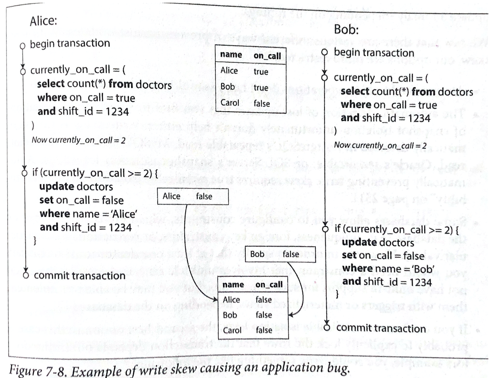

# 관계형 데이터베이스의 고립성(Isolation) of ACID (2)


## Lost Update 방지하기

read committed와 snapshot isolation 레벨은 읽기만 하는 트랜잭션이 동시적인 쓰기가 존재함에도 읽기가 가능함을 설명했다. 두 트랜잭션이 동시에 쓴다면 어떤 문제가 발생할까? __lost update__ 문제가 있다. 이 문제는 두 트랜잭션이 카운터를 올릴 때 발생한다.

__lost update__ 문제는 두 애플리케이션이 데이터베이스로 부터 읽고 그것을 수정한 후, 수정한 값을 다시 쓸 때 발생한다. _read-modifiy-write cycle_ 이라고도 일컫는다. 만약 두 트랜잭션이 동시에 이 동작을 한다면, 하나의 수정사항은 유실된다. 왜냐하면 두 번째 쓰기 트랜잭션은 첫 번쨰 트랜잭션의 변경 사항을 갖지 않기 때문이다. 

| Transaction1                          | Transaction2                          |
| ------------------------------------- | ------------------------------------- |
| 트랜잭션 시작 - Data1 읽음, 10이 출력 |                                       |
|                                       | 트랜잭션 시작 - Data2 읽음, 10이 출력 |
| Data1의 값을 1 더함, **11**           |                                       |
|                                       | Data1의 값을 1 더함, **11**           |
| 커밋                                  | 커밋                                  |


### 원자적 쓰기 작업(Atomic write operations)

read-modifiy-write cycle을 방지하려면, 애플리케이션 수준에서 처리할 필요가 없다. 대부분의 데이터 베이스가 원자적 갱신 작업(atomic update operation)을 지원하기 때문이다. 예를 들어 다음의 작업은 대부분의 관계형 데이터베이스에서 __동시적으로 안전__하다.

```sql
UPDATE counters SET value = value + 1 WHERE key = 'foo';
```

데이터베이스는 원자적 작업을 어떻게 구현할까? __배타적 잠금(exclusive lock)__을 해당 객체에 걸어준다. 배타적 잠금은 한 트랜잭션이 갱신을 완료하기 전까지 누구도 읽지 못하게 객체 접근을 막는 것을 말한다.


### 명시적 잠금(Explicit Lock)

lost update를 막는 또 다른 방법은 명시적 잠금이다. 이는 DB에서 원자적 작업을 지원하지 않을 경우에, 애플리케이션이 직접 해당 객체에 락을 거는 것이다. 예를 들어, 멀티 플레이어 게임이 있다고 가정하자. 이 게임은 여러 사용자가 동시에 움직일 수 있다. 데이터베이스가 구현한 원자적 작업에서는 불가능할 것이다. 하지만, 애플리케이션 수준에서는 여러 사용자가 동시에 움직이도록 허용할 수 있다. 만약 같은 맵의 지점에 사용자가 이동하려 한다면 그 때 락을 걸 수 있다.

```sql
SELECT * FROM figures
WHERE name = 'robot' AND game_id = 222
FOR UPDATE;
-- 이동이 유효한지 검증한다. 그리고 위치를 수정한다.
UPDATE figures SET position = 'c4' WHERE id = 1234;

COMMIT;
```


### Lost Updates 자동 감지

read-modifiy-write cycle을 막는 또 다른 방법은 병렬적으로 쿼리를 수행하도록 한뒤, 트랜잭션 매니저가 lost update를 감지하여 이후에 갱신한 트랜잭션을 취소시키는 방법이다. 이 방법은 스냅샷 고립성(snapshot isolation)의 이점을 이용하여 효율적으로 감지할 수 있다. PostgreSQL, Oracle, SQL Server는 지원가능하지만 MySQL/InnoDB의 repeatable read는 lost update를 감지하지 못한다. lost update 자동 감지 기능은 애플리케이션 코드가 명시적 잠금을 하지 않아도 된다는 점에서 유용하다.


### 충돌 해결과 복제(Conflict resolution and replication)

복제 데이터베이스에서 lost update는 또 다른 방식이 필요하다. 왜냐하면, 여러 노드에 데이터가 복제되어 있으므로, 데이터는 언제든지 동시에 다른 노드에서 동시에 수정될 수 있기 때문이다. 수정하려는 값에 lock을 걸면 모든 복제본이 최신화된 값을 가질 수 있을까? 아쉽게도 그렇지 않다. 왜냐하면, multi-leader와 leaderless 복제 방식은 쓰기가 동시적으로 진행해야 되며 복제는 비동기적으로 처리되어야 하기 때문이다. 복제 DB에서 이를 해결하는 일반적인 방법은 하나의 값에 버전이 충돌(conflict)하는 여러 버전을 만드는 것이다. 이후에 애플리케이션 코드를 이용하여 이 충돌을 해결하고 버전을 병합한다. 하지만, 대부분의 데이터베이스는 LWW(Last-write-win) 방식을 채택한다. 이 방식은 가장 마지막에 작성한 쓰기만 적용된다.


## 쓰기 왜곡과 팬텀(Write Skew and Phantoms)

지금까지, dirty writes와 lost updates 문제에서 동시적으로 다른 트랜잭션들이 쓰는 것을 막아야 함을 보여줬다. 하지만 이것이 쓰기 경합상황의 문제의 전부가 아니다. 다음 상황을 고려해보자.

- 의사가 병원의 대기 업무(on-call shifts)를 관리할 수 있는 애플리케이션을 만든다고 하자.
- 병원은 여러 의사가 업무를 처리할 수 있도록 대기시켜야 한다.
- 하지만, 최소한 한명의 의사는 대기해야 한다.
- 의사는 아파서 업무를 쉴 수 있다. 단, 다른 의사가 해당 근무에 대기해야한다.
- Alice와 Bob 이라는 두명의 대기 의사가 특정 업무를 갖는다.
- 애석하게도 두 명 모두 건강이 좋지 않아 쉬려고 한다. 
- 두 명이 버튼을 눌러 거의 동시에 퇴근 버튼을 눌렀다면 다음과 같은 상황이 발생 한다.



[그림 7-8] 쓰기 왜곡이 애플리케이션 버그를 발생함

위의 두 트랜잭션에서, 애플리케이션은 먼저 두 명이상의 의사가 현재 대기상태인지 확인할 것이다. 맞다면, 한 명은 퇴근하도록 허용할 것이다. 위 데이터베이스는 스냅샷 고립성을 사용하므로, 대기 상태인 의사의 수가 2명임을 알려준다. Alice와 Bob은 각각 출근을 하도록 자신의 레코드를 수정했다. 두 트랜잭션이 커밋되면 이제 어떤 의사도 대기상태에 있지 않게 된다. 이러한 상황을 통해 애플리케이션이 버그가 발생함을 알 수 있다. 

### 쓰기 왜곡 해결하기

이런 이상 현상을 쓰기 왜곡(write skew)라고 한다. 이것은 dirty write도 아니며 lost update도 아니다. 쓰기 왜곡은 두 트랜잭션이 같은 객체를 읽고, 이객체를 수정할 때 발생한다. 위 예제에서는 테이블의 on_call 상태가 update를 시행한 지점과 맞지 않았기 때문에 발생했다. 이러한 문제를 해결하는 방법은 다음과 같다. 

- 가장 쉬운 방법은 serializable 고립성 수준을 채택하는 것이다. 하지만 동시성이 크게 떨어진다.

- 두 번째 방법은 명시적 락을 트랜잭션이 의존하는 행에 거는 것이다. 위의 예제를 이용하면 다음과 같이 작성할 수 있다.

  ```sql
  BEGIN TRANSACTION;
  
  SELECT * FROM doctors
  	WHERE on_call = true
  	AND shift_id = 1234 FOR UPDATE;
  
  UPDATE doctors
  	SET on_call = false
  	WHERE name = 'Alice'
  	AND shift_id = 1234;
  	
  COMMIT;
  ```

한편, lost updates에 대한 자동 감지(automatic detection)는 도움이 되지 않는다. 왜냐하면, 쓰기 왜곡은 PostgreSQL의 repeatable read나 MySQL의 repeatable read, Oracle의 serializable, SQL Server의 repeatble read 수준에서는 감지되지 않기 때문이다.


### 쓰기 왜곡을 유발하는 팬텀

아래의 예제들은 모두 같은 패턴을 보인다.

1. SELECT 쿼리는 조건절을 이용하여 요구사항에 충족하는지 확인한다. 마치, 최소 두 명의 의사가 대기해야하는 것처럼 말이다.
2. 첫 번째 쿼리의 결과에 따라서, 애플리케이션 코드는 어떻게 진행할지 결정한다. 예를 들어, 에러를 던지거나 취소할 것이다.
3. 애플리케이션이 계속 진행하기로 판단했다면, 데이터베이스에 쓰기작업(INSERT, UPDATE, 또는 DELETE)을 수행하고 커밋할 것이다. 
   - 이 쓰기 작업은 2번 단계에서 사용한 조건을 바꾸게 될 것이다. 즉, **SELECT를 1번 단계에서 수행하고 쓰기 작업후 수행한것이 다른 결과를 낳는다는 것이다.** 

이러한 문제를 해결하려면 step1에서 `SELECT FOR UPDATE` 를 이용해 명시적으로 락을 걸어줘야할 것 같다. 하지만, 테이블에 추가하거나 삭제된 레코드는 `SELECT FOR UPDATE` 가 락을 걸지 않았는 것이다. 

이렇게 하나의 트랜잭션이 다른 트랜잭션의 검색 결과를 바꿀 수 있는 현상을 팬텀(phantom)이라고 한다. 스냅샷 고립성이 read-only 방식을 이용해 팬텀을 피할 수 있지만, 읽고-쓰는 트랜잭션 작업은 팬텀에 의해 쓰기 왜곡을 유발한다.

---

Desingning Data-Intensive Application. Martin Kleppmann. O'REILLY. 2017.

