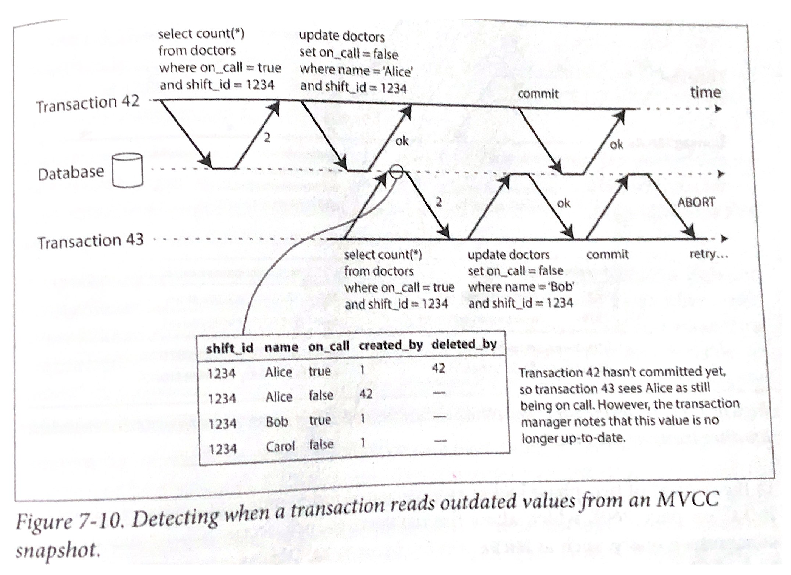
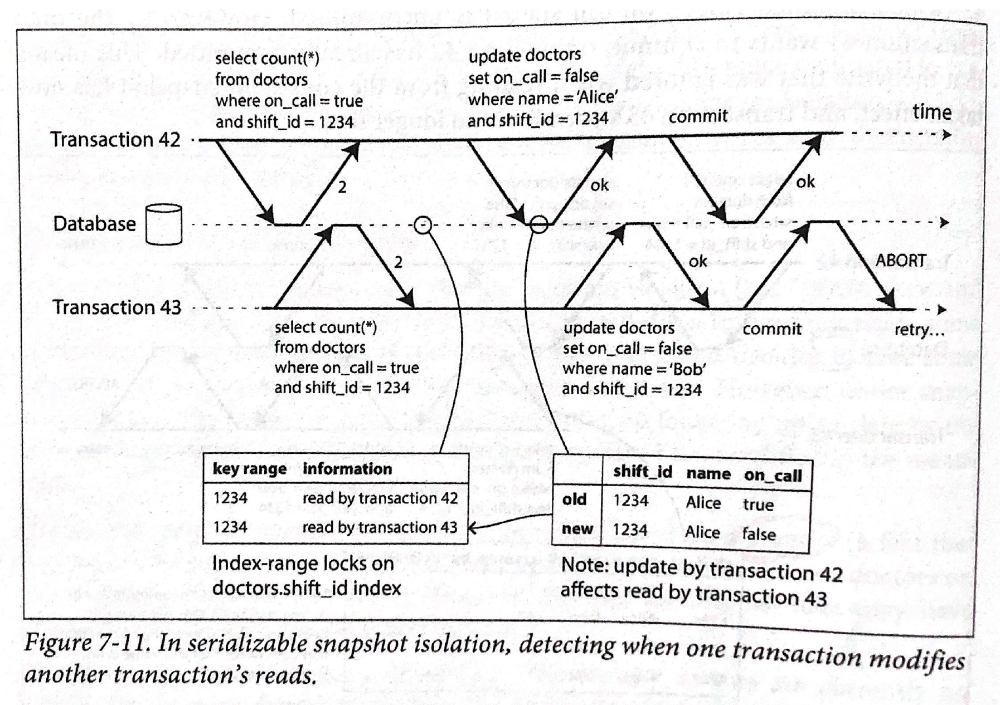

# 관계형 데이터베이스의 고립성(Isolation) of ACID (4)

## 직렬화 가능한 스냅샷 고립성(Serializable Snapshot Isolation)

트랜잭션의 고립성에서 가장 엄격한 직렬성은 성능이 좋지 않다. 직렬성 대신, 더 약한 수준의 고립성 레벨을 택한다면 성능은 충분하다. 하지만 lost updates, write skew, phantom 과 같은 문제에서 자유롭지 못하다. 직렬성 수준의 고립성을 지키면서 성능을 꾀할 수 없을까?

직렬화 가능한 스냅샷 고립성, 줄여서 SSI(Serializable Snapshot Isolation)은 Michael Cahill이 2008년에 고안하였다. SSI는 완전한 직렬성을 제공하면서도, 스냅샷 고립성 수준에 버금가는 성능을 기대할 수 있다.

## 비관적 동시성 제어 vs 낙관적 동시성 제어

2단계 락(two-phase lock)은 비관적(pessimistic) 동시성 제어 메커니즘이라고 부른다. 왜냐하면 다른 트랜잭션과 충돌되기 전에 애초에 막아버리기 때문이다. 마치 멀티스레드 환경의 상호 배제(mutual exclusion)처럼, 데이터 구조를 보호하는 것도 비관적 락에 속한다.

반면, SSI는 낙관적(optimistic) 동시성 제어 기술이라고 부른다. 낙관적이라는 의미는 다른 트랜잭션이 어떤 위험한 일을 저지르기 전에 막지 않고, 일단 트랜잭션이 흘러가게 냅두는 것이다. 두 트랜잭션간 데이터가 어긋나는 상황이 발생하면 어떻게 될까? 트랜잭션이 커밋될 때, 데이터베이스는 정합성을 체크하여 트랜잭션을 취소한다. 

SSI의 장점은 트랜잭션간 경합 상황이 높을 때 빛을 발한다. 예를 들어, 여러 트랜잭션이 동시에 하나의 카운터 값을 증가시키길 원한다면, 어떠한 순서로 값이 증가하든지 상관없다. 이것을 교환적 원자 연산(commutative atomic operation)이라고 한다. 

## MVCC가 직렬화 가능한 스냅샷 고립성을 구현할 수 있는 이유

MVCC는 다중-버전 동시성 제어 기술이다. 이 기술을 이용하면 read-committed와 동시에 repeatable-read를 실현할 수 있다.  

아래의 [그림 7-10]을 살펴보자. 트랜잭션 43번이 트랜잭션 42번이 데이터를 update하고 나서도 자신만의 스냅샷을 가지므로 42번이 업데이트 한 것을 볼 수 없다. 따라서, 43번이 이후에 update를 하고나서도 42번이 먼저 커밋을 수행했으므로, 43번의 커밋은 취소(ABORT)된다. 왜 43번이 커밋하기 전까지 취소하지 않았을까? 왜냐하면, 43번은 단순히 읽기만 작업할 수도 있기 때문이다. 게다가, 43번이 먼저 커밋한다면 42번 트랜잭션은 ABORT될 것이다. 이렇게 낙관적 메커니즘은 유연성이 특징이다.

[그림 7-10] 트랜잭션이 MVCC 스냅샷의 오래된 데이터를 읽는 것을 감지한다.

아래의 [그림 7-11] 은 위의 [그림 7-10]과 상황이 다르다. 이번에는 두 트랜잭션이 읽기를 수행할 때 index-range 락이 걸린다. 하지만, 해당 인덱스 key range에 대해 블로킹(blocking)하지 않는다. 단순히 인덱스 키(여기서는 1234)가 커밋되는 시점에 최신 데이터인지 확인하는 용도로 사용된다.

트랜잭션 43번이 트랜잭션 42번에게 너가 읽은 데이터는 오래되었다고 일러준다. 42번이 먼저 커밋을 했으니 트랜잭션은 성공하고, 43번이 커밋하려는 데이터는 42번이 이전에 커밋한 데이터와 불일치하므로 43번의 트랜잭션은 취소(ABORT)된다.

[그림 7-11] SSI는 한 트랜잭션이 다른 트랜잭션의 읽기를 수정하는 것을 감지할 수 있다.

## SSI의 성능은 어떨까?

2단계 락(two-phase lock)과 SSI를 비교하면, SSI는 트랜잭션이 다른 트랜잭션을 블로킹하지 않는다는 것에 있다. 이러한 설계 원칙이 쿼리 레이턴시를  예측가능하도록 한다. 읽기 작업이 많은 트랜잭션은 락 없이 읽을 수 있다. 

단순한 직렬(serial) 실행과 SSI를 비교하면, SSI는 단일 CPU 코어의 처리량에 제한되지 않는다. 즉, SSI는 트랜잭션이 여러 파티션에서 블로킹없이 읽기와 쓰기 작업을 처리하므로 분산 환경에서 매우 높은 처리량을 얻을 수 있다.  

반면, 이런 경우는 SSI를 삼가하는 것이 좋을 것 같다. 읽기와 쓰기 작업이 매우 긴 OLTP와 같은 트랜잭션이라면 커밋시점이 되어서야 경합상황을 감지하고 취소될 수도 있기 때문이다.

---

Desingning Data-Intensive Application. Martin Kleppmann. O'REILLY. 2017.

