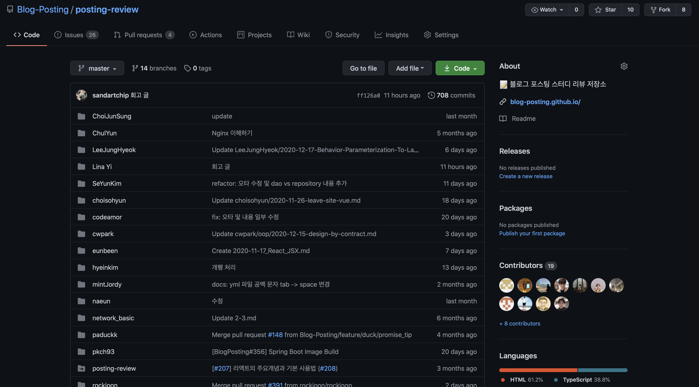
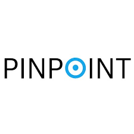

# 어느 1년차 개발자의 2020년 회고

2020년에 다짐했던 것이 꼭 하나 있다. 자바 책 3권을 완독하자고 다짐했다. "난 정말 Java를 공부한적이 없어요"와 "이펙티브 자바" 그리고 "오브젝트"를 완벽하게 끝내보리라 마음속으로 다짐했다. 어떻게 됐을까? 이 중 2권은 성공했다. 하지만, 자바 도서로 많이들 추천하는 "이펙티브 자바"는 쉽지 않았다. 한 문장 한 문장에 저자의 범접할 수 없는 실력이 농축되어 있었다. 2021년에는 저자의 내공을 깊이있게 이해하길 기원한다.

2020년에는 회사에서 많이 적응이 되었고, 본격적으로 스터디를 시작하려고 다짐했다. 동시에, 코로나가 시작되며 스터디를 구하기가 쉽지 않았다. 커뮤니티를 두리번거리다, 컨셉이 생소한 "블로그 포스팅"이라는 스터디에 발을 들이게 되었다. 이 스터디는 아직까지도 계속하고 있으며, 2기를 진행중이다. 이런 스터디를 찾게되어 굉장히 운이 좋았다고 생각한다. 좋은 사람들과 같이 지식을 공유하고 즐겁게 공부할 수 있다는 것이 회사에서는 쉽지 않았기 때문이다.

올해에 나에게 개발자 커리어에 있어서 중요한 이벤트 하나가 있다. 오픈소스 컨트리뷰션이다. 정보통신산업진흥원에서 주관하는 오픈소스 컨트리뷰션에 참여했다. 내가 참가 신청한 오픈소스는 네이버의 유명한 오픈소스 중 하나인 핀포인트였다. 신청을 하면서 "이게 될까"하며 기대는 하지 않았다. 하지만, 참여 공지를 받고, 컨트리뷰션에 참가할 수 있었다. 처음하는 오픈소스다보니 어떻게 해야할지 깜깜했다. 사실 Pull Request 조차 몰랐다. 하물며, 핀포인트는 구조가 복잡한 프로젝트다. hbase를 구동해야하며 hbase의 스키마를 설치하고, collector를 그 다음 구동하고 에이전트를 부트스트래핑하여 구동하고 등등 초심자에겐 결코 쉽지 않았다. 하지만 시간과 끈기가 해결해주었다. 길지 않은 6주동안의 컨트리뷰션을 성공적으로 마무리하고, 팀원들과 멘토님들 덕분에 장려상을 받게되었다.

## 2021년에 개발자로서 해야할 것

우리가 개발을 하며 쉽게 간과하는 것들은 사실 당연하게 이루어지지 않는다. 그 속에 많은 이야기들이 숨어 있다. 그래서 더 중요한게 있다. 질문을 하는것이다. 질문이라는 망치로 메마른 지식을 깨야 한다. 이렇게 하지 않으면 그 지식은 온전히 내것이 아니게 된다. 개발자는 더욱 그래야 한다. 추상(abstraction)으로 무장한 수 많은 API들이 개발자들을 유혹한다. 마치 이것만 있으면 개발이 될 것 같다. 하지만 결국에는 외면했던 근본적인 원리들이 부메랑처럼 돌아와 나를 괴롭힐 것이다. 2021년의 나는 좀 더 근본적인 것을 탐구하는 개발자가 되길 원한다.

개발을 잘하는 것에 왕도는 없지만, 한 가지 중요한 도구를 알고 있다. '책'이다. '책' 중에서도 컴퓨터의 역사에 대해 설명해주는 책을 읽어보자. 빌 게이츠는 어떤 것에 대해 알려면 그것에 대한 역사를 알아야 한다고 말했다. 과학을 공부하려면 과학사를 보고, 경제를 알고 싶으면 경제사를 공부하고, 컴퓨터를 공부하려면 컴퓨터의 역사에 대해 공부하라는 것이다. 

2021년에는 어떤 일이 일어날지 모르겠다. 계획에 없던 우연에 부딪히고 여러 문제에 고민하고 좌절도 할 것이다. 2021년은 행복하게 개발하자.

