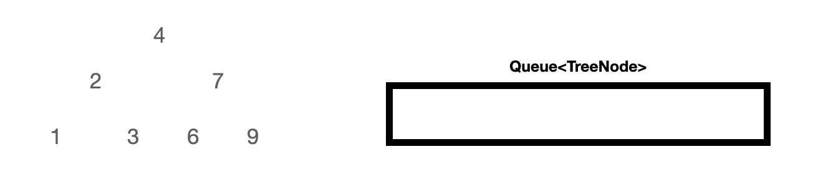
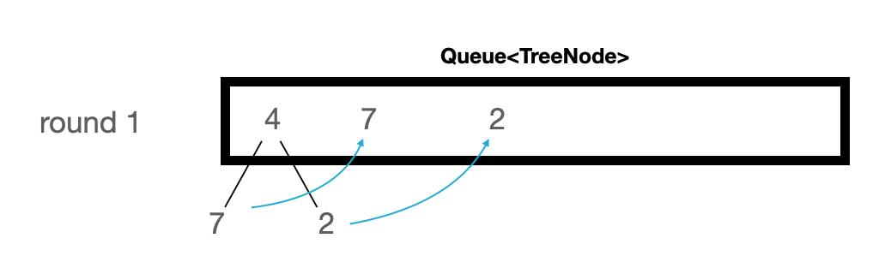

# 이진 트리 뒤집기(Inverting Binary Tree)


이 문제가 만들어진 계기는 Homebrew를 만든 Max Howell이 올린 유명한 트윗 때문이다. 


> 구글: 구글 엔지니어의 90%는 당신(Max Howell)이 작성한 소프트웨어(Homebrew) 를 사용한다. 하지만, 화이트 보드에 이진 트리 뒤집는걸 못하네? 그냥 꺼져.


Homebrew만든 사람도 못풀었다고? 지레 겁먹었다. 사실 생각보다 매우 간단하다.

이진 트리 뒤집기 예시를 보자.

Input:

```
     4
   /   \
  2     7
 / \   / \
1   3 6   9
```

Output:

```
     4
   /   \
  7     2
 / \   / \
9   6 3   1
```

최상단의 루트 노드(4)에서 출발해서 다음 자식 노드(7, 2)의 순서를 역으로 바꾼다.  그 다음 자식 노드(9, 6, 3, 1)들의 순서를 바꾼다. 

이 문제를 해결하는 방법은 총 2가지가 있다. 재귀(recursive)와 반복(iterative)이다.

먼저 다음과 같이 TreeNode가 구현되어 있다고 가정하자.

```java
public class TreeNode {
  int val;
  TreeNode left;
  TreeNode right;
  TreeNode() {}
  TreeNode(int val) { this.val = val; }
  TreeNode(int val, TreeNode left, TreeNode right) {
    this.val = val;
    this.left = left;
    this.right = right;
  }
}
```

`TreeNode` 는 정수 값  `val` 을 가지며 왼쪽 노드(`left`) 와 오른쪽 노드(`right`) 를 갖는다. 생성자를 제외한 이외의 메서드는 생략하자. 

내가 처음에 생각한 방법은 루트에서 출발해서 각 레벨마다 모든 노드의 순서를 역으로 바꿔주는 것이었다. 하지만 해답은 훨씬 더 간결했다.

```java
class Solution {
	public TreeNode invertTree(TreeNode root) {
		if(root == null) {
    	return null;
		}
    TreeNode right = invertTree(root.right);
		TreeNode left = invertTree(root.left);
    root.left = right;
    root.right = left;
    return root;
  }
  
}
```

이렇게 간결하게 뒤집을 수 있는 이유는 부모 노드의 왼쪽에서 오른쪽, 혹은 오른쪽에서 왼쪽으로 위치가 뒤바뀌기 때문이다. 따라서, 자식 노드의 왼쪽, 오른쪽만 뒤집어주면 되는 것이다.

시간 복잡도를 분석해보자. 트리를 통틀어서 하나의 노드를 단 한번씩만 방문한다. 따라서, O(n)이라고 할 수 있다. 여기서 n은 트리의 노드 개수다. 여기서 더 최적화 가능할까? O(n)보다 더 빠른 것은 O(log n)인데, 아무래도 방법이 떠오르진 않는다. 이진 탐색처럼 단 하나의 원소만 필요하다면 모를까, 노드의 위치를 바꾸려면 최소한 한 번씩은 방문해야 하니 O(n)이 당연하다.

재귀 방법은 간결하다는 장점이 있지만, 함수 호출하는 스택에 함수가 계속 쌓이게 되면 overflow가 날 수 있다. 스택에 쌓이는 함수 호출 개수는 얼만큼일까? 트리의 최대 높이만큼이다. h가 트리의 높이라면 O(h)로 표현한다.

공간 복잡도를 계산해보면, 노드의 개수 n일 때 O(n)이다. 노드의 개수만큼만 가지기 때문이다.


이번에는 반복 방식으로 풀어보자. 이 방식은 너비 우선 탐색(breadth-first search)과 비슷하다. 루트에서 출발해서 왼쪽 자식 노드와 오른쪽 자식 노드를 모두 방문하여 다음 자식 노드에서 다시 뒤집기 작업을 진행한다. 재귀방식과 다른 점은 너비 우선 탐색이 가능하도록 Queue를 별도로 마련해야 한다는 것이다.

​	예제 트리는 이전과 같다. 루트 노드 4부터 출발한다. 그리고 TreeNode를 담을 Queue를 준비한다.



4를 큐에 담고 나서 자식 노드인 2와 7의 순서를 바꾼다. 그리고 정렬된 자식 노드 2개를 큐에 차례로 넣어준다. 


두 번째 반복에서는 7을 큐에서 빼내어(poll) 자식 노드인 9와 6의 순서를 바꾸어 큐의 끝에 차례대로 추가한다.


세번째 반복문은 깊이 1의 마지막 노드를 처리한다. 1과 3의 순서를 바꿔 3, 1로 만든 후 큐의 끝에 추가한다. 다음 처리할 노드는 깊이가 2다. 이렇게 하나의 깊이에 있는 노드들에 대한 작업을 끝내고 다음 깊이의 노드들을 처리할 수 있다.

지금까지 정리한 것을 코드로 작성해보자.

```java
public TreeNode invertTree(TreeNode root) {
    if(root == null) return null;
    Queue<TreeNode> queue = new LinkedList<TreeNode>();
    queue.add(root);
    while(!queue.isEmpty()) {
        TreeNode current = queue.poll();
        TreeNode temp = current.left;
        current.left = current.right;
        current.right = temp;
        if(current.left != null) queue.add(current.left);
        if(current.right != null) queue.add(current.right);
    }
    return root;
}
```


이 코드의 복잡도를 분석해보자. 재귀 방식과 마찬가지로 노드는 단 한번씩만 방문한다. 따라서 트리의 전체 노드의 개수를 n이라고 할 때, 시간 복잡도는 O(n)이다. 공간 복잡도 또한 재귀 방식과 같다. 큐는 각 레벨에 있는 모든 노드를 저장한다. 가장 많은 노드를 가진 것은 리프 노드다. 

마지막으로 예외 처리를 잊지말자. 큐에 노드를 추가하기 전에 null인지 확인해야 한다. null의 속성에 접근한다면 NullPointerException이 발생할 것이다.

ps. 리트코드 문제 풀이 후 다른 사람의 풀이를 볼 수 있는데, 거의 전부가 문제를 재귀로 풀었다. 최적화 테스트 케이스가 부족한 것일까, overflow가 안나는 걸까?


----

https://leetcode.com/articles/invert-binary-tree/

https://twitter.com/mxcl/status/608682016205344768


