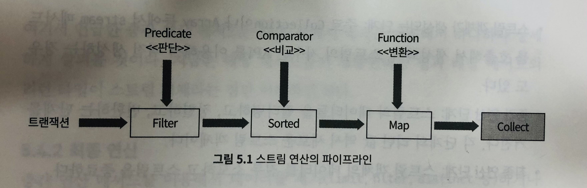
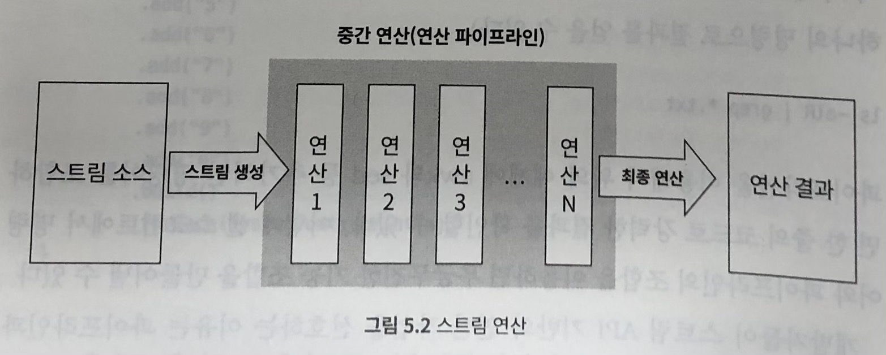

# 자바 8의 스트림 API

자바 8에서 새롭게 추가된 스트림 API에 대해 알아보자. 스트림 API는 람다와 더불어 함수형 프로그래밍의 핵심이다.

- 스트림 이해: 자바 8의 스트림에 대한 개념 이해
- 스트림 기본 사용 법: 스트림 생성 및 활용
- 스트림 연산 이해: 기본 연산과 그 응용
- 리듀스 연산: 리듀스 연산 이해 및 람다 표현식 기반의 데이터 연산 작업


## 스트림 인터페이스란?

스트림(Stream)은 '작은 하천', '시냇물'이란 뜻이다. 주의할 것은 기존 자바에서 사용하던 java.io 패키지의 I/O 프로그래밍에 사용되는 Stream이 아니다. 

여기서 배울 내용은 컬렉션 프레임워크와 같은 데이터를 처리할 때 도움을 주는 자바 8에서 새롭게 추가된 API다. 

스트림 API는 람다 표현식과 메서드 참조등을 결합하여 복잡한 데이터 처리작업을 쉽게 처리할 수 있다.


아래와 같은 데이터를 예로 들자.

```java
Integer[] intArray = new Integer[] {1, 2, 3, 4, 5, 6, 7, 8, 9, 10};
List numberList = Arrays.asList(intArray);
```

위 데이터를 순차적으로 STDOUT으로 출력하는 코드를 작성하면 다음과 같다.

```java
for(int i = 0; i < numberList.size(); i++) {
  System.out.println(numberList.get(i));
}
```

이 코드의 문제점은 루프를 돌리기 위해 인덱스 변수 i 를 사용하고 배열의 끝을 위해 List의 크기와 그것을 비교하는 작업을 반복한다는 것이다.


```java
for (Integer intValue : numberList) {
  System.out.println(intValue);
}
```

위 코드는 제너릭을 이용한 for each 구문이다. for 문장을 위한 인덱스 코드도 없고 Iterator 객체도 존재하지 않는다.

자바 8의 Stream API는 위의 코드를 다음과 같이 한 줄로 줄여쓸 수 있다.

```java
numberList.forEach(System.out::println);
```

스트림을 이용한 컬렉션 프레임워크의 가장 큰 특징은 기존 컬렉션 프레임워크처럼 개발자가 *외부에서* for 루프를 구현하는 것이 아니라 *스트림 내부*에서 개발자가 정의한 코드가 반복 실행된다는 것이다.

### 스트림 인터페이스

스트림 API 문서를 보면 대부분 인터페이스로 구성되어 있다. 그 이유는 구현체는 데이터의 원천인 컬렉션 프레임워크 기반의 클래스에 위임하기 때문이다.

스트림의 가장 기본이 되는 인터페이스는 BaseStream 이며, <T, S extends BaseStream<T, S>>` 가 인터페이스에 정의되어 있다.

T는 스트림에서 처리할 데이터의 타입을 의미한다. S는 BaseStream을 구현한 스트림 구현체를 의미한다. 이 구현체는 스트림을 자동으로 종료하기 위한 AutoCloseable 인터페이스도 구현해야 한다. 


다음은 BaseStream의 인터페이스 메서드다.

| 리턴 타입       | 메서드                    | 설명                                                         |
| --------------- | ------------------------- | ------------------------------------------------------------ |
| void            | close()                   | 스트림을 종료한다. 해당 스트림의 파이프라인과 연결된 모든 핸들러를 종료한다. |
| boolean         | isParallel()              | 스트림이 병렬로 실행되는지에 대한 여부를 말한다.             |
| Iterator\<T>    | iterator()                | 스트림 항목에 대한 인덱스를 Iterator 객체로 리턴한다.        |
| S               | onClose(Runnable handler) | 추가적인 종료 핸들러를 지정한 스트림을 리턴한다.             |
| S               | parallel()                | 병렬처리 가능한 스트림을 리턴한다.                           |
| S               | sequential()              | 절차적으로 처리 가능한 스트림을 리턴한다.                    |
| Spliterator\<T> | spliterator()             | 스트림이 포함하는 항목들을 분할하기 위한 Spliterator 객체를 리턴한다. |
| S               | unordered()               | 데이터가 정렬되지 않은 스트림을 리턴한다.                    |


BaseStream 인터페이스는 스트림 API의 최상위 명세다. 하지만 개발자들은 이를 직접 구현하지 않고, 이 인터페이스를 상속한 Stream 인터페이스를 사용한다.

다음은 Stream 인터페이스에서 사용되는 메서드 중 일부만을 간추렸다.

| 메서드   | 설명                                                         |
| -------- | ------------------------------------------------------------ |
| concat   | 입력 파라미터인 두 개의 스트림을 하나의 스트림으로 합친다. 첫 번째 스트림이 먼저 처리되고 두 번째 스트림이 뒤이어 처리된다. |
| collect  | 스트림의 내용들을 컬렉션 프레임워크 기반의 객체로 리턴한다. 주로 List 객체로 리턴한다. |
| count    | 스트림에 포함된 항목들의 개수를 리턴한다.                    |
| distinct | 중복된 항목을 제외하고 다시 스트림 객체를 만들어 리턴한다. 이 기능을 위해 equals 메서드를 사용한다. |
| filter   | 스트림의 항목들을 필터링한다.,                               |
| forEach  | 스트림 연산을 종료하고 최종 결과를 처리한다. 종료 연산의 일종이다. |
| limit    | 특정 개수만큼만 항목을 제한한다. 제한된 개수만큼 새로 스트림을 생성하여 리턴한다. |
| reduce   | 람다 표현식을 기반으로 데이터를 소모하고 그 결과를 리턴하는 최종 스트림 연산이다. |
| skip     | 스트림 처리 중 지정한 숫자만큼 항목을 건너뛴다.              |
| sorted   | 스트림 항목들을 정렬한다.                                    |
| toArray  | 스트림 항목들을 배열로 만들어 리턴한다.                      |

주목할 점은 BaseStream 인터페이스와 Stream 인터페이스의 대부분의 메서드가 Stream을 리턴한다는 것이다. 최종 연산 메서드는 void 형이다.

파이프라인 개념과 중간 연산, 최종 연산이 스트림 API 이해의 핵심이다. 또한, Stream 객체는 불변성이라는 것을 아는 것이 중요하다. Stream 객체가 어떤 메서드 호출을 할 때 원천 데이터를 수정하지 않는다는 것이다. 왜냐하면 병렬 처리 작업을 위해 데이터의 정합성을 보장하기 위해서다.


### 기본형 스트림 인터페이스

컬렉션프레임워크와 마찬가지로 스트림 API역시 데이터가 *객체* 라는 것을 기본 전제로 한다. 따라서, 기본형 데이터인 `int`, `double`, `long` 같은 값을 처리하면 오토 박싱/언박싱으로 인해 성능이 저하된다. 

스트림 API는 다음과 같이 기본형 타입에 대해 별도의 인터페이스를 제공한다. `DoubleStream` `IntStream`, `LongStream` 이 그것이다.

또한, 기본형에서는 Stream 인터페이스에서는 찾을 수 없는 연산 작업을 위한 메서드를 제공한다. `sum`, `max`, `int` 가 그것이다.


## 스트림 객체 생성하기

### 스트림 객체 생성이란?

스트림은 데이터 원본에서 객체를 생성한다. 즉, 자체적으로 데이터를 생성하고 관리하는 것이 아니다. 다음 예제는 ArrayList 에서 스트림 객체를 리턴받아 출력한다.

```java
public class FirstStreamExample {
  public static void main(String[] args) {
    List<String> firstList = new ArrayList<>();
    firstList.add("1");
    firstList.add("2");
    firstList.add("3");
    //... 4, 5, 6, 7, 8, 9, 0 까지 입력
    System.out.println("First List:" + firstList);
    
    // 스트림 객체 생성
    Stream<String> firstStream = firstList.stream();
    // 스트림 객체의 크기를 조회 한다. (최종 연산)
    System.out.println("Stream 항목 개수 : " + firstList.count());
    // 스트림에서 앞에서 5개의 데이터를 한정하여 새로운 스트림 객체를 생성한다.
    Stream<String> limitedStream = firstStream.limit(5);
    limitedStream.forEach(System.out::println);
  }
}
```

얼핏보기에는 1부터 0까지 10개의 데이터를 ArrayList에 추가하고, 해당 값들을 화면에 출력하는 것이라 예상할 것이다. 하지만 **다음과 같이 오류가 발생한다.**

```
First List : [1, 2, 3, 4, 5, 6, 7, 8, 9, 0]
Stream 항목 개수 : 10
Excpection in thread "main" java.lang.IllegalStateException: stream has already been operated upon  or closed
```

맨 처음 List\<String>객체를 생성하고 10개의 값을 추가했다. 그리고 System.out.println 메서드로 ArrayList 객체를 출력하고 정상적으로 처리했다.

총 개수를 확인하고 스트림에서 총 5개의 데이터를 가져오기 위해 `limit` 연산을 수행했는데 `IllegalStateException` 이 발생하였다.

>  stream has already been operated upon or closed

이 뜻은 "스트림은 이미 처리되었거나 종료되었다" 라는 뜻이다. 이 예외를 통해 스트림의 특징을 알 수 있다. 

- 스트림을 한번 사용하고 나면 다시 사용할 수 없다.
- Stream 인터페이스의 메서드 중 void를 리턴하는 메서드를 호출하면 스트림의 데이터를 소모하고 종료한다.

왜 count 같이 단순한 크기를 알기 위한 메서드가 스트림을 다 사용한 것일까? 스트림 데이터의 크기는 **스트림의 데이터를 다 흘려보내봐야만 알 수 있기 때문이다.**  스트림 데이터를 다 소모하게 만드는 메서드를 특별히 최종연산이라고 한다.

예외가 발생하지 않도록 다음과 같이 코드를 수정해보자.

```java
public class FixedFirstStreamExample {
  public static void main(String[] args) {
    List<String> firstList = new ArrayList<>();
    
    System.out.println("First List :" + firstList);
    
    // 스트림 크기를 출력한다.
    Stream<String> firstStream = firstList.stream();
    System.out.println(firstStream.count());
    
    // 스트림 데이터를 5개로 제한하고 그 값을 출력한다.
    firstStream = firstList.stream(); // 다시 Stream 객체 생성, 올바른 예는 아니다.
    Stream<String> limitedStream = firstStream.limit(5);
    limitedStream.forEach(System.out::println); // void 연산
  }
}
```


Stream은 빌더 패턴을 사용하는 것과 유사하다. 스트림에서는 이것을 *파이프라인* 이라고 한다. 파이프라인 예제를 통해 더 자세하게 살펴보자.

```java
public class SecondStreamExample {
  public static void main(String[] args) {
    List<String> firstList = new ArrayList<>();
    System.out.println("First List : " + firstList);
    
    // 스트림의 크기를 출력한다.
    System.out.println(firstList.stream().count());
    // 스트림 데이터를 5개로 제한하고 그 값을 출력한다.
    firstList.stream().limit(5).forEach(System.out::println);
  }
}
```


아래는 앞선 코드의 내용 중 파이프라인을 사용하지 않았을 때이다.

```java
firstStream = firstList.stream();
Stream<String> limitedStream = firstStream.limit(5);
limitedStream.forEach(System.out::println);
```


이 코드를 다음과 같이 한줄로 작성할 수 있다.

```
firstList.steram().limit(5).forEach(System.out::println);
```

빌더 패턴과 유사하게 메서드를 계속하여 연결하여 최종 연산자인 forEach 메서드까지 이어나갔다. 이렇게 메서드를 계속해서 연결할 수 있는 이유는 stream 메서드와 limit 메서드 모두 스트림 객체를 리턴하기 때문이다.


### 스트림 빌더

스트림을 사용할 때 대부분의 경우는 데이터를 소모하는 역할 만하고 데이터를 생성하는 역할을 수행하지 않는다. 하지만 데이터를 직접 생성하기 위한 기능을 제공하기도 하는데 그것이 바로 *스트림 빌더*이다. 스트림 빌더의 이점은 두 가지가 있다.

- 스트림 API 자체적으로 스트림 구성 항목을 생성할 수 있다.
- 스트림 객체를 생성하기 위해 List 등의 컬렉션 프레임워크를 이용하여 임시로 데이터를 만드는 작업을 하지 않아도 된다.

자바 API 문서의 Stream.Builder 인터페이스에는 세가지 메서드가 있다.

| 리턴 타입          | 메서드      | 설명                                                         |
| ------------------ | ----------- | ------------------------------------------------------------ |
| void               | accpet(T t) | 스트림 빌더에 데이터를 추가한다.                             |
| Stream.Builder\<T> | add(T t)    | 스트림 빌더에 데이터를 추가한다. 기존에 추가한 데이터와 새로 추가할  데이터를 포함하여 리턴한다. |
| Stream\<T>         | build()     | 빌더 작업을 종료한다.                                        |

다음 예제를 통해 스트림 빌더를 이용하여 스트림 객체를 생성하는 것을 살펴보자.

```java
public class StreamBuilderExample {
  public static void main(String[] args) {
    Stream.Builder<String> builder = Stream.builder();
    builder.accpet("1");
    builder.accpet("2");
    builder.accpet("3");
		// 4 ... 0 까지
    builder.build().forEach(System.out::println);
  }
}
```


accpet 메서드 대신, add 메서드를 이용하면 반복적으로 스트림 빌더 객체를 참조하는 변수를 코딩하지 않는다.

```java
public class StreamBuilderExample2 {
  public static void main(String[] args) {
    Stream.Builder<String> builder = Stream.builder();
    builder.add("1")
      .add("2")
      // 0까지
      .build()
      .forEach(System.out::println);
  }
}
```

스트림 빌더 역시 스트림 객체와 마찬가지로 한 번 사용하고나면 재사용할 수 없다. 두 번 처리하기 위해선 다음과 같이 수정해야 한다.

```java
Stream stream1 = builder.build();
stream1.forEach(System.out::println);
Stream stream2 = builder.build();
stream1.forEach(System.out::println);
```


## 스트림 연산 이해

앞서 스트림 연산은 파이프라인이 기본 골격이라고 했다. 파이프라인이란 리눅스 명령어처럼 추가적인 명령어를 연결하여 작업하는 것을 말한다. 



위 그림 5.1은 스트림 연산의 파이프라인의 대표적인 예를 보여준다. 먼저, 스트림 데이터를 filter 메서드로 원하는 데이터를 추출한다. 그 결과를 sorted 메서드를 이용하여 정렬하고, map 메서드로 원하는 데이터 타입으로 변환한다. 마지막으로, collect 메서드로 컬렉션 객체로 리턴한다.

filter나 sorted, map 처럼 데이터를 연산 작업하고 또 다른 스트림 객체를 만드는 것을 중간 연산(intermediate operation)이라고 한다. 가장 오른쪽의 collect 메서드는 스트림 데이터를 모두 소모하고 스트림을 종료하므로 이를 최종 연산(terminal operation)이라고 한다. 




그림 5.2는 스트림에서 제공하는 중간 연산과 최종 연산의 역할을 도식화한 것이다. 이 그림을 통해 스트림 객체의 생명주기는 크게 세 가지로 구분할 수 있다.


- 스트림 객체가 생성되는 단계: 주로 Collection이나 Array 등에서 stream 메서드를 호출하여 생성된다.
- 중간 연산단계: 스트림 데잍러르 필터링하고 정렬하고, 변환하는 단계를 거친다. 각 단계의 리턴 값은 새로운 스트림 객체다.
- 최종 연산 단계: 스트림 객체의 데이터를 모두 소모하고 스트림을 종료한다.


#### 중간 연산

Stream 인터페이스의 메서드를 살펴보자. 스트림의 중간 연산은 빌더 패턴 처럼 연속적으로 스트림 결과를 이어서 사용할 수 있으므로 리턴 타입이 Stream이다. 이를 정리하면 다음과 같다.



| 메서드명                                              | 설명                                                         |
| ----------------------------------------------------- | ------------------------------------------------------------ |
| concat(Stream\<? extends T> a, Stream<? extends T> b) | 두 개의 스트림을 하나로 합친다.<br />내부적으로는 첫 번째의 인자의 스트림을 모두 처리하고 나서 두 번째 인자의 스트림을 처리한다. |
| distinct()                                            | 중복값을 제거한다. 이 때 사용되는 메서드는 equals 메서드다.  |
| filter(Predicate<? super T> predicate)                | Predicate 함수형 인터페이스를 입력받아 해당 조건에 맞게 스트림 데이터를 필터링한다. |
| limit(long maxSize)                                   | 파라미터로 전달받은 maxSize 번째 데이터까지 스트림 객체를 생성하여 리턴하며 그 이후 데이터는 버린다. |
| map(Function<? super T, ? extends R> mapper           | Function 함수형 인터페이스를 입력받아 해당 조건에 맞게 값을 변경한다. |
| sorted()                                              | 스트림 데이터를 정렬한다. Comparable을 구현한 객체여야 하며 구현 하지 않을 경우 ClassCastException이 발생한다. |
| sorted(Comparator<? super T> comparator)              | Comparator 인터페이스의 연산을 기준으로 데이터를 정렬한다.   |


#### 최종 연산

중간 연산 이후 최종적으로 데이터를 소모(consume)하는 것이 최종 연산에 속한다. "소모한다"라고 쓴 이유는 스트림을 처리하고 나서 다시 읽어들이거나 재활용할 수 없기 때문이다. Stream 인터페이스의 최종 연산을 정리하면 다음과 같다.

| 메서드명                                    | 설명                                                         |
| ------------------------------------------- | ------------------------------------------------------------ |
| count()                                     | 스트림에 포함된 데이터 개수를 리턴한다.                      |
| collect(Collector<? super T,A,R> collector) | 주어진 Collector 인터페이스를 기반으로 스트림 데이터를 변환한다. |
| forEach(Consumer<? super T> action)         | 함수 레퍼런스나 람다 표현식을 이용하여 스트림 내부에서 for 반복문을 실행한다. |


## 주요 스트림 연산 자세히 살펴보기


#### 데이터 필터링

filter메서드는 스트림에 포함된 객체 속성값에 기반하여 데이터를 선별한다.

```java
public class StreamFilterExample {
  // Stream 인터페이스의 filter 사용 예
  public static void main(String[] args) {
    List<TravelInfoVO> travelList = TravelInfoDAO.createTravelList();
    Stream(TravelInfoVO) travelStream = travelList.stream();
    
    // 필터 조건을 정의한다.
    travelStream.filter(new Predicate<TravelInfoVO>() {
      @Override
      public boolean test(TravelInfoVO t) {
        return TravelInfoDAO.COUNTRY_PHILLIPHINE.equals(t.getCountry());
      }
    })
    .forEach(System.out::println);
  }
}
```

위 예제는 여행사의 상품 조회시에 filter메서드를 적용한 것이다. TravelInfoVO에는 여행정보를 담고 있다. 이 객체를 기반으로 여러 검색 서비르르 제공하는데, 기존 예제에서는 List의 데이터를 활용하여 조회한다.

자바 API 문서에서 filter 메서드 항목을 살펴보면, 다음과 같이 설명한다.

> 현재 스트림에서 '주어진 Predicate'와 일치하는 항목으로 구성된 스트림을 리턴한다.

이에 대한 소스 코드는 다음과 같다.

```java
Stream<T> filter(Predicate<? super T> predicate);
```

Predicate객체란 무엇일까? predicate의 인터페이스 명세를 확인해보면 `boolean test(T t)` 메서드 하나가 정의되어 있다. 스트림이 참/거짓을 판단하는 메서드가 바로 이 메서드이다. 위 예제는 정의한 Predicate 인터페이스를 익명클래스로 정의하였다. 이번에는 람다 표현식으로 표현해보자.

```java
travelStream.filter((TravelInfoVO t) ->
                   TravelInfoDAO.COUNTRY_PHILLIPHINE.equals(t.getCountry()))
  .forEach(System.out::println);
```


filter 메서드와 별도로 스트림에서는 중복 제거를 위한 distinct 메서드를 제공한다. 이 메서드는 중복 값을 제거해주지만 사용상 주의할 점이 있다.

1. distinct 메서드는 성능을 저하시킬 수 있다. 병렬 처리시 여러 쓰레드에 분산해 놓은 데이터를 동기화하여 비교해야하기 때문이다.
2. 중복 제거가 불가능할 수 있다. distinct 메서드 호출 시 equals 메서드를 내부적으로 사용한다는 점을 숙지해야 한다. 

다음은 distinct를 이용하여 중복 데이터를 제거한다.

```java
COllection<String> list = Arrays.asList("A", "B", "C", "D", "E", "A", "B", "C");

// 중복 제거된 List 객체 리턴
List<String> distinctElements = 
  list.stream().distinct().collect(Collectors.toList());

// 결과 출력
System.out.println(distinctElements);
// A, B, C, D
```

다음은 이름과 나이 정보가 들어있는 Person 클래스를 정의한 것이다. 이 객체를 사용하여 중복 데이터를 제거하자.

```java
public class Person {
  private String name;
  private int age;
  // constructor
  // getter, setter ...
  public String toString() {
    return "Name :" + name + ", Age : " + age;
  }
}
```

다음은 Person 객체를 이용하여 distinct 연산메서드로 중복 제거하는 예제다.

```java
public class StreamDistinctExample {
  public void test() {
    List<Person> personList = new ArrayList<>();
    personList.add(new Person("장윤기", 45));
    personList.add(new Person("장해라", 18));
    personList.add(new Person("장해윤", 14));
    personList.add(new Person("장윤기", 45));
    
    // 중복 제거 후 출력, 실패?
    personList.stream().distinct().forEach(System.out::println);
  }
  
  public static void main(String[] args) {
    new StreamDistinctExample().test():
  }
}
```

이 예제에서 의도한 바는 첫 번째, 마지막 Person 객체가 속성이 동일하므로 3개의 값이 출력될 것이라 예상했지만 결과는 다음과 같다.

````
Name : 장윤기, Age : 45
Name : 장해라, Age : 18
Name : 장해윤, Age : 14
Name : 장윤기, Age : 45
````

왜 distinct 메서드가 중복을 제거하지 않았을까? 이유는 equals 메서드가 오버라이드되지 않았기 때문이다. 다음과 같이 Person 클래스를 수정하고 다시 distinct 메서드를 확인해보자.

```java
public class Person {
  private String name;
  private int age;
  // constructor
  // getter, setter...
  @Override
  public boolean equals(Object obj) {
    if (obj == null) 
      return false;
    
    // age 속성과 name 속성이 모두 동일해야 같은 객체로 판단한다.
    if (obj instanceof Person) {
      Person p1 = (Person) obj;
      if (p1.getName().equals(this.getName()) && p1.getAge() == this.getAge()) {
        return true;
      } else {
        return false;
      }
    } else {
      return false;
    }
  }
  
  @Override
  public int hashCode() {
    return (name + age).hashCode();
  }
}
```


만일 equals 메서드와 hashCode 메서드를 오버라이드할 수 없는 상황이라면 어떻게 해야할까?  이 경우, 중복을 제거하는 메서드를 별도로 작성하여 스트림에 적용해야 한다. 


```java
public class StreamDistinctExample2 {
  public static <T> Predicate<T> distinctByKey(Function<? super T, ?> key) {
    Map<Object, Boolean> seen = new ConcurrentHashMap<>();
    return t -> seen.putIfAbsent(key.apply(t), Boolean.TRUE) == null;
  }
  
  public void test() {
    List<Person> personList = new ArrayList<>();
    personList.add(new Person("장윤기", 45));
    personList.add(new Person("장해라", 18));
    personList.add(new Person("장해윤", 14));
    personList.add(new Person("장윤기", 45));
    
    // distinctByKey 로 필터링
    personList.stream().filter(distinctByKey(b -> (b.getName() + b.getAge())))
      .forEach(System.out::println)
    
  }
  
  // 스트림 객체의 데이터 중복 제거 예
  public static void main(String[] args) {
    new StreamDistinctExample2().test();
  } 
}
```

위 예제의 핵심은 distinctByKey 메서드다. 이 메서드는 filter 메서드의 파라미터가 되었다. filter 메서드 작업을 순차적으로 살펴보자.

- personList의 stream 메서드를 이용하여 스트림 객체를 생성한다.
- filter 메서드가 호출된다.
- filter 메서드의 입력 파라미터인 Predicate 객체를 생성하기 위한 distinctByKey 메서드가 호출된다.
- distinctByKey 메서드에서 Predicate 객체를 생성한다.
- 생성된 Predicate 객체는 외부에서 선언된 Map<Object, Boolean> 객체를 참조한다.
- 스트림 내부에서 Predicate 객체가 반복실행되며 참/거짓 값에 따라 필터링된다.
- 필터링 결과 스트림에서 forEach 메서드가 호출된다.
- forEach 메서드의 파라미터로 전달된 함수 레퍼런스가 반복 실행된다.


distinctByKey 메서드는 스트림 개수만큼 호출되지 않는다. 이 메서드는 단 한번만 실행되며, **distinctByKey의 리턴 객체인 Predicate 객체의 test 메서드가 반복 호출된다.**

```java
public static <T> Predicate<T> distinctByKey(Function<? super T, ?> key) {
  Map<Object, Boolean> seen = new ConcurrentHashMap<>();
  return t -> seen.putIfAbsent(key.apply(t), Boolean.TRUE) == null;
}
```

이 메서드에서 Map 객체에 키와 값을 넣고나서 동일한 키가 존재하면 이미 존재했던 객체를 리턴하여 null값으로 판단되지 않는다. 반대로 키가 존재하지 않으면 null값으로 판단되어 true를 리턴한다.

만일 distinctByKey 메서드가 반복 호출된다면 스트림 연산마다 Map객체가 생성되므로 올바른 로직이 아닐 것이다. 하지만 메서드 내부에 선언해도 동일한 결과를 얻을 수 있는 이유는 filter에서 정의한 distinctByKey 메서드가 한 번만 호출되기 때문이다.

distinctByKey 메서드를 람다형이아닌, 익명 클래스로 변경하면 다음과 같다.

```java
publci static <T> Predicate<T> distinctbyKey(Function<? super T, ?> key) {
  Map<Object, Boolean> seen = new ConcurrentHashMap<>();
  return new Predicate<T>() {
    @Override
    public boolean test(T t) {
      return seen.putIfAbsent(key.apply(t), Boolean.TRUE) == null;
    }
  }
}
```


#### 데이터 정렬

스트림 API에서 정의하는 정렬 메서드는 다음과 같다.

- sorted()
- sorted(Comparator<? super T> comparator)

```java
// 실행 시 에러가 발생한다.
public class StreamSortedExample {
  
  // 스트림 정렬 사용 예
  public static void main(String[] args) {
    List<Person> personList = new ArrayList<>();
    personList.add(new Person("장윤기", 45));
    personList.add(new Person("장해라", 18));
    personList.add(new Person("장해윤", 14));
    personList.add(new Person("장윤기", 45));
    
    // 데이터를 정렬한 후 출력한다. - 에러발생
    personList.stream().sorted().forEach(System.out::println);
  }
}
```

위 예제를 실행하면 다음과 같은 에러가 발생한다.

```
Exception in thread "main" java.lang.ClassCastException: class ...
me.study.Person cannot be cast to class java.lang.Comparable ...
```

왜 ClassCastException이 발생할까? 이 에러 메시지에는 java.lang.Comparable 객체로 Person 객체 캐스팅을 시도하였지만 실패했다고 나온다. 이 내용을 이해하려면 자바에서 객체를 비교를 이해해야 한다. 값이 동일한지 여부를 판단하는 것은 equals 메서드를 통해 수행된다. 객체의 크고 작음을 비교하는 것은 Comparable 인터페이스 구현에 달려있다. 따라서, sorted() 스트림은 Comparable 객체로 형 변환을 시도했지만 이 인터페이스를 구현하지 않았으므로 실패한 것이다.

```java
public class Person implements Comparable<Person> {
  private String name;
  private int age;
  
  // constructor
  // getter, setter
  // equals
  // hashCode
  
  @Override
  public int compareTo(Person person) {
    return (name + age).compareTo(person.getName() + person.getAge());
  }
}
```

위와 같이 Person 클래스를 수정하고 다시 실행하면 ClassCastException 이 발생하지 않고 코드가 성공하는 것을 확인할 수 있다.

하지만 우리가 Person 클래스를 수정하지 못하는 상황이라면 어떻게 할까? 이를 위해 스트림 API는 Comparable 인터페이스를 파라미터로 받는 sorted() 메서드를 제공한다.

`sorted(Comparator<? super T> comparator)`

자바의 API 문서 중 java.util 패키지의 Comparator 인터페이스의 내용을 살펴보자. 이 인터페이스는 자바 1.2 부터 존재하던 것이다. 상당히 많은 메서드가 있지만 반드시 구현해야 하는 메서드는 단 하나다.

`compare(T o1, T o2)`

compare 메서드의 리턴 값은 int인데 0을 기준으로 크고 작음을 말한다. 다시 말해서,

- 첫 번째 파라미터 값이 크다면, 음수를 리턴한다.
- 두 번째 파라미터 값이 크다면, 영(0) 혹은 양수를 리턴한다.

다음 예제는 Person 객체를 다양한 기준으로 정렬한다.

```java
public class StreamSortedExample2 {
  // 스트림 객체를 정렬
  public static void main(String[] args) {
    List<Person> personList = new ArrayList<>();
    personList.add(new Person("장윤기", 45));
    personList.add(new Person("장해라", 18));
    personList.add(new Person("장해윤", 14));
    personList.add(new Person("장윤기", 45));
    
    // 역방향으로 정렬한다
    // Comparable 인터페이스가 구현되어야 한다.
    personList.stream().sorted(Comparator.reverseOrder())
      .forEach(System.out::println);
    
    // 나이순으로 정렬한다.
    personList.stream().sorted(Comparator.comparing(Person::getAge))
      .forEach(System.out::println);
    
    // 이름순으로 정렬한다.
    personList.stream().sorted(Comparator.comparing(Person::getName))
      .forEach(System.out::println);
  }
}
```

위 예제에서 주목할 내용은 `Person::getAge` 이다. sorted 메서드는 2개의 데이터를 비교하는데 어떻게 메서드 하나만을 던질 수 있을까? 위 코드를 풀어서 쓰면 다음과 같다.

`A.getName().comparetTo(B.getName());`


#### 데이터 매핑

매핑(map)은 스트림의 데이터를 다른 타입으로 변환하는 것을 맗란다. 매핑 메서드는 다음과 같이 4개가 존재한다.

-  map(Function\<? super T, ? extends R> mapper)
- mapToDuble(ToDoubleFunction\<? super T> mapper)
- mapToInt(ToIntFunction<? super T> mapper)
- mapToLong(ToLongFunction<? super T> mapper)

이 4개 메서드 중 가장 많이 사용하는 메서드는 첫 번째 `map(Function<? super T, ? extends R> mapper)` 메서드다.


```java
public class StreamMapExample {
  
  // 스트림 map 메서드 사용 예
  public static void main(String[] args) {
    List<Person> personList = new ArrayList<>();
    personList.add(new Person("장윤기", 45));
    personList.add(new Person("장해라", 18));
    personList.add(new Person("장해윤", 14));
    personList.add(new Person("장윤기", 45));
    
    // Stream<Person> -> Stream<String> 으로 변환
    Stream<String> personStream = 
      personList.stream().map((Person p) -> p.toString());
    personStream.forEach(System.out::println);
  }
}
```


```java
public class StreamMapExample2 {
  
  // 기본형 데이터를 이용한 map 메서드 사용 예
  public static void main(String[] args) {
    List<Person> personList = new ArrayList<>();
    personList.add(new Person("장윤기", 45));
    personList.add(new Person("장해라", 18));
    personList.add(new Person("장해윤", 14));
    personList.add(new Person("장윤기", 45));
    
    // Stream<Person> -> IntStream 으로 변환
    IntStream intStream = 
      personList.stream().mapToInt((Person p) -> p.getAge());
    intStream.forEach(System.out::println);
  }
}
```


#### 데이터 반복 처리

스트림도 결국 컬렉션과 마찬가지로 데이터의 집합이다. 따라서, 데이터를 반복해서 처리할 필요가 있다. 스트림 API는 forEach 메서드를 다음과 같이 두 가지로 제공한다.

- forEach(Consumer<? super T> action)
- forEachOrdered(Consumer<? super T> action)

추가적으로, 자바 8의 Map 인터페이스에도 forEach 메서드를 제공하고 있다. 

- forEach(BiConsumer<? super K, ? super V> action)

기본 forEach와 map의 forEach와 차이점은 map의 forEach는 BiConsumer를 입력 파라미터로 사용한다. BiConsumer는 입력받는 파라미터가 2개이다.  또 다른 차잉점은 default 메서드로 구현되어 있다는 점이다. 이는 기존에 Map 인터페이스를 상속한 클래스에 영향을 주지 않기 위해서다.


```java
public class MapIteratorExample {
  
  // Map 인터페이스의 forEach 사용 예
  public static void main(String[] args) {
    Map<String, Person> personList = new HashMap<>();
    personList.add(new Person("장윤기", 45));
    personList.add(new Person("장해라", 18));
    personList.add(new Person("장해윤", 14));
    personList.add(new Person("장윤기", 45));

    // Iterator로 처리
    Iterator<String> keys = map.keySet().iterator();
    while (keys.hasNext()) {
      String key = keys.next();
      System.out.println(
      	String.format("Key : %s, Value : %s", key, map.get(key)));
    }
    
    // Map의 Entry로 처리
    for (Map.Entry<String, Person> element: map.entrySet()) {
      System.out.println(
      	String.format("Key : %s, Value : %s", element.getKey(), element.getValue()));
    }
    
    // Map의 KeySet을 이용
    for (String key : map.keySet()) {
      System.out.println(
      	String.format("Key : %s, Value : %s", key, map.get(key)));
    }
    
    // forEach 이용
    map.forEach((key, value) ->
                String.format("Key : %s, Value : %s", key, value));
  }
}
```


forEach 메서드를 사용하면 위에서 작성한 3가지의 방식보다 좋은 점이 있다.

- 멀티 스레드 환경에서 for 문을 처리하는 도중 키와 값이 추가되거나 삭제될 수 있는 위험이 있다.


#### 컬렉션으로 변환

스트림은 데이터를 소모한다는 개념을 가진다. 데이터를 처리하고 나면 다시 꺼내서 쓸 수 없다는 뜻이다. 이와 반대로, 컬렉션 프레임워크는 데이터를 읽어드리고나서도 다시 읽을 수 있다. 따라서 가끔 컬렉션 객체를 이용해야할 경우가 있다. 이 때 collect 메서드를 사용하면 된다.

- collect(Supplier\<R> supplier, BiConsumer\<R, ? super T> accumulator, BiConsumer\<R, R> combiner)
- collect(Collect<? super T,A,R> collector)

```java
public class StreamCollectExample {
  
  // 스트림 map 메서드 사용 예
  public static void main(String[] args) {
    List<Person> personList = new ArrayList<>();
    personList.add(new Person("장윤기", 45));
    personList.add(new Person("장해라", 18));
    personList.add(new Person("장해윤", 14));
    personList.add(new Person("장윤기", 45));
    
    // 최종 결과를 List 객체로 리턴한다.
		List<Person> sortedList = 
      personList.stream().sorted().collect(Collectors.toList());
    
    for (Person person : sortedList) {
      System.out.println(person);
    }
  }
}
```


가장 많이 사용하는 스트림 인터페이스가 `collect(Collector<? super T,A,R> collector)` 이다. 이 입력 파라미터 3가지를 살펴보면 다음과 같다.

- T : 리듀스 연산의 입력 항목으로 사용하는 데이터 타입
- A : 리듀스 연산의 변경 가능한 누적값으로 사용하는 데이터 타입
- R : 리듀스 연산의 최종 결과 데이터 타입

자바 8 에서는 Collector 인터페이스를 구현한 유틸리티 클래스로 `Collectors` 를 제공한다.

```java
List<String> list = people.stream()
  .map(Person::getName)
  .collect(Collectors.toList());
```

이 예제는 collect 메서드에서 가장 많이 사용되는 패턴이다. 


```java
Set<String> set = people.stream()
  .map(Person::getName)
  .collect(Collectors.toCollection(TreeSet::new));
```


한 가지 주목해야할 점은 toList() 의 메서드는 구현체를 명시적으로 지정하지 않았다는 것이다. 명시적으로 지정하기 위해서는 `toCollection` 메서드를 사용해야 한다.

```java
// LinkedList로 생성한 List 객체로 변환
List<String> set = people.stream()
  .map(Person::getName)
  .collect(Collectos.toCollection(LinkedList::new));
```


```java
// 데이터를 쉼표로 구분하여 하나의 문자열로 하빈다
String joined = things.stream()
  .map(Object::toString)
  .collect(Collectors.joining(", "));
```


joining 메서드는 스트림의 데이터를 하나의 데이터로 합친다. 일반적으로 CSV와 같은 형태로 저장하기 위해 사용된다. 

Collectors의 메서드를 이용하면 합계를 할 수 있다.

```java
// 스트림 항목의 특정 값의 합을 리턴한다.
int total = employees.stream()
  .collect(Collectors.summingInt(Employee::getSalary));
```


Collectos를 이용하여 List 객체를 Map으로 바꿀 수 있다.

```java
// 항목의 특정 데이터를 기준으로 분류하여 Map 객체로 변환한다.
Map<Department, List<Employee>> byDept = employees.stream()
  .collect(Collectors.groupingBy(Employee::getDepartment));
```

위 예제는 Employee 객체가 가진 부서 코드를 기반으로 직원들을 Map 객체로 분류한 것이다. 


```java
Map<Department, Integer> totalByDept = employees.stream()
  .collect(Collectors.groupingBy(Employee::getDepartment,
                                Collectors.summingInt(Employee:getSalary)));
```

위 예제의 groupingBy 메서드는 2 개의 입력 파라미터로 기준 데이터, 누적해서 사용할 데이터를 각각 입력받는다. 두 번째 입력 파라미터가 Collector이므로 이 기준에 맞추어 람다 표현식을 작성할 수 있다.


Collectors의 파티셔닝 기능은 사용자가 작성한 조건 여부에 따라 데이터를 두 가지로 분류하여 Map으로 리턴해준다.

```java
// bool 값으로 데이터를 분류하고 Map 객체로 변환
Map<Boolean, List<Student>> passingFailing = students.stream()
  .collect(Collectors.partitioningBy(s -> s.getGrade() >= PASS_THRESHOLD));
```


## 기타 스트림 생성 방법

List 객체가 아닌 다른 방법으로 스트림을 생성할 수 있는 방법이 있다. 자바에서는 많이 생성하는 스트림 생성 방법을 구현하여 제공한다.

- Collection.stream() : Collection 인터페이스에 있는 stream 메서드를 호출한다. 
- Arrays.stream(Object[]) : 배열을 스트림 객체로 변환한다.

```java
public class ArrayToStreamEample {
  

  public static void main(String[] args) {
    // 배열을 스트림으로 변환하는 예
    List<Person> personList = new ArrayList<>();
    personList.add(new Person("장윤기", 45));
    personList.add(new Person("장해라", 18));
    personList.add(new Person("장해윤", 14));
    personList.add(new Person("장윤기", 45));
    
    Stream<Person> stream = Arrays.stream(personList);
  	stream.forEach(System.out::println);
  }
}
```


데이터들을 나열하여 직접 스트림 객체를 만들 수도 있다. 이를 위해 Stream인터페이스의 of 메서드를 사용하면 된다.

```java
public class StreamOfExample {
  
  public static void main(String[] args) {
    // of 메서드로 스트림 객체를 생성하는 예

    Stream<Person> stream = Stream.of((new Person("장윤기", 45),
					new Person("장해라", 18),
          new Person("장해윤", 14),
    			new Person("장윤기", 45));
		stream.forEach(System.out::println);    
  }
}
```

Stream.of 는 Stream 에 구현된 static 메서드다. 인터페이스의 static 메서드가 사용되는 것은 자바 8버전 부터다.


## 기타 스트림 연산들

### 데이터 평면화

배열 내부에 또 배열이 있거나 맵 데이터에서 값이 배열이라면? 이런 데이터를 쉽게 처리하기 위해 존재하는 기능이 데이터 평면화(flattening)이다.

평면화 기능이 필요한 경우는 다중 배열 형태의 데이터를 필터링할 때, 혹은 다중 배열의 형태를 하나의 배열로 모아두기 위해서다.

```java
public class StreamFlatMapExample {
  // 다중배열 처리 예
  public static void main(String[] args) {
    String[][] rawData = new String[][] {
      { "a", "b"}, {"c", "d"}, {"e", "a"}, {"a", "h"}, {"i", "j"}
    };
    List<String[]> rawList = Arrays.asList(rawData);
    
    rawList.stream()
      // a를 필터링한다.
      .filter(array -> "a".equals(array[0].toString()))
      	|| "a".equals(array[1].toString())
      // 결과값 출력
      .forEach(array ->
              System.out.println("{" + array[0] + ", " + array[1] + "}"));
  }
}
```

위 예제는 2차원 배열 데이터 중 "a"값을 찾는다.  이 코드에서 문제가 있다면 2차원 배열이 반드시 크기가 일정하지 않는다는 것이다. 다음과 같은 배열이라면 어떻게 하겠는가?

```
{"a", "b", "c", "d"}, {"c", "d"}, {"e", "a", "d"}, {"a", "h"}, {"i", "j"}
```

위 데이터를 앞서 작성한 코드에 적용하면 NullpointerException이 발생할 것이다.

이러한 데이터를 처리하기 위해 flatMap연산이 존재한다. 

```java
public class StreamFlatMapExample {
  // 다중배열 처리 예
  public static void main(String[] args) {
    String[][] rawData = new String[][] {
      { "a", "b"}, {"c", "d"}, {"e", "a"}, {"a", "h"}, {"i", "j"}};
    List<String[]> rawList = Arrays.asList(rawData);
    
    rawList.stream()
      //배열을 펼친다.
      .flatMap(array -> Arrays.stream(array))
      // a 캐릭터를 필터링한다.
      .filter(data -> "a".equals(data.toString()))
      // 결과 출력
      .forEach(data -> System.out.println(data));
  }
}
```


### 데이터 검색

스트림 필터링 연산을 이용하는 것과 별개로 검색 기능이 별도로 존재한다. 두 개의 차이점은 무엇일까?

데이터를 필터링하는 것은 데이터의 참과 거짓을 판별하여 원하는 데이터의 집합을 생성하는 것이다. 하지만 데이터를 검색하는 것은 특정 패턴에 맞는 데이터를 조회하는 것이다. 

스트림 API는 검색 기능을 위해 allMatch, anyMatch, nonMatch, findFirst, firstAny 등의 메서드를 제공한다. 

```java
public class StreamMatchExample {
  
  // 스트림 데이터 비교 기능을 사용한 예
  public static void main(String[] args) {
    List<Integer> numberList = Arrays.asList(1, 3, 5, 7, 9, 11);
    
    // allMatch 
    boolean answer1 = numberList.stream().allMatch(number -> number < 10);
    System.out.printf("10 보다 모두 작은가요? : %s\n", answer1);
    
    // anyMatch 
    boolean answer2 = numberList.stream().anyMatch(number -> number % 3 ==0);
    System.out.printf("3의 배수가 있나요? : %s\n", answer2);
    
    // noneMatch 
    boolean answer3 = numberList.stream().noneMatch(number -> number % 2 == 0);
    System.out.printf("양수가 없나요? : %s\n", answer3);
  }
}
```

검색 연산은 아쉽지만 메서드 단위로 파이프 라이닝을 할 수 없다. 왜냐하면 Match 계열 메서드는 최종 연산자로서 boolean 값을 리턴한다.

find 계열 메서드는 다음 두 가지가 존재한다.

- findFirst: 스트림이 가지는 데이터 중 가장 첫 번째 값만 리턴한다. 스트림에 아무런 데이터도 없다면, Optional로 감싸서 리턴한다.
- findAny : 스트림이 가지는 데이터 중 임의의 값을 리턴한다. 스트림에 아무런 데이터가 없다면 Optional 로 감싸서 리턴한다.


```java
public class StreamFindExample {
  // 스트림 데이터 찾기 기능을 사용한 예
  public static void main(String[] args) {
    List<Integer> list = Arrays.asList(1,2,3,4,5,6,7,8,9,10);
    Optinal<Integer> result = 
      list.stream().parallel().filter(num -> num < 4).findAny();
    
    System.out.println(result.get());
  }
}
```


## 리듀스 연산

연산은 크게 중간 연산과 최종 연산으로 구분된다. 최종 연산을 다시 두 분류로 나눌 수 있다.

- 스트림 항목을 처리하며 처리 결과를 바로 알 수 있는 최종 연산: forEach가 대표적이다.
- 스트림 데이터를 모두 소모해야지 그 결과를 알 수 있는 최종 연산: count가 대표적이다. reduce도 여기에 속한다.

자바 API에서는 '리듀싱 연산' 이라고 표현하고 있으며, 데이터를 계속 접어서 더는 접을 수 없을 때까지 연산을 진행한다는 의미로 **'폴드(fold)'** 라고 부른다.

###  합계 구하기

reduce를 사용하지 않고 합계를 구해보자.

```java
int count = 0;
for(String a : stringList) {
  count++;
}
```

count 뿐만 아니라 min,max, sum 을 count 값과 동시에 구할수도 있다.

```java
int count = 0;
int sum = 0;
for(int i : intList) {
  count++;
  sum += i;
}
```


그럼에도 스트림 API가 필요한 이유는 무엇일까? 스트림 API를 이용하면 개발자가 for 문 작성을 할 필요가 없고, 병렬 처리시 안전하다.


```java
int sum = 0;
int count = 0;
intList.stream().forEach(value -> { sum += value; count++});
```

forEach를 이용하여 데이터의 합과 개수를 구할 수 있지만 다음과 같은 컴파일 에러가 발생한다.

```
Local variable count defined in an enclosing scope must be final or effectively final
```


그렇다면, 변수를 final로 선언하자

```java
final int sum = 0;
intList.stream().forEach(value -> sum += value);
```

위와 같이 코드를 수정하면 다른 컴파일 에러가 발생한다.

```
The final local variable count cannot be assigned. It must be blank and not using a compound assignment.
```

해석하자면, final 변수는 불변이므로 재할당이 불가능하다는 것이다.


### IntStream 인터페이스 이용

Stream 인터페이스의 연산자들을 보면, count, limit 등은 있지만, sum 메서드는 없다. 왜냐하면 sum 은 정수 혹은 실수에 기반한 계산이기 때문이다.

편의성 제고를 위해서 IntStream 인터페이스에는 합계, 평균, 최대값, 최솟값을 모두 구할 수 있는 연산을 제공한다.

```java
int intStreamSum = intList.stream().mapToInt(Integer::intValue).sum();
```

### 스트림의 collect 연산을 이용

이 인터페이스는 스트림 데이터를 어떤 데이터로 전환할지를 정의해놓았다. 여기서 자주 사용하는 패턴을 Collectors 클래스에 사전 정의해 놓고 사용할 수 있다.

```java
int sum2 = intList.stream().collect(Collectors.summingInt(Integer::intValue));
```


### 리듀스 연산 이해

데이터의 합을 구하는 것처럼 모든 스트림 데이터를 처리하고 데이터를 도출해야 한다면 리듀스 메서드를 고려하라. 자바 API 문서에서 reduce 메서드의 명세를 보면 다음과 같다.

```java
reduce(T identity, BinaryOperator<T> accumulator)
```

Stream 인터페이스에는 세 가지의 reduce 메서드를 제공한다. 위 메서드가 가장 많이 사용되며 인수 2개를 설명하자면 다음과 같다.

- 첫 번째 인수는 **초기값**을 의미한다. 합계를 구할 때 0을 사용하거나 이미 존재하는 값에 더하기를 시작할 수도 있다.
- 두 번째 인수는 BinaryOperator 다. 이 인터페이스는 두 개의 인수를 받아 하나의 값으로 리턴한다.
- 

```java
int sum3 = intList.stream().reduce(0, Integer::sum);
```

위 코드에서 초기값을 0으로 지정하고 두 번째 인수로 두 정수를 합치는 메서드를 지정했다. 이 메서드를 람다 표현식으로 정의하면 다음과 같다.

```java
int sum4 = intList.stream().reduce(0, (x, y) -> x + y);
```

reduce 메서드를 사용하면 스트림 병렬 처리 기법을 활용할 수도 있다.

```java
stringList.parallelStream().reduce(0, (x,y) -> x + y);
```


두 번째 파라미터인 BinaryOperator에 어떤 값이 어떻게 전달되는지 정확히 확인하기 위해 디버깅 코드를 작성해보자.

```java
public class ReduceDebugging {
  // reduce 메서드에서 전달되는 x, y 값을 출력한다.
  public static int debugArguments(int x, int y) {
    System.out.println("x = %s, y = %s, sum = %s", x, y, x+y);
    return x+y;
  }
  
  // reduce 메서드 디버깅을 위한 예제
  public static void main(String[] args) {
    List<Integer> intList = Arrays.asList(1, 2, 3, 4, 5, 6, 7, 8, 9, 10);
    
    int sum = intList.stream()
		      .reduce(0, ReduceDebugging::debugArguments);
    System.out.printf("Final sum : %s\n", sum);
  }
}
```

위 예제를 실행해보면 다음과 같은 결과를 얻는다.

```
x = 0, y = 1, sum = 1
x = 1, y = 2, sum = 3
x = 3, y = 3, sum = 6
x = 6, y = 4, sum = 10
x = 10, y = 5, sum = 15
...
x = 45, y = 10, sum = 55
```


### 리듀스 연산 응용

리듀스는 사실 합계를 구하기 위해 만들어 놓은 것이 아니다. 람다 표현식을 이용하여 x 값과 y 값을 계산하여 그 결과를 다음 x로 넘기는 역할이 주된 기능이다.

```java
public class ReduceMinMaxExample {
  
  // reduce 메서드를 이용해 최대값/최솟값 을 구하는 예
  public static void main(String[] args) {
    List<Integer> intList = Arrays.asList(4, 2, 8, 1, 9, 6, 7, 3, 5);
    
    // 최대값 구하기
    int max = intList.stream().reduce(0, Integer::max);
    
    // 최소값 구하기
    int min = intList.stream().reduce(0, Integer::min);
  }
}
```


## 요약

- 스트림 API에서 가장 핵심이 되는 것은 Stream 인터페이스이다.
- 스트림 API는 인터페이스의 실제 구현체를 제공하지 않는다. 컬렉션 프레임워크, 배열관련 프레임워크에서 데이터 타입에 맞게 구현해 놓았다.
- 데이터를 정렬/필터링/매핑하는 등의 작업을 중간 연산, 컬렉션으로 변환/출력 하는 등 최종 소모하는 작업을 최종 연산이라고 한다.
- 다중 배열 형태의 데이터를 처리하기 위해 데이터 평면화(flattening) 기능을 제공한다.
- 리듀스 연산을 이용하여 값을 누적해 나갈 수 있다. 이것을 폴딩(folding)이라고 한다.


---

Practical 모던자바. 장윤기. 인사이트.


