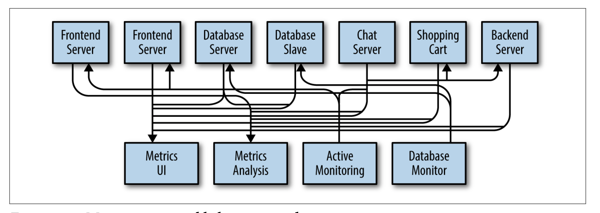
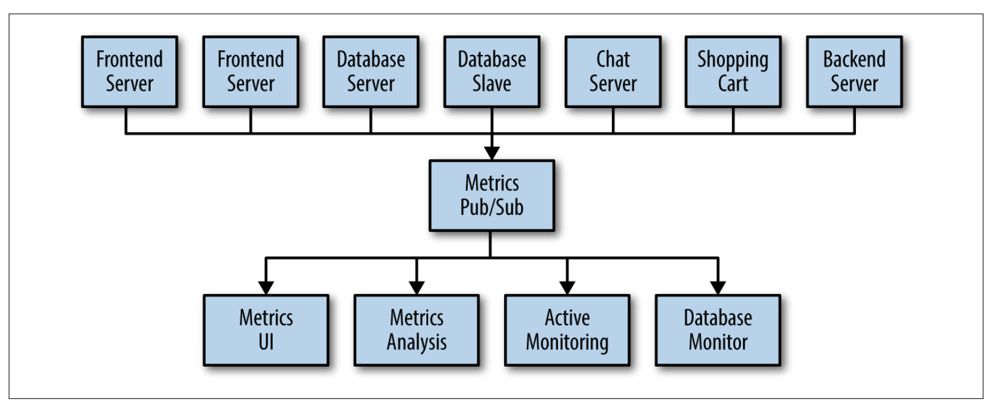
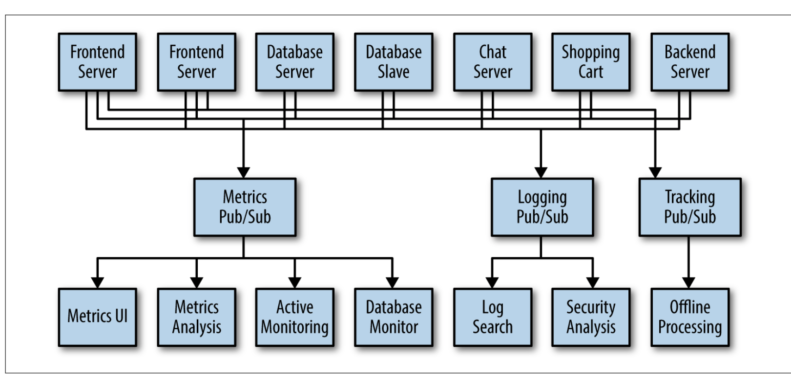
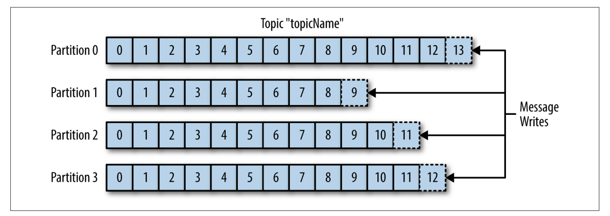
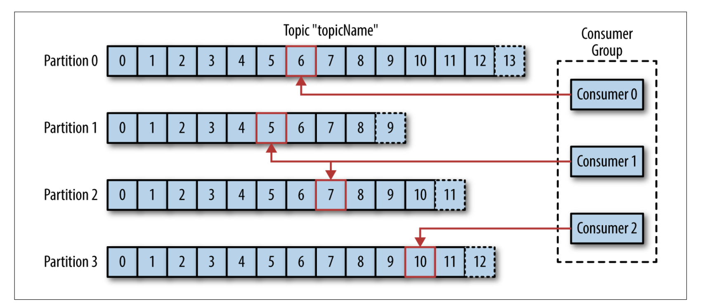
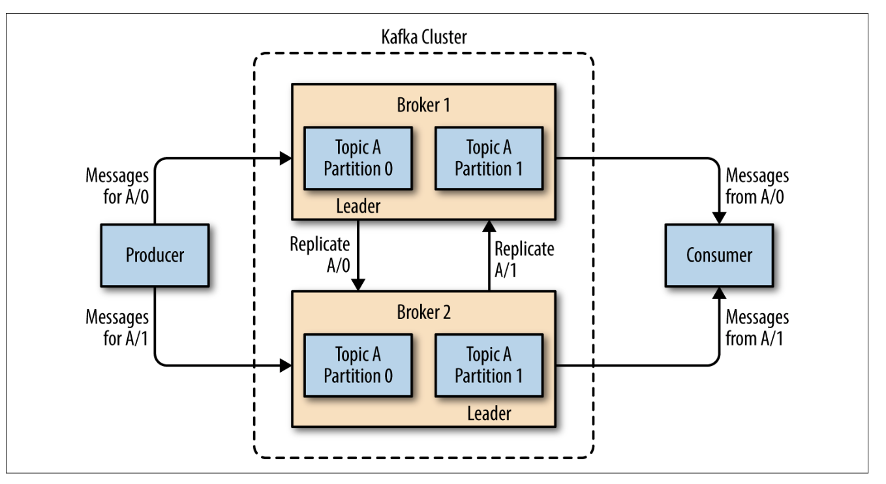

# 카프카의 기본 개념 요약

## 링크드인이 카프카를 만든 계기

- 아파치 카프카(Apache Kafka)는 링크드인의 내부 인프라 시스템에서 시작했다. 
- 링크드인은 많은 데이터베이스가 존재했지만 지속적인 데이터의 _흐름(flow)_을 다룰 수 있는 시스템이 부재했다.  (관계형 데이터베이스, 키-밸류 저장소, 검색 인덱스, 아니면 캐시를 사용하면 해결할 수 있을까?)
- 끊임 없이 늘어나는 데이터가 지속적으로 바뀌고, 데이터의 양이 커지는 것에 집중했다.

- 카프카는 스트리밍 플랫폼 혹은 메시징 시스템이다. 

- 메시징 시스템은 구독자(subscriber)와 발행자(publisher)가 존재한다.

  

  

## 카프카가 기존의 메시징 시스템과 갖는 차이점은 무엇일까?

- 분산 시스템으로 동작할 수 있다. 클러스터를 구성하거나 스케일을 할 수 있다. 
- 카프카는 스토리지 시스템이다. 데이터를 원하는 기간 만큼 보관할 수 있다. 영속성(durability)를 보장한다.
- 영속성을 보장한다는 것과 클러스터를 구성한다는 점에서 하둡과 비슷하지만, 하둡보다 더 즉각적으로 데이터에 반응할 수 있다.

##  메시징 발행/구독 (Publish/Subscribe)

- 카프카를 이해하기 전에 발행/구독의 개념을 알아야 하고 왜 이것이 중요한지 파악해야 한다. 
- 발행/구독 메시징이란 데이터의 조각(메시지)을 보내는 발행자(publisher)가 구독자(subscriber)에 직접적으로 메시지를 전달하지 않는 방식을 말한다.

- 이 그림은 발행자(Frontend server)가 직접적으로 데이터를 구독자(Metrics server)에게 전달하는 방식을 표현했다.
- 하지만, 여기에 메트릭 시스템과는 별도로, 알람 시스템이나 다른 목적의 서버를 구독자로 둔다면 문제는 복잡해진다.

- 이러한 다양한 구독자와 발행자가 존재하는 시스템에서 pub/sub 모델을 적용해볼 수 있다.

- 위 그림에서는 하나의 메시징 시스템을 구축했지만, 목적에 따라 메시징 시스템을 분산할 수 있다.
- 서버 성능 관리, 로깅, 트래킹의 목적에 따라 메시징 시스템을 나누면 아래와 같이 구성할 수 있다.

- 메시지 큐 시스템을 개별적으로 두어서 메시지 서버의 부하를 분산했다.
- 하지만 또 다른 목적의 메시징 시스템이 추가된다면 메시징 시스템간에 중복 또한 늘어난다.

## 카프카로 기존의 메시징 시스템 문제점을 해결하기

- 카프카를 보통 "분산 커밋 로그"라고도 부른다.
- 파일시스템이나 데이터베이스에서 커밋 로그는 모든 트랜잭션에 대한 영속적인 기록을 의미한다. 
- 카프카는 여기에 추가적으로 데이터를 여러 서버에 분산할 수 있다는 장점을 갖는다.

## 토픽과 파티션

- 카프카 메시지는 토픽이라는 곳에서 분류(categorized)된다. 
- 기존 데이터베이스에 빗대어 표현하자면 토픽은 하나의 테이블이다.
- 하지만 토픽은 하나 이상의 파티션으로 나눌 수 있다.
- 카프카에서 파티션은 데이터를 나누는 것 이상의 의미를 갖는다.
- 각각의 파티션은 다른 서버에 존재할 수 있다. 즉, 하나의 토픽이 여러 서버에 걸쳐서 스케일링 될 수 있다는 의미다.

위 그림은 "topicName"이라는 토픽을 표현하였다. 이 토픽은 4개의 파티션을 가지고 있다.

## 프로듀서(Producers)와 컨슈머(Consumers)

- 카프카 시스템을 이용하는 클라이언트는 두 가지 종류가 있다. 프로듀서와 컨슈머다.
- 프로듀서는 새로운 메시지를 생산한다. 발행/구독 시스템에서는 발행자(publisher, writer)라고 부른다.
- 프로듀서는 특정 토픽에만 메시지를 생산할 수 있다.
- 프로듀서는 어떤 파티션에 메시지가 들어갈지를 고민하지 않아도 된다.
- 예외가 있다면, 메시지의 키값을 이용하여 특정 파티션에 메시지를 생산할 수 있다.

- 컨슈머는 메시지를 읽는다. 발행/구독 시스템에서는 구독자(subscriber, reader)라고 부른다.
- 컨슈머는 하나 이상의 토픽을 구독할 수 있다.
- 컨슈머는 메시지를 순서대로 읽어야한다. 이것이 가능하려면, 메시지를 읽을 때마다 메시지의 오프셋을 기록해야 한다.
- 오프셋이란 지속적으로 증가하는 정수형 값이다. 
- 컨슈머가 메시지를 읽는 도중 서버가 멈추거나 재시작해도 메시지를 읽었던 위치를 찾아갈 수 있다.

- 컨슈머는 프로듀서와 다르게 그룹을 구성할 수 있다. 
- 이것이 필요한 이유는 하나의 토픽의 메시지를 여러 컨슈머끼리 중복하지 않고 구독하기 위해서다.

- 위 그림에서 처럼, 컨슈머 그룹에 컨슈머 3개가 존재한다. 
- 각 컨슈머는 "topicName"이라는 토픽을 구독한다. 
- 하지만, 이 컨슈머들은 똑같은 데이터를 읽지 않는 것을 볼 수 있다.
- 이것이 필요한 이유는 읽어야할 메시지가 많아질 때 컨슈머를 수평적으로 확장하기 위해서다.
- 어떤 그룹에서 하나의 컨슈머가 실패한다고 해보자. 이 컨슈머를 대신하여 이 그룹의 나머지 컨슈머가 파티션을 읽을 수 있다.

## 브로커와 클러스터

- 하나의 카프카 서버를 브로커라고 부른다.
- 브로커는 프로듀서로부터 메시지를 받는다. 이외에도 메시지를 디스크에 저장하거나 컨슈머에 요청에 응답할 수 있다.
- 카프카 브로커가 여럿이 모이면 클러스터가 된다. 
- 클러스터 내에서 하나의 브로커는 **컨트롤러(Controller)**가 된다.
- 컨트롤러는 브로커에 파티션을 할당하거나 브로커의 실패 상태를 모니터링한다.
- 파티션이 여러 브로커에 분산될 수 있지만, 반드시 어떤 브로커가 주인이 되어야 한다. 이 브로커를 파티션의 리더(leader)라고 부른다.

- 위 그림은 클러스터 환경에서 파티션의 복제를 설명한다.
- 브로커 1과 브로커 2는 모두 같은 토픽A를 갖는다.
- 토픽 A의 파티션 0과 파티션 1이 나누어져서 두 브로커에 복제되었다. 
- 각 파티션을 맡는 브로커가 리더(leader)임을 알 수 있다.

## 파티션 개수 정하는 방법

- 어떤 토픽 하나가 처리하기 원하는 처리량(throughput)이 몇인가? 예를 들어, 초당 100KB 쓰기를 원하는가? 아니면, 초당 1 GB 쓰기를 원하는가?
- 하나의 파티션으로부터 컨슈밍할 때 최대 처리량은 얼만큼을 원하는가? 만약 데이터베이스가 각 쓰레드당 초당 50MB 이상 쓰기를 다룰 수 없다면, 하나의 파티션으로부터 이벤트를 구독할 때의 최대 처리량은 60MB다.
- 키에 기반하여 파티션에 메시지를 전송하는 경우, 파티션을 추가하는 것은 매우 어렵다. 따라서, 향후 사용량을 예상해서 처리량을 계산해내야 한다.

- 브로커 당 네트워크 대역폭과 사용가능한 디스크 용량을 토대로 각 브로커에 파티션 개수를 고려해야 한다.
- 너무 많은 파티션을 만들면, 리더 브로커 선출에 시간이 많이 걸린다.
- 파티션 개수를 정하는 대략적인 가이드 라인은 다음과 같다.

> 1. 토픽이 처리해야할 타겟 처리량과 컨슈머가 처리할 수 있는 처리량을 계산한다.
>
> 2. 타겟 처리량을 컨슈머 처리량과 나눈다. (토픽 타겟 처리량 / 컨슈머 처리량)
>
>    ex) 어떤 하나의 토픽이 1 GB/sec 의 쓰기 및 읽기를 처리해야 한다면, 각 컨슈머가 처리할 수 있는 량이 50MB/s 라고 하자. 그렇다면 파티션의 개수는 최소 20개다.

---

Reference: Kafka: The Definitive Guide. Neha Narkhede, Gwen Shapira, and Todd Palino. 2017. O’Reilly Media.
