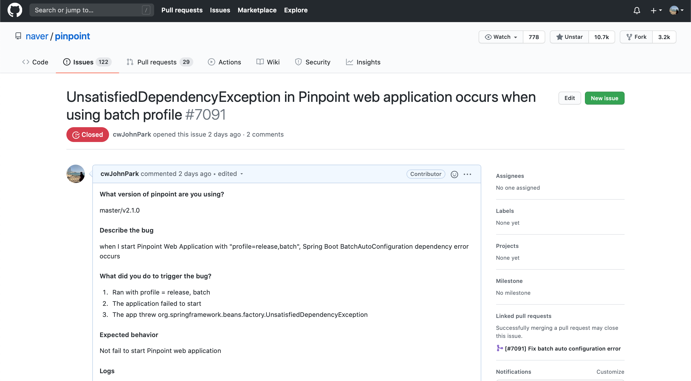
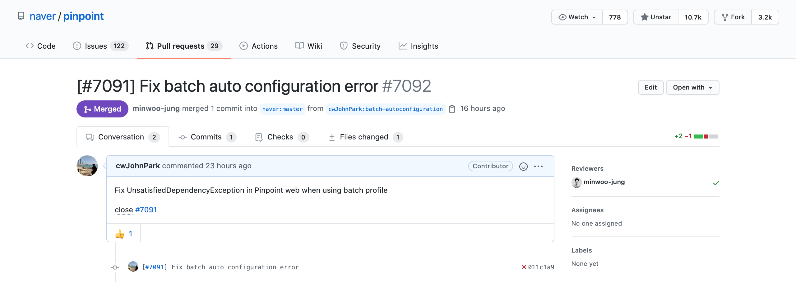

# 나의 첫 오픈소스 커밋

저는 공개 SW가 주관하는 2020 오픈소스 컨트리뷰톤에 참여하였습니다. 오픈소스 컨트리뷰톤은 기여(Contribute)와 마라톤(Marathon)의 합성어로 선배개발자와 함께 6주간 공개SW 프로젝트에 참여, 공유, 오픈, 협업하여 다양한 방식의 기여(Contribute)를 직접 경검하는 프로그램입니다. 8월 1일 발대식을 시작으로 현재 프로젝트 기여를 진행 중입니다. 

제가 기여하게 된 프로젝트는 [Pinpoint](https://github.com/naver/pinpoint) 입니다. Pinpoint는 오픈소스 APM 입니다. 네이버/라인은 물론 현재 미국 중 국 등 상위 IT 기업 다수가 대규모 시스템을 모니터링하기 위해 Pinpoint를 사용하고 있습니다.

Pinpoint Web 컴포넌트의 알람 기능을 개선 중인 와중에 프로젝트 시작이 안되는 문제가 있었습니다. 문제의 내용은 이렇습니다.

```
08-10 15:13:34.034 [           main] ERROR o.s.b.d.LoggingFailureAnalysisReporter   -- 

***************************
APPLICATION FAILED TO START
***************************

Description:

Parameter 1 of method jobLauncherCommandLineRunner in org.springframework.boot.autoconfigure.batch.BatchAutoConfiguration required a bean of type 'org.springframework.batch.core.explore.JobExplorer' that could not be found.


Action:

Consider defining a bean of type 'org.springframework.batch.core.explore.JobExplorer' in your configuration.

08-10 15:13:34.958 ERROR WebApp                              : [WebApp] could not launch app.
org.springframework.beans.factory.UnsatisfiedDependencyException: Error creating bean with name 'jobLauncherCommandLineRunner' defined in class path resource [org/springframework/boot/autoconfigure/batch/BatchAutoConfiguration.class]: Unsatisfied dependency expressed through method 'jobLauncherCommandLineRunner' parameter 1; nested exception is org.springframework.beans.factory.NoSuchBeanDefinitionException: No qualifying bean of type 'org.springframework.batch.core.explore.JobExplorer' available: expected at least 1 bean which qualifies as autowire candidate. Dependency annotations: {}
	at org.springframework.beans.factory.support.ConstructorResolver.createArgumentArray(ConstructorResolver.java:797)
	at org.springframework.beans.factory.support.ConstructorResolver.instantiateUsingFactoryMethod(ConstructorResolver.java:538)
	at org.springframework.beans.factory.support.AbstractAutowireCapableBeanFactory.instantiateUsingFactoryMethod(AbstractAutowireCapableBeanFactory.java:1338)
	at org.springframework.beans.factory.support.AbstractAutowireCapableBeanFactory.createBeanInstance(AbstractAutowireCapableBeanFactory.java:1177)
	at org.springframework.beans.factory.support.AbstractAutowireCapableBeanFactory.doCreateBean(AbstractAutowireCapableBeanFactory.java:557)
	at org.springframework.beans.factory.support.AbstractAutowireCapableBeanFactory.createBean(AbstractAutowireCapableBeanFactory.java:517)
	at org.springframework.beans.factory.support.AbstractBeanFactory.lambda$doGetBean$0(AbstractBeanFactory.java:323)
	at org.springframework.beans.factory.support.DefaultSingletonBeanRegistry.getSingleton(DefaultSingletonBeanRegistry.java:226)
	at org.springframework.beans.factory.support.AbstractBeanFactory.doGetBean(AbstractBeanFactory.java:321)
	at org.springframework.beans.factory.support.AbstractBeanFactory.getBean(AbstractBeanFactory.java:202)
	at org.springframework.beans.factory.support.DefaultListableBeanFactory.preInstantiateSingletons(DefaultListableBeanFactory.java:893)
	at org.springframework.context.support.AbstractApplicationContext.finishBeanFactoryInitialization(AbstractApplicationContext.java:879)
	at org.springframework.context.support.AbstractApplicationContext.refresh(AbstractApplicationContext.java:551)
	at org.springframework.boot.web.servlet.context.ServletWebServerApplicationContext.refresh(ServletWebServerApplicationContext.java:141)
	at org.springframework.boot.SpringApplication.refresh(SpringApplication.java:747)
	at org.springframework.boot.SpringApplication.refreshContext(SpringApplication.java:397)
	at org.springframework.boot.SpringApplication.run(SpringApplication.java:315)
	at com.navercorp.pinpoint.web.WebStarter.start(WebStarter.java:32)
	at com.navercorp.pinpoint.web.WebApp.main(WebApp.java:20)
Caused by: org.springframework.beans.factory.NoSuchBeanDefinitionException: No qualifying bean of type 'org.springframework.batch.core.explore.JobExplorer' available: expected at least 1 bean which qualifies as autowire candidate. Dependency annotations: {}
	at org.springframework.beans.factory.support.DefaultListableBeanFactory.raiseNoMatchingBeanFound(DefaultListableBeanFactory.java:1714)
	at org.springframework.beans.factory.support.DefaultListableBeanFactory.doResolveDependency(DefaultListableBeanFactory.java:1270)
	at org.springframework.beans.factory.support.DefaultListableBeanFactory.resolveDependency(DefaultListableBeanFactory.java:1224)
	at org.springframework.beans.factory.support.ConstructorResolver.resolveAutowiredArgument(ConstructorResolver.java:884)
	at org.springframework.beans.factory.support.ConstructorResolver.createArgumentArray(ConstructorResolver.java:788)
	... 18 more

Process finished with exit code 0
```

Pinpoint web은 Spring Boot를 사용하고 있습니다. Spring Boot의 자동 설정으로 인한 의존성 주입 오류가 발생한 것입니다. Spring Boot는 사용자의 편의성을 위해 관련된 Bean을 자동으로 주입합니다. 기존에 문제가 발생되지 않았던 이유는 Spring Boot가 의존성 모듈을 사용할 때만 애플리케이션 로딩 시점에 주입하기 때문입니다. 하지만 왜 주입하지 못했을까요? 자동 설정임에도 불구하고 수동으로 설정을 해야 하는걸까요?

`JobLauncherCommandLineRunner` 클래스가 생성될 때 필요한 Bean은 `JobLauncher`, `JobExplorer`, `JobRepository` 이렇게 3가지 입니다. 로그의 내용을 상세히 보면, JobLauncher는 주입을 받았지만, JobExplorer가 없어서 애플리케이션 구동이 실패하였습니다. Pinpoint web 프로젝트 내의 applicationContext-batch.xml 파일에서 JobLauncher의 Bean은 이미 생성이 되어 있습니다.   Spring Boot는 이것을 인식하고 Bean을 주입할 수 있었지만, JobExplorer의 경우 생성된 Bean이 없기 때문에 오류가 발생한 것입니다. 

이 문제의 해결은 매우 간단합니다. Spring Boot main 메서드를 구동하는 클래스에 단 한 단어를 추가하면 됩니다. 이 코드는 AutoConfiguration 구동을 제어할 수 있습니다. `exclude` 에 `BatchAutoConfiguration.class` 를 추가합니다.

```java
@EnableAutoConfiguration(exclude = {SecurityAutoConfiguration.class, TransactionAutoConfiguration.class, BatchAutoConfiguration.class})
```


2020년 8월 10일, 멘토님들과 몇몇 멘티님들이 모인 자리에서, 멘토님이 이 문제에 대해서 듣고 issue 등록 후 pull request 제안을 하셨습니다. 

저는 issue 를 등록하기 위해 정해진 템플릿에 맞춰 작성해나갔습니다. 템플릿 항목은 아래와 같습니다.

```
What version of pinpoint are you using? (pinpoint의 어느 버전을 사용 중인가?)

Describe the bug (버그를 설명하라.)

What did you do to trigger the bug? (버그를 발생하기 위해 무엇을 하였나?)

Expected behavior (예상했던 동작은 무엇인가?)

Logs (로그)

Additional context (추가 사항)
```

처음 올리는 이슈등록이라 그런지 오타가 있어 나중에 수정을 했지만, 어렵지 않게 이슈 등록을 할 수 있었습니다. 첫 이슈 등록을 통해 배운 점은 오픈소스 기여를 할 때 어떤 프로세스를 지켜야하는지에 대해 알게되었습니다. 다른 사람에게 프로젝트의 문제점을 설명하기 위해, 미리 짜여진 질문에 맞춰 답변을 하는 것이 중요하다는 것입니다. 보는 이가 문제를 정확하게 이해할 수 있고 쓰는 이 또한 이것을 요점에서 벗어나지 않고 설명할 수 있습니다. 




이슈 등록이 끝났으면 이제 Pull Request(PR)를 할 차례입니다. PR의 과정은 fork저장소를 가져오는 것부터 시작해야 합니다. fork 저장소에서 이 이슈를 위한 브랜치를 별도로 생성하고 수정할 내용을 커밋 후 push합니다. fork 저장소에 성공적으로 push가 되었다면, GitHub에서 PR을 할 수 있습니다.




PR 등록 후 오후에 승인을 받았습니다!


대규모 오픈소스에 작은 한줌이라도 기여할 수 있게 되어 좋았습니다. 첫 기여를 시작으로 더 많은 PR을 통해 오픈소스 커뮤니티 활동을 이어나가려고 합니다. 감사합니다.