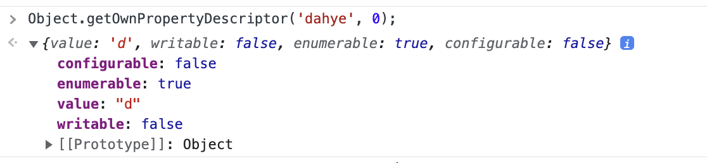
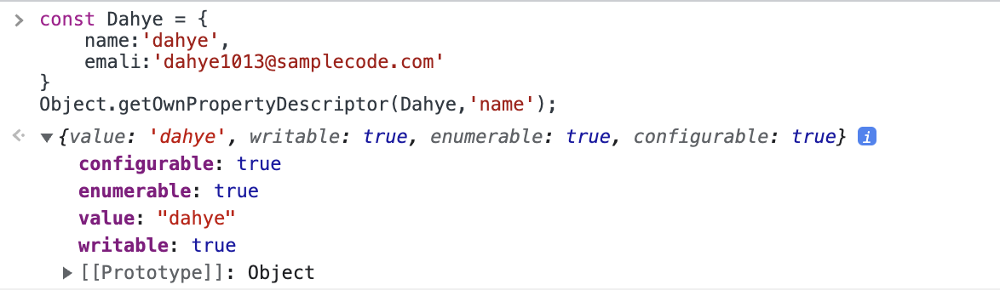

# JS\_원시타입과 객체 타입(Primitive, Object)

JavaScript 언어의 타입은 두 가지로 나뉩니다.

1. 원시타입 (Primitive)
2. 객체 (Object)

자바스크립트는 총 8개의 자료형으로 7개의 원시타입과 객체로 구성되어있습니다.

자바스크립트는 느슨한 타입의 동적 언어(Dynamic, weak type)입니다.

처음 선언(Declare) 시점에 특정 타입과 연결되지 않습니다. 변수에 타입 지정없이 할당이 가능하며, 할당하는 과정에서 타입이 결정됩니다.

타입 제한이 없기 때문에 어떤 특정 타입과 연결되지 않으며, 모든 타입의 값으로 할당과 재 할당이 가능합니다. 즉, 처음에 원시타입으로 선언과 할당을 통해 초기화 해도 이후에 객체 타입으로 재할당이 가능합니다. 같은 방식으로 객체 타입 할당 후 원시타입 재 할당이 가능합니다. 이를 동적 타이핑(Dyanmic Typeing)이라고 합니다.

# 원시타입(Primitive)

## 원시타입이란 무엇인가?

---

- 원시타입은 언어의 로우레벨에서 직접 표현되는 불변 데이터(Immutable Value)입니다.
- 원시 타입을 값으로 전달 됩니다 (pass-by-value)
- 변수 선언이 아닌 할당 시점에 메모리 스택 영역에 고정된 메모리를 점유하고 저장합니다.

## JavaSciprt에서의 원시타입

---

- 자바스크립트에는 7개의 원시타입(Primitive Type)이 존재합니다.

> Boolean, Null, Undefined, Number, BigInt, String, Symbol

- 원시 타입은 불변 데이터(Immutable Data)이므로 한번 생성되면 Read Only 속성을 가지며, 변경 될 수 없습니다.
  

  - writable에 대한 속성이 false 입니다
    → 데이터를 변경 할 수 없습니다.
    (속성들에 대한 더 자세한 정보는 [이곳에서](https://developer.mozilla.org/en-US/docs/Web/JavaScript/Reference/Global_Objects/Object/getOwnPropertyDescriptor) 확인하실 수 있습니다.)
      <aside>
      💡  자바스크립트의 원시 타입은 값으로 호출 됩니다(call-by-value)
      
      </aside>
      
      — 값으로 호출되는 경우에는 메모리 값을 직접 접근하여 수정할 수 없습니다.

  **(예시1) 변경**

  ```jsx
  let dahye = "Dahye";
  dahye[0] = "S";
  console.log(dahye); // Dahye
  ```

  dahye 변수에 할당된 문자열은 원시값이고, Immutable합니다.
  특정 문자를 변경하고자 해도 반영되지 않습니다.
  **(예시2) 재할당**

  ```jsx
  let dahye = "Dahye";
  dahye = "Dahye Shin";
  console.log(dahye); //Dahye Shin
  ```

  문자열 변경이 아닌 새로운 값을 할당하는 것은 가능합니다.
  원시값이 변경이 불가능하다는 것은 메모리 영역에 있는 값 수정이 불가능 하다는 의미입니다.
  재할당을 통해서 메모리 영역에 있는 데이터를 변경하는 것이 아니라 주소를 변경하는 것은 가능합니다.
  (위의 예시는 “Dahye” 메모리 주소를 가르치던 것이 “Dahye Shin” 메모리 주소를 가르키도록 변경된 것 입니다.)
  (재할당 이후, 도달 가능성(reachable)이 사라진 데이터들은 [가비지 컬렉터](https://ko.javascript.info/garbage-collection)에 수집하여 메모리에서 삭제합니다.)

---

# 객체타입(object/reference type)

## 객체타입이란?

---

- 일반적으로 컴퓨터 과학에서 객체는 식별자로 참조할 수 있는 메모리 상의 값입니다.
- 객체는 데이터와 그 데이터 관련한 동작을 모두 포함하는 개념적 존재입니다.
- 다양한 데이터를 담을 수 있습니다.
  → 키로 구분된 데이터 집합이나 개체(entity)를 저장할 수 있습니다.
- 프로퍼티(property)와 동작을 의미하는 메소드(method)를 가집니다.

## 자바스크립트에서의 객체

---

- 자바스크립트는 객체 기반의 스크립트 언어입니다.
  - 원시데이터 (primitive) 자료형 외에는 배열, 함수, 정규 표현식 등이 모두 객체 타입입니다.
- 자바스크립트 객체는 키와 값을 매핑한 것입니다.
  - 객체는 키와 값 사이의 매핑으로 해시 테이블과 유사합니다.
- 객체 타입은 변경 가능한 값(mutable value) 입니다.
  

  - writable에 대한 속성이 true 입니다.
    → 객체내에서 해당 속성 데이터를 변경 할 수 있습니다.
    (객체에 속성에 대한 특성은 [이곳](https://developer.mozilla.org/ko/docs/Web/JavaScript/Data_structures#%EB%8D%B0%EC%9D%B4%ED%84%B0_%EC%86%8D%EC%84%B1)에서 확인하실 수 있습니다.)
      <aside>
      💡  자바스크립트의 객체는 참조(pass-by-reference) 전달하고, 전달 받습니다.
      
      </aside>

  단, 객체는 참조되어 있기 때문에 상태가 변경될 수 있다는 문제점을 가지고 있습니다.

  > 주의 : 참조를 가지고 있는 곳에서 객체 상태를 변경한다면, 의도한 동작 외 Side Effect 를 줄 수 있습니다.
  > 이를 방지하기 위해서 [Object.freeze()](https://developer.mozilla.org/ko/docs/Web/JavaScript/Reference/Global_Objects/Object/freeze)를 사용하여 불변(immutable) 객체로 만들어 사용하거나, 객체를 복사하여 사용하는 방법을 사용 할 수 있습니다.
  > 이러한 Side Effect를 방지하기 위해 객체가 생성 된 이후 상태를 변경 할 수 없는 디자인 패턴이 환영 받고 있습니다. 함수형 프로그래밍은 상태에 영향을 주지 않도록 Immutability하게 프로그래밍하는 것에 있습니다. 이러한 장점으로 자바스크립트 진영에서는 최근 함수형 프로그래밍이 크게 환영받고 있습니다.

## 참고자료

---

- JavaScript 타입과 자료구조

  [JavaScript의 타입과 자료구조 - JavaScript | MDN](https://developer.mozilla.org/ko/docs/Web/JavaScript/Data_structures)

  [Data type & Variable | PoiemaWeb](https://poiemaweb.com/js-data-type-variable)

  [https://ko.javascript.info/types](https://ko.javascript.info/types)

- JavaScript 내부 속성 확인하는 방법

  [Object.getOwnPropertyDescriptor() - JavaScript | MDN](https://developer.mozilla.org/en-US/docs/Web/JavaScript/Reference/Global_Objects/Object/getOwnPropertyDescriptor)

- 원시값

  [원시값의 메서드](https://ko.javascript.info/primitives-methods)

- immutable and mutable

  [Immutability | PoiemaWeb](https://poiemaweb.com/js-immutability)

- Wrapper Function은 무엇인가

  [Wrapper function - Wikipedia](https://en.wikipedia.org/wiki/Wrapper_function)

- JavaScript에서 Wrapper 객체
  [JavaScript: Wrapper objects - Programming with Mosh](https://programmingwithmosh.com/javascript/javascript-wrapper-objects/)
