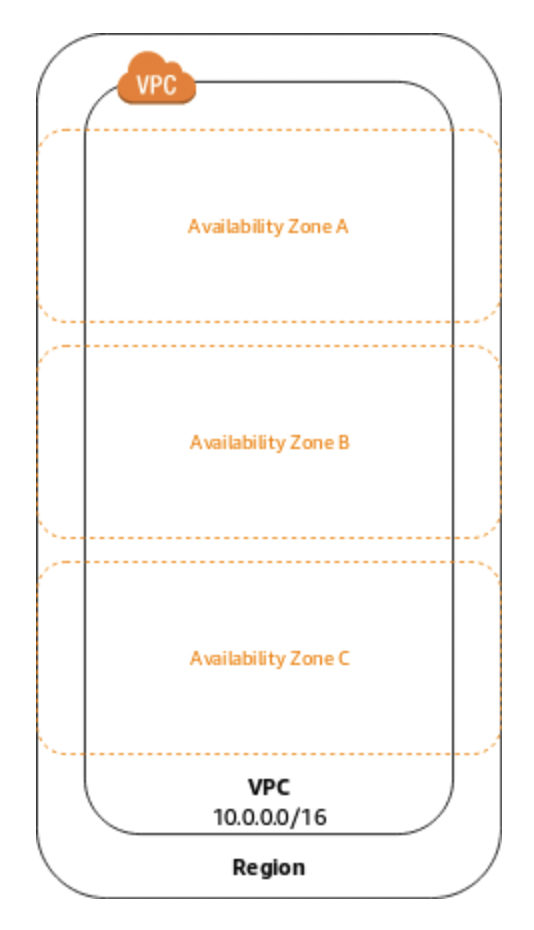

# AWS VPC 빠르게 개념잡기

AWS VPC(Virtual Private Cloud)는 사용자가 정의한 가상 네트워크로 AWS 클라우드에서 다른 가상 네트워크와 논리적으로 분리되어 있습니다. Amazon EC2 인스턴스와 같은 AWS의 리소스를 실행할 수 있는 독립된 가상의 네트워크라 할 수 있습니다.

VPC 내에는 IP 대역, 인터페이스, 서브넷, 라우팅 테이블, 인터넷 게이트웨이, 보안그룹, 네트워크 ACL 등을 생성하고 제어할 수 있습니다. 이러한 설정들로 VPC 자원을 쉽게 설정하고 관리할 수 있습니다. 해당 개념들을 가볍게 살펴보며 AWS VPC를 이해해 봅시다. 그러려면 먼저 VPN(Virtual Private Network)을 알아보는 것이 좋겠습니다.

## VPN(Virtual Private Network)

VPN은 가상 사설망을 의미합니다. '가상 사설망'을 풀어서 설명하면 '논리적으로 나누어진 사설 네트워크망'이라고 할 수 있습니다. '사설 네트워크'란 인터넷 같은 공개 네트워크에서 접근할 수 있는 공개 IP가 아닌, 내부 네트워크에서만 접근 가능한 사설 IP로 이뤄진 네트워크를 말합니다.

이와 같이 VPN은 공개 네트워크 망을 논리적인 경계에 따라 나누고, 나눠진 네트워크에 속해있는 IP끼리만 서로 통신할 수 있는 개념입니다. 사설망은 IPv4 주소를 아낄 수 있을 뿐아니라 별도 네트워크를 구성함으로써 외부 접근으로부터 내부 리소스를 보호할 수 있습니다. 만약 가상 사설망을 사용하지 않는다면 물리적으로 사설망끼리 연결될 수 있는 전용회선을 구축해야 하고, 거리가 멀수록 천문학적인 비용이 들게 됩니다. 이러한 비용적, 물리적 문제를 해결하는 것이 바로 VPN입니다.

내부 네트워크에 속한 사설 IP끼리만 통신할 수 있다는 점에서 VPN은 둘 이상의 네트워크가 안전하게 연결되어 암호화된 데이터를 주고받을 수 있도록 구성되어 있습니다. 이러한 VPN을 클라우드 상에서 구현한 것이 Virtual Private Cloud(VPC)입니다. VPC는 AWS에서만 구축할 수 있는 것이 아니고 Microsoft Azure, Google Cloud Platform 등 클라우드 플랫폼에서 모두 가능합니다.

## AWS VPC

그림과 같이 리전(Region) 내에 VPC가 존재하고, 그 안에 가용영역(Availability Zone)이 존재합니다. Region은 AWS의 데이터센터가 클러스터링 된 물리적 위치이고, 가용영역은 리전에 구축된 데이터 센터를 그룹지어 나눈 것으로서 물리적으로 수 킬로미터 이상 분리되어 있습니다. 만약 하나의 애플리케이션을 여러 AZ에 나누어 배포해두면 지진, 토네이도와 같은 재난으로 가용영역 하나가 불능상태가 되어도 다른 가용영역에 배포된 애플리케이션은 안전하게 보호되어 격리 수준을 높일 수 있습니다. 이를 다중 AZ(Multi-AZ) 배포라고 합니다. 가용영역은 또한 여러 개의 서브넷으로 나누어 관리할 수 있습니다.

### 서브넷(Subnet)

서브넷이란, 간단히 말하면 커다란 네트워크 망을 분할한 것이라고 이해하면 됩니다. VPC 내에서도 서브넷으로 네트워크망을 분리하여 각 서브넷에 AWS 리소스를 실행시킬 수 있습니다. 서브넷을 이용하면 서브넷 단위로 네트워크 설정이 가능하게 됩니다. 필요에 따라 서브넷 단위, 또는 VPC 단위로 네트워크를 제어할 수 있습니다.

VPC가 생성될 때 사용할 수 있는 IP 대역이 할당되는데 서브넷은 VPC 네트워크를 분할한 것이므로 VPC IP 대역에 속해 있게 됩니다.

**퍼블릭 서브넷과 프라이빗 서브넷**

서브넷은 퍼블릭 서브넷과 프라이빗 서브넷으로 나눌 수 있습니다.

퍼블릭 서브넷 - 인터넷과 직접 통신할 수 있는 공개 네트워크

프라이빗 서브넷 - 인터넷과 직접 통신하지 않는 사설 네트워크

퍼블릭 서브넷은 퍼블릭 IP로 인터넷 게이트웨이를 통해 인터넷 세계의 사용자와 통신이 가능하지만, 프라이빗 서브넷은 프라이빗 IP만 가지고 있어 외부 사용자와 통신이 불가능합니다.

### 인터넷 게이트웨이(Internet Gateway)

VPC는 사설 네트워크로서 외부 인터넷에서 접근이 불가합니다. 그러나 인터넷 게이트웨이를 연결해 VPC의 특정 IP와 연결하여 인터넷 구간과 통신할 수 있습니다. 이 특정 IP는 퍼블릭 서브넷 내의 퍼블릭 IP입니다.

인터넷 게이트웨이는 양방향 통신을 지원하므로 퍼블릭 IP에서 인터넷 구간으로, 인터넷 구간에서 퍼블릭 IP로 송수신이 가능합니다.

원칙적으로 프라이빗 IP는 외부와 통신이 불가능하지만 단방향으로 외부와 통신이 가능하도록 해주는 기술이 있습니다. 바로 NAT Gateway입니다.

### NAT 게이트웨이(Network Address Translation Gateway)

인터넷 게이트웨이처럼 외부 인터넷 구간과 연결하는 관문 역할을 합니다. 차이점은 NAT이라는 명칭에서 알 수 있듯 Network Address Translation, 즉 IP주소를 변환하여 처리해준다는 것인데요. 외부와 통신이 불가능한 프라이빗 IP를 퍼블릭 IP를 변환시켜줄 때 사용됩니다.

그러나 NAT 게이트웨이로 프라이빗 IP 인터넷과의 통신은 단방향으로만 이뤄집니다. 프라이빗 IP -> 인터넷 방향의 통신은 가능하지만, 인터넷 -> 프라이빗 IP 방향의 통신은 불가능합니다.

### 보안그룹(Security Group)과 네트워크 ACL(Access Control List)

AWS VPC에서는 인스턴스별 서브넷별로 인바운드 및 아웃바운드 데이터에 대한 허용/거부 정책을 설정할 수 있습니다. 인스턴스 수준에서 정책을 설정하는 것이 보안그룹이고, 서브넷 수준에서 설정하는 것이 네트워크 ACL입니다. 인바운드 및 아웃바운드 정책은 프로토콜 유형, 포트 번호, IP address 등으로 식별하여 제어할 수 있습니다.

---

### References

- [VPC 기초](https://gasidaseo.notion.site/ongja/VPC-922a05b8a79b4654b432d5fd905fcda5)
- [Amazon VPC 개념](https://docs.aws.amazon.com/ko_kr/vpc/latest/userguide/what-is-amazon-vpc.html)
- [리전 및 가용 영역](https://aws.amazon.com/ko/about-aws/global-infrastructure/regions_az/)
- [Private and Public IP Addresses](https://wiki.teltonika-networks.com/wikibase/index.php?title=Private_and_Public_IP_Addresses&mobileaction=toggle_view_mobile)
- [VPN 쉽게 이해하기](https://aws-hyoh.tistory.com/entry/VPN-%EC%89%BD%EA%B2%8C-%EC%9D%B4%ED%95%B4%ED%95%98%EA%B8%B0)
