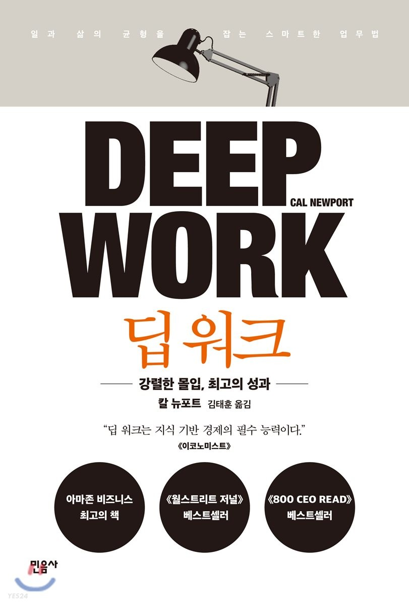

# [책리뷰] 딥워크(Deep Work) - 강력한 몰입, 최고의 성과

현대 사회는 기술, 문화, 경제 모든 것이 아주 빠르게 변하고 있다. 이러한 변화에 뒤처지지 않기 위해서는 많은 시간을 학습과 경험에 투자해야 한다. 그렇다면 어떻게 효율적으로 시간을 투자해야 하는가? 이 책은 이러한 나의 질문 속에서 기대를 갖고 읽은 책이다.

로봇공학, AI 등의 발전으로 기계가 인간을 대체하는 현상이 심화되고 있는 시대이다. 일자리를 지켜내고 가치있는 인재가 되려면 기계로 쉽게 대체될 수 없는 지식 기반의 고숙련 노동자가 되어야 한다. 저서에서는 대체 불가능한 전문가가 되려면 시대의 흐름을 읽고 빠르게 지식을 학습하고 가치를 생산할 줄 아는 사람이 되어야 한다고 말한다. 빠르게 지식을 학습하고 의미있는 가치를 생산하기 위해서는 고도의 지적 노동이 필요하다. 따라서 이러한 고도의 지적 노동을 얼만큼 잘 할 수 있느냐가 관건이 되는데, 이를 좌우하는 것이 일에 깊게 몰두하는 능력이다. 저자는 이를 '딥워크(Deep Work)'라 명명하고 아래와 같이 설명한다.

딥 워크(Deep Work): 인지능력을 한계까지 밀어붙이는 완전한 집중의 상태에서 수행하는 직업적 활동. 딥 워크는 새로운 가치를 창출하고, 능력을 향상시키며, 따라하기 어렵다.

가장 인상 깊었던 내용은 이러한 딥 워크 능력이 생각보다 쉽게 얻어지는 것이 아니라는 내용이었다. 사람들은 쉽게 일에 몰두 할 수 있다고 생각하는 경향이 있는데, 지속적인 수련이 뒷받침 되지 않는다면 집중해서 결과물을 내고 싶다고 해도 희망사항에 그칠 수 있다는 것이다. 무언가를 집중해서 빠르게 끝내고 싶은데 집중이 잘 안되는 경험을 종종 겪곤 했는데, 나 또한 내 몰입 능력을 과대평가하고 있지 않았나 하는 생각이 들었다.

몰입하는 능력을 기르기 위해서는 몰입할 수 있는 환경을 만들고, 방해받지 않고 길게 몰두 할 수 있는 시간을 가져야 한다. 책의 초반은 딥워크가 무엇이며 왜 중요한지를 다루고 있고, 중반부터는 어떻게 해야 딥워크 능력을 향상시킬 수 있을 지에 대해 다루고 있는데 실제로 실천할 수 있는 실질적인 내용들이라 마음에 들었다. 간단히 정리하자면 아래와 같다.

### 네트워크 도구를 멀리하라

이메일, 트위터, 페이스북 등의 네트워크 도구를 멀리 해야 한다. 수시로 이메일함을 체크하고, 틈만 나면 소셜 미디어에 접속해 일과 관련없는 내용들을 살펴보는 것은 주의 잔류물(attention residue)을 발생시켜 하나의 일에 몰두하기 어렵게 한다. 작업 A를 하고 있는 도중 이메일함을 확인하면 그 자체로 주의가 분산될 뿐 아니라 이메일 내용에 따라 아예 집중력을 빼앗겨 버릴 수 있다. 고도의 집중과 몰입이 필요한 심층적 작업에 이러한 주의 분산은 성과를 저하시키는 원인이 된다. 특히 저자는 트위터, 페이스북 같은 소셜 미디어를 사용하지 않기를 강력하게 권한다. 여러 사람들의 이야기를 들을 수 있고, 지인들의 중대사를 알 수 있다는 점이 장점 같아 보이겠지만, 주의를 분산시키고 시간을 허비하게 만든다는 점에서 결코 장점이 아니라고 말한다. 특히 인상적이었던 구절은 닐 스티븐슨이라는 작가가 소셜 미디어를 사용하지 않는 이유에 대해 적은 글 중 일부였다.

> "길고, 연속적이며, 방해받지 않는 시간을 많이 갖도록 일상을 조직하면 소설을 쓸 수 있다. 그렇지 않고 방해를 많이 받으면 무엇이 바뀔까? 길이 남을 소설 대신 다른 사람들에게 보낸 이메일 뭉치만 굴러다닐 것이다."

또한 길고, 연속적이며 방해받지 않고 몰입하는 시간을 갖는 것이 중요한 이유를 논문을 인용하여 신경과학적 측면에서 설명하는 내용도 있다. 특정한 기술에 집중하면 연관된 신경 회로가 독립적으로 거듭 발화하게 되고, 이처럼 신경 회로를 반복적으로 활용하면 희소돌기신경교라는 세포가 해당 신경 회로의 뉴런 주위로 수초층을 형성하기 시작한다. 그에 따라 신경회로와 연계된 기술이 확고해진다. 만약 복잡한 기술을 학습하면서 페이스북을 틈틈이 확인하며 학습한다면 해당 기술과 연관된 신경회로가 집중 발화되는 것이 아니라 관련없는 신경회로들 까지 발화되면서 강화하고자 하는 뉴런만 분리해서 강화시킬 수 없게 된다. 신경과학적 내용을 온전히 이해할 수는 없었지만 실제로 업무를 하면서 계속 슬랙에 실시간으로 답변하는 경우 업무 속도가 더디고 집중하기 어렵다고 느낀 적이 있어 경험적으로 공감이 가는 내용이었다.

### 방해받지 않는 환경을 만들어라

딥 워크를 위해서는 무엇보다 방해받지 않는 환경을 구축해야 한다. 방해받지 않고 집중할 수 있는 장소를 마련하고, 명상 등으로 머리를 차분하게 하며, 다른 사람이 자신에게 쉽게 연락해서 몰입을 깨뜨리지 않게 하는 것도 중요하다. 여러가지 방식이 있을 수 있는데, 각자의 상황에 맞추어 적용하면 된다.

- 수도승 방식: 혼자 집중할 수 있는 공간에서 인터넷을 전혀 사용하지 않고 이메일도 제공하지 않으면서 고립되어 결과물을 만들어 낸다. 논문을 쓰거나 소규모로 일하는 등 개인화된 결과물을 내놓아야 할 경우 적합할 수 있다.
- 이원적 방식: 특정 시간은 딥워크에 할애하고 나머지 시간은 그 외 다른일을 처리하는 방식이다. 예를 들어 주 3일은 딥워크를 하면서 수도승 방식을 적용하고, 나머지는 개방적으로 일을 처리하는 식이다. 여기서의 딥워크 단위는 최소 하루이다.
- 운율적 방식: 가장 현실적인 방식이라 할 수 있는데, 일과 중 특정 시간을 딥워크 시간대로 정해두고 해당 시간동안 몰입하는 방식이다. 예를 들어, 매일 오전 5시 30분에 일어나 2시간 동안 집중하는 시간을 가지고 이후 출근하는 등 나머지 일과를 처리하는 방식이다.
- 기자 방식: 일과 중에 틈날 때마다 딥워크를 수행하는 방식이다. 그러나 이 방법은 피상적 작업에서 심층적 작업으로 전환하는 능력이 많이 길러진 후에야 효과가 있다.

위 방식중 운율적 방식이 가장 현실적이라고 생각이 들고, 실제로 새벽에 일어나 일과를 시작하는 편인 나와 맞아떨어지는 방식이었다. 게다가 새벽 시간은 방해받지 않을 가능성이 높아서 가장 효과적이라고 생각한다. 저녁 시간은 약속이 있거나, 야근을 하게 되는 등 변수가 많아 매일 딥워크할 시간을 마련하는 것이 어렵다고 느꼈다. 그러나 이 부분은 사람마다 각자 라이프스타일에 따라 유연하게 적용할 수 있는 부분이며 핵심은 매일 일과 중 특정 시간대를 딥워크 시간으로 할애하고 꾸준히 지켜나가는 것이다. 정해놓은 시간대에는 모든 연락과 단절하고 고립되어 집중 능력을 한계로 밀어부쳐 무언가를 한다면, 가치있는 성과를 꾸준히 낼 수 있을 것이라 생각한다.

배울 것이 너무 많고, 빠르게 변화하는 세상에서 빠르게 학습하고 성과를 내는 능력은 훨씬 더 중요해지고 있다. 훌륭한 성과를 내면서 일상에 여유도 갖고 싶었던 나에게 정말 도움이 되는 책이었다. 직업적, 학업적 성취를 이루면서 가족, 친구들과 좋은 시간을 보내고, 취미 활동도 하려면 어떻게 해야할까하는 고민에서 읽은 책이었는데 딥워크를 통해 충분히 달성할 수 있다는 것을 알 수 있게 해주었다. 또한 현재 일찍 일어나 하루를 시작하는 습관을 더 단단히 가져가야지 하는 다짐도 하게 되었다. 특히 몰입하는 능력이 쉽게 얻어지는 것이 아니며 수련해야 하는 능력이라는 점이 지금까지 안일하게 과대평가 해왔던 나의 집중력에 대해 다시한번 객관적으로 생각해볼 수 있게끔 만들었다. 방해받지 않는 환경을 집착적으로 구축하고, 분 단위로 하루를 계획하고, 소셜 미디어를 멀리하며, 마치 업무와 나만 존재하는 것처럼 몰입하는 것. 아직은 서툴지만 지속적으로 도전하고, 수련하여 강화하고 싶은 능력이다.

정리한 내용은 일부에 불과하고, 몰입을 위한 여러 방법들을 제시해주고 있다. 나의 소중한 하루 속에서 최소시간 최대효율을 얻고자 한다면 읽을 가치가 충분한 책이다.
