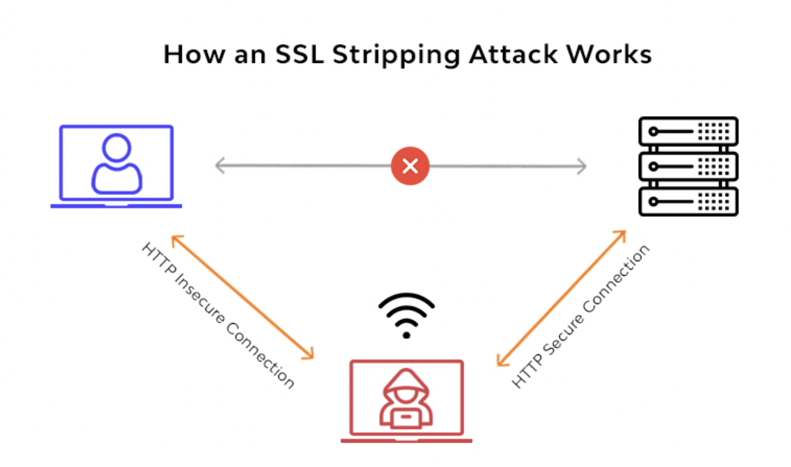
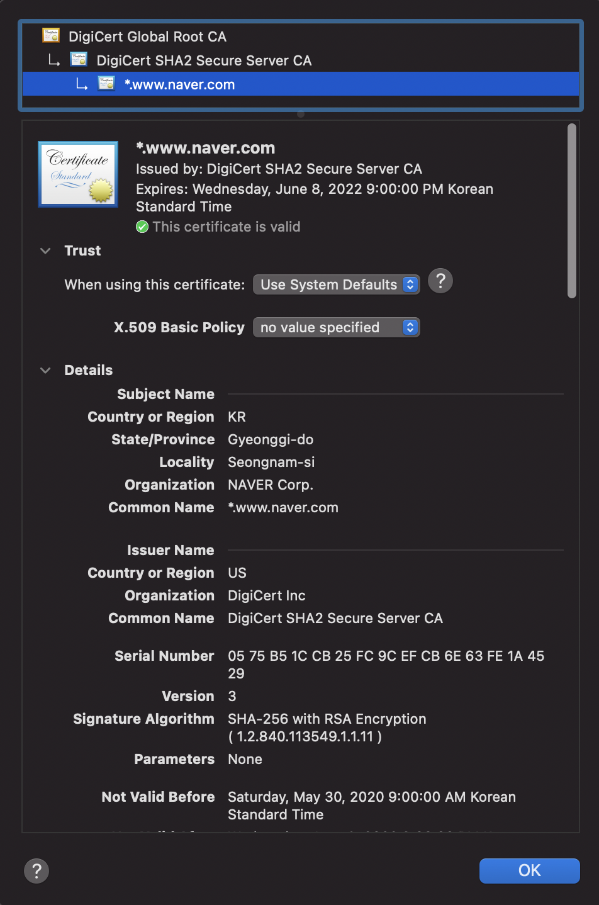

# HTTPS를 지탱하는 SSL 통신의 구조와 원리 개요

  

2018년, 구글의 Chrome 68부터 HTTP 사이트에 대해 ‘안전하지 않음(Not Secure)’을 표시해주기 시작했습니다. 여기에는 HTTP 통신이 안전하지 않다는 경각심을 심어주는 것과, HTTPS 통신을 강제하려는 의도가 숨어있습니다. 이렇게 강제할 정도로 HTTPS 사용을 권고하는 이유는 당연하게도 보안때문입니다. HTTP를 통한 통신은 데이터가 암호화 되어있지 않아 정보탈취, 정보 조작 등의 위험을 마주하게 됩니다. 이에 보안 강화를 위한 인증과정이 추가된 것이 HTTPS입니다.

  

 
HTTP 통신은 암호화되지 않은 평문으로 이루어 집니다. 평문은 말 그대로 텍스트 그 자체로서 누구나 데이터를 가로채서 그 내용을 읽을 수 있다는 것을 의미합니다. 이러한 문제를 해결하기 위해 데이터를 암호화하여 기밀성을 유지하고 안전하게 데이터를 통신할 수 있도록 하는 기술이 필요한데, 여기서 사용되는 것이 SSL(Secure Socket Layer) 입니다. HTTPS는 HTTP에 SSL을 구현한 개념입니다.

SSL를 이해하려면 먼저 대칭키, 비대칭키 암호화 통신 방식을 이해해야 합니다.

**대칭키**

대칭키 암호화 방식이란 동일한 키로 암호화, 복호화가 가능한 방식을 말합니다. 클라이언트에서 서버로 데이터를 보낼 때 A라는 키로 암호화 해서 보내고, 서버에서도 이 암호화된 데이터를 A로 복호화 할 수 있을 때, 대칭키 방식을 사용한다고 할 수 있습니다. 그러나 대칭키만을 이용한 암호화 통신은 아래와 같은 가장 큰 문제가 있습니다.

- 클라이언트 ↔ 서버가 동일한 대칭키를 안전하게 공유하기 어려움

만약 클라이언트에서 서버로 자신의 대칭키를 전달할 때, 중간에 누군가 트래픽을 가로채 조작한다면 둘의 통신내용이 모두 노출되게 됩니다. 사실상 암호화가 무의미해 지는 것이죠. 이를 해결하기 위해 비대칭키 방식이 고안되었습니다.

**비대칭키 통신 방식**

대칭키의 경우 키가 외부에 노출되면 암호화가 무의미해지므로 절대 외부에 공개되어서는 안됩니다. 이와 달리 비대칭키 방식은 공개키, 비밀키가 한 쌍을 이루어 공개키로 암호화한 내용은 비밀키로, 비밀키로 암호화한 내용은 공개키로 복호화 할 수 있는 방식입니다. 비공개키를 모르면 데이터 복호화가 불가능하므로 대칭키의 보안적 취약성을 보완하였다고 할 수 있습니다.

1. 통신하려는 두 엔드포인트 개체는 각각 자신의 공개키, 비밀키를 생성합니다.
2. 통신 시작 시, 서로의 공개키를 교환하는 키교환 단계를 거칩니다.
3. 이후 통신에서 서로의 주고받았던 공개키로 암호화하여 데이터를 전송합니다.
4. 자신의 공개키와 쌍을 이루는 비밀키로 복호화되는 데이터에 대해서만 신뢰합니다.

그러나 비대칭키 방식은 통신하려는 두 엔드포인트 각각 공개키, 비밀키를 갖고 있어야 합니다. 공개키와 비밀키를 생성하는 작업은 자원 소모가 많이 드는 작업으로서 통신하려는 엔드포인트 모두가 공개키, 비밀키를 생성하는 것은 비효율적입니다. 대칭키는 AES-128, 비대칭키는 RSA-2048과 같은 알고리즘 사용하는데 뒤에 붙은 숫자가 키 생성에 사용되는 비트값을 의미합니다. 비대칭키에 사용되는 비트값이 훨씬 크다는 점을 알 수 있습니다. 이로 인해 대칭키 생성이 훨씬 비용이 저렴하며 암호화 및 복호화에도 대칭키 방식이 더 효율적입니다.

대칭키와 비대칭키 방식의 문제를 해결하고, 더 효율적인 대칭키 방식을 사용하기 위해 여러 방법들이 고안되게 됩니다. 이 중에서 대칭키 + 비대칭키 방식을 혼용하는 방식을 살펴보겠습니다. SSL에서 사용되고 있는 통신 방식도 이 대칭키 + 비대칭키 방식입니다.

**대칭키+비대칭키 통신 방식**

클라이언트가 서버와 통신을 시작하면, 아래와 같은 순서로 키교환을 하게 됩니다.

키교환 순서

1. 서버에서 공개키를 클라이언트에 전송
2. 클라이언트에서는 자신의 대칭키([Symmetric-Key](https://en.wikipedia.org/wiki/Symmetric-key_algorithm))를 전달받은 서버의 공개키로 암호화하여 전송
3. 서버는 비밀키로 데이터를 복호화하고, 클라이언트의 대칭키를 얻어냄
4. 이후 통신부터 데이터를 주고 받을 때, 클라이언트의 대칭키로 암호화 및 복호화하며 데이터를 안전하게 송수신

이 방식에서는 서버만 공개키, 비밀키를 생성하면 되고, 클라이언트에서는 대칭키만 생성하여 통신하면 됩니다. 비대칭키 방식의 보안성과 대칭키의 효율성을 둘다 활용할 수 있는 방식입니다.

그런데, 만약 서버가 공개키를 클라이언트에 전달할 때, 중간에 누군가 트래픽을 가로채 악의적으로 서버의 공개키를 바꿔치기 한다면 어떻게 될까요?

  

 
위의 그림처럼 공격자는 클라이언트 - 서버 간의 트래픽에 침투하여 데이터 전송을 조작합니다. 공격자는 서버가 클라이언트에 전달하는 서버의 공개키를 탈취하고, 자신의 공개키를 클라이언트에 바꿔치기 하여 전달합니다. 클라이언트는 이 공개키로 자신의 대칭키를 암호화해서 다시 전달합니다. 공격자는 자신의 공개키로 암호화된 데이터를 복호화하고, 클라이언트의 대칭키를 얻어냅니다. 그리고 클라이언트가 전달한 데이터를 자신이 탈취한 서버의 공개키로 다시 암호화 하여 서버에 전달합니다. 서버와 클라이언트는 공격자에게 데이터가 유출되었는지 인지하지 못한채로 데이터를 주고받게 됩니다. 공격자가 대칭키를 알아내버렸으므로 두 엔드포인트에서 대칭키로 암호화하여 주고받는 데이터는 모두 공격자에게 유출되게 됩니다.

위와 같이 중간자가 침투하여 트래픽을 탈취하는 것을 MITM(Man In The Middle) 공격이라고 합니다. 만약 아이디, 비밀번호와 같은 계정정보 혹은 신용카드 정보 등이 MITM 공격으로 유출되면 신원 도용, 불법 자금이체 등의 심각한 문제를 일으킬 수 있습니다.

그렇다면 클라이언트가 어떻게 서버의 공개키를 신뢰할 수 있을지가 문제가 됩니다. 공개키가 안전하고 신뢰할 수 있다는 것을 보장해주는 무언가가 필요합니다. 이 역할을 수행하는 것이 바로 인증기관(CA, Certificate Authority) 입니다.

이제 서버는 스스로 공개키, 비밀키를 생성하지 않고 CA에 의뢰하여 공개키, 비밀키를 전달받습니다. CA는 키와 관련된 알고리즘, 생성일자 등 부가정보를 함께 묶어 인증서 파일로 전달합니다. 여기에는 데이터 무결성 검증을 위한 원본 데이터에 대한 해시값도 포함되며, 이 해시값은 CA의 비밀키로 암호화됩니다. CA 비밀키로 암호화된 데이터는 CA 공개키로만 복호화가 가능합니다. 따라서 서버의 인증서가 CA 공개키로 복호화 된다면 CA 비밀키로 암호화된 안전한 인증서라는 것을 알 수 있게 됩니다. 또한, 원본 데이터에 대한 해시값도 존재하므로 원본 데이터가 공격자에 의해 조작되었을 지라도 해시값과 다르기 때문에 무결성도 보장되게 됩니다. 해시까지 조작하는 것은 거의 불가능에 가깝기 때문입니다.

그렇다면 CA가 개입되면서 변경된 통신 흐름을 살펴볼까요?

1. 서버 ↔ 클라이언트 키교환 과정에서 서버는 클라이언트에 CA에서 발급받은 인증서 파일을 전송
2. 클라이언트는 이 인증서를 CA 공개키로 복호화 하고, 잘 복호화 된다면 신뢰할 수 있는 인증서로 인식
3. 신뢰가 검증된 인증서에 적힌 서버의 공개키로 클라이언트는 자신의 대칭키를 암호화하여 서버에 전송
4. 서버에서는 비밀키로 클라이언트의 데이터를 복호화하고, 클라이언트의 대칭키를 추출
5. 이후 통신과정에서는 두 엔드포인트가 대칭키를 공유하고 있으므로 대칭키로 데이터를 암호화하여 송수신

여기서 1 - 4번 과정을 [SSL Handshake](https://en.wikipedia.org/wiki/Transport_Layer_Security#TLS_handshake)라고 합니다. SSL은 SSL Handshake에서 어떤 순서로 어떤 데이터를 교환할 것인지 정의해둔 프로토콜 입니다. 단순 평문 데이터를 주고 받는 HTTP통신에 이와 같은 SSL Handshake 과정이 추가된 것이 HTTPS입니다.

  

HTTPS가 적용된 사이트는 chrome에서 “보안 연결"이라는 문자열과 함께 자물쇠 잠금 표시가 나타납니다. 유효한 인증서로 안전한 데이터 통신이 가능하다는 의미를 나타냅니다.

각 사이트의 SSL 인증서를 확인해보면, 위에서 언급한 사이트에 대한 정보와 기타 부가정보들(어떤 알고리즘을 사용했는지 등)을 확인할 수 있습니다.

  

그리고 이 정보들의 무결성을 검증하고 데이터의 안전한 통신을 보장하는데 사용되는 인증서에 대한 암호화된 해시값도 확인할 수 있습니다.

  

SSL 통신에 사용되는 기술들은 더 복잡하고 어려운 개념들이 숨어있습니다. 해당 글은 대략적인 SSL 프로토콜의 작동 방식에 대해 간략히 다룬 글이며, 더 자세한 내용은 레퍼런스의 글들을 참고하시길 바랍니다.

---

- 개발자는 반드시 알아야 할 SSL 통신의 구조와 원리 # 1 - 4 (영상)
  - [https://www.youtube.com/watch?v=jyZ7TQaFy_o](https://www.youtube.com/watch?v=jyZ7TQaFy_o)
  - [https://www.youtube.com/watch?v=0bggPYjCnlE&t=331s](https://www.youtube.com/watch?v=0bggPYjCnlE&t=331s)
  - [https://www.youtube.com/watch?v=ewjpVxKXGxg](https://www.youtube.com/watch?v=ewjpVxKXGxg)
  - [https://www.youtube.com/watch?v=FeNBIqD9BAU&t=333s](https://www.youtube.com/watch?v=FeNBIqD9BAU&t=333s)
- [https://chrome.softwaredownload.co.in/chrome-68-0-3440](https://chrome.softwaredownload.co.in/chrome-68-0-3440)
- [https://smartits.tistory.com/228](https://smartits.tistory.com/228)
- [https://12bme.tistory.com/80](https://12bme.tistory.com/80)
