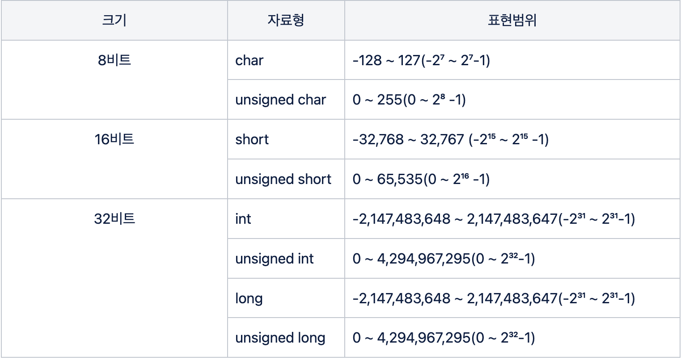
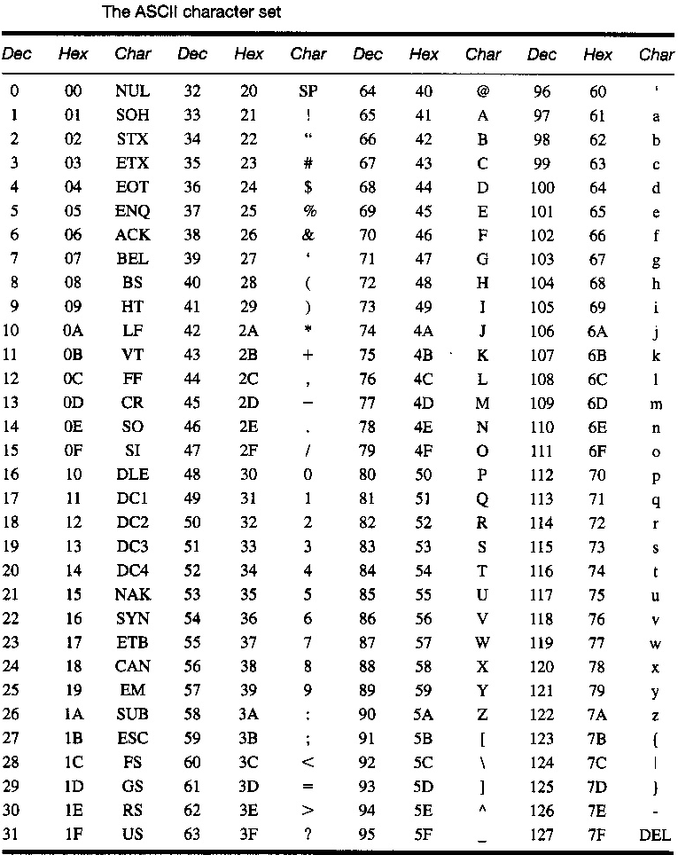

# C언어의 자료형


## 자료형 (Data Types)

자료형은 일정 크기(길이)의 메모리에 저장된 정보를 해석하는 방법을 말한다. 여기서의 길이는 바이트 단위를 말한다.
자료란 수(Number)이다. 기본적으로 컴퓨터라는 기계가 처리할 수 있는 정보는 오로지 숫자 뿐이다. 이미지, 영상 등의 모습을 하고 있어도 모두 본질적으로 수이다.


## 자료의 표현

**메모리의 단위**

자료는 수(Number)로 이루어져 있으며, 메모리 상에서 byte단위로 관리된다.

```
1 byte = 8 bits
````

1 byte는 8bits를 의미한다. bit는 이진수로 표현한 0이나 1 한 자리수를 의미하며, 컴퓨터가 데이터를 해석하는 기초단위 이다. 이 byte단위로 메모리가 관리되며 자료가 해석된다.


**메모리 주소**
- 1 byte 단위로 번호가 매겨지며, 이 번호를 메모리 주소라고 한다. 
- 위치정보를 나타낸다.
- 메모리 주소는 16진수로 표현된다.
    - 이진수로 표현하면 너무 길어지기 때문이다. A를 65로 표현한다고 했을 때, 16진수는 `0x41`으로 표현되지만 이진수로는 `01000001`이 된다.


**변수와 상수**

자료는 위에서 말했듯이 수로 이뤄져 있다. 성격에 따라 변수와 상수로 나눌 수 있다.

상수: 값이 확정되어 앞으로 변할 가능성이 없는 수
- 'A'와 같은 문자상수, 3, 4L과 같은 정수 상수 등


변수: 변화할 수 있는 수, 아직 확정되지 않은 수
- 아직 확정되지 않았으며 프로그램 실행 시 결정되는 값
- 변수는 메모리에 저장된 데이터를 식별하는 역할을 한다. 
- 메모리 주소에 저장된 데이터를 해석하는 방식이 자료형이라면, `메모리 주소에 저장된 데이터`를 식별하기 위해 이름을 붙인 것이 변수이다.


## C 언어의 자료형
C언어의 자료형은 크게 정수형, 실수형, 유도형, 함수형 정도가 있다. 


### 정수 자료형
정수 자료형에는 부호비트(sign bit)개념이 존재한다. int, long, char와 같은 C언어의 자료형을 살펴보기 전에, 부호비트에 대해서 먼저 이해할 필요가 있다.

**부호비트와 데이터비트**

C 언어의 자료형(Data type)에서 부호가 있는 정수형의 경우, 가장 왼쪽의 1비트를 부호비트(sign bit)라고 한다. 그리고 그 외 나머지 영역은 데이터를 나타내는 데이터 비트이다.

부호비트는 0 또는 1을 가질 수 있으며 0이면 양수, 1이면 음수로 해석된다. 8비트 자료형에서 부호비트를 제외하면 나머지 7비트가 데이터 비트가 된다.

따라서 7비트로 나타낼 수 있는 수의 범위는 2의 7제곱 => 128이 된다. 부호비트가 0인 경우, 0을 포함하여 0 ~ 127까지 표현할 수 있고 부호비트가 1인 경우 -128 ~ -1까지 표현할 수 있다.

만약 부호비트까지 모두 데이터비트로 사용한다면 8비트를 모두 데이터 비트로 사용할 수 있다. 이 때, 데이터는 양수로 표현되고 2의 8제곱(0~255) 만큼의 수를 표현할 수 있다. 아래는 자료형별 표현범위를 표로 나타낸 것이다.

<center><br/>표 1. C언어 자료형별 표현범위</center><br/>


흔하게 접하는 IP 주소도 8비트 단위로 구성되어 있다. 

```
192.168.0.1
```
주소값 하나가 8bit로 표현되며, 0~255까지 값을 가질 수 있다. IP 주소는 32비트로 구성되어 있는 것이다.


**char와 ASCII 코드**

문자를 나타내는 char형식 또한 정수형이다. 거듭 말했듯이 모든 데이터는 '수'로 이뤄져 있다. 문자 한 글자를 표현하는 형식인 char형도 결과적으로 숫자로 표현되는 부호가 있는 8비트(1byte) 정수형으로서, 정수 자료형에 포함된다.

- char형 변수 선언 및 정의
    ```C
    char ch = 'A';
    ```


ASCII 코드의 탄생

컴퓨터는 데이터를 숫자로만 표현할 수 있다. 따라서 인간이 읽고 쓰는 글자(문자)를 표현할 수 없다. 따라서 특정 숫자를 특정 문자로 규정하고 이해하는 방식이 고안되었으며 이를 **부호체계**라 한다.

만약 '가'를 표현하고자 할 때, 3을 'ㄱ'으로, 7을 'ㅏ'로 표현하고 이해하기로 약속하는 것이다. 이와 같이, 단순 숫자의 나열을 문자로 해석하기로 약속한 것이 부호체계이다.

그러나 집단마다 같은 숫자에 대해 다르게 부호체계가 적용되는 경우 해석이 일관되지 않는 문제가 있다. 이를 해결하기 위해 미국 표준협회에서 부호체계 통일을 추진하였으며 그로 인해 잘 알려진 ASCII 코드가 탄생하게 되었다.


<center></center>


10진수 65와 16진수 0x41를 문자 'A'로 해석하기로 약속한 것이라고 이해하면 된다.

ASCII 코드는 초기 7비트로 구성되었으며, 2⁷=128으로 영문 대소문자, 숫자, 특수문자 등을 충분히 표현할 수 있는 크기이기 때문에 7비트로 결정되었다. 이후 특수기호를 추가로 표현하기 위해 1비트가 추가 되었고 8비트가 되었다. 즉, 영문 한 글자를 저장할 수 있는 크기인 8비트 기준으로 1byte 단위가 만들어지고, 메모리 관리 단위가 된 것이다.


**short**

부호가 있는 16비트 정수형. 정수를 표현하는 자료형이지만, 표현 범위가 작아서 잘 사용되지 않는다 (최대 0 ~ 65,535(2¹⁶)). 명확하게 작은 숫자로만 값이 다뤄질 경우 사용할 수 있다.

```C
short s = 1234;
```


**int**

int형은 부호가 있는 32비트 정수형. 가장 많이 사용되는 자료형 중 하나이다. 일반적으로 '정수'라고 칭하는 자료형은 int를 뜻한다.

```C
int length = 10;
```

**long**

long형은 운영체제에 따라 32비트 또는 64비트로 다뤄지기도 한다. 따라서 int형과 동일한 표현범위를 갖거나, 혹은 그 이상의 표현범위를 갖게 된다. long형에는 정수 뒤에 L을 붙여준다.
```C
long data = 10L;
```


## 실수 자료형
실수 자료형은 1.1이나 2.2처럼 소수점 이하의 숫자 정보까지 표현할 수 있는 자료형을 말한다. 부동 소수점 표현이라고도 한다.

실수 자료형은 정수 자료형과 다르게 정확하게 수를 표현하는 것이 불가능 하다. 1과 2사이에 존재하는 실수는 무한히 존재하기 때문이다. 예를 들어, 1.11111... 과 같이 무한히 이어지는 수를 무한히 표현할 수 없으므로 특정 지점에서 끊어서 표현해주어야 한다. 이러한 근사값을 나타내는 규칙은 다양하게 존재하며, 각 규칙에 따라 오차가 발생한다. 따라서 실수 자료형에서는 이러한 일정 수준의 오류(부동 소수점 오차)가 존재하고 있음을 이해하고 자료형을 다루는 것이 필요하다.

|자료형|크기   |범위   |유효자릿수 |
|---|---|---|---|
|float   |32비트   | 1.175494e-38~3.402823e+38  | 7  
|double   |64비트   | 2.225074e-308~1.797693e+308  | 16  
|long double   |64비트   | 2.225074e-308~1.797693e+308  | 16  

표 2-1. 실수 자료형의 표현범위와 유효 자릿수

**float**

실수를 표현하는 32비트 단정도형이며, 유효자릿수는 소수점 이하 6번째 자리까지이다. 7번째부터는 부정확한 값이 되므로 작은 수의 경우에만 정확도를 보장한다. 표현할 수 있는 정확한 값의 범위가 작기 때문에 float보다는 double 사용을 권한다.

실수형 자료를 표현의 표준인 [IEEE 754](https://standards.ieee.org/ieee/754/6210/)에 따르면 단정도형의 비트 구조는 아래와 같다.

|부호|지수부|가수부|
|---|---|---|
|1 비트|8 비트|23 비트|

표 2-2. IEEE 754 단정도형의 구조


float형의 선언 및 정의는 아래와 같이 할 수 있다.
```C
#include <stdio.h>

int main() 
{
    float num1 = 2.2f;
}
```
float형을 선언할 때에는 숫자 뒤에 f를 붙여주어야 한다. 붙이지 않으면 double형으로 취급된다.


**double**

실수를 표현하는 64비트 배정도형이며, 유효자릿수가 소수점 자리 이하 15번째까지인 자료형으로 float형보다 정확도가 높아서 주로 사용된다. double도 15자리를 벗어나면 정확도가 떨어지며 오차가 발생한다. 

|부호|지수부|가수부|
|---|---|---|
|1 비트|11 비트|52 비트|

표 2-3. IEEE 754 배정도형의 구조

double형의 선언 및 정의는 아래와 같이 할 수 있다.
```C
#include <stdio.h>

int main() 
{
    double num = 123.456;
}
```


## 문자와 문자(배)열

문자열은 정확히 말하자면 문자'배열'이다. 하나의 인스턴스로 이루어진 것이 아니고 여러 인스턴스가 하나로 합쳐져 하나의 문자열로 보이는 개념이다. 또한 C언어에서 배열은 인스턴스가 아니라 주소에 이름이 부여된다는 특징이 있다.

```C
#include <stdio.h>

int main(void)
{
    char ch1 = 'A', ch2 = 'B', ch3 = 'C';
    char data1[4] = {'A', 'B', 'C'};
    char data2[4] = {'ABC'};
}
```

문자열은 첫번째 줄처럼 변수에 하나씩 할당하여 개별 인스턴스를 각각 생성해 줄 수 있다. 두번째 줄의 `data1[4]`구문은 char형 인스턴스 4개 크기의 배열을 선언하는 구문이며, `{}`에 초기값을 넣어줄 수 있다. `data2`는 `data1`과 동일하지만 ','으로 나누지 않고 하나의 문자 덩어리로 묶어 선언해주었다. 이렇게 해도 결과는 동일하게 나타난다.

문자 인스턴스는 3개('ABC')인데 왜 4 크기의 배열을 선언하였는지 의아할 수 있다. 그 이유는 문자열이 끝났다는 것을 의미하는 NULL('\0')문자가 자동으로 들어가기 때문이다. 


---


### References
- 최호성. ⌜독하게 시작하는 C프로그래밍⌟, 루비페이퍼
- [독하게 시작하는 C 제2장 자료형 - 첫 번째](https://www.youtube.com/watch?v=Ia1h6I6Qjbg&list=PLXvgR_grOs1AQuQ-5mWbx0zdG0betdeoL)
- [독하게 시작하는 C 제2장 두 번째](https://www.youtube.com/watch?v=cSgRsmpyMWY&list=PLXvgR_grOs1AQuQ-5mWbx0zdG0betdeoL)
- https://dojang.io/mod/page/view.php?id=45
