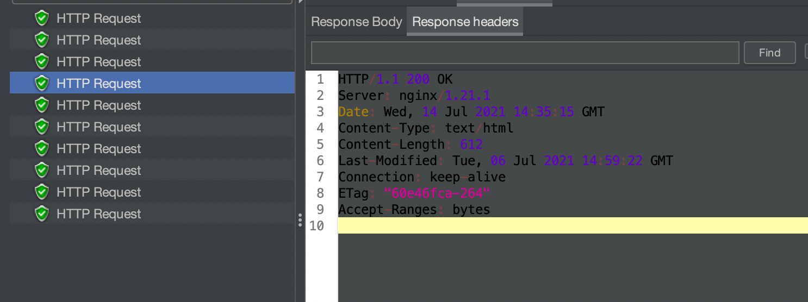

# HTTP Keep-Alive

### 1. Keep-Alive 사용이유

일반적인 웹 환경에서는 TCP 프로토콜 기반으로 HTTP 요청과 응답이 이루어진다. 

```bash
  TCP 커넥션 오픈 ---->  HTTP 요청 ----> HTTP 응답 ----> TCP 커넥션 해제
  (3 핸드쉐이크)                                       (4핸드 쉐이크)
```

 TCP 프로토콜은 데이터의 신뢰성을 보장하기 위해 핸드쉐이크 과정과 혼잡제어, 흐름제어 등 여러가지 일을 수행한다.
이런 TCP의 기술들 덕분에 데이터의 안정성과 신뢰성을 보장 받지만, 일종의 트레이드 오프처럼 일부 아쉬운 단점들 또한 존재한다.   

 그 중에서 keep-alive와 관련된 내용을 찾아보면 TCP의 단점으로 대표되는 주제가 [지연시작(TCP혼잡제어)](https://evan-moon.github.io/2019/11/26/tcp-congestion-control/)과 [TIME_WAIT 문제](https://www.youtube.com/watch?v=MBgEhSUOlXo&t=359s)가 있다.   
 (다른분들이 잘 정리해놓은 내용이 있어 자세한 내용은 링크 참고)

 이러한 TCP의 단점으로 인해 매회 요청시 잦은 지연시작이 발생하여 네트워크 속도가 저하되고, 커넥션 해제 중 TIME_WAIT 문제의 빈도수가 높아지게 된다. 또한, 요청 수에 따른 커넥션 생성은 CPU 사용률 증가 문제도 발생하게 된다. 

위와 같은 문제점을 보완하기 위하여 여러 요청에 대해 단일 커넥션을 유지(재사용)하기 위한 기술인 Keep-alive 혹은 Persistent Connection 기술이 나오게 되었다.
```bash
  커넥션 유지
                         +---------------------------+
                         |                           |                                         
                         v                       +------+
  TCP 커넥션 오픈 ---->  HTTP 요청 ----> HTTP 응답 -- | wait |  --> TCP 커넥션 해제
  (3 핸드쉐이크)                                    +------+      (4 핸드쉐이크)
                                                 (timeout)
```          

### 2. HTTP 1.1의 지속커넥션

HTTP 1.0에서는 Keep-alive을 통한 커넥션 유지가 표준화되지 않는 기술이었다. 클라이언트와 서버 모두 Connection 헤더에 keep-alive를
넣어야 커넥션이 유지되었다.

```bash
Connection: keep-alive
``` 
하지만, 설계에 문제가 있어 잘 동작하지 않는 문제가 있었다고 한다.(일명 멍청한 프록시 문제가 발생했다고 함) 

HTTP 1.1에서부터는 위의 문제를 개선하고 표준화된 기술로 되어 default로 지속 커넥션(keep-alive)가 활성화 되어있다. 클라이언트와 서버 모두 HTTP 1.1을 구현하고 있다면 지속커넥션을 기본으로 사용하게 되어있다.  
   
2.1) keep-alive 옵션
- `max` : 한 커넥션에서 최대 요청 수   
- `timeout` : 유휴상태에서의 keep-alive 유지시간(초 단위)


2.2) 제한과 규칙  

  요청 당 하나의 커넥션으로 처리되는 HTTP 1.0에서는 HTTP 메시지의 끝을 커넥션이 종료되는 기점으로 알 수 있었다. 하지만, HTTP1.1에서부터는 여러 요청에 대해 커넥션을 유지하기 때문에 커넥션이 종료되는 기점으로 HTTP 메시지에 대한 끝부분을 알 수 없게된다.
  
  이러한 지속적인 커넥션 때문에 HTTP `Content-length` 헤더값을 사용하여 HTTP 메세지 본문의 끝점을 식별하거나,
  [청크 인코딩(패키징된 데이터)](https://developer.mozilla.org/ko/docs/Web/HTTP/Headers/Transfer-Encoding) 헤더를 사용하여 지속커넥션을 사용할 수 있다.  


### 3. 이점 및 단점

 3.1) 이점
- 커넥션 수가 적기 때문에 CPU와 메모리 사용량이 낮다.
- 후속 요청의 네트워크 지연감소(no handshaking)
- 커넥션 해제 중 TIME_WAIT 문제 빈도수 감소 

 3.2) 단점 
- 커넥션을 유지하기 때문에 사용되지 않더라도 유휴 상태에서 리소스를 계속 점유(적절한 timeout 설정이 필요)


### 4. 간단한 테스트

개념으로만 살펴보기에는 뭔가 아쉬워서 간단한 테스트를 진행하였다. nginx 웹서버에서 keep-alive 옵션값을 수정하여 위의 정리한 
내용과 동일하게 동작하는지 간단하게 테스트해보겠다. 
  
nginx에서 요청시 커넥션이 유지되는지 확인하기 위한 로그설정과 keep-alive 옵션값인 `max`값과 `timeout`을 수정하기 위해 nginx가 설치된 폴더 내부에 nginx.conf파일에서 설정값을 변경한다.

```bash
[nginx.conf 파일]

http {
    include       mime.types;
    default_type  application/octet-stream;
     
    #로그 포맷 수정 혹은 추가   
    log_format connection '$remote_addr - $remote_user [$time_local]  $status '
                          '"$connection $connection_requests"';
    #로그 저장 위치 
    access_log /opt/homebrew/var/log/nginx/connection.log  connection;

    #...생략

    #timeout값 설정 (default 65)
    keepalive_timeout 65;
    #max값 설정 (default 1000)
    keepalive_requests 5;

}
#...생략
```
 - `$conntcion` :  커넥션의 고유한 시리얼 넘버
 - `$connection_requests` : 커넥션의 요청 수  
 - `keepalive_timeout` :  유휴 상태에서의 커넥션이 유지되는 시간(초 단위) = keepalive 옵션인 timeout
 - `keepalive_requests` : 한 커넥션에서의 최대 요청수 = keepalive 옵션인 max 

위와 같이 설정하고 nginx를 재시작한다.(mac 기준) 

```bash
sudo nginx -s reload 
```

총 12번의 localhost로 접속 시 아래와 같은 로그가 출력된다.   


커넥션 넘버별로 최대 요청수 5회 시 다음 요청에 대해서 새로운 커넥션이 맺어진걸 확인 할 수 있다. 

추가로, 커넥션이 해제되는 응답값을 확인하기 위하여 Jmeter라는 테스트 도구를 통해서 4번째 요청과
5번째 요청에 대한 응답값을 확인해봤다.



아직 최대 요청수를 넘어서지 않았기 때문에 4번째 요청에 대한 응답 헤더값은 Connection: keep-alive로 설정되어있고
최대 요청수의 5번째 요청은 응답 헤더값에 Connection:close 값이 추가되어 후속요청은 새로운 커넥션이 맺어진걸 확인 할 수 있다. 

### 5. 정리
지속커넥션(keep-alive)은 반복적인 커넥션 생성 비용을 낮추고 no handshaking을 통한 네트워크 속도 증가 등의 이점이 있다. 
하지만, 유휴상태에서의 리소스를 계속 점유하고 있어 적절한 max request 설정과 timeout 설정이 필요할 것으로 보인다. 

이번 주제를 공부하면서 tcp keep-alive와 http keep-alive의 개념을 나눠서 다루는데 아직 이 두가지의 차이점은 파악하지 못하였다. 또한,
마지막에 성능테스트도 해보고 싶었는데 아직 성능테스트에 대한 배경지식이 없어 못한 점이 아쉬웠다. 


[Reference]  
 - [https://www.youtube.com/watch?v=MBgEhSUOlXo&t=47s](https://www.youtube.com/watch?v=MBgEhSUOlXo&t=47s)
- [위키피디아](https://en.wikipedia.org/wiki/HTTP_persistent_connection#HTTP_1.0)
- [Jmeter사용법 참고 유투브](https://www.youtube.com/watch?v=1AyxqIePusA&t=321s)
- [Nginx 공식문서](http://nginx.org/en/docs/)
- [https://evan-moon.github.io/2019/11/17/tcp-handshake/](https://evan-moon.github.io/2019/11/17/tcp-handshake/)
- [https://mkki.github.io/http/2018/02/14/http-the-definitive-guide-1-15.html](https://mkki.github.io/http/2018/02/14/http-the-definitive-guide-1-15.html)
