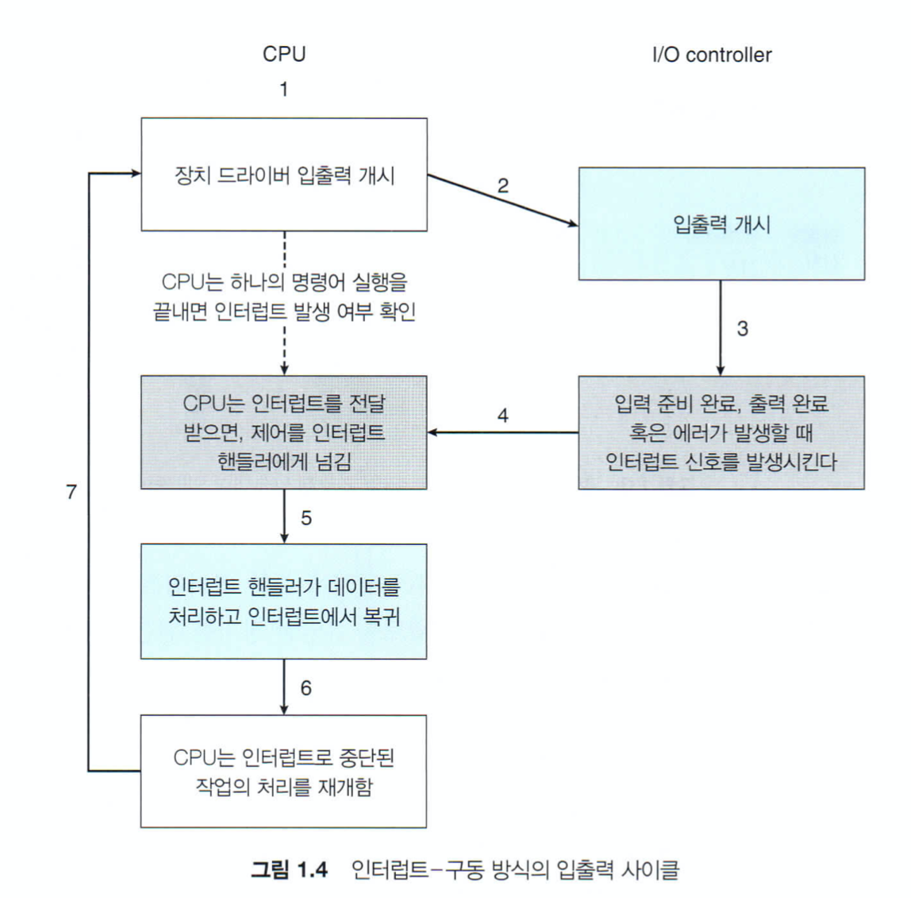

# 인터럽트

### 1. 인터럽트 개념 및 개요
 CPU가 프로그램을 실행하고 있을 때, 입출력 하드웨어 등의 장치에 예외상황이 발생하여 처리가 필요할 경우에 CPU에게 알려 처리할 수 있도록 하는 것을 말한다 ([위키피디아](https://ko.wikipedia.org/wiki/%EC%9D%B8%ED%84%B0%EB%9F%BD%ED%8A%B8))

### 2. 하드웨어 인터럽트 
 2.1) 하드웨어 인터럽트     
 디바이스 혹은 장치컨트롤러에 의해서 발생되는 인터럽트를 말하며, 하드웨어가 CPU에게 어떤 이벤트를 발생시키거나 CPU의 서비스요청을 할때 인터럽트를 발생 시킬 수 있다.
  - 입출력 인터럽트 : 입출력 장치에서 입출력 준비가 완료되었을때 CPU에게 인터럽트 발생 
  - 타이머 인터럽트 : 일정 주기로 인터럽트가 필요할 때 발생되는 인터럽트
  - 기계검사 인터럽트 : 프로그램 내에서 기계적인 문제가 발생하거나 정전 이상으로 발생된 인터럽트

2.2) 하드웨어 인터럽트 처리 과정   
 하드웨어는 인터럽트를 요청할 때 요청 라인 회선(IRQ)을 통해서 인터럽트를 요청하게 된다. IRQ에는 고유의 숫자가 있어 CPU는 IRQ 숫자를 식별하여 어떤 하드웨어가 인터럽트를 요청한지 빠르게 식별할 수 있다. 
 
 IRQ 숫자를 색인된 데이터가 저장되어 있는 곳을 `인터럽트 백터 테이블`이라고 하는데, CPU는 인터럽트 요청이 들어오면 인터럽트 백터 테이블에서 색인된 데이터를 찾는다. 데이터 내용에는 특정 인터럽트 요청에 대한 서비스를 처리하는 `인터럽트 핸들러 루틴(서비스루틴)`에 대한 참조값이 저장되어있고, 참조값을 호출하여 인터럽트 서비스를 처리한다.

[간단한 도식도]
```bash            

 I/O 컨트롤러                       CPU                   OS 영역 
 
 +--------+           IRQ                                                       
 |keyboard|-----------------------+            +----------------------+ 
 +--------+                       |      +---> | 키보드 인터럽트 핸들러 루틴 |   
                                  v      |     +----------------------+
 +-----+       IRQ             +-----+   |     +----------------------+
 |mouse| --------------------> | CPU |---+---> | 마우스 인터럽트 핸들러 루틴 |
 +-----+                       +-----+   |     +----------------------+          
                                  ^      |     +----------------------+ 
 +-----+         IRQ              |      +---> | USB 인터럽트 핸들러 루틴  | 
 | USB | -------------------------+            +----------------------+                    
 +-----+                                       
```
[상세 입출력 사이클]
  

장치컨트롤러가 인터럽트 요청라인(IRQ)에 신호를 보내 인터럽트를 `발생`시키고,
CPU는 인터럽트를 `포착`하여 인터럽트 핸들러로 `디스패치`하고 핸들러는 장치를 서비스하여 인터럽트를 `지운다`  

2.3) 하드웨어 인터럽트 특징  
하드웨어 인터럽트의 경우 `비동기` 이벤트로 동작된다. 현재 CPU가 실행하고 있는 명령어와는 상관없이 외부 디바이스에서 발생된 인터럽트이기 때문에 비동기 이벤트로 발생된다. 또한, 동시에 인터럽트가 발생 하였을 때 우선순위에 따라 인터럽트 요청을 처리할 수 가 있다. 우선순위가 높은 인터럽트의 실행을 선점하여 순차적으로 인터럽트들을 처리하게 된다.   

### 3. 소프트웨어 인터럽트 
 하드웨어 인터럽트가 CPU 외부에서 발생되는 인터럽트라면, 소프트웨어 인터럽트는 CPU 내부(사용자 프로그램)에서 발생되는 인터럽트이다. 
 
  - 프로그램적으로 발생하는 오류(Over/Under Flow, 0으로 나누기)
  - 시스템콜을 통한 인터럽트 발생

 3.1) 시스템콜 사용 이유   
 사용자 프로그램이 운영체제의 모든 데이터 혹은 하드웨어 자원에 접근 후에 수정이나 삭제할 경우 운영체제에 문제가 발생될 수 있다. 직접 접근하는 방법을 막고자 운영체제가 일종의 인터페이스인 시스템콜을 제공하여, 사용자 프로그램은 시스템콜을 이용하여 파일읽기나 파일쓰기를 요청할 수가 있다. 이러한 이유때문에 시스템 콜을 사용하여 커널모드에서 인터럽트를 대신 요청하게 해준다. 

 [시스템 콜을 사용한 인터럽트] 
 ```bash
           +-------------+       +-----------+              +-----------+
 유저 영역   | 사용자 프로세스 | ----> | 시스템콜 호출 |              | 시스템콜 복귀|     
           +-------------+       +-----------+              +-----------+          
---------------------------------------|--------------------------|-----          
                                       |                          |
 커널 영역                         +-------------+        +--------------------+
                                 | 시스템 콜 실행 |  ----> | 인터럽트 핸들러 루틴 완료|
                                 +-------------+        +--------------------+
```


### 4. 인터럽트 우선순위
인터럽트는 우선순위에 따라 인터럽트를 지연시킬수 있고 선점할 수 있다.  

 1) 정전 발생 인터럽트 : 정전되면 전원이 차단되게 되어 가장 0순위     
 2) 기계 고장 인터럽트 : 컴퓨터의 하드웨어 고장으로 발생되는 인터럽트     
 3) 외부 신호 인터럽트 : 외부 장치에서 발생되는 인터럽트(하드웨어 인터럽트)   
 4) 프로그램 인터럽트  : Over/Under플로우 혹은 분모 0으로 발생되는 인터럽트 
 5) SVC 인터럽트 : 제어프로그램 호출 시 발생되는 인터럽트


### 5. 정리 및 회고
- 외부 장치 및 소프트웨어 프로그램에 의해서 인터럽트가 발생하며, 우선순위에 따라 긴급한 인터럽트 요청을 먼저 처리한다. 
인터럽트 요청을 수신하고, 처리하고, 복귀하는 일은 cpu 유휴시간때 발생된다. 이런 유휴시간을 최소화(?)할려면 효율적인 인터럽트 처리가 시스템 성능을 좋게 할 수도 있다. 

- 잘 모르는 부분을 공부할 때는 하나의 참고자료 기준으로 정리하는게 좋은 것 같다. 인터럽트와 관련된 내용을 인터넷에 찾아보면서, 파편화된 내용들이많아 어떤 부분이 맞는 내용인지 쉽게 머리속에 들어오지 않아 정리 하기가 어려웠다.  
- 컨택스트 스위칭시에 CPU가 유휴상태에 프로세스의 상태정보를 저장하는 정도로만 생각했는데, 이번에 인터럽트를 공부하면서 유휴 상태일때 인터럽트와 관련된 작업처리 하는것을 알게 되었다.
- CS는 한번에 이해하기가 너무 어렵다  


[참고]  
- [공룡 책](http://www.yes24.com/Product/Goods/89496122)
- [https://www.youtube.com/watch?v=fjQnmiwJFl0&t=520s](https://www.youtube.com/watch?v=fjQnmiwJFl0&t=520s)
- [https://real-dongsoo7.tistory.com/93]https://real-dongsoo7.tistory.com/93
- [https://pediaa.com/what-is-the-difference-between-hardware-and-software-interrupt/#Hardware%20Interrupt](https://pediaa.com/what-is-the-difference-between-hardware-and-software-interrupt/#Hardware%20Interrupt)
