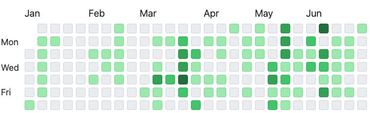
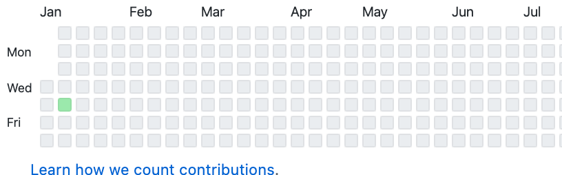

# ### 취업
- - - -
한창 공부를 하면서 **'웹 개발자'** 로는 절때 절때 취업을 하지 않겠다는 다짐을 했었다. 학부생때부터 웹 개발을 프로젝트를 진행하면서 프론트 개발에 대한 스트레스가 상당했기 때문이다.(~~중학교때 미술쌤이 진지하게 디자인에 나처럼 소질없는 사람 처음봤다고 하심,,~~) 그래서 웹 보다는 앱 쪽으로 눈을 돌렸고 앱 관련 공모전에서도 꽤 수상도 했기 때문에 **'안드로이드 개발자'** 로 진로를 정했다.

본격적으로 취업을 시작하면서 여러 회사 **'안드로이드 개발자'** 파트에 지원서를 넣게 되었고 운이 좋게도 취업 준비를 시작한지 얼마 안 되어서 금융 SI 회사에 붙었다. 그와 동시에 웹 개발자를 뽑는 대기업에도 붙었는데 어렸던 나는 회사의 이름만 보고 대기업을 선택하게 되었다.
(~~대기업을 가더라도 IT 대기업을 가야했는데,,,,~~)

### 개발자로써 1년차를 지내면서
- - - -
얼떨결에 맡게된 .net MVC 프로젝트 유지보수 업무는 정말 많은 생각을 하게 되었다. 각자 맡은 프로젝트를 진행하는 형식이다보니 학생때 개발하던 습관 그대로 개발을 해도 아무도 뭐라 하지 않으셨다. 또한 혼자 프로젝트를 관리하다 보니 내 맘대로 개발하고 내 맘대로 코드를 짰다. 이런 과정이 반복되면서 엄청 자괴감에 빠졌던거 같다.

### 개발자의 갈림길
- - - -
회사에서 개발을 하면서 정말 내가 생각했던 개발자의 삶과는 너무나도 달랐다. 다 같이 토론하며 코드를 리뷰하고 고쳐나가는 모습은 없고 각자 자신이 맡은 프로젝트를 관리하기가 바빴다. 나도 내가 맡은 프로젝트를 유지보수하기 바빴고 들어오는 요구사항을 반영해 주기 바빴다. 그래서인지 올 한해 많은 고민이 들었던거 같다.

공기업이나 IT 계열이 아닌 회사에 다니는 개발자라면 한 번쯤은 해봤을 법한 고민
그저 요구사항만 들어주는 개발자가 될 것인지 아님 **스스로 발전하고 더 깊이 있는 공부를 하고 자신의 개발자 커리어**를 만들어 나갈것인지..

엄청난 고민과 회사 선배님들 그리고 스타트업에 다니는 많은 사람들의 조언에 따라 나는 **후자의 길**을 가기로 마음을 먹었다. 

### 공부
- - - -
개발자로 취업하고 1년 동안 개인 개발을 쉬었다. 졸전을 하면서 많이 고생한게 보상심리로 발동되어서 그냥 1년은 쉬고 싶었다..

~~Github만 봐도 한 눈에 엄청 개발을 안 한게 보여진다~~

2019년의 GitHub

2020년의 Github

그래도 그나마 공부를 한 리스트다.

 - React를 다루는 기술
 - 러닝 자바스크립트
 - Spring 멀티캠퍼스 교육
 - C# 멀티캠퍼스 교육
 - AWS 교육
 
회사에서 보내주셨던 멀티캠퍼스 교육은 기초 개념을 다시한번 정리하는데 많은 도움이 되었다.
 
 React와 자바스크립트는 프론트 공부를 하지 않았던 나를 반성하면서 시작한 공부고 지금까지도 계속 하고 있다.
 
 AWS는 내가 취업한 동시에 회사에서 AWS 도입을 하여 운 좋게도 많은 부분에 있어 교육을 받았고 AWS Lambda 프로젝트도 진행할 수 있었다.(~~물론 혼자,,,~~) 
 
 이렇게 회사에서 제공하는 교육과 회사 업무를 진행하면서 필요한 기초 지식들만 익혀온 1년 이였다.

### 내년 목표
- - - -

이제 회사 업무도 손에 익었고 내가 나아갈 방향도 찾게 되었으니 나를 개발자로써 더 성장시킬 수 있는 공부를 하고싶다.

- 개인 프로젝트 진행하기
    - Spring
    - React Native
    - Nodejs + React
    - ...
- 포트폴리오 업데이트 꾸준히 하기
- 1일 1커밋 도전해보기
- 블로그 운영하기
- 필사하기

이직을 위한 개인 프로젝트 진행을 해야 할거 같고 React Native 같은 신기술들을 익혀 보고 싶다!!