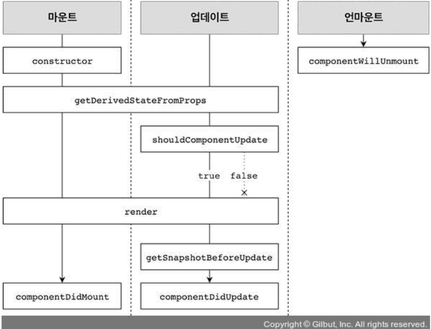
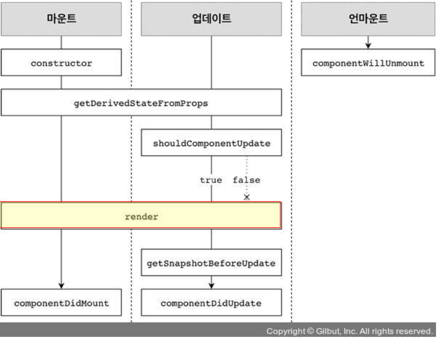
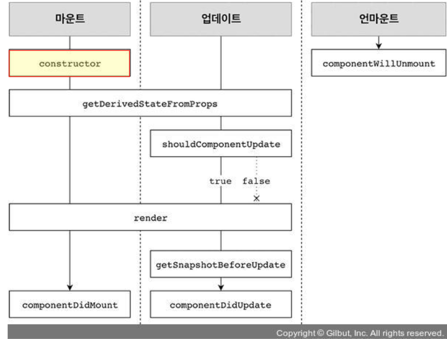
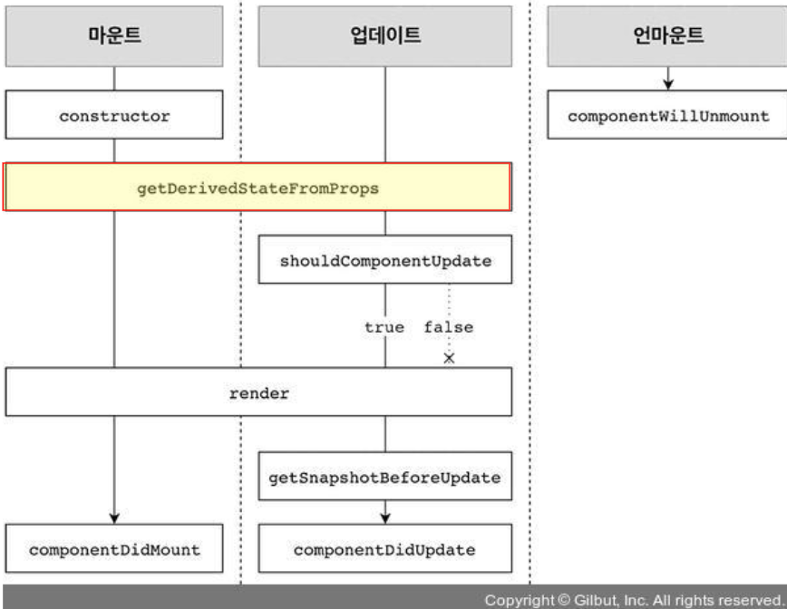
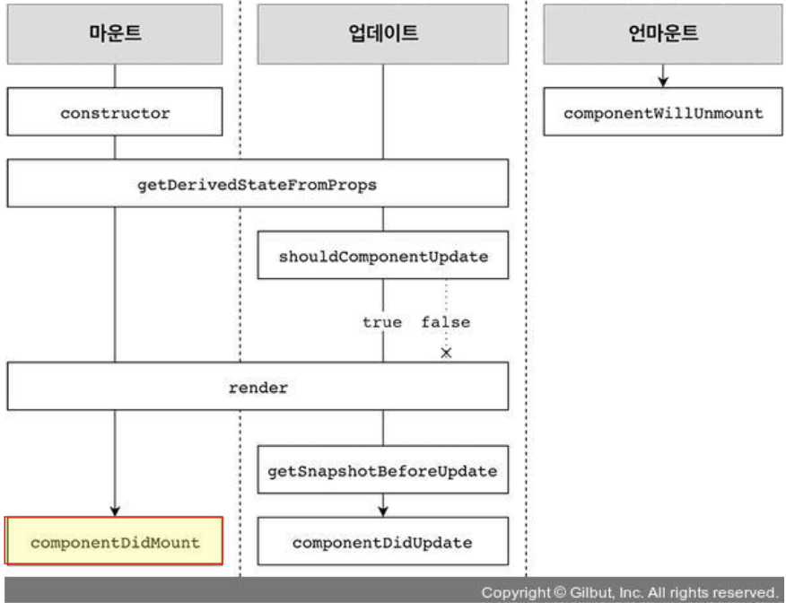
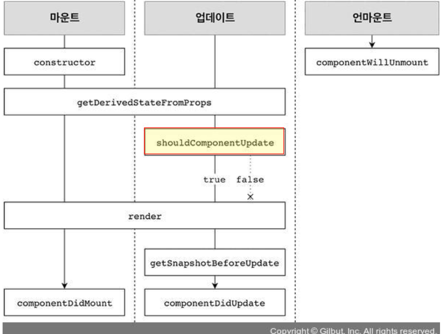
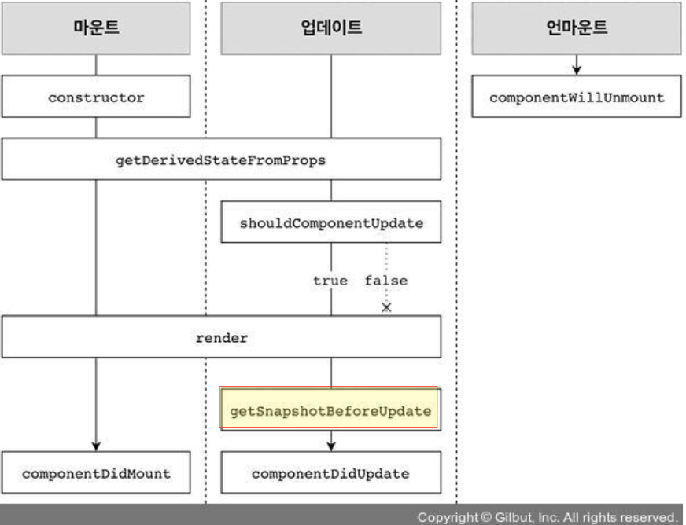
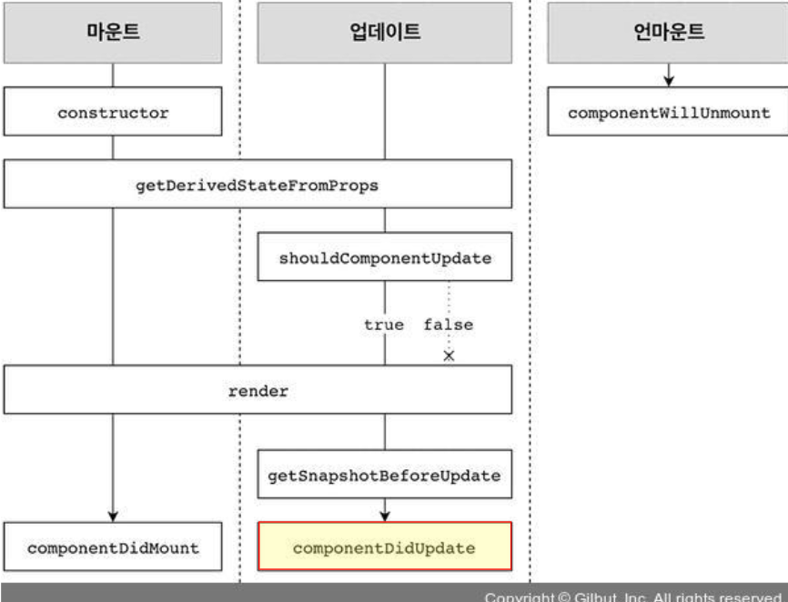
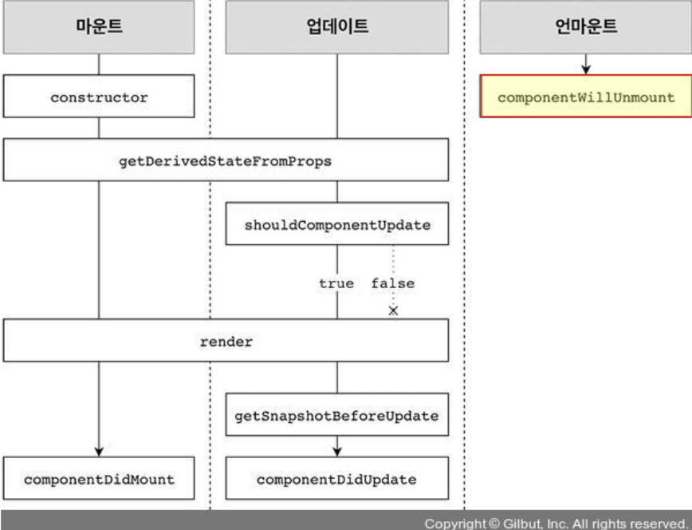

# 7. 컴포넌트의 라이프사이클

리액트를 다루는 기술 책에서 공부한 내용입니다.

- 모든 리액트 컴포넌트들은 **라이프사이클(수명 주기) 존재**
    - 컴포넌트의 수명 시작 : 페이지에 **렌더링되기 전**인 준비과정
    - 컴포넌트의 수명 끝 : 페이지에서 사라질 때
- 라이프사이클 메서드는 **클래스형 컴포넌트에서만 사용 가능**
   > 함수형 컴포넌트 사용 x(**Hooks 기능** 사용해 비슷한 작업 처리 가능)
    - 컴포넌트를 처음으로 렌더링 시 작업 처리
    - 불필요한 업데이트 방지
    - 컴포넌트 업데이트 전후 작업 처리

# 1. 라이프사이클 메서드의 이해



- 메서드 종류 총 9 가지(컴포넌트 클래스에서 덮어 써 선언함으로써 사용)
    - Will 접두사 : 어떤 작업을 작동하기 전에 실행 메서드
        - `componentWillUnmout()`, `componentDidCatch()`
    - Did 접두사 : 어떤 작업을 작동한 후에 실행 메서드
        - `componentDidMount()`, `componentDidUpdate()`
    - `render()` , `constructor()`, `getDerivedStateFromProps()`, `shouldComponentUpdate()`, `getSnapshotBeforeUpdate()`
- 라이프 사이클 → **마운트, 업데이트, 언마운트로 종류가 구분**
    - **마운트**  :  페이지에 컴포넌트가 나타남
    - **업데이트**   컴포넌트 정보를 업데이트 ( 리렌더링 )
    - **언마운트** : 페이지에서 컴포넌트가 사라짐
    - 마운드(mount)
        - DOM이 생성되고 웹 브라우저 상에서 나타나는 것
        - 마운트할 때 호출하는 메서드
            - `constructor()`
                - 컴포넌트를 새로 만들 때마다 호출되는 클래스 생성자 메서드
            - `getDerivedStateFromProps()`
                - props에 있는 값을 state에 넣을 때 사용하는 메서드
            - `render()`
                - 개발자가 준비한 UI를 렌더링하는 메서드
            - `componentDidMount()`
                - 컴포넌트가 웹 브라우저에 나타난 후 호출하는 메서드
    - 업데이트(update)
        - 컴포넌트는 다음과 같은 총 네 가지 경우 업데이트(업데이트 발생 요인)
            - props가 바뀔 때
            - state가 바뀔 때(setState())
            - 부모 컴포넌트가 리렌더링될 때(무조건)
            - `this.forceUpdate`로 강제로 렌더링을 트리거할 떄
        - 업데이트할 때 호출하는 메서드
            - `getDerivedStateFromProps()`
                - 마운트 과정에서도 호출, 업데이트가 시작하기 전에도 호출 
                → props의 변화에 따라 state 값에도 변화 줄때
            - `shouldComponentUpdate()`
                - 컴포넌트가 리렌더링 여부 결정 메서드
                    - true : 다음 라이프사이클 계속 실행
                    - false : 작업 중지(리렌더링 x)
                - 만약 특정 함수에서 `this.forceUpdate()` 호출 시 이 과정 생략 후 바로 `render()` 호출
            - `render(forceUpdate)`
                - 컴포넌트를 리렌더링
            - `getSnapshotBeforeUpdate()`
                - 컴포넌트 변화를 DOM에 반영하기 바로 직전 호출
                - 이 함수 후 웹 브라우저상 실제 DOM 변화
            - `componentDidUpdate()`
                - 컴포넌트의 업데이트 작업 후 호출
    - 언마운트(unmount)
        - 마운트의 반대 과정 → 컴포넌트를 DOM에서 제거하는 것
        - 언마운트할 때 호출하는 메서드
            - `componentWillUnmount()`
                - 컴포넌트가 웹 브라우저상에서 사라지기 전 호출하는 메서드

# 2. 라이프 사이클 메서드 살펴보기

## 2.1. render() 함수



- `render() {...}`
- 컴포넌트 **모양새**를 정의(**컴포넌트에게 가장 중요한 메서드**)
- 라이프사이클 메서드 중 유일한 **필수 메서드**
- 메서드 안 this.props와 this.state에 접근가능
- return : 리액트 요소
    - div 같은 태그 및 따로 선언한 컴포넌트 , null , false

## 2.2. constructor 메서드



- `constructor(props) {...}`

    ```jsx
    constructor(props) {
       super(props);
       console.log('constructor');
     }
    ```

- 메서드 안에서는 이벤트 설정이 아닌곳에 `setState()` 사용 x , 브라우저 DOM 접근 x 
→ `componenetDidMount()` 에서 처리할것!!
    - 컴포넌트 초기 생성자 메서드 → 컴포넌트 만들 때 처음으로 실행
    - 초기 state 설정 가능

## 2.3. getDerivedStatedFromProps 메서드**(v16.3 이후)**



```jsx
statice getDerivedStateFromProps(nextProps, prevState){
   if(nextProps.value !== prevState.value){ // 조건에 따라 특정 값 동기화
       return{value : nextProps.value};
   }
   return null : //state를 변경할 필요가 없다면 null을 반환
}
```

- **props로 받아 온 값을 state에 동기화 시키는 용도**
- 컴포넌트가 **마운트 , 업데이트 시** 호출

## 2.4. componentDidMount 메서드



- `componentDidMount() {...}`

    ```jsx
    componentDidMount(){
         console.log('componentDidMount');
         //첫 렌더링 마친 후 호출
     }
    ```

- 컴포넌트 생성 후 **첫 렌더링**을 다 마친 후 실행
- 다른 자바 스트립트 라이브러리, 프레임워크 함수 호출, 이벤트 등록, setTimeout, setInterval, 네트워크 같은 **비동기 작업 처리**

## 2.5. shouldCompoenetUpdate 메서드



- `shoudCompoenetUpdate(nextProps, nextSatae) {...}`

    ```jsx
    shouldComponentUpdate(nextProps, nextState){
         //props 또는 state 변경 시 리렌더링 시작 여부 지정
         console.log('shouldComponentUpdate', nextProps, nextState);
         //숫자의 마지막 자리가 4면 리렌더링하지 않습니다.
         return nextState.number % 10 !== 4;
     }
    ```

- **props 또는 state 변경 시 리렌더링 시작 여부 지정 메서드**
- 반드시 true , false 값 반환
    - 컴포넌트 생성시 메서드 따로 생성 x → true 값 반환
    - false 값 반환시 **업데이트 과정 중지**
- 현재 props, state > this.props, this.stats
- 새로 생성 props, state > nextProps, nextState

## 2.6. **getSnapshotBeforeUpdate 메서드(v16.3 이후)**



```jsx
getSnapshotBeforeUpdate(prevProps, prevState){
    if(preState.array !== this.state.array){
        const {scrollTop, scrollHeight} = this.list
        return {scrollTop, ScrollHeight}l
    }
}
```

- **render에서 만들어진 결과물이 브라우저에 실제 반영 전 호출**
    - 주로 업데이트 직전 값을 참고할 일 있을 때 활용(ex : 스크롤바 위치)
- return 객체 → compoenetDidUpdate에서 세번째 파라미터인 snapshot값으로 전달 가능

## 2.7. componentDidUpdate 메서드



- `componentDidUpdate(prevProps. prevState, snapshot) {...}`

    ```jsx
    componentDidUpdate(prevProps, prevState, snapshot){
         console.log('compoennetDidUpdate', prevProps, prevState);
         if(snapshot){
             console.log('업데이트되기 직전 색상 : ' , snapshot);
         }
     }
    ```

- **리렌더링을 완료한 후 실행**(업데이트 후라서 DOM 관련 처리 가능)
- prevProp, prevState 사용해 **컴포넌트 이전 데이터 접근 가능**
- `getSnapshotBeforeUpdate()` 의 return 객체 → **세번째 매개변수 가능**

## 2.8. componentWillUnmount 메서드



- `componentWillUnmount() {...}`

    ```jsx
    componentWillUnmount(){
         console.log('componentWillUnmount');
     }
    ```

- 컴포넌트를 **DOM에서 제거할 때 실행**
- `componentDidMount()` 에서 등록한 이벤트, 타이머, 직접 생성 DOM 존재 시 여기서 제거 작업

## 2.9 compoenetDidCatch 메서드(v16 도입)

- 컴포넌트 렌더링 도중에 **에러 발생 시 오류 UI 보여줌**

    ```jsx
    componentDidCatch(error, info){
        this.setState({
            error : true
        });
        console.log({error, info});
    }
    ```

- error : 파라미터에 어떤 에러 발생 표출
- info : 어디에 있는 코드에서 오류 발생 표출
- log도 찍을 수 있지만 실제 오류 발생시 서버 API 호출해 따로 수집 가능
- 컴포넌트 자신 발생 에러 잡기 x 
→ 자신의 this.props.children 전달 컴포넌트에서 발생 에러만 잡기 가능

# 2. 라이프사이클 메서드 사용하기

- 예제

```jsx
import React, { Component }  from 'react';
 
//클래스 설명 : 
//부모 컴포넌트에서 props로 색상을 받아 버튼을 누르면 state.number  값을 1씩 더한다.

class LifeCycleSample extends Component{
   state = {
       number : 0,
       color : null
   }
   myRef = null;
 
   constructor(props) {
       super(props);
       console.log('constructor');
   }
 
   static getDerviedStateFromProps(nextProps, prevState){
       //부모에게서 받은 color 값을 state 에 동기화
       //컴포넌트가 마운트될 때와 업데이트 시 호출
       console.log('getDerivedStateFromProps');
       if(nextProps.color !== prevState.color){
           return {color : nextProps.color}
       }
       return null;
   }
 
   componentDidMount(){
       console.log('componentDidMount');
       //첫 렌더링 마친 후 호출
   }
 
   shouldComponentUpdate(nextProps, nextState){
       //props 또는 state 변경 시 리렌더링 시작 여부 지정
       console.log('shouldComponentUpdate', nextProps, nextState);
       //숫자의 마지막 자리가 4면 리렌더링하지 않습니다.
       return nextState.number % 10 !== 4;
   }
 
   componentWillUnmount(){
       console.log('componentWillUnmount');
   }
 
   handleClick = () => {
       this.setState({
           number : this.state.number + 1
       });
   };
 
   getSnapshotBeforeUpdate(prevProps, prevState){
       //DOM에 변화가 일어나기 직전의 색상 속성 snapshot 값으로 반환
       console.log('getSnapshotBeforeUpdate');
       if(prevProps.color !== this.props.color){
           return this.myRef.style.color;
       }
       return null;
   }
 
   componentDidUpdate(prevProps, prevState, snapshot){
       console.log('compoennetDidUpdate', prevProps, prevState);
       if(snapshot){
           console.log('업데이트되기 직전 색상 : ' , snapshot);
       }
   }
 
   render(){
       console.log('render');
       const style = {
           color : this.props.color
       };
       return(
           <div>
               {this.props.missing.value}{/*에러 발생*/}
               <h1 style={style} ref={ref=> this.myRef=ref}>
                   {this.state.number}
               </h1>
               <p>color : {this.state.color} </p>
               <button onClick={this.handleClick}>
                   더하기
               </button>
           </div>
       );
   }
}
 
export default LifeCycleSample
 
 
 
/*
statice getDerivedStateFromProps(nextProps, prevState){
   if(nextProps.value !== prevState.value){ // 조건에 따라 특정 값 동기화
       return{value : nextProps.value};
   }
   return null : //state를 변경할 필요가 없다면 null을 반환
}
 
getSnapshotBeforeUpdate(prevProps, prevState){
    if(preState.array !== this.state.array){
        const {scrollTop, scrollHeight} = this.list
        return {scrollTop, ScrollHeight}l
    }
}
 
componentDidCatch(error, info){
    this.setState({
        error : true
    });
    console.log({error, info});
}
*/
```

- 에러 잡기
    - 사용자들 에러 시 빈 화면 보지 않게 에러 잡아주는 컴포넌트 생성

```jsx
import React, { Component }  from 'react';
 
 
//부모 컴포넌트에서 props로 색상을 받아 버튼을 누르면 state.number  값을 1씩 더한다.
class ErrorBoundary extends Component{
   state = {
       error : false
   };
   componentDidCatch(error, info){
       //에러 발생시 메서드 호출
       this.setState({
           error : true //this.state.error 값을 true로 업데이트
       });
       console.log({error, info});
   }
 
   render(){
       //true 시 에러 문구 보여줌
       if(this.state.error) return <div>에러가 발생했습니다!</div>;
       return this.props.children;
   }
}
 
export default ErrorBoundary

<ErrorBoundary>
	 <LifeCycleSample color={this.state.color}/>
</ErrorBoundary>
```

# 3. 정리

- 라이프사이클 메서드는 **컴포넌트 상태에 변화가 있을 때마다 실행**하는 메서드
- 서드파티 라이브러리 사용 **DOM 직접 건드려야 하는 상황 유용**
→ 서드파티 라이브러리(제작사에서 만든것이 아니라 다른 업체에서 만든 해당 툴 지원 라이브러리)
- 컴포넌트 **업데이트 성능 개선 시 shouldComponentUpdate 중요** 사용
