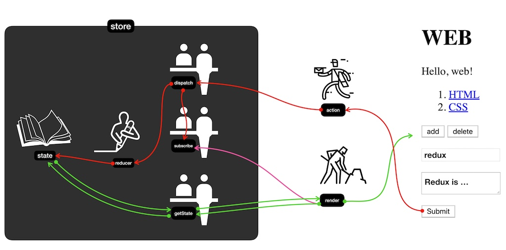
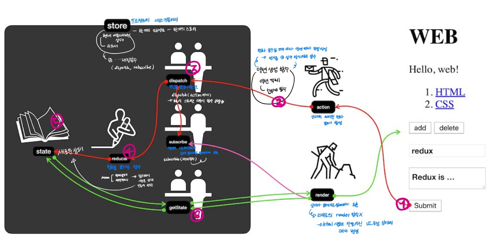

# 16. 리덕스 라이브러리 이해하기

React를 다루는 기술 책

# 리덕스(Redux) 라이브러리란?

- 가장 많이 사용하는 **리액트 상태 관리 라이브러리**
- 장점
    - 컴포넌트의 상태 업데이트 관련 **로직을 다른 파일로 분리 → 더욱 효율적**으로 관리 가능
    - 컴포넌트끼리 같은 상태를 공유 할 때 여러 컴포넌트 거치지 않고 **손쉽게 상태 값 전달 + 업데이트**
    - **전역 상태를 관리할 때 굉장히 효과적**

## Context API VS Redux lib

- **단순히 전역 상태 관리만 → Context API 사용 충분**
- **상태를 체계적으로 관리 필요 → 리덕스 사용**
- 프로젝트의 규모가 클 경우 리덕스 사용 추천

    → 코드의 유지보수성, 작업 효율 극대화

# 리덕스 개념 정리



출처 : 생활코딩 Redux - 리덕스 여행의 지도
([https://s3-ap-northeast-2.amazonaws.com/opentutorials-user-file/module/4078/11034.png](https://s3-ap-northeast-2.amazonaws.com/opentutorials-user-file/module/4078/11034.png))

## 액션(action)

- 상태(state)에 어떠한 **변화**가 필요하면 액션(action) 발생
- 액션은 객체로 표현

```jsx
{
   type : 'TOGGLE_VALUE'
}
```

- 액션 객체
    - *type 필드* →  *type필드*의 값을 액션의 이름이라고 생각(필수값)
    - *type 필드* 제외 나머지 → 나중에 상태 업데이트 할 때 참고해야 할 값
        - 작성자 마음대로 넣을 수 있음

```jsx
{
   type : 'ADD_TODO',
   data : {
       id: 1,
       test : '리덕스 배우기'
   }
}
{
   type : 'CAHNGE_INPUT',
   text : '안녕하세요'
}
```

## 액션 생성 함수(action creator)

- 액션 생성 함수(action creator)는 **액션 객체를 만들어 주는 함수**

```jsx
function addTodo(data){
   return {
       type : 'ADD_TODO',
       data
   };
}
//화살표 함수
const changeInput = text => ({
   type:'CHANGE_INPUT',
   text
});
```

- 액션 생성 함수 존재 이유
    - 변화 일으켜야 할 때마다 액션 객체 생성위해 코드 작성 번거로움 + 실수 가능성

    → 방지 위해 함수로 만들어서 관리

## 리듀서(reducer)

- 리듀서(reducer)는 **변화를 일으키는 함수**
- *dispatch 함수*가 **액션을 만들어서 리듀서 함수 발생**
- 리듀서 파라미터
    - 현재 상태
    - 전달받은 액션 객체

→ 두 값을 참고해 **새로운 상태를 만들어서 반환**

```jsx
//초기화 객체
const initialState = {
   counter : 1
};

//state(상태)가 undefined라면 initialState로 초기화
function reducer(state = initialState, action){
   switch(action.type){
       case INCREMENT :
					 //새로운 상태 반환
           return {
               counter : state.counter + 1
           };
       default :
	       return state;
   }
}
```

## 스토어(store)

- 프로젝트에 리덕스 적용 위해 스토어(store) 생성
- **한 개의 프로젝트는 단 하나의 스토어만 가질 수 있음**
- 스토어 내부
    - 현재 애플리케이션 상태
    - 리듀서
    - 중요한 내장 함수 (dispatch, subscribe ...)

## 디스패치(dispatch)

- 스토어의 내장 함수 중 하나
- **액션을 발생시키는 함수**
    - 디스패치 함수는 `dispatch(action)`과 같은 형태로 **액션 객체를 파라미터로 넣어서 호출**
- 디스패치 함수가 호출되면 **스토어는 리듀서 함수를 실행시켜서 새로운 상태를 만들어 줌**

## 구독(subscribe)

- 스토어의 내장 함수 중 하나
- `subscribe(리스터 함수)` → 리스터 함수를 파라미터로 넣어서 호출
    - 리스너 함수가 **액션이 디스패치되어 상태가 업데이트될 때마다 호출**

```jsx
const listener = () => {
   console.log('상태가 업데이트됨');
}
const unsubscribe = store.subscribe(listener);
 
unsubscribe();//추후 구독을 비활성화할 때 함수를 호출
```

## 정리



출처 : 생활코딩 Redux - 리덕스 여행의 지도
([https://s3-ap-northeast-2.amazonaws.com/opentutorials-user-file/module/4078/11034.png](https://s3-ap-northeast-2.amazonaws.com/opentutorials-user-file/module/4078/11034.png))

```jsx
import {createStore} from 'redux';

const divToggle = document.querySelector('.toggle');
const counter = document.querySelector('h1');
const btnIncrease = document.querySelector('#increase');
const btnDecrease = document.querySelector('#decrease');

//액션 이름 정의
const TOGGLE_SWITCH = 'TOGGLE_SWITCH';
const INCREASE = 'INCREASE';
const DECREASE = 'DECREASE';

//액션 생선 함수 (액션 이름을 사용하여 액션 객체를 만든다.)
const toogleSwtich = () => ({type : TOGGLE_SWITCH});
const increase = diffirence => ({type : INCREASE});
const decrease = () => ({type : DECREASE});

//초깃값 설정 (형태 자유)
const initalState = {
    toggle : false,
    counter : 0
};

//리듀서 함수 정의(리듀서는 변화를 일으키는 함수)
//state가 undefined일 때는 initalState를 기본값으로 설정
function reducer(state = initalState, action){
    switch(action.type){
        case TOGGLE_SWITCH:
            return {
                ...state,
                toogle : !state.toggle
            };
        case INCREASE:
            return {
                ...state,
                counter : state.counter + action.difference
            };
        case DECREASE:
            return {
                ...state,
                counter: state.counter - 1
            };
        default : 
            return state;
    }
}
//리듀서에서는 상태의 불변성을 유지하면서 데이터에 변화를 일으켜 주어야 한다.

//스토어 만들기
const store = createStore(reducer);

//스토어 내장 함수 사용
//상태가 업데이트될 때마다 호출 -> 리액트의 render 함수와는 다르게 이미 html을 사용하여 만들어진 UI 속성을 상태에 따라 변경
const render = () => {
    const state = store.getState();
    //토글 처리
    if(state.toggle){
        divToggle.classList.add('active');
    }else{
        divToggle.classList.remove('active');
    }
    //카운터 처리
    counter.innerText = state.counter;
}

render();

//구독하기 - 스토어의 상태가 바뀔 때마다 방금 만든 render 함수가 호출되도록
//subscribe - 파라미터로 함수 형태의 값 전달 -> 전달된 함수는 추후 액션이 발생하여 상태가 업데이트될 때마다 호출
store.subscribe(render);

//액션 발생시키기
divToggle.onclick = () => {
    store.dispatch(toogleSwtich());
};
btnIncrease.onclick = () => {
    store.dispatch(increase(1));
};
btnDecrease.onclick = () => {
    store.dispatch(decrease());
}
```

# 리덕스의 세가지 규칙

- 단일 스토어
    - **하나의 애플리케이션 안에 하나의 스토어 권장**
    - 특정 업데이트가 빈번, 애플리케이션의 특정 부분 완전히 분리 시 **여러 개 스토어 가능
     → 상태 관리 복잡해짐**
- 읽기 전용 상태
    - 리덕스 상태 = 읽기 전용
    - **상태를 업데이트할 때 기존의 객체는 건드리지 않고 새로운 객체 생성**
    - 리덕스 ***불변성*** 유지 이유
        - 내부적으로 데이터가 변경되는 것을 감지하기 위해 얕은 비교 검사
        - 객체의 변화를 감지할 때 객체의 깊숙한 안쪽 비교 X → 좋은 성능 유지 가능
- 리듀서는 순수한 함수
    - 변화 일으키는 리듀서 함수 = 순수한 함수
    - 리듀서 함수 파라미터→ **이전 상태**와 **액션 객체**
    - **파라미터 외의 값에 의존 X**
        - 이전 상태 변경 X → 변화를 준 새로운 상태 객체 생성해 반환
    - **똑같은 파라미터로 호출된 리듀서 함수 → 언제나 똑같은 결과 값 반환**
        - 파라미터가 같아도 다른 결과를 만들어 낼 수 있는(랜덤 값, Date 함수)것은 **리듀서 함수 바깥에서 처리**
