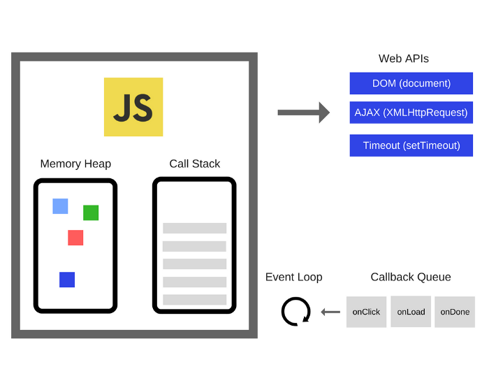
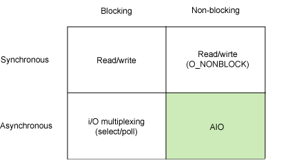

# JavaScript는 비동기가 어떻게 가능할까?

# 자바 스크립트란?

- 웹을 풍부하게 만들어주는 작고 가벼운 언어로 웹 브라우저에서 실행하는 스크립트 언어 기술

# 자바 스크립트 특징

- 인터프리터 언어
    - 인터프리터 언어 : 프로그램을 한줄마다 기계어로 번역해 실행하는 프로그래밍 언어
    - 컴파일 언어 : 소스 코드 여러 개를 묶어서 컴파일 한 후에 실행되는 프로그래밍 언어
    - **클라이언트의 웹 브라우저에 의해 해석되고 실행**
- **동적 프로토타입 기반 객체 지향 언어**
    - JS는 프로토타입 기반 객체 지향 언어로 객체 생성 후 프로퍼티, 메서드 등을 동적으로 추가, 삭제 가능
    - 상속과 클래스라는 개념은 없음!
- 동적 타입 언어
    - **JS의 변수 타입 X** → 프로그램 실행 도중 변수에 저장되는 데이터 타입 동적 변환 가능
- 함수가 일급 객체(First class object)
    - **JS의 함수는 객체**이므로 함수에 함수를 인수로 넘길 수 있음
- 함수가 클로저 정의
- **싱글 스레드로 동작하는 언어**

***→ 싱글 스레드인데 JS가 싱글 스레드이면서 동시성을 가질수 있는 이유는?***

**자바스크립트 동작 원리에 대해 알면 답이 나온다!!**

# 자바스크립트 엔진과 랜더링 엔진

JavaScript Engine 

- JavaScript로 작성한 코드를 해석하고 실행하는 **인터프리터**
- Google V8엔진(c++로 작성된 고성능 언어)

Rendering Engine

- HTML괴 CSS 로 작성된 마크업 관련한 코드들을 콘텐츠로서 웹 페이지에 **'rendering' 하는 역할**
- 런타임 환경 - 브라우저, nodeJS

## 자바스크립트의 런타임



출처 : [https://miro.medium.com/max/700/1*FA9NGxNB6-v1oI2qGEtlRQ.png](https://miro.medium.com/max/700/1*FA9NGxNB6-v1oI2qGEtlRQ.png)

**Call Stack**

- 단 하나의 호출 스택 사용
- 요청 들어올 떄마다 해당 요청 **순차적으로 호출 스택에담아 처리**
- Stack 자료구조의 특성 사용해 task 수행하는 원리

**→ JS 가 싱글스레드 기반의 언어라는 말 = JS 가 하나의 메인스레드와 하나의 콜스택을 가짐!**

**Task Queue(Event Queue)**

- 런타임 환경에서 처리해야 하는 Task들을 **임시 저장하는 대기 큐**
- Call Stack이 비어졌을 때 먼저 대기열에 들어온 순서대로 수행
- 비동기로 호출되는 함수들을 Call Stack에 쌓이지 않고 Task Queue에 enqueue

→ **Event Loop는 현재 실행 중인 태스트가 없는지, 태스크 큐에 태스크가 있는지 반복적 확인**

**Heap**

- 동적으로 생성된 객체는 힙에 할당

# 동시성 보장하는 비동기?

 **JavaScript 런타임은 자체적으로 비동기 지원 X! → 런타임 환경에서 담당(브라우저, Nodejs 등)**

각 이벤트를 스케쥴링하는 것은 그것을 둘러싸고 있는 환경!! (비동기 작업들도 환경에서 지원함!)

→ 위 이미지가 JS의 엔진과 외부 런타임 환경 조화된 모습

## 비동기 작업 실행 순서(런타임 환경 Web API)


출처 : [https://seolhun.github.io/assets/images/contents/20180404/js/js-eventloop.png](https://seolhun.github.io/assets/images/contents/20180404/js/js-eventloop.png)

1. 코드 ⇒ **호출스택에 쌓인 후 실행**
2.  JS의 엔진 ⇒ 코드 중 **비동기 작업을 Web API에게 위임**
3.  Web API는 해당 비동기 작업을 **수행 후 콜백 함수를 이벤트 루프를 통해 콜백 큐**에 넘김
4. 이벤트 루프는 콜스택에 쌓여있는 **함수가 없을 때에, 태스크 큐에서 대기하고 있던 콜백함수를 콜스택으로 넘김
(**Event Loop는 현재 실행 중인 태스트가 없는지, 태스크 큐에 태스크가 있는지 반복적 확인)
5. **콜스택에 쌓인콜백함수가 실행되고, 콜스택에서 제거 후 완료**

```jsx
console.log('첫번째로 실행됩니다.');
setTimeout(() => console.log('최소 1초 후에 실행됩니다.'), 1000);
console.log('언제 실행될까요?');

//츨력
첫번째로 실행됩니다.
언제 실행될까요?
최소 1초 후에 실행됩니다.

console.log('첫번째로 실행됩니다.');
setTimeout(() => console.log('최소 0초 후에 실행됩니다.'), 0);
console.log('언제 실행될까요?');

//츨력
첫번째로 실행됩니다.
언제 실행될까요?
최소 0초 후에 실행됩니다.

/*
setTimeout의 인자인 딜레이 시간은 정확한 시간X
->setTimeout의 콜백 함수가 태스크 큐에 쌓여도 콜스택에 쌓여있는 함수들의
실행 시간에 따라 지연 가능!
*/
```

→ *동기 작업* = 다른 코드들을 **[블로킹]**

→ *비동기 작업* = **[논블로킹]**Web API에게 넘겨줌으로 해당 작업 완료시 까지 다른 코드들 실행 가능

## 비동기 VS 동기 / 블로킹 VS 논블로킹

- `Syncronous` 동기 : 요청을 보낸 후 해당 요청의 응답을 받아야 다음 동작을 실행하는 방식
    - 함수의 결과를 호출한 쪽에서 처리
- `Asynchronous` 비동기 : 요청을 보낸 후 응답과 관계없이 다음 동작을 실행하는 방식
    - 함수의 결과를 호출한 쪽에서 처리 X

- `Blocking` 블로킹 : 자신의 수행결과가 끝날 때까지 **제어권을 갖고 있는 것**
- `non-blocking` 논블로킹 : 자신이 호출되었을 때 **제어권을 자신을 호출한 쪽으로 넘기고** 자신을 호출한 쪽에서 다른 일을 할 수 있도록 하는 것



**→ 비슷하지만 다른 개념!**

# 비동기 코드

- Callback 함수
- Promises
- Async & Await

# 결론!

페이지 렌더링 동작을 방해하지 않고 브라우저의 응답도 끊지 않으면서 연산량이 많은 코드를 실행할 수 있는 방법은 비동기 콜백!

**→ JS는 싱글 스레드인데 비동기가 어떻게 가능할까?**

바로 JS는 **비동기 작업들은 런타임(Runtime) 환경에게 넘겨줌**으로써, 해당 작업이 완료될 때까지 다른 코드들 실행 가능

( JS가 싱글스레드 기반이지만 **비동기 작업**을 수행하고 **동시성**을 가지고 **논블로킹I/O**가 가능)

# 출처

- [https://medium.com/@vdongbin/javascript-작동원리-single-thread-event-loop-asynchronous-e47e07b24d1c](https://medium.com/@vdongbin/javascript-%EC%9E%91%EB%8F%99%EC%9B%90%EB%A6%AC-single-thread-event-loop-asynchronous-e47e07b24d1c)
- [https://velog.io/@jiwon/Javascript는-동기일까-비동기일까](https://velog.io/@jiwon/Javascript%EB%8A%94-%EB%8F%99%EA%B8%B0%EC%9D%BC%EA%B9%8C-%EB%B9%84%EB%8F%99%EA%B8%B0%EC%9D%BC%EA%B9%8C)
- [https://k39335.tistory.com/9](https://k39335.tistory.com/9)
- [https://joshua1988.github.io/web-development/translation/javascript/how-js-works-inside-engine/](https://joshua1988.github.io/web-development/translation/javascript/how-js-works-inside-engine/)
- [https://blog.sessionstack.com/how-javascript-works-inside-the-v8-engine-5-tips-on-how-to-write-optimized-code-ac089e62b12e](https://blog.sessionstack.com/how-javascript-works-inside-the-v8-engine-5-tips-on-how-to-write-optimized-code-ac089e62b12e)
- [https://victorydntmd.tistory.com/8](https://victorydntmd.tistory.com/8)
