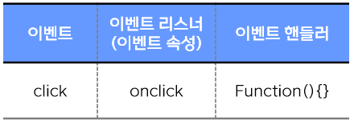
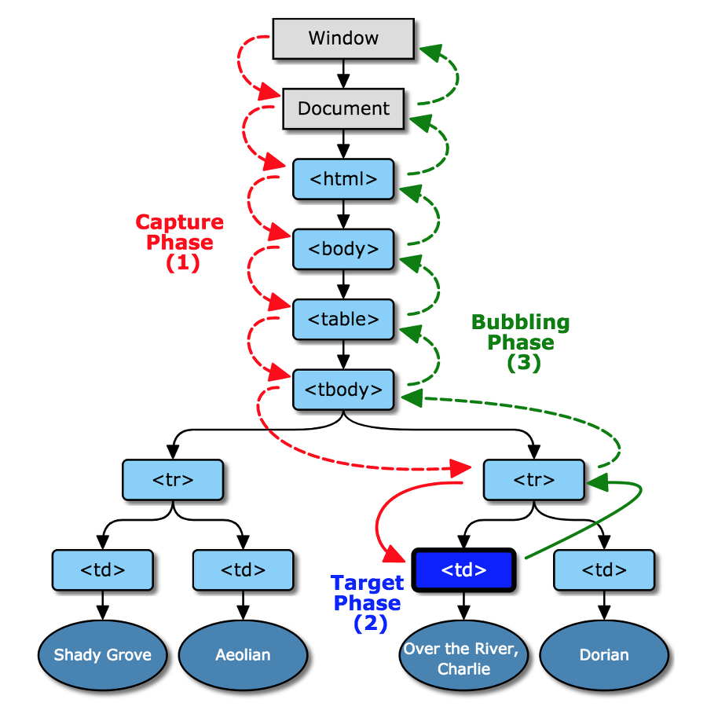
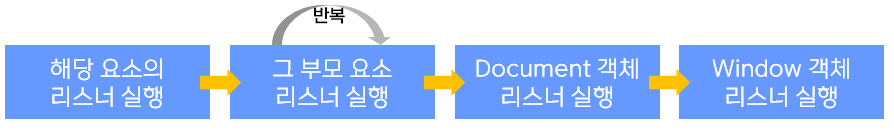
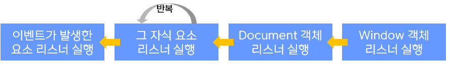

# event에 대하여...

# 👻이벤트(event)란?

이벤트(event)는 클릭 했을 '때', 스크롤을 했을 '때', 필드의 내용을 바꾸었을 '때' 같이 **어떤 사건** 또는 **행위**를 의미합니다. 

이벤트는 **DOM과 밀첩한 관계**를 가지게 됩니다.

프로그램에는 이런 사용자의 행위와 사건을 예측하여 미리 사용할 수 있는 이벤트가 준비되어 있습니다.

🤔이벤트가 발생하면 이를 감지하고 대응하는 처리 호출해 주어야 하는데...? 🤔

바로, **브라우저에서 이벤트를 자동으로 감지하고 발생 시에 통지**를 해 줍니다!

이러한 과정을 통해 사용자와 웹페이지는 **상호 작용(interaction)**이 가능하게 됩니다.

🤔그럼 이벤트와 항상 같이 붙어다니는 **이벤트 핸들러**와 **이벤트 리스너**는 무엇일까요?🤔

## 이벤트 핸들러(event handler)란?

이벤트(event)가 **발생했을 때 그 처리를 담당하는 실행 함수**를 가리킵니다. 즉, 이벤트가 발생했을 때 동작하는 코드를 의미합니다.

## 이벤트 리스너(event litener)란?

지정된 타입의 이벤트가 특정 요소에서 발생하면, 웹 브라우저는 그 요소에 등록된 이벤트 리스너를 실행시킵니다.

## 🐾이벤트 핸들러, 이벤트 리스너

이벤트 핸들러가 연결된 특정 DOM에서 지정된 타입의 이벤트 발생

 ⇒ 웹 브라우저는 자동으로 이벤트 리스너에 연결된 이벤트 핸들러 실행 프로세스
 
 

## 이벤트 등록 방법

이벤트 리스너는 **해당 객체나 요소에 등록되어야만 호출이 가능**합니다.

- inline 방법

    ```html
    <input type="button" onclick="alert('Hello world');" value="button" />
    ```

- property로 등록하는 방법

    이벤트 대상에 해당하는 객체의 프로퍼티로 이벤트를 등록하는 방식입니다.

    ```jsx
    <input type="button" id="target" value="button" />

      var dom = document.getElementById('target');
      dom.onclick = function(){
          alert('Hello world');
      }
    ```

- `addEventListener()` 전달하는 방법

    가장 권장되는 방식입니다! 여러개의 이벤트 핸들러를 등록할 수 있기 때문인데요. 하지만 해당 방식은 internet explore8 이하에서는 호환되지 않습니다.

    ```jsx
    dom.addEventListener('click', function(event){
        alert('Hello world, '+ event);
    });
    ```

# 🐱‍💻이벤트 객체(event object)

```jsx
dom.addEventListener('click', function(event){
    alert('Hello world, '+ event);
});
```

🤔이 코드에서 보이는 `event`는 무엇을 의미할까요?🤔

바로, 이벤트 객체(event object) 입니다. 

이벤트 객체(event object)란 **특정 타입의 이벤트와 관련 있는 객체**입니다. 이벤트 리스너가 호출될 때 전달되는 **인수가 바로 이벤트 객체** 입니다.

모든 이벤트 객체는 해당 **이벤트에 대한 상세 정보**와 **이벤트를 조작하는 메소드**들이 들어있습니다.

또한, 프로퍼티를 가지는데 ...

- 이벤트의 타입을 나타내는 `type`프로퍼티
- 이벤트의 대상을 나타내는 `target`프로퍼티

대표적으로 이 두 프로퍼티를 가집니다.

```jsx
var btn = document.getElementById("btn"); // 아이디가 "btn"인 요소를 선택함.
btn.addEventListener("click", clickBtn);  // 선택한 요소에 click 이벤트 리스너를 등록함.
function clickBtn(event) {
    document.getElementById("text").innerHTML =
    "이 이벤트의 타입은 " + event.type + 
		"이벤트의 대상은 " + event.target + "입니다.";
}
```

# 이벤트 호출 순서

```jsx
<div id='dom' onclick="alert('Hello world');"></div>
document.getElementById('dom').addEventListener('click', event => {alert('Hi')});
document.getElementById('dom').addEventListener('click', event => {alert('Hello')});
```

이때 이벤트가 발생하면 브라우저는 

1. 이벤트의 대상이 되는 **객체나 요소에 프로퍼티로 등록한 이벤트 리스너** 가장 먼저 호출
2. `addEventListener()` **메소드 사용한 이벤트 리스너** **등록한 순서대로 호출**

# 이벤트 전파



이벤트는 크게 **3가지**로 구분 가능합니다.

- 버블링
- 캡쳐링
- 타겟(실제 이벤트 발생 요소)

## 🎈버블링(bubbling) 전파 방식

이벤트가 발생한 요소부터 시작해 **DOM 트리를 따라 위쪽으로 올라가며👆 전파**되는 방식입니다.

```jsx
//각 요소마다 버블링 방식으로 click 이벤트 리스너 등록
document.getElementById("divBox").addEventListener("click", event => {
	document.getElementById("text").innerHTML += "div 요소를 click 하셨네요!<br>";
});
document.getElementById("paraBox").addEventListener("click", event => {
	document.getElementById("text").innerHTML += "p 요소를 click 하셨네요!<br>";
});
document.getElementById("spanBox").addEventListener("click", event => {
	document.getElementById("text").innerHTML += "span 요소를 click 하셨네요!<br>";
});
```


장점👍

- 다수의 요소에 공통으로 적용되는 이벤트 리스너를 따로 등록할 필요 없이 공통된 조상 요소에 한 번만 등록하면 처리할 수 있습니다.

## 📸캡쳐링(capturing) 전파 방식

이벤트가 발생한 요소까지 **DOM 트리의 최상위부터 아래쪽으로 내려가며👇 전파**되는 방식입니다.

```jsx
document.getElementById("divBox").addEventListener("click", clickDivEvent, true);
document.getElementById("paraBox").addEventListener("click", clickParaEvent, true);
document.getElementById("spanBox").addEventListener("click", clickSpanEvent, true);
```

캡쳐링 전파 방식을 사용하기 위해서 `addEventListener()` 메소드의 **세번째 인수**에 `true` 값을 전달합니다.

```jsx
target.addEventListener(type, listener[, useCapture]);
```


## 이벤트 전파의 취소

특정 메소드나 프로퍼티를 사용하면 **이벤트의 전파를 취소**할 수 있습니다.

- `stopPropagation()` 메소드 : 태그 클릭 시 부모에게 이벤트가 전달(버블링)되지 않도록 합니다.
- `cancelBubble`프로퍼티

```jsx
function clickLink(event) {
    event.preventDefault();  // 링크의 기본 동작을 취소함.
    document.getElementById("text").innerHTML += "링크의 기본 동작을 막았어요!<br>";
    event.stopPropagation(); // 이벤트의 전파를 취소함.
    document.getElementById("text").innerHTML += "이벤트의 전파를 막았어요!<br>";
}
```

## 이벤트 기본 동작의 취소

특정 이벤트( ex : `<a>`)는 미리 지정된 기본 동작을 가지고 있고 이를 실행하지만 특정 메서드나 프로퍼티를 이용해 **기본 동작의 실행을 취소**할 수 있습니다.

- `preventDefalut()` 메소드 : 기본 동작을 취소합니다.
- `returnValue` 프로퍼티

```jsx
document.getElementById("linkBox").addEventListener("click", event => {
    event.preventDefault(); // 링크의 기본 동작을 취소함.
    document.getElementById("text").innerHTML += "링크의 기본 동작을 막았어요!<br>";
    document.getElementById("text").innerHTML += "a 요소를 click 하셨네요!<br>";
});
```

# 출처

[https://codedragon.tistory.com/5743](https://codedragon.tistory.com/5743)

[https://blog.daum.net/tstory/215](https://blog.daum.net/tstory/215)

[https://ooeunz.tistory.com/17](https://ooeunz.tistory.com/17)

[http://webcache.googleusercontent.com/search?q=cache:m2skDGrCTtkJ:www.tcpschool.com/javascript/js_event_eventListenerCall+&cd=5&hl=ko&ct=clnk&gl=kr](http://webcache.googleusercontent.com/search?q=cache:m2skDGrCTtkJ:www.tcpschool.com/javascript/js_event_eventListenerCall+&cd=5&hl=ko&ct=clnk&gl=kr)

[https://www.zerocho.com/category/JavaScript/post/57432d2aa48729787807c3fc](https://www.zerocho.com/category/JavaScript/post/57432d2aa48729787807c3fc)
