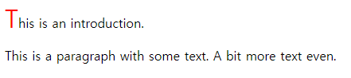
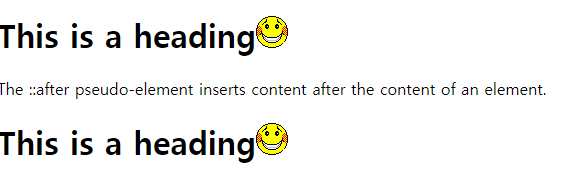

# CSS Pseudo-Element(가상요소)

# Pseudo-Element(가상요소)란?

```css
p::first-line {
  color: blue;
  text-transform: uppercase;
}
```

❓CSS 코드를 보면서 이런 코드를 본 적 있을겁니다.

바로 `::fisrt-line` 이 부분이 의사요소, 가상요소로 불리는 Pseudo-Element인데요.

**Pseudo-Element란?**

- 선택자에 추가하는 키워드로, 선택한 요소의 지정된 부분에 스타일을 입힐 수 있습니다
- 가상클래스처럼 선택자(selector)에 추가되며, 존재하지 않는 요소를 존재하는 것처럼 부여하여 문서의 특정 부분 선택이 가능합니다.

예를 들어 다음과 같은 용도로 사용이 가능합니다.

- 요소의 첫 글자 또는 줄 스타일 지정
- 요소의 내용 앞 또는 뒤에 내용 삽입

‼ 이 글을 시작하기 전, 의사 요소(pseudo-Element)는 가상 요소로 의사 클래스(pseudo-class)는 가상 클래스로 표기를 통일했습니다. 😊

## 문법

```css
선택자::의사요소이름 {속성: 속성값;}
```

💥여기서 주의할 점이 있습니다.

바로, CSS1과 CSS2에서는 하나의 콜론 (`:`)으로 가상 요소를 나타내어 CSS3를 지원하지 않는 브라우저에서는 적용되지 않을 수 있으니 주의해야 합니다.

CSS3에서는 가상 클래스는 하나의 콜론(`:`)을, 가상 요소에는 두 개의 콜론(`::`)을 사용하고 있습니다.

```css
p::first-letter { color: #FFD700; font-size: 2em; font-weight:bold; }
p::first-line { color: #FF4500; }
```

하나의 HTML 요소에 여러개의 의사 요소를 동시에 적용 가능합니다.

## 가상 요소

| Selector        | Example           | Example description|
| ------------- |:-------------:| -----:|
| `::before` | `p::before`| 특정 요소의 내용(content) 부분 바로 앞에 다른 요소를 삽입합니다.|
| `::after` | `p::after`|  특정 요소의 내용(content) 부분 바로 뒤에 다른 요소를 삽입합니다. |
| `::first-letter` | `p::first-letter`|  각 요소의 첫 글자를 선택합니다. |
| `::first-line` | `p::first-line` | 각 요소의 첫 번째 줄을 선택합니다. |
| `::marker` | `p::marker`| `marker` 목록 항목의 마커를 선택합니다. |
| `::selection`| `p::selection`|  해당 요소에서 사용자가 선택한 요소 부분을 선택합니다. |
| `::placeholder`| `p::placeholder`|  Input 필드 안 힌트 텍스트에 스타일을 적용합니다. |

## ::before ::after

- `::before` : 실제 내용 바로 앞에서 생성되는 자식요소
- `::after` : 실제 내용 바로 뒤에서 생성되는 자식요소

`before` 와 `after`를 사용할 때에는 `content`라는 속성이 필요합니다.

특정 요소의 내용(content) 바로 앞 또는 뒤에 삽입할 때 사용하기 때문인데요!

**content란?**

→ HTML 문서에 정보로 포함되지 않은 요소를 CSS에서 새롭게 생성시켜주는 가짜 속성입니다.

대표적으로 사용되는 속성들은 아래와 같습니다.

```css
p::after{ padding-left:5px; content:"|"}
p::after { content: url("/examples/images/img_penguin.png"); }
p::before { content: url("/examples/images/img_penguin.png"); }
```

- `normal` : 아무것도 표시하지 않는 기본값
- `string` : 문자열 생성
- `image` : 이미지, 비디오(크기 조절 불가)
- `counte` : 순서
- `none` : 표시 X
- `attr` : 해당속성의 속성값 표시

## ::first-line ::first-letter

- `::first-line` : 텍스트의 첫 라인만을 선택
- `::first-letter` : 텍스트의 첫 글자만을 선택

`first-line`와 `first-letter`를 사용할 때는 **블록 타입의 요소**에만 사용할 수 있습니다.

```css
p::first-line { color: #FF4500; font-size: 2em; }
p::first-letter { color: #FF4500; font-size: 2em; }
```

또한, 사용할 수 있는 속성이 한정적입니다.

- `font`, `color`, `background`, `margin`, `padding`, `border`, `text-decoration`, `text-transform`, `line-height`, `float`, `clear`, `vertical-align` (단, float 속성값이 none일 경우에만)

## 예제

```html
<!DOCTYPE html>
<html>
	<head>
		<style>
			p.intro::first-letter {
			  color: #ff0000;
			  font-size: 200%;
			}  
		</style>
	</head>
	<body>
		<p class="intro">This is an introduction.</p>
		<p>This is a paragraph with some text. A bit more text even.</p>
	</body>
</html>
```



```html
<!DOCTYPE html>
<html>
<head>
<style>
::marker { 
  color: red;
  font-size: 23px;
}
</style>
</head>
<body>

<ul>
  <li>Coffee</li>
  <li>Tea</li>
  <li>Milk</li>
</ul>

<ol>
  <li>First</li>
  <li>Second</li>
  <li>Third</li>
</ol>

</body>
</html>
```


```html
<!DOCTYPE html>
<html>
<head>
<style>
h1::after {
  content: url(smiley.gif);
}
</style>
</head>
<body>

<h1>This is a heading</h1>
<p>The ::after pseudo-element inserts content after the content of an element.</p>

<h1>This is a heading</h1>

</body>
</html>
```



🤔그럼 가상 클래스는 뭔가요? 둘이 같은 건가요?🤔

## Pseudo-Class(가상 클래스)

별도의 class를 지정하지 않아도 지정한 것 처럼 요소를 선택할 수 있는 것으로 

즉, 가상 클래스(pseudo-class)는 선택하고자 하는 HTML 요소의 특별한 '상태(state)'를 명시할 때 사용합니다.

예를 들면 `:hover`는 사용자가 선택자에 의해 지정된 요소 위를 `hover`시 스타일을 적용합니다.

또한, 가상 요소, 문서 트리의 콘텐츠, 탐색기 히스토리, 콘텐츠 상태 혹은 마우스 위치 처럼 외부 요인 관련 요소에 스타일을 적용할 수 있습니다.

**가상 요소는 가상 클래스와 달리 요소의 특정 부분에 스타일을 적용할 때 사용합니다.**

# 출처

[https://www.w3schools.com/css/css_pseudo_elements.asp](https://www.w3schools.com/css/css_pseudo_elements.asp)

[http://blog.hivelab.co.kr/공유before와after-그들의-정체는/](http://blog.hivelab.co.kr/%EA%B3%B5%EC%9C%A0before%EC%99%80after-%EA%B7%B8%EB%93%A4%EC%9D%98-%EC%A0%95%EC%B2%B4%EB%8A%94/)

[http://webcache.googleusercontent.com/search?q=cache:xa0MC2GUVPcJ:www.tcpschool.com/css/css_selector_pseudoElement+&cd=2&hl=ko&ct=clnk&gl=kr](http://webcache.googleusercontent.com/search?q=cache:xa0MC2GUVPcJ:www.tcpschool.com/css/css_selector_pseudoElement+&cd=2&hl=ko&ct=clnk&gl=kr)
