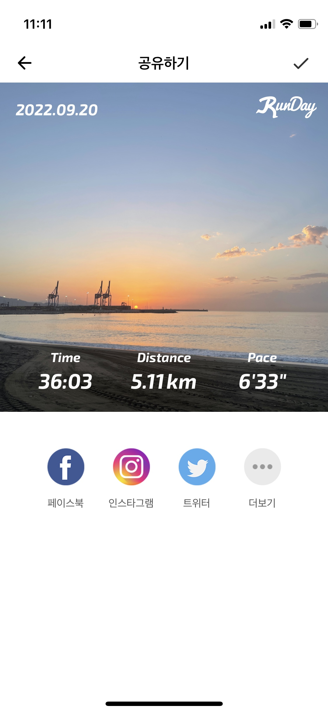

## OAuth2.0 이란?

- **인가(Authorization)**을 위한 업계 표준 프로토콜로 웹 어플리케이션 이나 전자제품 등을 위한 특정 인가 플로우를 제공함으로써 개발의 간략함에 초점을 맞추고 있다.

## 언제 사용할 수 있을까?

다양한 경우가 있겠지만 그 중에 대표적인 예를 들어보겠다. 

- **회원가입/로그인 (사실 이건 OpenID Connect, 관련 내용은 아래에)**

예를 들어 Jorge가 스카이스캐너 웹사이트에 회원가입을 하고자 할 때 굳이 새로 가입하지 않고 기존에 가지고 있는 페이스북 계정을 통해 회원가입을 할 수 있다. 그러면 페이스북에 저장되어 있는 Jorge의 이름과 이메일 주소를 (사전에 Jorge의 동의를 받고) 스카이스캐너에서 사용할 수 있다. 

- **SNS에 게시물 올리기**

   

Rebeca가 런데이 어플리케이션에서 자신의 운동기록을 인스타그램에 공유하고 싶을 때 인스타그램에 직접 로그인하고 사진을 업로드할 필요없이 런데이 어플리케이션에서 바로 공유하기를 통해 업로드를 할 수 있다. 

## OAuth2.0의 Workflow

Workflow 전에 각자의 역할을 먼저 설명한다면

- **Resource Owner** : 리소스를 소유하고 있는 사용자 혹은 시스템으로 써 접근 권한을 부여할 수 있다.
- **Client** : 리소스 접근을 요청하는 시스템. 리소스에 접근하기 위해서는 Client는 적합한 Access Token을 가지고 있어야 한다.
- **Authorization Server:** Client이 Acess Token을 요청하는 서버. Resource Owner에 정의된 약관과 성공적인 인가를 통해 토큰을 발행한다.
- **Resource Server** : 사용자의 리소스를 보호하고 Client로 부터 접근 요청을 받는다.

](./img/Untitled.png)

이미지 출처 : [https://www.digitalocean.com/community/tutorials/an-introduction-to-oauth-2](https://www.digitalocean.com/community/tutorials/an-introduction-to-oauth-2)

1. 어플리케이션(Client)은 사용자로부터 서비스 리소스에 접근하기 위한 인가(Athorization) 요청을 보낸다. 
2. 사용자가 요청을 허가하면, 어플리케이션(Client)은 권한(Authorization Grant)를 부여 받는다. 
3. 어플리케이션(Client)은 Authorization Server (API)에서 부여받은 권한(Authorization Grant)와 본인 인증과 함께 access token을 요청한다. 
4. 본인 인증과 권한(Authorization Grant)가 통과가 되면, Authorization server(API)는 access token을 전달함으로써 인가(Authorization)가 마무리 된다. 
5. 어플리케이션(Client)은 resource server(API)에게 인가(Authorization)용 access token과 함께 리소스를 요청한다. 
6. access token이 유효하다면, resource server (API)는 어플리케이션(Client)에게 요청받은 리소스를 제공 한다. 

## Spring Security

- 스프링 기반 어플리케이션의 보안의 위한 표준. 인증(Authentication)과 인가(Authorization) 기능을 가진 프레임워크

- 로그인/로그아웃 기능
- URL 접근 제한
- 특정 권한 부여
- 보안 취약점 (Session fixation, Clickjacking 등등)을 관리
- Supports OAuth

## OpenID Connect

- OpenID Connect는 OAuth2.0을 확장하여 인증방식을 표준화 한다.
- OAuth2.0은 Authorization을 위한 프로토콜인 반면에 OpenID Connect는 Authentication을 위한 프로토콜이다.  OAuth2.0은 Authorization을 위한 프로토콜이기 때문에 Authentication을 사용하기 위해서는 OpenID Connect Exention이 필요하다.

## OAuth2.0 vs OpenID Connect

OAuth2.0은 (Authorization)

- 클라이언트 API에 접근을 허가하고
- 다른 시스템에 있는 사용자 데이터 접근을 부여받는다

OpenID Connect는 (Authentication)

- 로그인
- 다른 시스템에서도 계정이 사용가능 하도록 한다

도움받은 자료 : [https://www.youtube.com/watch?v=996OiexHze0](https://www.youtube.com/watch?v=996OiexHze0)

[https://speakerdeck.com/nbarbettini/oauth-and-openid-connect-in-plain-english?slide=43](https://speakerdeck.com/nbarbettini/oauth-and-openid-connect-in-plain-english?slide=43)