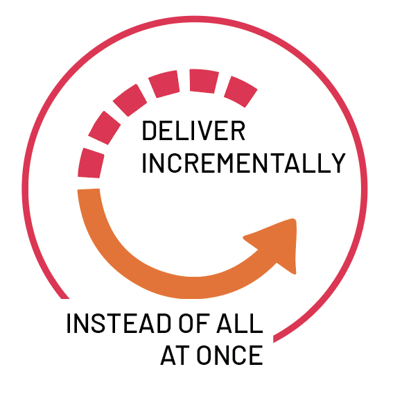
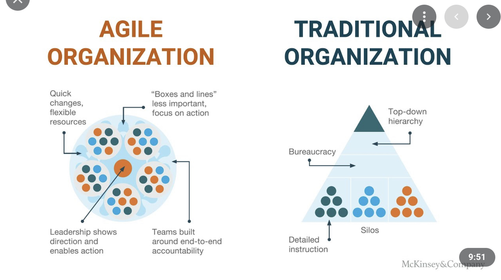
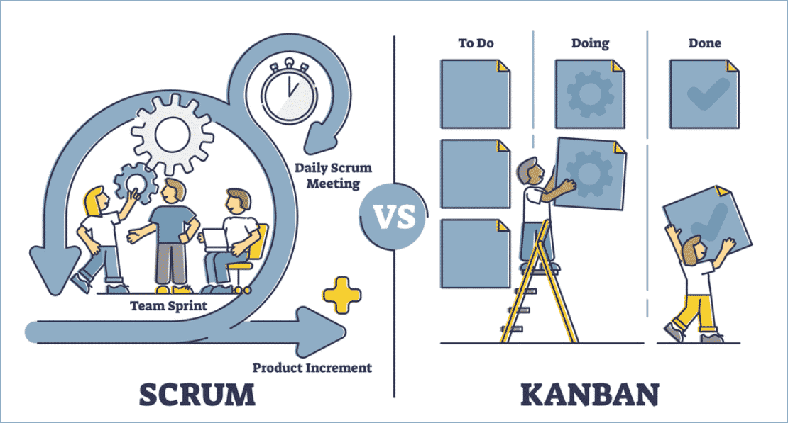
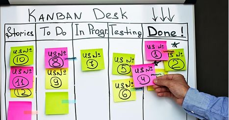
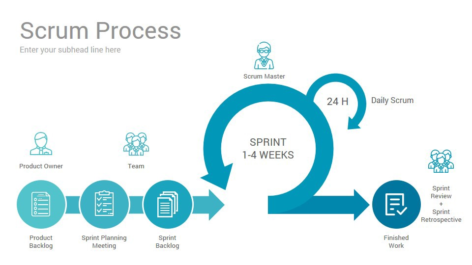

# Agile 이란? (Kanban, Scrum)

최근에 이력서를 넣으면서 Job Description에 Agile Organization이나 Agile Team Player, agile moethologies라는 단어를 많이 접해서 확실하게 이해 하기 위해서 정리해보고 싶었다. 

## Agile 이란

- 프로젝트 운영 및 소프트웨어 개발 방법론
- 작지만 소모적인 단위로 업무를 전달한다
- 계획, 요구사항, 결과를 지속적으로 평가함으로써 변화에 빠르게 대응할 수 있는 자연스러운 메커니즘을 가질 수 있도록 한다
- 에자일은 협력적이고 다기능의 팀에 적합하다
- 열린 소통, 협업, 적용 및 신뢰는 애자일의 핵심

Agile을 적용하기 위해는 두가지 종류가 있다. (더 있을 수도 있음) 

## Kanban

- 연속점 흐름 처리 방식
- 칸반 보드로 시각화 되고 단계는 열로 포시
- 우선 순위가 낮은 이슈들은 아래 배치
- Work-In-Process(WIP)가 동시에 개발이 진행 될 수있는 아이템의 수를 제한

## Scrum

- 스프린트(Sprint)라고 불리는 업무주기를 반복
- Scrum master라는 조력자가 프로세스를 인도
- 

