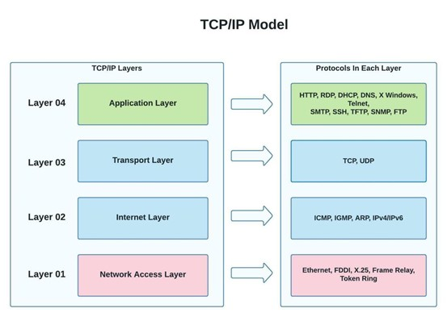
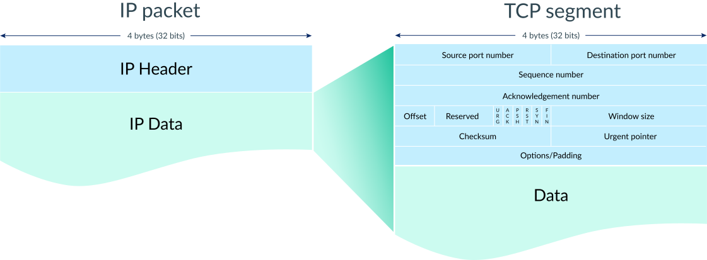
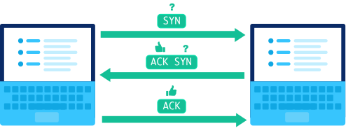
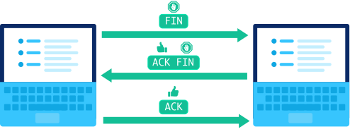

# TCP/IP 

유투브에서 아래 영상으로 보고 나서 아직 개념 정리가 잘 안되었다고 생각 되어 글로 정리해 보아야겠다는 생각이 들었다! 

https://youtu.be/K9L9YZhEjC0

TCP는 Transmission Control Protocl의 약자로 신뢰있는 패킷 운반을 하기위해 사용되는 IP 상위에 있는 프로토콜이다. 

TCP/IP는 총 4개의 계층이 있다. 

## Packet Format
TCP/IP에서 데이터를 전송할 때 사용하는 포맷을 패킷이라고 하고 패킷 안에 있는 IP 데이터를 세그먼트라고 한다. 

비유하자면 하트 이미지의 데이터를 전송하고자 할 때 하트 이미지는 1.4MB 이고 서버에서 한번에 읽을 수 있는 메모리가 64KB 일 때 이미지를 한번에 전부 전송할 수가 없으니 하트 이미지를 퍼즐로 조각을 냈다고 해보자.
하트 이미지를 조각내어 전송할 때 퍼즐 조각 하나씩 전송하는데 이 때 퍼즐 조각이 세그먼트이고 퍼즐 조각(세그먼트)을 보내기 위해 사용된 택배 박스를 패킷이라고 한다. 

패킷(택배 박스)에는 IP 데이터와 IP 헤더가 있는데 IP 헤더에는 송신 주소와 수신 주소, TTL 등이 적혀있고 
IP 데이터에는 세그먼트(퍼즐 조각)를 가지고 있다. 

각 세그먼트에는 헤더와 데이터가 있는데, 헤더에는 송신 포트, 수신 포트, 시퀀스 넘버, 등 다양한 정보가 있다.

## TCP/IP 흐름

### Step 1: 연결 

TCP를 통해 데이터를 보내고자 할때 가장 먼저 3-way handshake를 사용해 연결을 수립해야 한다. 

첫번째 컵퓨터가 패킷에 SYN을 담아 보내면 (내 소리가 들리니?)

두번째 컴퓨터가 패킷에 ACK (응, 들려.)와 SYN (너도 내소리가 들리니?)를 보내면

첫번째 컴퓨터가 다시 패킷에 ACK (응, 나도 들려)를 보낸다. 

연결에 사용된 세개의 패킷에는 대게 어떤 데이터도 가지고 있지 않는다. 3-way handshake가 끝나고 나면 진짜 데이터가 담긴 패킷을 보낼 준비가 되었다는 것이다. 

### Step 2: 데이터 전송

TCP를 통해 패킷이 전송이 되면, 수신자는 반드시 무엇을 받았는지 알려야 한다. 

첫번째 컴퓨터가 시퀀스 넘버와 데이터가 담긴 패킷을 보내면

두번째 컴퓨터는 ACK와 ACK넘버(다음에 받아야하는 세그먼트 넘버)를 보낸다. 

시퀀스넘버와 ack넘버는 데이터가 성공적으로 받아졌는지, 유실되었는지, 중복으로 전송되었는지 확인할 수 있게 도와준다. 

### Step 3: 연결 종료

더이상 데이터를 전송하고 싶지 않거나 받고 싶지 않을 때 연결을 끊을 수 있다. 

연결을 끊고자 하는 컴퓨터에서 FIN이 담긴 패킷을 보내면 (나 그만 끊을게)

다른 컴퓨터가 ACK(응. 알겠어)와 FIN(나도 끊을게)이 담긴 패킷을 보내면

다시 한번 ACK(응. 나도 알겠어)가 담긴 패킷을 보내면 연결이 종료가 된다. 

