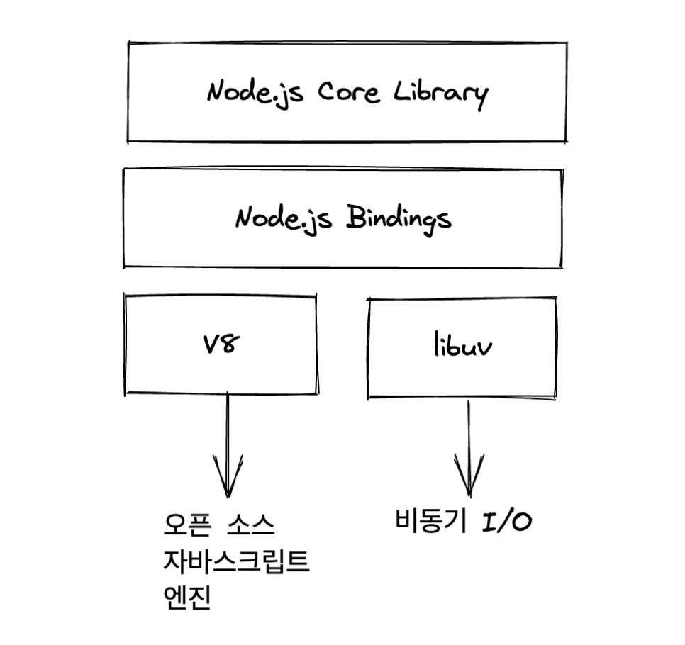
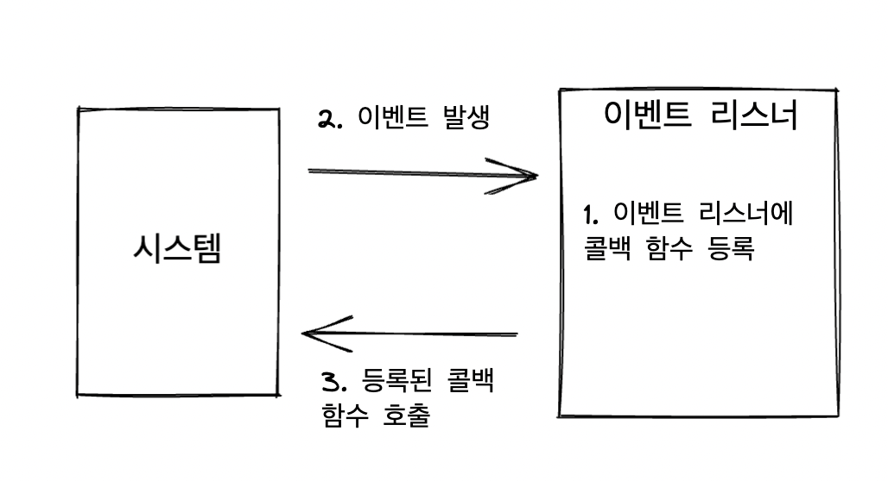

# 노드 시작하기

# 자바스크립트 런타임

<aside>
💡 Node.js®는 [Chrome V8 JavaScript 엔진](https://v8.dev/) 으로 빌드된 JavaScript 런타임입니다.

</aside>

- 런타임 : 특정 언어로 만든 프로그램을 실행할 수 있는 환경. 쉽게 말해 JavaScript 실행기
- 기존에는 자바스크립트 프로그램을 웹 브라우저 위에서만 실행할 수 있었음(브라우저는 자바스크립트 런타임을 내장)
- 구글이 V8 엔진을 사용한 크롬을 출시하였고, V8 엔진은 다른 자바스크립트 엔진과 달리 매우 빨랐음. 오픈 소스로 코드 공개함
- 노드의 내부 구조
    
    
    
    - V8과 libuv는 C와 C++로 구현되어 있음

# 이벤트 기반

- 노드는 이벤트 기반 방식으로 동작하므로, 이벤트가 발생하면 이벤트 리스너에 등록해둔 콜백 함수를 호출함
- 발생한 이벤트가 없거나 이벤트를 다 처리하면, 노드는 다음 이벤트가 발생할 때 까지 대기함



```jsx
function run() {
	console.log('3초 후 실행');
}

console.log('시작');
setTimeout(run, 3000);
console.log('끝');
```

- 이벤트 루프 : 이벤트 발생 시 호출할 콜백 함수들을 관리하고, 호출된 콜백 함수의 실행 순서를 결정하는 역할을 담당함. 노드가 종료될 때까지 이벤트 처리를 위한 작업을 반복하므로 루프(loop)라고 부름
- 백그라운드 : setTimeout 같은 타이머나 이벤트 리스너들이 대기하는 곳. 자바스크립트가 아닌 다른 언어로 작성된 프로그램이라고 봐도 됨
- 태스크 큐 : 이벤트 발생 후, 백그라운드에서는 태스크 큐로 타이머나 이벤트 리스너의 콜백함수를 보냄. 정해진 순서대로 콜백들이 줄 서있으므로 콜백 큐 라고도 부름.
1. **호출 스택**에 anonymous(전역 컨텍스트), setTimeout()이 쌓임
2. setTimeout()이 실행되면서 **백그라운드**로 타이머, run 콜백을 보냄. 스택에서 빠짐
3. anonymous가 스택에서 빠짐(프로그램 종료. 스택 비워짐)
4. **백그라운드**에서 3초 센 후 , run 콜백을 **태스크 큐**로 보냄
5. **호출 스택**이 비워져있으면, **이벤트루프**가 **태스크 큐**의 콜백을 **호출 스택**으로 올림 → 실행
    1. 만약 호출 스택에 함수들이 너무 많이 들어 있으면 3초가 지난 후에도 run 함수가 실행되지 않을 수 있음. 이벤트 루프는 호출 스택이 비어 있을 때만 태스크 큐에 있는 run 함수를 호출 스택으로 가져오니.

# 논 블로킹 I/O

```jsx
function longRunningTask() {
	// 오래 걸리는 작업
	console.log('작업 끝');
}

console.log('시작');
longRunningTask();
console.log('다음 작업');

시작
작업 끝
다음 작업
```

```jsx
function longRunningTask() {
	// 오래 걸리는 작업
	console.log('작업 끝');
}

console.log('시작');
setTimeout(longRunningTask, 0);
console.log('다음 작업');

시작
다음 작업
작업 끝
```

- setTimeout(콜백, 0)은 코드를 논 블로킹으로 만들기 위해 사용하는 기법 중 하나임
    - 노드에서 사실 setImmediate를 주로 더 사용하긴 함
- setTimeout을 이용함으로 longRunningTask가 태스크 큐로 보내짐으로 일반적인 함수 호출 순서대로 호출되지 않음.
- longRunningTask에 I/O 작업이 없다면 사실 전체 소요 시간은 똑같음(코드가 동시에 실행되지는 않고, 실행 순서만 바뀌기 때문)
    - I/O 작업이 없다고 의미가 없는 것은 아닌 것이, 작업의 순서를 바꿔줌으로 간단한 작업을 빨리 끝낼 수 있게 해준다는 장점은 있음

# 싱글 스레드

- 작성된 자바스크립트 코드가 동시에 실행될 수 없음(Python의 GIL과 동일한 효과)
- 노드는 엄밀히 말하면 싱글 스레드로 동작하지는 않음. 노드 실행 시, 프로세스가 생성되고 내부에 여러 스레드가 생성되는데 그 중 직접 제어할 수 있는 스레드는 하나뿐이여서 싱글 스레드로 여겨짐

> ThreadPool, Worker Thread
노드가 싱글 스레드로 동작하지 않는 두가지 경우가 **ThreadPool** 과 **Worker Thread**임
스레드풀은 노드가 특정 동작을 수행할 때 스스로 멀티 스레드를 사용함(암호화, 파일 입출력, 압축 등)
WorkerThread : 작업자가 직접 다수의 스레드를 다룰 수 있음. CPU 작업(연산이 많은 작업)이 많은 경우 워커 스레드를 사용하면 됨
> 

<aside>
💡 이벤트 루프는 동시 작업을 다루려고 부가적인 스레드를 만드는 다른 언어의 모델과는 다릅니다.
[블록킹과 논블록킹 살펴보기](https://nodejs.org/ko/docs/guides/blocking-vs-non-blocking/)

</aside>
