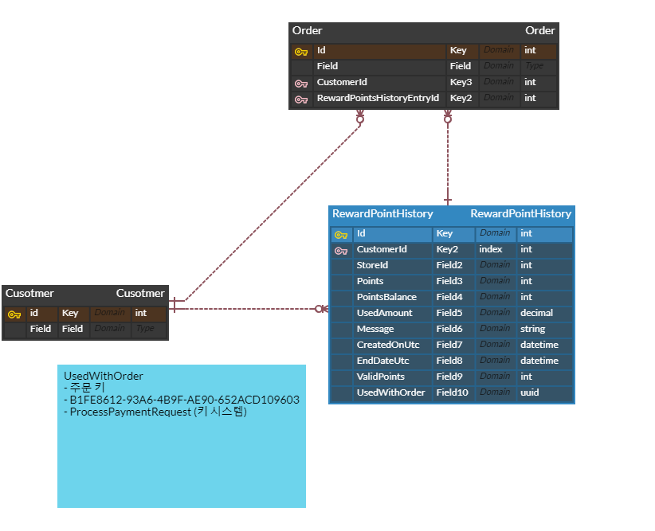

# [Point Modeling] Point ERD 작성과 개념

## 구분해야 하는 개념 
- Table
  - 데이터들을 저장하는 항목인 Field 들로 구성된 데이터의 집합체
  - 열과 행으로 이루어진 표의 형태
- Entity
  - 사람, 장소, 물건, 사건, 개념 등의 명사 
  - 업무상 관리가 필요한 관심사
  - 저장이 되기 위한 어떤 것(Things)
  - Instance 
    - Entity의 Instance란 Entity 하나의 값을 말한다 
    - 과목 Entity는 수학, 영어의 Instance를 가진다. 이때 개념적인 대상이기 때문에 실제 속성이 되는 attribute 와는 구분된다
    - Entity는 Instance의 집합이기 때문에 Instance 는 Entity 하나의 값이라고 볼 수 있다
- Model
  - 여기에서의 Model이라면 보통 Business Layer에서 사용하는 domain model을 의미
- Class
  - Model이 개념적인 설명이라면 이 개념을 Data Class로서 객체의 설계도로서 나타낸 형태 
- Object
  - 소프트웨어 세계에서 구현할 대상
  - Class에 선언된 모영 그대로 생성된 실체
---
- Attribute
  - 사물의 성질, 특징 또는 본질적인 성질, 그것이 없다면 실체를 생각할 수 없는 것 
  - 업무에서 필요로 하는 instance로 관리하고자 하는 의미상 더 이상 분리되지 않는 최소의 데이터 단위 
- Property
  - attribute가 특성이라는 단어로 나타낸다면 property는 속성이라는 단어로 나타낼 수 있다
  - attribute가 모델링 관점에서 속성이라면 property는 object의 속성으로 쓰인다 
- Field
  - 같은 종류의 의미를 가지고 있는 데이터들을 저장하기 위한 항목
  - 데이터 베이스 관점에서 데이터가 가지고 있는 속성의 값(명칭) 
- Column
  - 모델링관점의 attribute가 관계형 데이터베이스에서는 column 이 된다 
  - Table을 구성하는 데이터 중에 세로축의 열을 나타낸다
---
- Tuple
  - 모델링 관점에서 각각의 data를 나타내는 항목 
  - 논리적인 차원에서 가로축의 행을 나타낸다 
- Record
  - Field에 연관성 있게 저장되어 있는 데이터들의 집합체의 형태 
  - 데이터 한 줄이라는 의미로 File에서도 쓰이는 명칭 
- Row
  - Table을 구성하는 데이터 중에 가로죽의 행을 나타낸다
---

## 모델링의 과정 
- 개념 
  - 조직, 사용자의 데이터 요구사항을 찾고 분석하는데서 시작
  - 핵심 엔터티와 그들 간의 관계를 발견하고 그것을 표현하기 위해 엔터티-관계 다이어그램으로 표현
  - 사용자와 시스템 개발자가 데이터 요구사항을 발견하고 현 시스템의 개요를 작성하는 과정
- 논리
  - 설계 진행 상에 비즈니스 정보의 논리적인 구조와 규칙을 명확하게 표현하는 기법 또는 과정
  - 논리 모델링이 되면 데이터 모델링이 완료된 상태라고 정의가 가능
  - 정규화가 중요한 과정이며 모델의 일관성을 확보하고 중복을 제거해서 속성들이 적절한 엔터티에 배치되도록 하는 데이터 구조를 얻고자 하는 과정 
  - 논리모델링이 상세화되면 식별자 확정, 정규화, M:M 관계, 참조무결성 규칙들이 정의가 되고 추가로 이력관리도 하게되어 변경되는 데이터 구조를 기록하게 된다
- 물리
  - 완성된 논리 모델링을 가지고 컴퓨터가 알 수있는 형태로 만드는 과정으로 데이터가 물리적으로 컴퓨터에 어떻게 저장될 것인가를 정의하는 것을 물리적 스키마라고 한다 
  - 이 단계에서는 테이블, 컬럼을 데이터 베이스에 생성하고 데이터의 크기와 타입에 대해 최종적으로 결정한다 

---
### 실무적 접근 예시 
- 포인트 ERD 구성
  - NOP Commerce Opensource (https://www.nopcommerce.com/en)
  - Entity
    - RewardPointHistory
    - Order
    - Customer
  - 비즈니스 특징
    - Point Balance가 History에서 계산되어야 하기 때문에 시간상 가장 마지막 Row가 가장 최신의 Balance를 가진다 (계산된 값)

