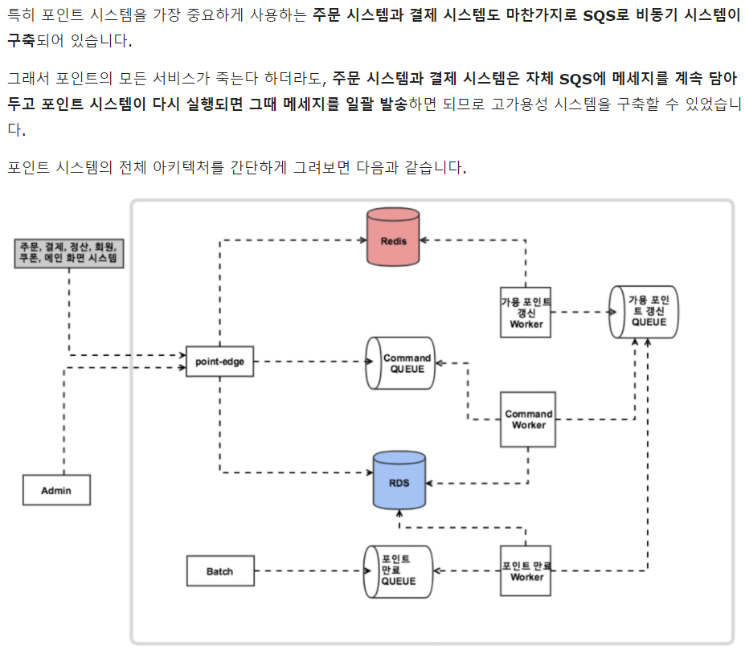
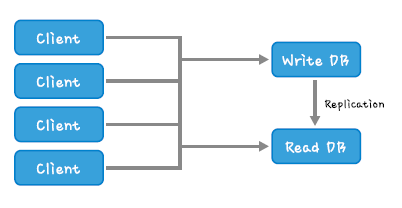
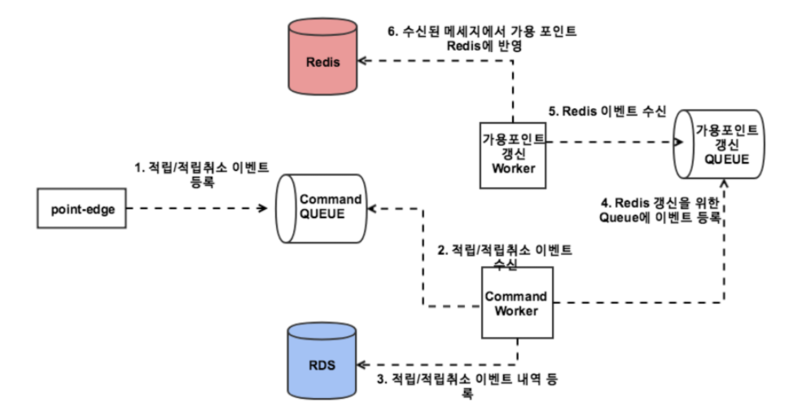

# [Point Modeling] Point 심화 (배달의 민족 편)

이전 포스팅에서 모델링할때 쓰이는 용어와 포인트 ERD 예시를 작성했다 

이번에는 우아한 형제들 신규 포인트 서비스 개발에 대한 내용을 정리해보았다 

이동욱님이라고 꽤 유명하신? 비전공자 개발자로 알고 있는데 그분 개인 블로그에 댓글로 얘기한 기억이 난다 

어쨌든 내용을 정리하면 

1탄 : [개발단계](https://woowabros.github.io/experience/2018/10/12/new_point_story_1.html)

2탄 : [오픈 준비 단계](https://woowabros.github.io/experience/2018/10/15/new_point_story_2.html) 

---
> ### 기존의 상황 
* 레거시 시스템에는 포인트 서비스라는 패키징된 구성으로 개발이 되어 있지 않음
  * 중앙 DB의 포인트 테이블과 처리 프로시저로만 존재 
* 모든 서비스가 개별적으로 포인트 프로시저를 실행하는 구조로 아마 수정이 생기면 모든 다른 서비스의 로직에도 영향이 가는 구조로 보임
* 신규 포인트 시스템을 위해서는 서버구조, 배포 환경, 도메인 모델, 어플리케이션 등을 완전히 제로에서 새로 만들어야 함을 의미
* 신규 시스템은 다른서비스의 변경에 의존성이 걸리지 않으며 확장 가능한 요소로 개발되어야 함을 인지하고 시작
---
> ### 도메인 

* update와 delete가 없는 도메인으로 구성 (insert 만 존재) 하게 된 이유 
  * 포인트가 왜 이 금액으로 되었는지 히스토리 관리가 어려움이 있음 (정확한 이유는 언급 안 됨)
  * 가용포인트와 적립/사용 포인트가 틀어지는 경우가 있었음
  * 포인트가 틀어졌을 때 다시 맞추는 것이 어렵고 틀어진 경우를 추척하기도 어려웠던 것으로 보임
  * 포인트를 프로시저 동작으로 업데이트를 하면서 불일치가 생겼고 이 불일치를 수정해야 하는데 그게 쉽지 않은 것으로 보임
---
> ### 도메인 구성에서 발견하게된 문제점 (개발을 진행하면서)

* 적립된 포인트를 사용하는데 포인트 쪼개기가 발생되었고 쪼개진 포인트를 만료하는 것이 까다로워 짐에 따라 포인트 상세 테이블을 추가 하게 됨 
  * 적립의 경우 포인트 히스토리를 추가하는 것으로 처리가 되지만 사용의 경우는 적립했던 포인트가 사용으로 상세 테이블에 쪼개서 들어가게 됨 
  * 기준이 되는 키 값은 적립 Id를 추가로 기억하게 되어 적립과 사용을 맵핑시킴
    * 분할 사용에 대한 맵핑 테이블이 없이 1:N 관계로 분할 맵핑
  * 사용 포인트는 적립 Id로 그룹핑해서 총합을 계산하게 되고 쪼개어 사용하는 경우에 추가로 상세 테이블에 쪼개서 기록(Insert) 

---
>### 이전 포스팅의 NOP 구조와 차이점 
* NOP 에서는 잔액을 계산해서 이벤트 추가시 계산된 잔액을 같이 넣어 줌
* 잔액 계산에 추가로 사용포인트/가용포인트에 대한 정보를 추가해서 적립/사용/환원에 대한 이벤트를 하나의 로우와 각각 컬럼으로 분리합니다 (표 해석을 배워야 함)
* 상세한 정보가 기록되어 해석이 가장 최근의 한줄로 가능하나 가용포인트 계산이 발생되어 이벤트 발생 때 update 가 발생 
  * 이 부분은 적립이라고 되어 있지만 사실상 0원에 도달하는 충전식이라고 해도 됨

* 가용포인트의 계산은 충전과 비슷함 -> 즉 적립 포인트를 쪼개는 것이 아닌 실시간성으로 포인트를 이벤트마다 계산
* 가용포인트의 합이 잔액이 되어 포인트 추적데이터로서 누적이 되나 이 업데이트가 틀어짐이 발생되면 다른 히스토리까지 영향이 가게 됨
  * 합산이 틀어지면 해당 부분을 보정해줘야 하는 후처리 작업을 수동으로 해줘야 하는 경우가 발생될 수 있음 
    * 시스템 내부에서 검증하는 단계가 필수로 필요하며 이때 틀어짐이 보이면 보정에 대한 운영 알람이 필요 (나중에 몰아서 할 수 있는 일이 아니라 즉각적인 처리가 필요)

* 우아한 형제에서도 포인트 적립 이벤트 누락 및 계산 미스가 발생이 가능 함
  * 2개의 테이블에 트랜잭션이 걸리는 부분에서 어느 한쪽에 이상이 발생되면 전체 취소가 되고 해당 부분에 대한 복구 체계가 있을 것으로 보임 
  * 이벤트가 추가 될 때 쪼개어 계산할 때 All or Nothing 이므로 update 상황과 같은 중간 누락은 아니지만 시스템이 불안정한 경우에는 (로깅마저 없다면) 이벤트 자체가 아예 유실 될 수 있음을 내포 
  * 이벤트를 큐에 저장해 놓고 있는데 처리가 완료되지 않으면 큐가 비워지고 끝이 아니라 재시도 로직이나 에러 복구 체계가 있어야 포인트 처리에 미스가 발생되지 않음 
    * 내부에서 네트워크 에러는 발생되고 나름 마이크로 서비스라고 분리된 상황에서 다른 서비스는 정상적으로 동작이 되고 있고 포인트 큐는 실패가 나고 있고 사용자는 UI에서 신나게 포인트를 쓰거나 변경시키면 운영 시간동안 유실된 이벤트를 수동으로 처리한다면 포인트 보정 만큼 끔직할 것 같다

* NOP에서는 계산 미스에 대한 우려가 있고 우아한 형제는 이벤트 누락시 후처리를 어떻게 할 것인지에 대한 우려가 있다
* 계산 미스에 대한 부분은 검증 단계를 철저하게 만들어야 할 것으로 보이고 이벤트 누락은 완료에 대한 동기 작업의 큐 시스템이나 에러/로그 핸들링 및 모니터링으로 후처리 방식의 자동화와 즉각적인 처리를 계산할 수 있어야 한다면 
  * NOP는 포인트 히스토리 검증에 사용할 포인트 밸런스를 히스토리에 검증성으로 이벤트마다 기록시키고 (잔액조회시 즉각적 사용도 가능)
  * 우아한 형제는 독립적인 서비스 개발의 관점에서 에러 복구 및 에러 알람에 대한 후속 처리가 가능한 가용성 있는 시스템 아키텍처를 만드는 것으로 부족한 부분을 보완해 본다 
---
<br />

> ### 샘플 자료 1
|순번|액션|포인트타입|시작일시|소멸일시|액션에 의한 동작 포인트 | 포인트 잔액 | 사용량 | 가용량(실시간 업데이트 값) | 
|---|---|---|---|---|---|---|---|---|
|1|적립이라 쓰고 충전이라 읽는다|포인트A|1900-01-01|2021-12-31|10000|10000|0|0 |
|2|적립이라 쓰고 충전이라 읽는다|포인트B|1900-01-01|2021-03-20|5000|5000|0|0 (1000) |
|3|구매1|포인트A|||-3000|7000|3000|0|
|4|구매2|포인트A|||-7000|0|7000|0|
|5|구매2|포인트B|||-4000|1000|4000|0|
|6|구매2반품|포인트A|||7000|7000|0|7000|
|7|구매2반품|포인트B|||4000|5000|0|0 (4000)|
|8|유효기간 만료 소멸|포인트B|||-5000|0|0|0|

<br />

--- 
> ### 샘플 자료 2

>>포인트 히스토리


|순번|액션|포인트타입|시작일시|소멸일시|금액| 잔액(이것에 대한 의견은?) | 
|---|---|---|---|---|---|---|
|A1|적립|포인트A|1900-01-01|2021-12-31|10|10|
|A2|적립|포인트A|1900-01-01|2021-12-31|30|40|
|A3|적립|포인트A|1900-01-01|2021-03-20|20|60|
|A4|사용|포인트A|||-50|10|
|A5|유효기간 만료|포인트A|||-10|0 (-나오면 기존의 계산에 이상 이 있음 즉각적인 운영자 처리)|
|A6|이벤트|포인트B|1900-01-01|2021-12-31|100|100|
|A7|적립|포인트A|1900-01-01|2021-12-31|50|50 (일 배치로 검증)|
|A8|이벤트 부분 취소|포인트B|||-50|50|
|A9|사용|포인트B|||-50|0|

---

>>포인트 차감 상세

|순번|액션|포인트타입|시작일시|소멸일시|거래포인트|히스토리 아이디|상세적립 아이디| 
|---|---|---|---|---|---|---|---|
|B1|적립|포인트A|1900-01-01|2021-12-31|10|A1|B1|
|B2|적립|포인트A|1900-01-01|2021-12-31|30|A2|B2|
|B3|적립|포인트A|1900-01-01|2021-03-20|20|A3|B3|
|B4|사용|포인트A|||-10|A4|B1|
|B5|사용|포인트A|||-30|A4|B2|
|B6|사용|포인트A|||-10|A4|B3|
|B7|유효기간 만료|포인트A|||-10|A5|B3|
|B8|이벤트|포인트B|1900-01-01|2021-12-31|100|A6|B8|
|B9|적립|포인트A|1900-01-01|2021-12-31|50|A7|B9|
|B10|이벤트 부분 취소|포인트B|||-50|A8|B8|
|B11|사용|포인트B|||-50|A9|B8|

--- 
위 구조의 차이점이 느껴지는가? 

1번 자료는 가용포인트 계산이 복잡하고 2번 자료는 아이디를 쪼개어 저장하는게 복잡해진다 (그룹핑을 필수로 해야 함)

우형의 구조라면 실패 복구의 체계가 보장된다면 이벤트 추가의 경우는 더 수월하다 (Insert 구조.. 단 운영이 100% 보장되도록 중간 수정은 없어야 한다 )

<br />

---
> ## 분산 DB 환경의 아키텍처 분석 


>## 우아한 형제 아키텍처의 조회/수정 DB 동기화 이슈 (캐시를 도입하는 것애 대한 공통적 위험)
* Redis로 현재 포인트 조회와 큐를 통해 처리하는 잔액처리(가용포인트 갱신)가 분리되어 있음 
  
* 즉 동기화 이슈가 생길 수 있는 구조로 분산되어 있는 구조상에서 비동기나 트랜잭션 처리에서 틀어짐이 발생되면 가용포인트 조회와 계산에 구멍이 생길 여지가 있는 구조 

* SQS 를 사용했기에 큐 처리의 100% 안정성이 보장? 되었는지는 클라우드 운영 노하우도 필요해 보임 
  
* 캐싱 갱신의 동기화 이슈로서 내부에서도 실제 문제가 발생되었고 (간헐적) 관련 내용이 2탄에 공유되어 있음 
  * 가끔 가용 포인트가 적립 내역과 다르다는 내용
  
* 조회 DB와 업데이트 DB가 분리된 구조로 성능을 위한 분산이나 단 DB Link와 같은 동일한 클러스터의 구성이 아닌 온전히 독립적으로 캐싱 DB와 History DB간 동기화 이슈가 있을 수 있는 구조 
  
 
# 두가지의 분산 환경 비교

```
우아한 형제 운영 능력을 보면 내부에서 누적된 메시지 큐 사용이나 분산 DB 노하우가 쌓인 것으로 보임 

모니터링 체계(핀포인트) 가 있고 성능 및 에러와 테스트 체계를 갖추고 있어 운영상의 이슈들을 하나하나 해결했을 것으로 보임 

대용량 처리 서비스를 위한 분산 DB로서 조회 캐싱을 하는 것은 아키텍처 구조상에 성능 이점을 가져갈 수 있는 구조로 점진적으로 지향해야 하는 방향
```

<br />

---
> ## 포인트 시스템을 레거시와 공존하면서 독자 서비스로 구축하는 방법 

* Controller 라 쓰고 Gateway라고 읽는다
  
* 외부 시스템과 관문을 만들기 위해 Endpoint를 하나로 만든다
  
* 외부 시스템에 의한 히스토리 처리를 위한 Point Key를 생성해서 연동 데이터간 추적을 위한 Key 속성 발급
  
* 레거시 시스템과 2중화 운영을 하되 안정화 이후 신규 시스템으로 100% 전환 


> ## 끝 맺음 

* 중요한 부분은 레거시를 이해해서 신규 시스템으로 바꾼다는 경험이 매우 중요해 보인다
   
* 기존의 구조에 단점이 있다면 개선을 해야 할 것이고 신규 구조에 결함이 있다면 이를 보완해야 한다 
  
* 무엇보다 개발에 있어 100% 완벽은 없어 보인다 
  
* 더 좋은 방법이 뭔지 (가급적이면 덜 크리티컬하게) 시행착오와 고민과 경험과 노력이 있을 것이다 