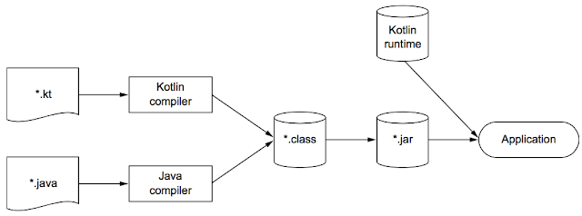

# Kotlin 시작 

## 1. 코틀린 맛 보기
```
// data class
// 널이 될 수 있는 Int타입과 파라미터 dafault 값
data class Person(val name: String, val age: Int? = null)

// 최상위 함수
fun main(args: Array<String>) {
    val persons = listOf(Person("영희"), Person("철수", age = 29))

    // 람다식과 엘비스 연산자(null 일 경우 age는 0을 반환)
    val oldest = persons.maxBy {
        it.age ?: 0 
    }
    // 문자열 템플릿
    // toString 자동완성
    println("나이가 가장 많은 사람: $oldest")
}

// 결과: 나이가 가장 많은 사람: Person(name=철수, age=29)

```
- 요약 : 객체지향과 함수형의 프로그래밍 스타일을 모두 지원 

---
### 정적 타입 지정 언어 
- 코틀린도 자바와 마찬가지로 정적 타입 지정 언어이다
- 모든 프로그램의 구성요소의 타입을 컴파일 시점에 알 수 있다
- 컴파일러가 객체 내부의 필드나 매소드의 타입을 검증해 준다
- 자바와 달리 코틀린 컴파일러는 변수 타입을 자동으로 유추해주는 타입 추론을 해준다 

#### 장점 
- 성능 : 실행 시점에 알 수 있다는 것은 매소드 호출을 더 빨리 해준다 
- 신뢰성 : 컴파일러가 프로그램의 정확성(타입)을 검증하기 때문에 실행 시 오류 확률이 적다 
- 유지 보수성 : 객체의 타입을 알면서 코드를 짤 수 있기에 처음 보는 코드도 다루기 쉽다
- 도구 지원 : 정적 타입 지정을 활용해 도구는 더 정확한 코드완성 및 IDE의 기능이 풍부해진다 

#### 함수 타입에 대한 지원
- 함수형 프로그래밍 핵심 개념 
  - 일급시민(first-class) 함수 
    - 함수를 일반 값처럼 다룰 수 있다
    - 함수를 변수에 저장훌 수 있고 다른 함수에 전달하거나 새로운 함수를 바로 만들어서 반환할 수 있다 
  - 불변성
    - 만들어 지고 나면 내부 상태가 절대로 바뀌지 않는 불변 객체를 이용한다
  - side effect 없음
    - 입력이 같으면 항상 같은 출력을 내놓고 함수 외부와 상호 작용하지 않는 순수 함수를 사용한다

- (순수함수를 값처럼 활용해서)함수형 프로그래밍 지원으로 강력한 추상화와 코드 중복을 막을 수 있다 
- 다중 스레드를 사용해도 안전성을 보장해준다 
  - 다중 스레드 환경에서 같은 데이터를 여러 스레드가 변경 못하게 함으로 복잡한 동기화를 신경쓰지 않아도 된다 

- 테스트 하기 쉽다 
  - 자바에서는 전체 환경을 구성하는 준비 코드가 따로 필요하게 되는데 순수함수는 준비코드 없이 바로 사용해서 확인이 가능하다  

### 코틀린 코드 컴파일 

- 코틀린 런타임 라이브러리에 의존하며 코틀린 자체 표준 라이브러리를 사용하고 자바 API를 확장한 내용이 들어 있다 
- Maven, Gradle, Ant 와 같은 빌드 시스템과 호환되며 애플리케이션을 패키지할 때 코틀린 런타임을 포함시켜 준다 

## 2. 기초 

### 2.1 함수 

### Hello World 
```
fun main(args: Array<String>) {
    println("Hello world!")
}
```
- fun 키워드를 사용 
- 함수를 최상위 수준에 정의가 가능해서 꼭 클래스안에 매소드로 만들 필요가 없다 


### 특징 
- 함수의 반환 타입은 파라미터 목록의 닫는 괄호 다음에 오고 괄호의 반환 타입 사이를 콜론(:)으로 구분한다 

- 문과 식의 구분 
  - kotlin은 자바와 달리 if문이 아닌 if식이다 
  - 식은 값을 만들어내며 다른 식의 하위요소로 쓰일 수 있다 
  - 문은 자신을 둘러싸고 있는 블록을 말하며 문 자체는 값을 만들어 내지 않는다 
  - 식이 본문인 함수 예시 
    ```
    fun max(a: Int, b: Int) : Int = if(a > b) a else b
    ```
    - 위의 그림과 봤을 때 중괄호로 둘러싸인 함수를 블록이 본문인 함수로 부르고 등호와 식으로 이루어진 함수를 식이 본문인 함수라고 한다 
    - if 식에서 반환 타입을 생략할 수 있는데 컴파일러가 타입추론을 해주기 때문에 함수의 반환 타입을 컴파일러가 알 수 있다 

###  2.2 변수 

### 변경 가능한 변수와 변경 불가능한 변수
- val(vlaue) - 변경 불가능한 참조를 지정, 자바의 final 변수
- var(variable) - 변경 가능한 참조를 지정, 자바의 일반 변수

- 권장하는 부분은 기본적으로 모든 변수를 val 키워드를 사용해 불변 변수로 선언하고 꼭 필요한 경우만 var로 변경가능한 변수로 바꾸어라
- val 변수는 블록을 실행할 때 정확히 한 번만 초기화돼야 하나 조건에 따라 여러 값으로 초기화가 가능하다 
  ```
  val message: string
  if(operation()) {
      message = "success"
      // ...
  } else {
      message = "failed"
  }
  ```
  - val 참조 자체는 불변이어도 그 참조가 가리키는 객채 내부를 변경할 수는 있다(list)
  ```
  val languages = arrayListOf("java") 
  languages.add("kotlin")
  ```

### 문자열 템플릿 - 더 쉽게 문자열 사용하기 
```
fun main(args: Array<String>) {
  val name = if (args.size > 0) args[0] else "kotlin"
  println("hello $name!")
}
```
- name이라는 변수를 사용하고 문자열 리터럴의 필요한 곳에 변수를 넣되 변수앞에 $를 추가해서 넣었다 
- 이 문자열 템플릿은 자바의 문자열 붙이기와 동일한 기능을 하면서 간결하다
  - ("hello, " + "name" + "!")
- 존재하지 않는 변수를 사용하면 오류가 발생하며 컴파일러가 정적(컴파일시점)으로 검사한다
- $를 문자열에 포함하는 방법(escape 시키기)
  ```
  println("\$name")
  ```
- 간단한 변수말고 식과 같은 구문도 중괄호 {}로 둘러싸서 문자열 템플릿 안에 넣을 수 있다 
  ```
  fun main(args: Array<String>) {
      if (args.size > 0) {
          println("hello, ${args[0]}")
      }
  }
  ```
  ```
  fun main(args: Array<String>) {
      if (args.size > 0) {
          println("hello, ${args[0]} , ${args[1]}")
      }
  }
  ``` 
  ```
  fun main(args: Array<String>) {
      if (args.size > 0) {
          println("hello, ${1: args[0], 2: args[1]}")
      }
  }
  ```

## 2.3 클래스와 프로퍼티
- 다음 기회에... 