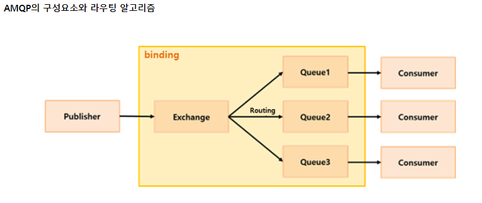

# RabbitMQ 시작 
- RabbitMQ는 AMQP를 구현한 미들웨어이다. 
- RabbitMQ는 서비스와 서비스 사이에 존재해서 메시지를 전달하는 역할을 하게 된다
- RabbitMQ는 AMQP를 구현한 오픈소스 메시지 브로커 소프트웨어이다

## AMQP(위키)
- Advanced Message Queuing Protocol 는 메시지 지향 미들웨어를 위한 개방향 표준 응용 계층 프로토콜이다 
- 이런 말을 이해하려면 Backend 도 세분화 할 수 있다는 부분을 이해해야 한다 
  - Front Backend <-> Back Backend
  - Front Backend는 보통 RESTful, SOAP, GraphQL등의 API 서버라고 불리게 된다
  - Back Backend는 서비스 로직 or Analysis 서버라고 불릴 수 있다 
  - 이 경우 한 서버에서 Backend 라는 것으로  동작했을 때 갑자기 사용자가 폭주해서 서버 트래픽이 급증했을 때를 생각하면 
    - 분석할 데이터 양이 늘어나서 앞단의 API 서버가 죽었다 (해당 프로세스가 뻗음) 
  	- 뒷단의 분석서버까지 영향을 받아 동작을 못함 
    - 분석 데이터와 다른 비즈니스인 로그인 쪽도 영향을 받아 로그인도 안됨 
  - 서버를 분리해서 운용하는것이 가용성에 좋고 확장도 가능해진다는 것을 인지하게 된다 
  - 이렇게 서버를 분리하면 MSA에 접근한 방법이라고 할 수 있을가?
	
- 분리된 서버들간에 데이터를 주고 받을 수 있게 하는 것 
  - 다이렉트로 Front Backend <-> Back Backend 간에 분리된 상태로 주고 받는 경우를 생각해 보면 이 경우에도 데이터가 폭주해서 처리량이 매우 늘었을 때 분석 서버에서 API 서버로의 응답량이 매우 많아져서 Front Backend 가 죽게 된다면 다른 서비스까지 멈추게 된다 
  - 이를 완충하기 위해 중간에 미들웨어를 두고 Message를 큐에 넣어서 주고 받는 방식을 택하게 되었다 
  - 매우 많은 부하로 서비스 한쪽에서 문제가 생겼을 때 그 부분에 대해서만 문제가 되고 나머지 서비스에서는 영향이 없게 되는 것이다 
  - 아키텍처적으로 앞단에 큐를 두어서 큐가 버티지 못하면 큐만 죽고 다른 서비스에 영향도를 없애는 것이다 
    - 모놀로식 방식에서는 전체에 대해 디펜던시가 생기기 때문에 이런 구조를 고려할 수 없다
	- 분석서버가 죽었을 때 해당 큐만 죽었기 때문에 분석은 당장 안되겠지만 API 서버를 통해 다른 서비스(인증, 웹페이지 등)는 문제가 없다
			
- 외부 연동이나 폴리그랏이라는 다른 개발환경에서는?
  - 메시지 큐라는 미들웨어 즉 중간녀석이 생겼기 때문에 이를 어뎁터라고 보고 뭘로 개발하거나 외부 통신이 되더라도 이 어뎁터만 맞추면 통신이 가능하게 된다 
  - RabbitMQ로 주고 받는 것에 대해 메이저 컴퓨터 언어 기반으로는 다 만들어 두었기 때문에 서로간 통신하는 데 문제가 없다 
  - AMQP라는 프로토콜을 준수하기 때문에 다른 언어/다른 프레임워크여도 동일한 프로토콜로 통신한다는 것이 성립된다 

  

  - producers 로부터 메시지들을 받아 consumers 에게 전달해주는 서비스로, 쉽게말해 시스템 간에 메시지를 전달해주는 서비스

    - 사용되는 용어
    	- Producing : 메시지를 전송한다는 의미
		- Producer: 메시지들을 전송하는 프로그램 
		- Publish: Producer가 Message를 보냄 
		
		- Queue : RabbitMQ 시스템 내에 위치, Message를 저장하는 버퍼, Queue는 Exchange에 Binding 된다 
          - Message들이 RabbitMQ를 통해 Queue에 저장되어 짐
          - Producer는 이 queue를 통해 Message를 보내고 Consumer 는 이 Queue로 부터 데이터를 받을 수 있다 
		
		- Consuming : 메시지를 수신한다는 의미 
		- Cosumer : 메시지 수신을 기다리는 프로그램
          - 동일 업무를 처리하는 Consumer는 보통 하나의 Queue 바라본다 (중복방지)
          - 하나의 Queue에서 Round-Robin 방식으로 Message가 분산되면서 병렬처리가 가능해진다 
		- Subscribe : Consumer가 Message를 수신하기 위해 Queue를 실시간으로 리스능하도록 만듬

		- Exchange : Producer가 전달한 Message를 Queue에 전달하는 역할, Message가 Queue에 직접 전달되지 않고 Exchange type 정의대로 동작

    | type	|설명	| 특징 |
    |---:|---:|---:|
    | fanout | 알려진 모든 queue에 Message 전달 함	| broadcast |
    | direct	| 지정된 routung key를 가진 queue에만 Message를 전달 함  |unicast |
    | topic	| 지정된 패턴 바인딩 형태에 일치하는 Queue에만 Message 전달   #: 여러 단어	  *: 한 단어| multicast |
    | header	| 헤더에 포함된 key=value 의 일치조건에 따라서 Message 전달 |	multicast |
 		 
    - Binding : exchange와 queue를 연결해 주는 것 
	- Routing : Exchange가 Queue에 Message를 전달하는 과정
      - Routing key : exchange와 queue 가 binding 될 때 exchange가 queue에 message를 전달할지를 결정하는 기준 
      - 기준이라 함은 key 값이 일치하거나 patten이 매칭될 때 
