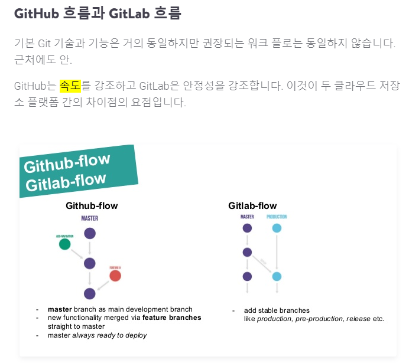
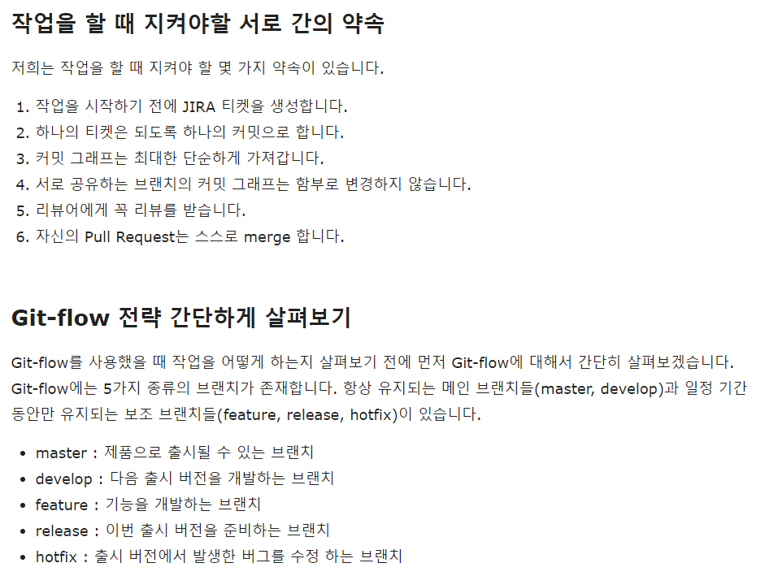
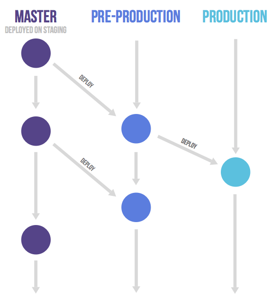

# git-flow 어떻게 사용할까?

git 이 형상 관리 툴로서는 대체 불가능한 도구로 자리 잡은것으로 보인다. 

이전에는 Team Foundation Server(Microsoft), SVN 도 사용한 적이 있지만 중앙집중 방식으로 여러 명이 동시에 사용하고 반영할 때 접근 순서를 강제해야만 공통 소스관리가 되었던 것으로 단점이 기억난다

git 과 명확한 차이라면 local branch / remote branch를 구분해서 각자 작업한 내용의 merge가 내부 조직의 규율을 간단하게 하여 conflict를 최소화 하고 항상 소스 최신화를 유지하기 쉬운 부분으로 생각된다 

용어로는 master를 checkin / checkout 에서 pull / push 로 바뀌면서 master를 직접 다루는 게 아니라 개인의 branch에 자유도를 준 차이가 느껴진다(분산 버전 관리 시스템)

서론은 여기까지 하고 이 글을 쓰게 된 이유는 최근에 git 을 사용하면서 여러 이슈들이 있었다 

[그냥 한번 읽어 보기](https://insight.infograb.net/blog/2020/09/22/git-flow-problem-and-solution/)

1. github 아닌 private git server 로만 사용 
   - team convention을 간단하게 가져간다고 필수 제약 조건을 걸었다 
     - push를 하기전 항상 master 로부터 최신 확인 하기 
     - fetch -> pull 이후 최신 상태로 만들고 나서 push 
     - local branch에서 conflict 해결 이후 master 로 push
   - 단점 
       - remote branch를 master만 사용할 수 있었으나 다른 사람의 코드와 충돌이 나지 않은 부분에서 push 가 간단했지만 협업 부분에서는 상대방이 반영하길 원치 않는 코드가 반영될 여지 가 있다(다만 이 부분은 반영 안 할 항목은 절대 push 하지 않으면 된다) 하지만 remote branch 가 하나이니 내부에서 구두로 확인 절차가 생실 수 있다 (SVN을 git으로 쓰는 느낌?)
     - git 담당자(팀장)가 master branch 를 배포시에 어느 부분의 commit 까지 반영할지 모든 히스토리가 인지 된 상태에서 stage나 production 으로 올릴 수 있어 테스트를 할 환경을 로컬에 따로 구축하거나 담당자가 직접 관리 해줘야 한다

2. open-source contributing 
   - fork repository 를 통한 개개인의 작업 내용을 운영진에 확인 받으며 pull request 를 만들어 전달하는 형태 
   - 단점 
     - 단점이 될지 모르겠는데 이 방식을 이해하는데 learning curve 가 있었다 
       - Rebase 된 깔끔한 commit 만 upstream에 방영이 가능함
     - 아래 경험을 통해 process를 이해할 수 있었다(글보다는 직접 해보고 알 수 있었다)
     - [React native seoul](https://medium.com/react-native-seoul/forking-workflow%EB%A5%BC-%EB%94%B0%EB%9D%BC%ED%95%98%EB%A9%B4%EC%84%9C-whatssub-%ED%94%84%EB%A1%9C%EC%A0%9D%ED%8A%B8%EC%97%90-%EA%B8%B0%EC%97%AC%ED%95%98%EB%8A%94-%EB%B0%A9%EB%B2%95-850a9ba039ab)
     - Repository 가 구분이 되었기 때문에 불특정 다수의 사람들이 공통의 코드를 사용하고 반영하는데 적합한 방법으로 보인다 (사내에서도 이렇게 할까요??)

3. gitLab 
   - 가장 최근에 사용한 방법으로 여기서는 Pull Request 가 Merge Request 로 쓰였다 
   - Github와 느낀 차이점으로 Reviewer 지정이 한명만 가능했다 그래서 Reviewer를 특정 멤버를 콕 찍어 지정해야 하는 방식으로 UX가 팀원들의 다양한 의견을 어떻게 받아야 하지? 혹은 모든 인원의 승인을 거쳐야 하는 번거로울 수 있는 process를 피하기 위해 일부터 이렇게 지정되었나? 하는 의문이 들었다
   - github vs gitlab flow 로 의문을 가지면 많은 내용이 나오나 아래 한줄로 간략히 이해하기로 했다 
    
       - 출처: https://kinsta.com/blog/gitlab-vs-github/    
     - gitlab은 github보다 production의 분기를 가지기 때문에 더 안정성있는 병합과 운영/개발 분기를 가질 수 있는 것으로 보인다
   - github와 gitlab의 차이로 이런저런 내용을 보면 git-flow나 private 용도 말고도 CI/CD 부터 너무 많은 내용이 나오기 때문에 순수하게 Review와 Flow상 Branch 정책에 대해서만 의구심을 가지고 접근하기로 했다  

4. 문제정의
   1. 왜 gitlab 은 다양한 reviewer 지정이 안되는 걸까? 
      - 이 질문은 사실 내가 잘못이해한 부분이다. ui/ux 상 담당자를 1명만 지정할 뿐 review system 자체를 강제하는 부분이 아니다 
        
           - 출처: https://insight.infograb.net/blog/2020/11/18/better-codereview-with-gitlab/ 
      - github에서 reivewer 지정 후 approval 되어야만 merge가 가능한 강제 사항이 있을 뿐 gitlab에서는 열린 review 체계로 프로젝트에 포함된 구성원 모두가 reviewer 가 가능하고 단지 merge 에 대한 ownership 만 1명에게 지정하는 것이다 
        - 즉 manager or business owner 라고 부를 수 있는 사람을 지정하고 그 사람이 merge 에 대한 전적인 권한을 가지는 것으로 보인다 
        - reviewe 를 강제하지는 않는 것으로 보인다 다만 내부 프로세스에서 적극적인 review를 권장하지 않는 다면 review 체계가 가능할가? 라는 생각이 든다

   2. 소규모 조직에 탁월한 flow는 어떤 방법일까? 
      - 개발 조직에 있으면서 매우 인접한 동료의 구성원의 수가 최소 3명에서 6명정도로 10명이 되지 않았다. 옆 팀과 동일 repository를 공유한 적이 있었지만 이건 개발파트의 역할이 완전히 구분되기 이전에 같이 개발을 진행했거나 (공통 모듈이 있음) 특정 부분(인증)만 어쩌다 가져가게 된 부분으로 알고 있고 그 팀 구성원 모두를 해도 12명 정도이다. 
      - 즉 하나의 커다란 Repository이어도 10명 이내의 사람들이 사용하는 형태였고 앞으로도 크게 변하지 않을? 부분으로 보인다 
      - git server를 사용할 때 master로 강제한 부분도 복잡한 convention or process를 만들지 않는다는 명분? 이 reader로 부터 들은 부분인데 이게 옆 팀과 마찰이 된 것도 있었다. 복잡한 merge commit의 남발로 인해 제발 rebase를 해달라는 요청을 엄청 들었다 
      - 위의 경험을 종합해 봤을 때 remote branch 에 대한 구분이 있어야 하는 것과 develop 영역과 production 단순히 이 2가지 경우가 아니라 QA 영역(dev-qa, live-qa) 구분이 필요하다면 해당 branch를 어떻게 구분하고 관리할 수 있는지에 대한 고민도 필요해 보인다 
      - QA 환경을 어떻게 가져가는지 혹은 live 배포와 어떻게 연결이 되는지 회사마다 방식이 다 다르겠지만 경험싱 아래 2가지는 꼭 지키면서 하고 싶다 
        1. QA 영역(환경) 과 live 영역(환경) local-dev 영역(환경) 은 구분되었으면 한다 
        2. live(production) 에 대한 직접적인 조작은 허용된 경우가 아니면 절대 불가능하며 원칙적으로 QA영역을 거친 내용만 live로 반영될 수 있다 
      - flow 에 대한 부분이라기 보다는 deploy or server enviroment 에 대한 부분이기도 하지만 일단 git remote branch 가 분기되어야 하는 부분이기 때문에 배포 자동화가 된다면 결국 flow와 연결되야 하지 않나 생각된다 

5. git-flow에 대한 고찰 
  - 내 관심사는 운영/개발 환경과 git 사용/배포에 대한 부분이기 때문에 가볍게 flow 차이를 훓고 넘어 간다 
    1. git-flow(정석)
    
       - 이 내용이 구성원간 협의가 되야 할 것으로 보이고 아래 그림을 보면 큰 줄기는 develop / master bracnh 가 있고 상황에 따라 feature/release/hotfix 로 세분화되고 기본 repository 전략은 origin / upstream으로 구분된다 
       - 가장 최초로 제안된 Workflow 방식이며, 대규모 프로젝트 관리에 적합한 방식으로 평가받기 때문에 소수의 인원이 적용할 경우 번거로운 process가 생길 수 있을 것으로 보인다 
        
       - 규칙을 정하는 부분이 거부감이 있다거나 origin/upstream 구분이 불필요한 부분으로 느껴질 수 있다
  
     1. github-flow
        - git-flow를 개선하기 위해 나온 하나의 방식
        - 흐름이 단순한 만큼, 역할도 단순하다. git flow의 hotfix나 feature 브랜치를 구분하지 않고, pull request를 권장한다
             
        - Master 브랜치가 릴리즈에 있어 절대적 역할을 한다
        - Master 브랜치는 항상 최신으로 유지하며, Stable한 상태로 product에 배포되는 브랜치다 따라서 Merge 전에 충분한 테스트 과정을 거쳐야 한다. (브랜치를 push하고 Jenkins로 테스트)
        - [!!규칙!!] 새로운 브랜치는 항상 Master 브랜치에서 만들며, 새로운 기능 추가나 버그 해결을 위한 브랜치는 해당 역할에 대한 이름을 명확하게 지어주고, 커밋 메시지 또한 알기 쉽도록 작성해야 한다 
        - Merge 전에는 pull request를 통해 공유하여 코드 리뷰를 진행한다. 이를 통해 피드백을 받고, Merge 준비가 완료되면 Master 브랜치로 요청하게 된다.
        - [!!제약사항!!] 이 Merge는 바로 product에 반영되므로 충분한 논의가 필요하며 CI도 필수적이다 
        - 소규모 인원이 간단하게 사용하기 좋으나 내가 생각한 QA 환경을 적용하려면 master가 여러 갈래로 구분되지 않는다 
        - master에 문제가 생기면 운영에도 영향을 미치게 되며 매우 소모적인 hotfix가 늘어날 수 있다 (git 담당자가 있어 환경 별로 구분을 해줄 수는 있을 것 같지만 그 역할을 누가 전담하는가?)
        - 개발 속도를 강조한 만큼 수정과 반영이 쉽겠지만 master != QA != production을 좀 더 안정적으로 가져갈 수 없을까? 에 대한 의구심이 남는다 

     2. gitlab-flow
        - github flow의 간단한 배포 이슈를 보완하기 위해 관련 내용을 추가로 덧붙인 flow 방식
        - 내 의구심이 다른 사람에게도 공통 요소였다고는 장담은 못하겠는데 gitlab-flow에서도 비슷한 고민을 한 것으로 보인다 
            
        - Production 브랜치가 존재하여 커밋 내용을 환경에 따라 Deploy 하는 형태를 갖추고 있다
        - Master 브랜치와 Production 브랜치 사이에 pre-production 브랜치를 두어 개발 내용을 바로 반영하지 않고, 시간을 두고 반영한다. 
        - 이를 통한 이점은, Production 브랜치에서 릴리즈된 코드가 항상 프로젝트의 최신 버전 상태를 유지할 필요가 없는 것이다 (운영과 개발이 분리 되었다)
        - 즉, github-flow의 단점인 안정성과 배포 시기 조절에 대한 부분을 production이라는 추가 브랜치를 두어 보강하는 전력이라고 볼 수 있다
        - git-flow는 복잡한 process를 강제해야 하고 github-flow는 환경별로 다른 버전을 가질 수 있는 부분을 간과하고 있었다 그런 부분에서 gitlab-flow는 환경에 대한 다른 버전에 대한 가능성을 열어 놓았고 검증된 코드만 production에 반영할 수 있게 되었다 

6. 결론
   - 쓰다보니 내용이 매우 길어졌는데 git을 사용한 platform 차이가 단순하지 않아 보였고 사용상의 ui도 다른 부분이 있다 
   - 요약하자면 아래 내용을 고려하고 싶었다 
     - 10명 내의 개발팀이 합리적인 review system과 코드 반영(오로지 개발)과 배포(테스트/운영 환경)가 구분되고 이를 적용하는 고민을 최소화 할 수 있는가 
   - gitlab-flow를 base로 삼고 환경에 따라 버전을 같거나 혹은 다르게 유연하게 적용이 가능한 방법으로 기능 개발과 (단위/전체/부하)테스트가 가능하게 하는 부분으로 종결지어 본다 

--- 
### 프로젝트, 개발자, 릴리즈 계획 등 상황에 따라 적합한 방법을 택해야 한다.
---
### 배달의 민족인 '우아한 형제들'이 github-flow에서 git-flow로 워크플로우를 변경한 것 처럼 브랜칭과 배포에 대한 전략 상황에 따라 변경이 가능한 부분이다.
---

참고한 내용
- flow
  - https://ujuc.github.io/2015/12/16/git-flow-github-flow-gitlab-flow/
  - https://kor45cw.tistory.com/261
  - https://github.com/gyoogle/tech-interview-for-developer/blob/master/ETC/Git%20vs%20GitHub%20vs%20GitLab%20Flow.md
- gitlab code review
  - https://insight.infograb.net/blog/2020/11/18/better-codereview-with-gitlab/
- woowahan
  - https://woowabros.github.io/experience/2017/10/30/baemin-mobile-git-branch-strategy.html
- https://insight.infograb.net/blog/2021/02/05/gitlab-vs-github/
- https://kinsta.com/blog/gitlab-vs-github/ 
- https://insight.infograb.net/blog/2020/09/22/git-flow-problem-and-solution/
