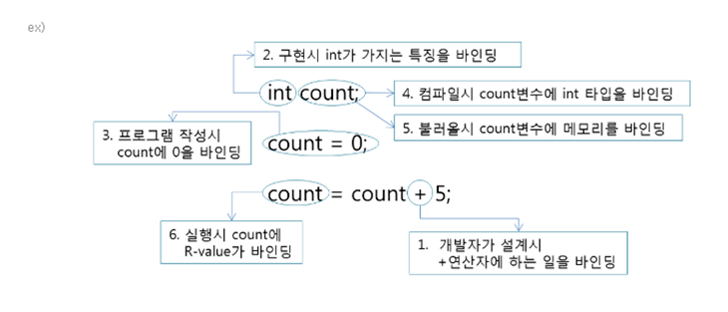
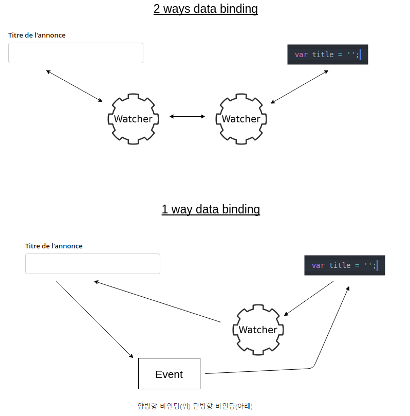

# binding 이란?

## 변수나 예약어 등 프로그래밍 언어를 구성하고 있는 여러 것에 속성을 부여하는 것을 바인딩이라고 한단다...
- 어려운 설명으로는 속성과 객체 사이 또는 연산과 기호 사이간 연관(association) 되는 것이라고도 한다
- 속성? 타입? 할당? 뭔가 대상(변수/객체)에게 주입되는 느낌.. 
- 이름에 어떤 속성을 연결하는 과정..
- 프로그램의 기본 단위에 이 단어가 택할 수 있는 여러 속성/타입 중에서 일부를 선정해서 결정하는 행위... 
- 이름(프로그래밍 요소)을 속성에 연관(binding)시키는 과정.. 

그렇다면 바인딩과 할당(=, assign)의 차이는 무엇일까?

그림으로 보면 아래와 같은 설명을 할 수 있다 (기본 베이스는 C언어 기반) 

1. 연산자에 의해 값이 변할 때
2. 변수 타입을 정하면서 int의 특성인 4바이트가 할당 될 때
3. 변수에 값이 할당 될 때
4. 컴파일 시 변수의 type이 정해 질 때 
5. 로드 과정 즉 각각 변수에 필요한 메모리를 바인딩 해준다 
6. 실행 과정 즉 프로그램 실행 시에 출력되는 결과 값을 변수에 바인딩 

- count에 대한 가능한 타입의 집합은 [언어 설계 시간]에 바인딩 된다.
  - 예) int, long, float 등등
- count의 타입이 [컴파일 시간]에 바인딩 된다. 
  - 예) int에 대응
- count의 가능한 값들의 집합은 [컴파일러 설계 시간]에 바인딩 된다. 
  - 예) int형 값의 범위 (-???? ~ +????)
- 연산자 기호 +에 대한 가능한 의미의 집합은 [언어 구현 시간]에 바인딩 된다.
  - 예) 수치 연산과 문자열 결합
- 연산자 기호 +의 의미는 [컴파일 시간]에 피연산자의 타입이 결정되었을 때 바인딩 된다.
  - 예) 피연산자인 count와 5는 int형 이므로 수치 연산으로 바인딩
- 리터럴 5의 내부 표현은 [컴파일러 설계 시간]에 바인딩 된다. 
  - 예) 바이트 코드로 00001001 로 표현
- count의 값은 이 할당문의 실행 시간에 바인딩 된다. 
  - 예) count가 가리키는 메모리 공간에 5를 저장

---
## 바인딩 타임
- 바인딩을 하는데 소모되는 시간을 의미

1. 언어 설계(정의) 시간: 언어에서 허용되는 자료구조나 프로그램 구조를 확정하는 시간 
2. 언어 구현 시간: 자료형 및 유효숫자 범위가 정해지는 시간 (+ 컴파일러 설계 시간)
3. 컴파일 시간: 변수명, 프로그램 구조 등을 확정할 때 걸리는 시간
4. 링크 시간: 부 프로그램 코드를 라이브러리와 연결할 떄 걸리는 시간
5. 적재 시간: 변수를 실제 메모리로 적재할 때 소요되는 시간
6. 실행 시간: 프로그램을 실행하면서 변수의 값을 확정할 때 걸리는 시간 

--- 

## 바인딩의 종류 

1. 정적 바인딩 : 컴파일에 바인딩 후 변경이 안됨 (고정된 관점)
   1. Explicit declaration : 타입을 명확히 명시
   2. Implicit declaration : 암시적으로 타입을 명시

장점: 타입이 정확하다 
단점: 다양한 대처가 어렵다 

2. 동적 바인딩 : 런타임중에 Type이 지속적으로 변화 가능으로 프로그램 실행 시에 바인딩 된다

장점: 유연하다
단점: 고비용 즉, 성능저하가 생길 수 있다 그리고 타입의 에러 발견이 상대적으로 어렵다 

---
## 할당 
- 기억장소할당: 변수에 "메모리 공간" 을 바인딩하는 과정 (그러면 할당은 바인딩 종류중에 하나?)
- 변수의 수명은 메모리 공간에 바인딩 될 때 시작 되어 메모리에서 회수될 때 끝난다

1. 정적 할당 
   - 변수에 메모리 공간이 정적으로 할당 되는 것 
   - 한번 할당되면 프로그램이 종료될 때 가지 할당상태가 유지된다 (data 영역)

2. 스택 기반 할당 
   - 자동 할당(Automatic Allocation) 이라고도 함
   - 변수의 타입은 정적으로 할당되지만 메모리 공간은 실행 중에 할당 됨
   - 스택 기반 할당이 이루어지는 메모리 공간은 스택(stack)

3. 동적 할당 
   - 명시적인 명령어(new, malloc)에 의해 실행되는 할당
   - 동적할당이 이루어지는 메모리 공간은 힙(heap)
   - 동적으로 할당된 영역은 포인터나 참조변수를 통해서 참조 됨

---
### 정리하자면 바인딩된다 ≒ 속성이 부여된다 

속성이 부여된다니.. 뭐 이런 개소리가 있다 싶어 조금만 더 쉽게 풀어보자.. 

타입이 결정된다?? 값이 할당된다?? 
위 그림으로 보면 두가지 모두 다 바인딩이다. 즉, 어떻게 보면 속성이 부여된다는 포괄적 의미가 이해가 될락말락한다 

그래서 조금 더 쉽게 개발적인 부분으로 이해하자면 
바인딩된다 = 타입이 결정되는 순간에 숫자가 할당되면 숫자형으로 바인딩되고 문자가 할당되면 문자형으로 할당 되는 것처럼 타입이 결정되는 순간에 본인 스스로를 알 수 있는 속성들을 가지게 된다는 식으로 이해하고 넘어간다 

--- 
### 데이터 바인딩이라는 것도 있다 (UI 관점 - Front end 개발자가 알아야 하는 바인딩)
- 뷰 컴포넌트와 모델 사이에서의 데이터를 자동으로 동기화 하는 과정 
- 데이터 바인딩은 뷰와 모델을 하나로 연결하는 것을 의미한다 이는 정적 HTML에 컴포넌트의 동적 데이터를 브라우저에 표시하기 위함이다
- UI와 데이터가 연결되어 데이터 값이 변경되면 자동으로 바인딩 된 속성의 값이 변경 된다(양방향 관점)
  

1. 단방향 바인딩(one-way binding) 
   - 단방향 바인딩은 처음 모델이 가진 값을 뷰에 표현하고 나중에 모델이 변경된 건 업데이트 되지 않는다
   - React 에서 지원

2. 양방향 바인딩(two-way bingind)
   - 양방향 바인딩은 모델을 뷰에 바인딩함과 동시에 이후 모델이 변경되는 경우를 감지해서 지속적으로 뷰를 업데이트 해준다 
   - Angular 에서 지원 

두 개의 방법이 차이가 있으므로 모델값의 변경에 따라 뷰 콘텐츠를 계속 업데이트 해야 하는가? 라는 질문을 하면서 개발하는 것이 필요하다 
양방향으로 모든 뷰 컴포넌트와 모델을 연결할 수 있기잠 이는 성능 및 리소스 관리에 좋지 않다고 한다(느려지는 화면이 만들어 질 수 있는 것으로 이해 된다)

언뜻 보기에는 단방향이 불편해보일 수 있지만 단방향 데이터가 가지는 장점은 모든 Javascript 코드가 데이터에 집중되며 일관된 데이터 관리 로직을 갖는다는 점이다.
   - 이 말이 어려운데 성능을 관리하면서 데이터 모델과 로직을 분리해서 개발할 수 있다는 부분으로 보인다 
   - 즉 데이터로서 모델을 설계하고 로직으로서 Event를 제어하는 방법이 코드의 작성 방법에서 로직과 데이터를 분리하는 설계와 개발이 가능하다는 부분으로 이해하려고 한다 
