# Open Source Monitoring Tool 도입기 

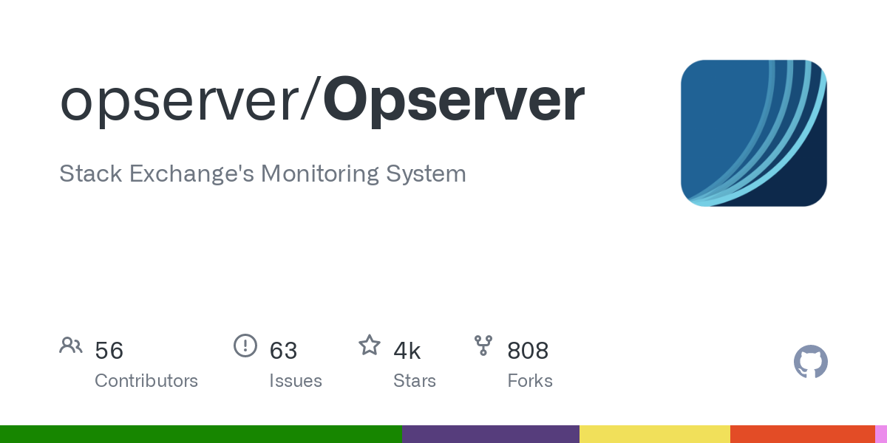

모니터링이 안되고 있는 업무 부분이 있어 진행해 보았다 

장에가 발생하면 즉각 조치가 어렵고 프로세스 강제 재시작 말고는 대처가 어려웠다 

이런 상황이라면 가장 중요한 부분은 장애 인지시 제 3의 시스템에 의해 알람이 발생되거나 의심되는 부분을 확인 할 수 있는 (메모리 누수 / TCP 소켓 연결 이상)  Application Performance Management 시스템에 의해 관리되어야 한다 (제니퍼, 핀포인트, 스카우터) 

현재로는 알람 발생이 가장 필요한 부분이었고 APM의 역할은 부수적인 부분이었다
그래서 한번 모니터링을 할 수 있는 툴을 붙여보았다 

커스터마이징 경험이 있는 오픈소스라 사실 다른 툴에 대한 리서치는 하지 않았고 Windows 라는 플랫폼의 제한도 있기 때문에 쉽게 선택되었다

일단 제약 사항은 아래와 같다

- ## Windows 기반의 application 모니터링이 가능한 툴 
  - WMI(Windows Management Instrumentation)
  - SNMP(Simple Network Management Protocol)  

- ## 따로 Agent 설치가 필요없는 Polling 방식의 간단한 툴 
  - Server에서 직접 Query

- ## 너무 듣보잡이라고 하기에는 그래도 나름 검증된 이름값이 있어야 하는 툴
  - Stack Exchange's team (stack overflow) 

- ## 프레임워크나 언어에 있어 다룰 줄 알아 따로 공부없이 바로 코딩이 가능한 툴 
  - C# / .NET Framework

Stack overflow Tech Stack을 알아보면 Microsoft 즉 Windows 기반에서 개발을 하는 것으로 보인다 

아래 그림이 해당 시스템을 간단하게 표현해 주는 것 같다 

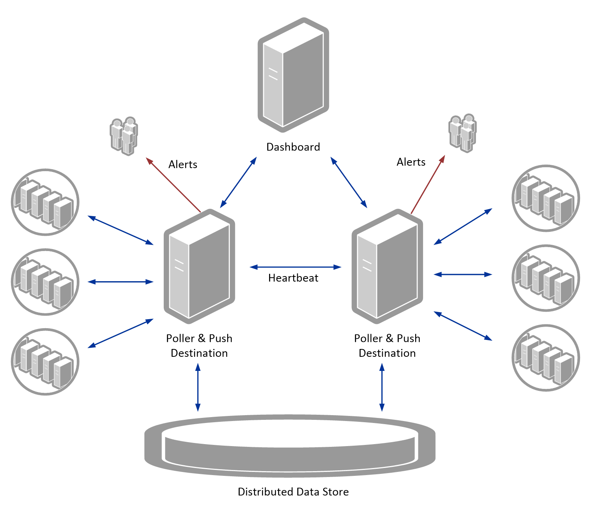

Monitoring 주제에 따라 각각 Dashboard 가 연결되어 있고 모니터링 기능은 아래와 같다 
- Dashboard 
  - WMI Moritoring
  - etc : Bosun, Orion 
- Exception Log Store
  - Jira issue reporting
- SQL Server Instance 
- Redis 
- Elasticsearch 
- Haproxy(Load balancer)
- PageDuty
- CloudFlare
  
사용된 웹 기술은 기술은 ASP.NET MVC5 or Core 로 가능하다

배포 방법은 Core일 떄는 Windows / MacOS / Linux 모두 가능하고 MVC일 때는 Windows에 IIS를 이용할 수 있다 

Exceptional 이라고 Error 에 대한 로그를 쌓을 수 있는 DB를 생성할 수 있는데 MS-Sql이 기본이고 MySql 까지 지원한다 

설정에 따라 보고자하는 Web Dashboard를  상단 메뉴에서 선택할 수 있고 설정파일은 json 형태로 되어 있다 

모니터링 모듈을 추가하고자 하면 설정파일만 추가하면 인식되고 File Watcher 가 동작하기 때문에 실시간 수정도 가능하다 	

요즘 트렌드에 맞게 Docker 로도 구축 및 배포가 가능하다

이런 형태로 대시보드에서 차트로 보는 것이 가능하다 

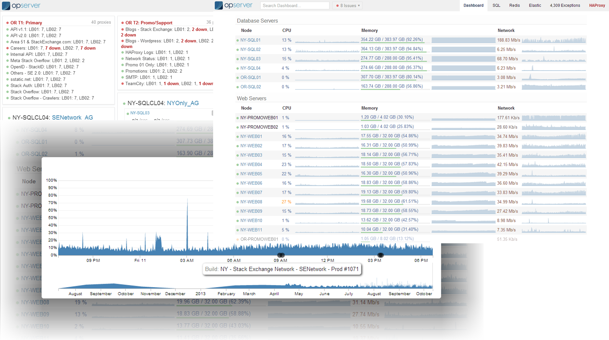

내부에는 디자인패턴으로 공통 Interface와 객체지향적 개발로 되어있는데 기본 개념은 Provider로 되어 있다 

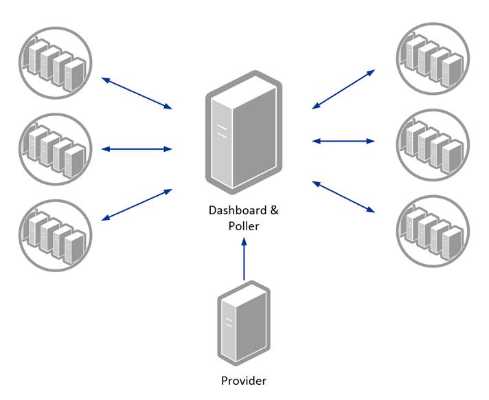

이 Provider 하나가 특정 모니터링을 주관하고 각각의 Dashboard를 가지고 있다

WMI-Provider : Base-Provider 를 가지고 있는 형태이다 (C#에서는 java의 extends 가 : 이다)

Configuration도 디자인 패턴으로 되어 있다 

각각 WMI-Settings : Base-Settings 로 되어 있어 확장이나 수정시에는 구현 클래스와 기본 클래스의 차이를 구분해야 한다

객체지향적으로 보면 추상 클래스를 기본으로 Provider 를 통해 확장 된 패턴을 가지고 있다 

각각의 Provider는 Module 클래스를 포함 관계로 가지고 있고 이는 Settings 가 제네릭으로 구성되어 있다 

Effective Java에 추상 클래스와 인터페이스를 비교하는 글들이 있는데 추상 골격 즉 기본 뼈대는 추상 클래스로 되어 있고 기능 확장에 대한 부분은 인터페이스를 통해 Module과 Provider 가 분리되어 있는 패턴이다 

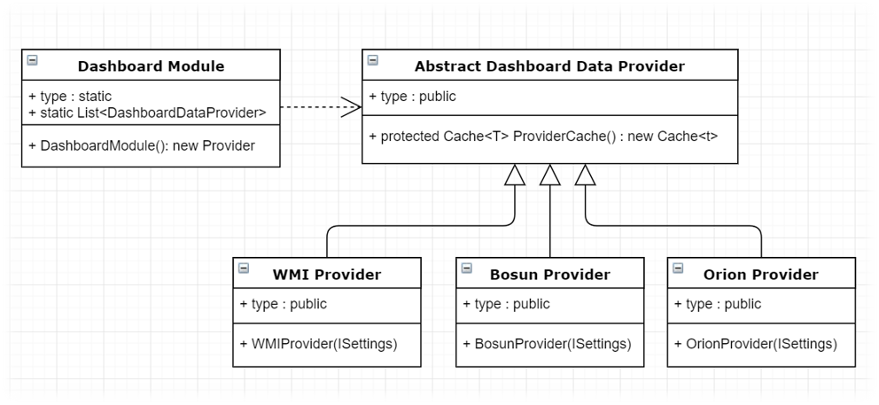

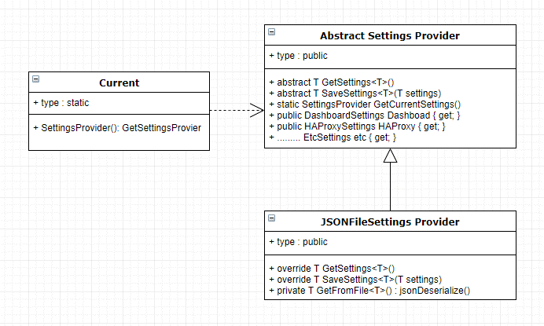

내부에는 Poll Engine이 동작해서 주기적으로 설정된 data 를 수집할 수 있다

Cache 클래스를 추상화시키고 자료구조화 해두어 누적데이터를 메모리상에 일정기간 가지고 있다

기간이 길어지면 모니터링 툴의 리소스가 늘어난다 

이 부분은 agent가 따로 없고 DB화 된 data 체계가 없어 생기는 단점이지만 그 대신 Agent 없이 설치만 하면 독립적으로 운영이 가능하다 

Security 부분도 Active Directory 인증도 가능하고 단순 뷰어로도 가능하다 (로그인 부분에 권한을 추가해서 커스터마이징도 가능하다)   

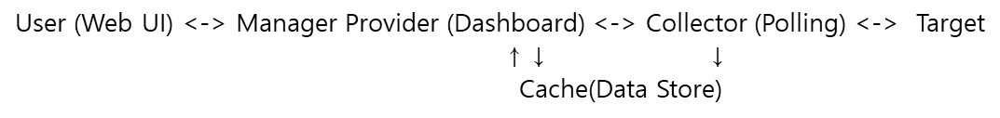

그리고 내가 원하는 부분은 아래와 같다

- ### CPU(Process 포함) / Memory 에 대한 추이 파악으로 메모리 상 누수 문제나 프로세스 상태 파악을 할 수 있다 
- ### 프로세스 상태 파악을 하면서 프로세스가 죽어 있으면 알람을 보낸다 

먼저 Opserver 현재 버전부터 보았을 때 이미 사용되고 있는 녀석이기 때문에 원하는 기능이 모두 있으면 따로 해야할 게 없다

확인해 보니 HW 적인 리소스는 모니터링이 가능한데 프로세스에 대한 모니터링이 없어 해당 부분은 추가해야 했고 알람 부분은 Exception 대상으로만 되어 있었고 Opserver 내부에서 사용되고 있지 않았다 

결국 제가 원하는 부분은 모두 추가 구현이 필요했다

다행인 것은 코드를 과거에 본적이 있기 때문에 어느 부분에서 WMI Query를 하는지 알고 있었고 Email 발송 부분도 Template을 커스텀 하게 사용한 적이 있어 큰 고민 없이 코드를 고쳐나갔다 

WMI에서 Process의 CPU 사용량을 알아오는 Query는 검색해서 찾았고 기존 구조를 망치지 않는 형태로 추가해두었다

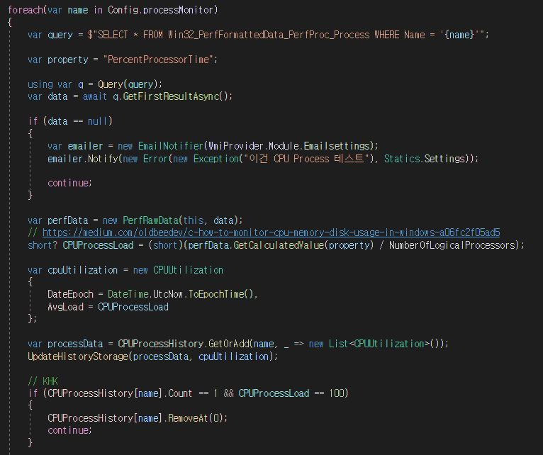

Process name은 설정에서 가져왔으며 data가 null 이 되면 프로세스가 죽은 상태이므로 email 발송하는 부분을 두었다 

Email 발송은 원래 바로 보낼 수 없는 부분인데 나중에 다시 설명하겠다

Process Query 값과 작업관리자 사용 상태를 보니 값이 안 맞는 것 같아 검색해보니 Processor 개수로 나누고 있었습니다 Processor 각각이 아닌 평균치로 봐야 겠다 

그리고 옛날버전에도 있던 부분인데 WMI 버그인지 최초 1회에는 100%을 치는 부분이 있어 해당 부분은 예외 처리 했다 (HW CPU도 마찬가지로 100%을 침) 

대부분의 클래스나 로직은 기존 구조를 따라갔고 설정에서 프로세스 리스트를 가져오는 부분만 따로 추가했다 

json 설정 파일이 위에 있다고 했었는데 아래 한 줄이면 끝이 난다 

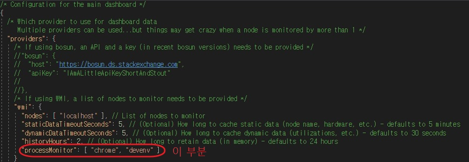

이렇게 processMonitor 라고 한줄을 추가하면 설정에 적용된다

예시로 chrome이랑 visual studio를 두었다

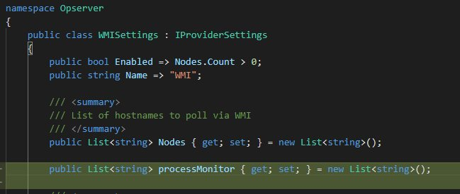

Process 에 대한 알람을 추가하니 Process memory 추이도 알면 좋겠다 싶었다

메모리 누수에 대한 확인과 추이를 알 수 있으면 Application 의 결함을 찾을 수 있는 계기다 될 수 있다 

찾아보니 Process memory는 WMI 말고 .NET에 Process 클래스가 제공되었다

해당 부분은 동일 Process name으로 수집하기 때문에 동시에 수집하도록 CPU Query 쪽 아래에 두었다 

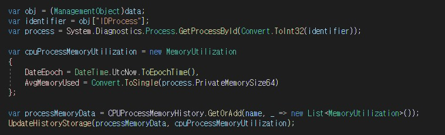

이로서 Process cpu와 memory 사용에 대해 수집해 주는 polling 코드가 추가되었다

해당 매소드는 다른 수집 주기와 동일하게 적용되도록 기존 코드에 반영했다 

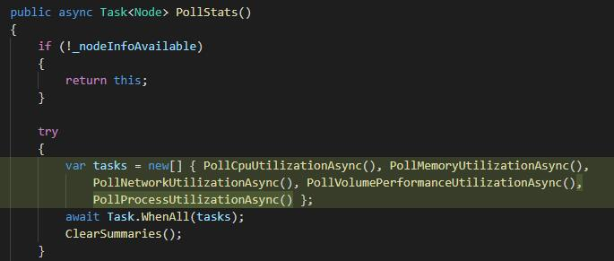

내부에서 사용하는 데이터는 CPU / Memory가 구분되어 각각의 자료구조를 가지고 있는 부분이 있어 추가할 부분이 더 있으나 이 정도로 핵심기능인 Query 부분은 끝나게 된다

다만 이걸로 끝이 아닌게 UI에 반영되려면 화면에서 Data를 갱신하고 차트에 반영해야 한다 

기본 구조는 MVC 형태이기 때문에 화면에서 어떻게 REST를 쓰는지 크롬의 네트워크 탭에서 확인했다

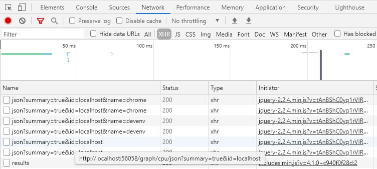

Opserver 의 Chart 라이브러리는 D3.js 를 사용하고 있는데 아주 많이 쓰이는 라이브러리로 알고 있다 

D3.js 를 사용하고 script 부분에서 ajax 로 호출하게 되어 있다 

그리고 .NET framework의 MVC는 view template engine 을 Razor View라는 것을 사용하는데 이건 JSP나 Thymeleaf 랑 비슷하다 

HTML 안에 java 코드를 쓰듯이 c# 코드를 쓰면 된다 

여기도 Process name을 사용하게 때문에 설정에서 가져온 이름으로 foreach 돌면서 차트를 그리게 했고 내부에서 스크립트를 호출하게 두었다 

이렇게 해서 화면이 갱신될 때 차트를 다시 그리도록 불러와 진다 

(따로 웹소켓이 연결되어 실시간 갱신하는 부분은 없다 )

일반적인 Client/Server 구조가 아닌 UI 기반의 Web Dashboard이고 어플리케이션 내부에서 Thread로 동작하는 Poll Engine 이 있다

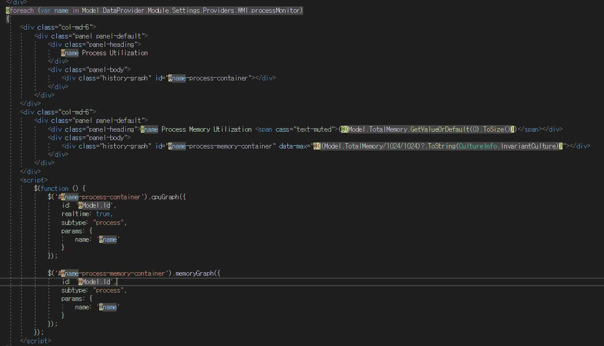

여기서 하나 애먹었던 부분이 있는데 기존 구현된 script에서 params 를 추가로 보내서 Polling 된 data의 key(Process name)를 보낼 수 있었는데 차트를 Zoom을 하면 데이터가 보이지 않았다 

이 부분은 REST나 Controller 상으로 처리하는 부분이 없어 어쩔 수 없이 script.js 파일까지 까보게되었고 여기에 하나 분기문을 추가하게 되었다

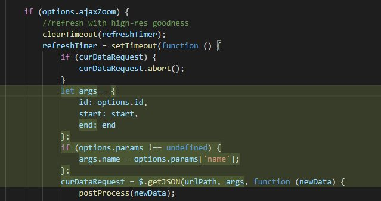

다행히 테스트를 해보니 기존 기능들에 영향은 없었지만 기능 추가를 하는데 있어 if 한줄을 넣었다는 것은 추후에 또 if가 추가될 여지가 있다는 부분이라 매우 맘에 안들었지만 chart zoom이 구현된 부분이 여기 밖에 없어 params 유무에 따라 처리되도록 했다 

이 걸로 프로세스 모니터링 부분은 끝낼 수 있었다 

두 번째는 이메일 발송 부분인데 앞에서 언급되었듯이 해당 부분도 코드를 추가해야 하는 상황이었고 발송까지 연결하는 부분이 없어 그것도 이어주어야 했다 

Exceptional 의 main 기능은 Error에 대한 로그 수집이었기 때문에 email 발송은 부가 기능이었다 

exception 이 발생하면 email send에 대한 부분이 선택이라 그 선택 코드를 붙이면 된다고 생각하고 원본 코드에서 필요한 부분만 가져다 사용했다  

- ### SMTPClient
  - SMTP Server 설정은 json으로 지정 
  - 현재 내부에서 사용하는 SMTP 서버가 없는 상황이라 gmail 설정을 통해 메일 발송 
- ### Email Template는 동적 HTML 생성 

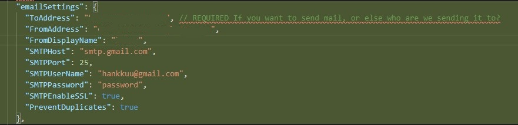

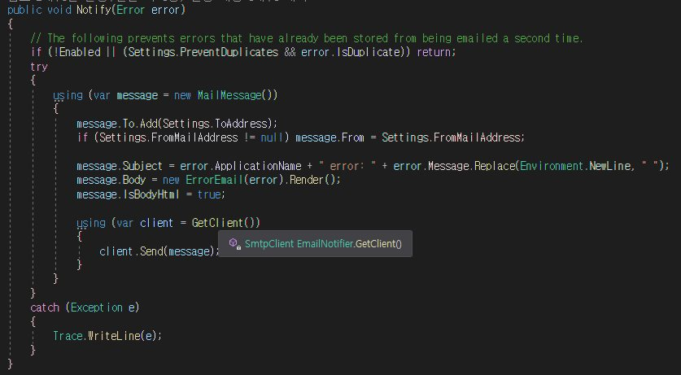

client 설정은 설정파일로 지정하고 mail template는 고정이지만 하고자 하면 변경은 가능하다 

즉 기존에는 ErrorStore 구조를 가지고 있어 Error 가 쌓이는 형태인데 이걸 사용안하고 Notify 하는 부분만 사용해서 구조적인 변경없이 Email Sender 구현이 된다 

3줄만 추가해서 Email Send 기능을 완료했다 

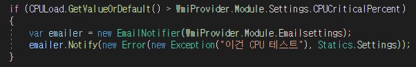

그러면 이제 실제로 구축해보면 

일부터 .NET Core로 진행했다 그러면 IIS라는 Tomcat 같은 WAS 가 동작해서 Application이 Hosting 될 필요가 없고 Kestrel 이라는 것이 내장되어 있어 Spring boot 처럼 Internal Tomcat이 있는 것처럼 쉽게 구동할 수 있다 

이런 부분을 보면 .NET Framework는 Spring 과 Web Framework 로서 유사점이 많은 것 같다 

자 이제 Publish를 해보면 

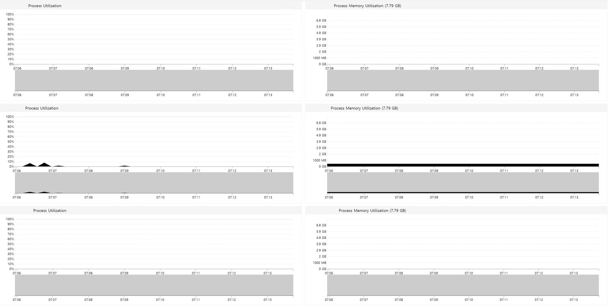

원하는 그림은 나왔다 Y축이 고정이라 그래프가 작아 보이긴 하지만 마우스를 가져가면 수치가 보인다

줌을 하면 확대해서 그 시간대만 볼 수도 있다 글로벌 오픈소스이기 때문에 기본시간은 UTC 시간이라 +9시를 고려해야 한다 

그리고 제일 중요한 알람발송이 되야 하는데 테스트를 해보면 아래와 같은 메일이 오게 된다

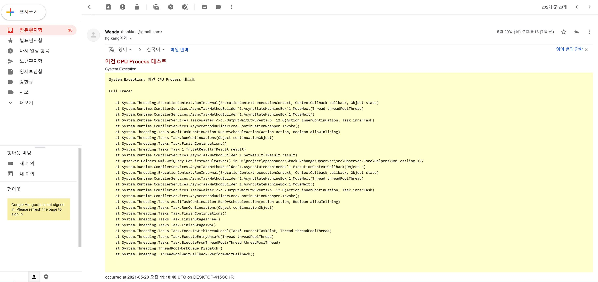

메일 템플릿이 기본 Exception 기반이라 마음에 들지 않지만 보여지는건 변경이 가능하다 

현재 필요한건 장애 발생 즉시의 알람 뿐이라 이쁜 Template은 중요도가 떨어져서 따로 수정하진 않았다 

SMTP Server 가 따로 없기 때문에 내 Gmail을 통해 발송하는 방법으로 전달 했다 

SMTP 를 쉽게 쓸 수 있는 방법이 있는지 혹은 사용하기 쉬운 오픈소스가 있는지 한번 찾아봐야겠다 

Mail-gun이라고 제한된 무료 서비스가 있었으나 현재는 유료로 전환된 것으로 알고있고 email에 한정된게 아닌 토이프로젝트로 여러 매체를 통한 발송 서버를 한번 구현해보고 싶어 졌다 

해당 부분은 Pull Request로 올려보았고 반영될지는 미지수이지만 그래도 글로벌하게 code review를 해보는 기회가 될것 같다

추가로 Redis Server나 SQL Server에 대한 모니터링 Dashboard도 추가했으나 따로 보이지는 않는다 

Open Source로 다양한 구현이나 활용을 할 수 있고 다른 사람과 공통으로 개발하는 부분에서 유연한 확장을 고려해야 하니 Abstract Class와 Interface이용한 추상화에 대해서도 배워볼 수 있는 부분도 장점인것 같다 

내가 혼자서 다 만들면 무척 힘들텐데 기본 뼈대가 있고 필요한 부분만 추가해서 만들면 되니 개발 시간이나 비용도 단축이 될 수 있었다 

오픈 소스를 적극적으로 활용하는 부분이 요즘 웹 서비스 개발에 중요하게 생각된다 (아니면 비용을 들여 Managed Service를 붙일 수도 있다)

개발자는 회사에서만 코딩하는 것이 아닌 전 세계 개발자들과 같이 코딩한다는 느낌이려나.. 어쨌든 회사에서 하는 것은 일인데 오픈소스는 일 보다는 공부하는 것 같다 

PR을 끝으로 해당 작업을 마친다 

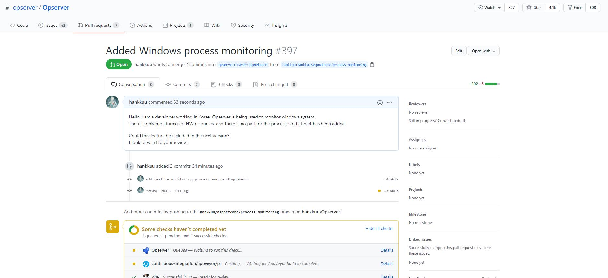

## Opserver : https://github.com/opserver/Opserver 

## Exceptional: https://github.com/NickCraver/StackExchange.Exceptional 