# Java 8 이후의 Heap Memory 구조의 변화 

14년 3월에 JDK8이 출시되었습니다. 

사실 2021년도에 JDK8 을 왜 논하지? 라고 생각할 수 있을 것 같아 설명 해보면 저는 Java 언어 기반의 개발로 시작하지 않았고 Java를 쓰는 개발로 끝을 내고 싶은 생각은 더더욱 없습니다 다만 커리어 도중 Java로 코딩 할 기회가 있었고 그 부분에서 기존 인프라가 (AWS) All Cloud Platform 로 올라가면서 기존 레거시가 JDK7 -> JDK8로 변환되었습니다 

이왕 다루는 김에 조금이라도 더 잘 알자 하는 마음에서 정리하게 되었습니다. 그리고 조금 더 명분을 간단히 하면 JVM의 메모리 구조를 취미 삼아?? 알고 싶었습니다

---
## 1. 메모리 구조를 알자 

발단은 Java 기본서와 C 기본서의 메모리구조의 차이였습니다. 

JVM의 Heap Memory 구조와 C 언어 기초 책에서 소개되는 프로그램의 Memory 구조가 조금 다른 부분이 있어 그 부분도 찾아보게 되었는데 먼저 C 언어에서 소개하는 메모리 구조 입니다 

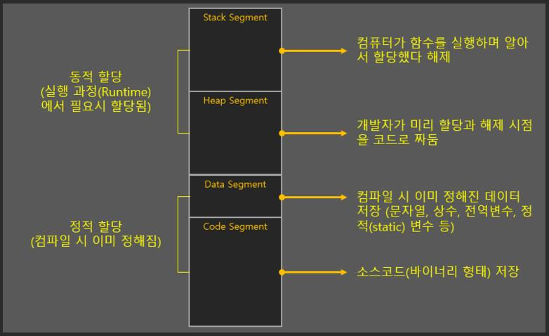

Stack / Heap / Data / Code 영역으로 나누고 있고 보통 세로 막대를 쪼개어 설명이 됩니다 

다음은 자바에서 소개하는 메모리 구조 입니다 

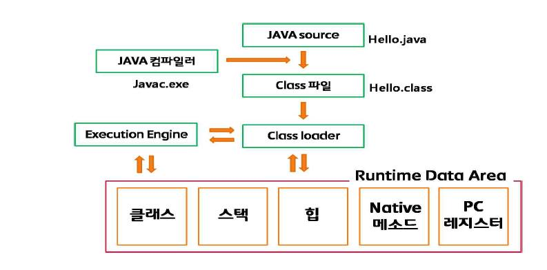

뭔가 다르죠? ㅎㅎ 이론으로 깊게 공부해 본적이 없어 자의적인 해석을 담아 언급하고 넘어가겠습니다

아래 그림이 다르게 된 부분으로 이해되었습니다  

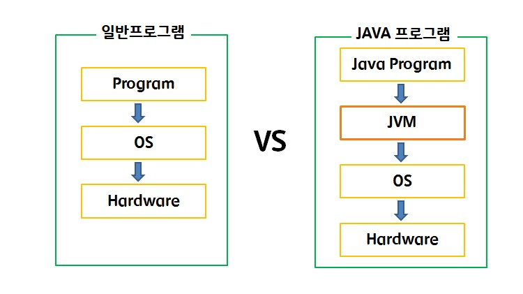

즉, JVM 이라는 녀석을 통해 프로그램이 해석이 되야 하는 부분이 생겼고 이는 OS와 Memory(HW) 중재자 역할을 해야 합니다

결론적으로 GC(Garbage Collector) 라는 매우 핵심적인 기능이 제대로 동작해야 합니다 

이런 JVM 덕분에 과거의 프로그램에서 직접 해주었던 Memory 관리를 안할 수 있게 되었고 개발자는 OS가 다루는 Memory 가 아닌 JVM이 다루는 Memory를 알아야 하는 이유가 생겼습니다 

즉 JVM의 존재와 GC 라는 기능을 알고 JVM을 의한 메모리 구조가 만들어 졌구나를 언급할 수 있어서 메모리 차이를 훓고 넘거가게 되었습니다 

그리고 이 말 뜻은 JVM이 누구에 의해 어떻게? 만들어 졌나에 따라 이 구조도 불변이 아닌 변경될 수 있는 구조라는 것도 생각할 수 있게 됩니다

이는 GC 알고리즘에 따라 변경될 여지가 있다는 부분으로 보입니다

- ### 특히 JVM Memory의 Heap 구조!!
  
여기서 이론적으로 더 깊게 나갈 필요는 없는 것 같아 JVM Memory에 데이터가 로드되고 해제된 다는 것만 기억하고 Skip 하겠습니다 

JVM의 Heap Memory 구조를 보여주는 그림이 아래와 같이 있습니다 

한글로 된 그림의 연장선인데 용어가 조금 다릅니다 

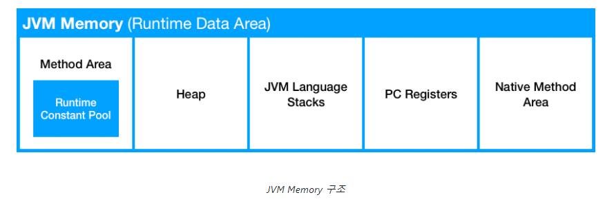

간단하게 클래스 영역 = 메소드 영역은 동일하게 보겠습니다. 그리고 중요한 Heap 구조는 아래 형태 입니다 

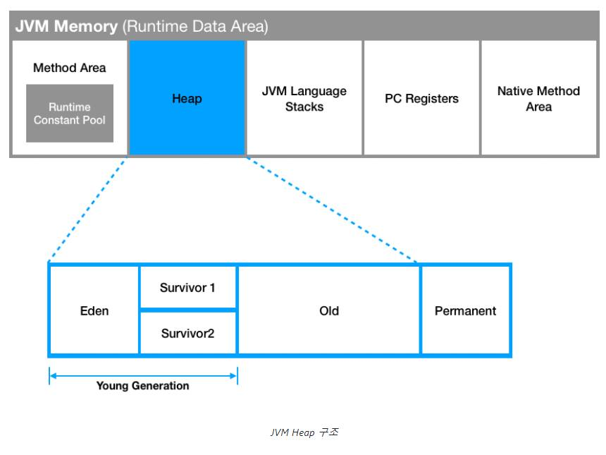

용어를 간단히 하기 위해 Young(new) / Old / Permanent 로 3개로 나누어 보겠습니다 

Heap 영역은 new 연산자로 인해 생성된 객체를 저장하는 영역으로 GC가 발생되는 총 영역을 얘기하고 불필요한 리소스들을 추적/관리하기 위해 Heap 영역도 쪼개어 보게 되었습니다 

### Young 영역

- Eden 영역(Minor GC)
  - 새로 생성된 객체가 처음 위치하는 영역
  - 주기적으로 GC가 발생하고 Eden 영역이 가득차면 Survivor 영역으로 옮겨진다  
- Survivor 1, Survivor 2 영역(Minor GC)
  - Eden 영역에서 살아남은 Object 들이 잠시 머무르는 곳이며 이 두 영역간 우선순위가 있는 것은 아니고 둘 중에 하나의 영역만 사용하게 된다 
  - 이런 구조로 둘 중에 하나는 비워진 상태가 되며 둘 중의 한 영역이 완전히 비워지지 않는다면 문제가 있다고 볼 수 있다 
    - 참조가 없으면 사라져야 하는 것이 GC과정 

### Old 영역(Major GC)
  - Survivor 1 또는 Survivor 2 영역을 왔다갔다 하는 과정에서 살아남은 Object가 Old 영역에 이동하게 되며 Old 영역의 메모리가 충분하지 않으면 발생되는 GC과정을 Major GC 라고 함
  - 보통 Old 영역이 Young 영역보다 크게 할당되며 이러한 이유로 Major GC 빈도는 Minor GC 보다 적게 발생 
  - Object의 크기가 매우 클 경우에도 Eden 영역에서 Survivor 영역을 거치지 않고 바로 Old 영역에 올 수 있다고 함 

### Permanent 영역
  - Class의 Meta 정보나 Method의 Meta 정보와 Static Object 와 상수 정보들이 저장되는 공간
  - Object의 생명 주기가 긴 것들이 할당되며 GC 대상에서 제외하기 위해 만들어진 영역
  - ## Java 8에서 실질적으로 교체된 영역
 
 ---

여기서 하나 문제 제기를 하겠습니다 

C 언어에서 Data 영역 즉 Static Object라고 할 수 있는 부분이 Heap 영역에 포함되지 않는데 JVM에서는 Heap 영역에 포함됩니다 그리고 위에서 같다고 얘기한 

  - 클래스 영역 = 메소드 영역 

이 Meta 정보를 저장하는 영역과 성격이 비슷해 보입니다. 

제가 외부 사람들과 진행하고 있는 스터디에서도 해당 내용이 이슈가 되었고 결론적으로는 Permanent 영역은 클래스 영역 = 메소드 영역을 포함하고 있다는 내용을 찾았습니다 
 - https://stackoverflow.com/a/60066513/9923340
 - https://stackoverflow.com/questions/41358895/permgen-is-part-of-heap-or-not 
 - Hotspot JVM(Oracle JDK) - [링크](https://mirinae312.github.io/develop/2018/06/04/jvm_memory.html)
   - Method Area 는 JVM 제품(벤더)에 따라 구현이 다르다. 
   - Hotspot JVM(Oracle)의 Method Area 는 Permanent Area(PermGen)이라고 한다.
  
---
최종적으로는 아래의 그림이 JVM의 Memory 구조라고 할 수 있게 되었습니다 

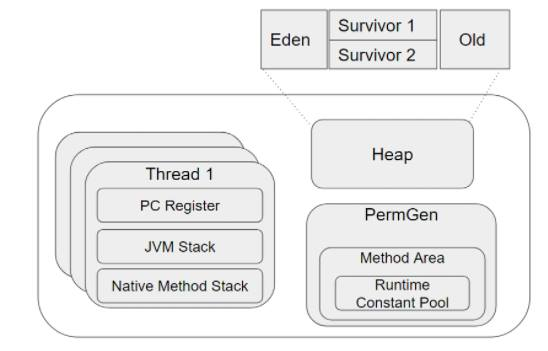

위에서 Heap 구성요소에 Permanent(PermGen) 영역은 Heap의 구성요소는 아니지만 GC의 대상이 아니라는 것은 맞습니다 

그렇다면 왜 이런 개념이 혼재되게 되었을 까요? 

Heap 이라는 부분이 우리가 C언어에서 봤던 Heap 영역과 Permanent Heap 이라는 2개의 Heap 공간으로 구분한 내용이 있습니다

즉, C 언어와 JVM에서 말하는 개발자가 Object 생성을 주관하는 공통적인  Heap 영역이 있고 C 언어에서 처럼 Static과 상수를 주관하는 Data 영역과 JVM에서의 Permanent Heap 영역이 구분되는 것으로 보입니다   

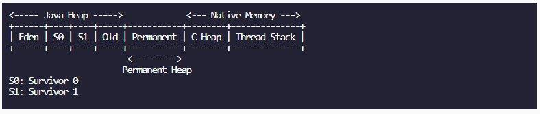

내용 출처: 기계인간 - [Java 7 까지의 HotSpot JVM 구조](https://johngrib.github.io/wiki/java8-why-permgen-removed/)

그래서 Permanent 영역을 공통적인 Heap 이라고 보는 것 보다는 별개의 영역으로 보는것이 좋아보이고 결론적으로 Java 8 에서는 사라지게 되었습니다 

그리고 이 Permanent 영역이 GC의 영역이 아니어서 발생되는 Memory 부족 문제가 있었는데 이 부분이 Java 8이 되면서 변경되었습니다 

일단 Permanent 영역의 메모리 부족이 발생되는 Exception 으로는 Out Of Memory Exception 이 고 이런 현상이 발생되는 이유는 아래와 같을 수 있습니다 

- Static Object의 잘못된 사용
- Class, Method Meta data의 증가 

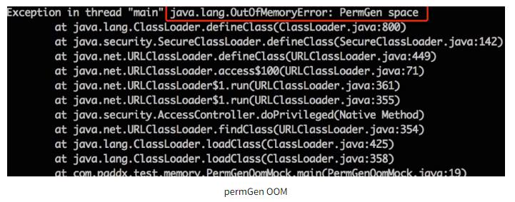

이 문제를 해결하기 위해 Perm 영역 메모리 크기 옵션을 지정할 수가 있는데 이 부분이 Java 8로 오면서 지정할 필요가 없어 졌습니다 

- Java 7에서의 튜닝옵션: -XX:PermSize / -XX:PermMaxSize 
  
### Java 8 부터는 Permanent 영역이 사라지면서 JVM  영역 구조가 변경이 되었는데 추가된 부분은 MetaSpace 영역이라고 합니다 

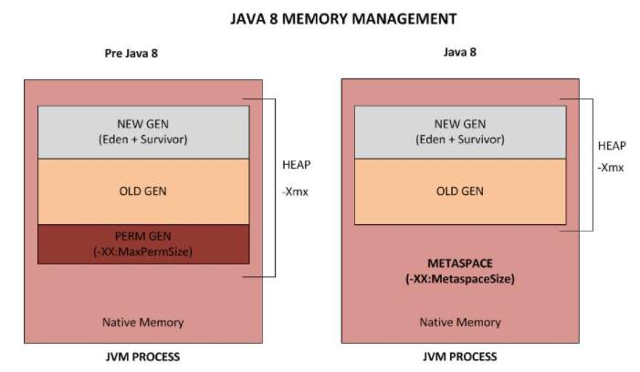

요약하자면 Permanent 영역이라는 부분이 있었고 

여기서 잘못된 프로그래밍으로 Memory 영역의 부족으로 인한 Out Of Memory Exception 발생이 있었는데 

그 부분이 Java 8에서는 Permanent 영역이 없어 졌기 때문에 Permanent 영역의 OOM은 과거의 산물이 되었다가 결론입니다 

이젠 Permanent 영역이 Heap 영역이냐 아니냐가 필요없어진 논제가 되었습니다 

그렇다면 변경된 부분이 어떤건지 확인해 보자면 

---
- Static Object, Constant Object를 Heap 영역으로 옮기면서 최대한(?) GC가 될 수 있도록 수정
  - interned Strings and class static variables will be moved from the permanent generation to either the Java heap or native memory 
    - [출처](https://openjdk.java.net/jeps/122)
- MetaSpace 영역은 Heap 이 아닌 Native Memory 영역으로 취급 
  - Heap 영역은 JVM에 의해 관리된 영역이며, Native 메모리는 OS 레벨에서 관리하는 영역으로 구분

- 튜닝 옵션의 변화 
  - Perm 영역 메모리 크기 옵션  -XX:PermSize / -XX:PermMaxSize
  - Metaspace 영역 메모리 크기 옵션 -XX:Metaspace / -XX:MaxMetaspaceSize

기존에 Permanent 영역의 Out Of Memory 문제는 Static Object를 사용하면서 개발자의 잘못된 프로그래밍으로 부족현상으로 보는 의견이 많았고 Java 버전이 올라가면서 이를 해소하기 위해 아예 Heap 영역으로 변경한 것으로 보입니다 

- 이제는 C 프로그램의 메모리 구조와 JVM 메모리 구조는 전혀 다른 형태가 인정되었습니다
 
변경된 내용은 기계인간 ([논문 같은 블로그](https://johngrib.github.io/))님이 표로 정리해 주셨습니다 

--- 

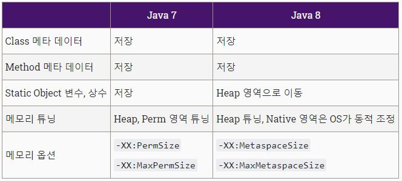

추가로 덧붙이자면 Meta data 를 OS가 관리하는 영역으로 옮겼기 때문에 Dynamic Object 이든 Static Object  이든 GC의 대상으로 관리하면 되게 되었습니다 

그 밖의 Meta data를 비롯해 Permanent 영역에 사용되는 data는 OS 레벨에서 관리하는 영역으로 변경되어 개발자는 Heap 영역에만 신경 쓸 수 있도록 Memory 사용 구조를 단순화 한 것으로 보입니다 

즉, JVM의 Heap Memory는 GC에서 최대한 관리되게 하고 그 밖의 data는 OS 레벨에서 관리하도록 나름의 개선(?) 을 한 것으로 보이는데요 

과연 이걸로 끝이 난 걸 까요? 

---

이렇게 되어서 개발자가 Out Of Memory 에서 해방되었다고 말 할 수 있을까요? 

이 글을 쓰면서도 진짜 개발의 세상은 끝이 없구나를 느낍니다 

결국은 Permanent 영역을 Heap과 MetaSpace로 쪼갠 셈이 되었는데요 

그러면 Heap은 튜닝 옵션이 처음부터 있었기에 MetaSpace는 튜닝할 경우가 없을가요? 

찾아보면 MetaSpace 영역을 Default 로 지정하고 운영하다 심각한 성능 이슈를 겪는 경우도 있었습니다 

- [JDK8 적용 후 심각한 성능저하가 발생한다면?](https://brunch.co.kr/@heracul/1)

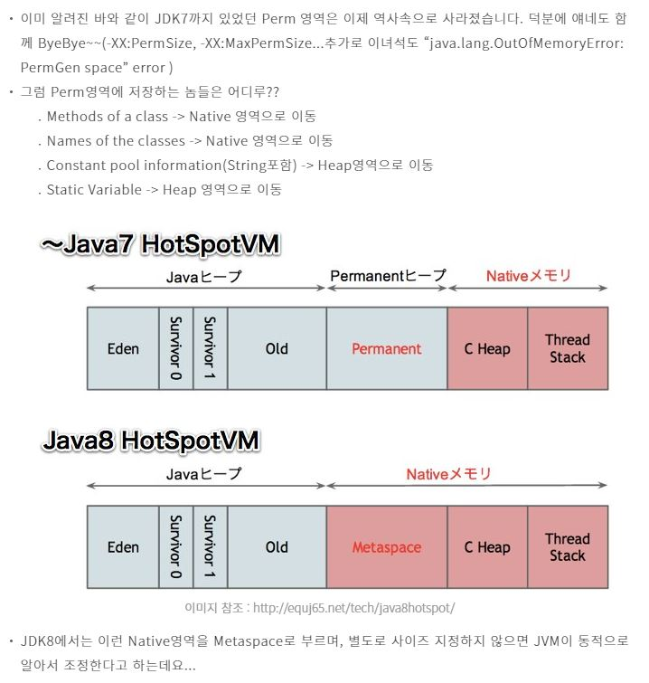

여기에 요약된 내용은 이제 위에서 쭉 언급했기 때문에 쉽게(?) 이해 되었으리라 생각됩니다 

언급된 장애의 현상이라면 

OOM도 발생하지 않고 Old 영역의 상태가 100%로 지속되면서 Heap Area에 대한 Minor GC만 반복되었다고 합니다 

그러다 보니 Old 영역을 사용하지 못하고 반복적으로 Heap 100%와 minor GC로 심각한 성능 저하가 발생되었다고 합니다 (부하 테스트를 통해 재현되었다고 합니다)

Parallel GC에 Heap Memory를 -Xmx1G로 설정하고 부하를 발생시켰을 때

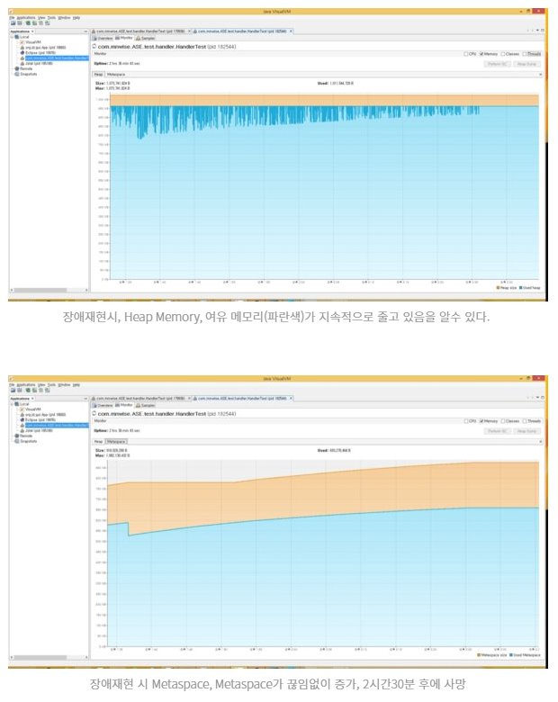

해결한 방법은 MetaSpace에 XX:MaxMetaspaceSize=256m 로 Custom 한 옵션값을 주었다고 합니다 

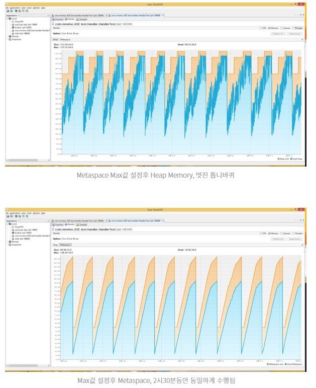

--- 
작성자의 예측은 

Class Meta 정보가 Metaspace에 유지됨에 따라 Old 영역에 Major GC가 발생되지 않았을 것으로 예상하고 있습니다 

하지만 이 부분은 Native Memory 에서 관리하기로 Java 8에서 쇼부 본 부분인데요 

개발자에게 메모리 관리의 자유를 주었지만 MaxMetaspaceSize를 알 수 없어(설정이 없다면) Meta data의 release 타이밍을 알지 못했고 이로 인해 적절한 Full GC가 발생되지 않았을 것으로 예상하고 있습니다 

즉, -XX:PermSize, -XX:MaxPermSize 옵션은 사라졌지만 -XX:MetaspaceSize, -XX:MaxMetaspaceSize의 지정이 새로 생겨난 샘입니다 

다행인 부분은 이 Native Memory의 튜닝 옵션이 없어 문제가 발생한 케이스는 Java-groovy, Java-scala 로 Java만 사용했을 때는 오라클의 가이드대로 별도의 설정없이 Native Memory의 적절한 release 가 되는 것으로 보인다고 끝맺고 있습니다 

물론 이 블로그 내용이 전체를 설명할 수는 없을 것이고 현재 Java 버전이 올라가면서 진짜로 개발자가 메모리 세상에서 해방 되었을 수도 있습니다 

--- 

가장 중요한 부분은 이 글의 제목대로 JDK 버전이 변하였는데 JVM의 Memory가 나와 상의 없이 마음대로 바꾸었다는 부분입니다 

이런 부분은 수 많은 자바를 사용하는 개발자는 메모리 구조가 바뀌었으니 JVM의 메모리 튜닝 방법이 바뀔 수 있다는 것을 의미합니다 

물론 이런 정도의 변화는 어떤 한 어플리케이션의 비즈니스가 변하는 정도와 무게감이 다르기 때문에 쉽게 수정되는 부분이 아닐 것으로 보입니다 (오라클 형님들?)

제가 지향해야 하는 유지보수 코드의 방향을 한줄로 얘기하면 아래와 같은데요 

- ### 확장에는 유연해야 하고 변경에는 엄격해야 한다 

어디서 들어본 말 같은가요? 

사실 객체지향 설계 원칙중에 SOLID에 나오는 개방-폐쇄 원칙입니다(개방-폐쇄 원칙) 

SW 설계 방법에 있어 변경(확장)될 것과 변하지 않는 것을 구분할 수 있어야 한다는 얘기이기 때문에 JVM이 변하는 것에 대해 핏하게 맞는 말은 아닙니다  

하지만 이게 코드가 아니라 방법론에 가까운 말이기 때문에 마음속에 새겨진 부분인데요 

Java 7 에서 Java 8로 변하면서 변경된 확장 부분은 Lambda 나 Stream/Optional API 같은 것들이 확장되었을 것인데요 

기존에 GC의 동작이나 Memory 구조에 대한 부분은 변하지 않는 것으로 생각하고 접근하게 되면 과거에 적용한 방법이 무용지물이 될 수 있다는 것도 됩니다 

- ### 예를들면 PermGen 메모리 튜닝 옵션

즉, 변하지 않는 것을 구분할 수 있어야 하지만 그것이 변했을 때 발생되는 Side Effect 는 어떤 것이 되지? 라는 부분을 고려하지 않을 수 없다는 것입니다 (100% 개방-폐쇄 원칙을 지킬 수 있다고 보장할 수 있는 것은 아니지만 지향하는 부분인 것 처럼입니다)

물론 JDK를 설계하고 개발한 회사나 개발자는 분명 이 부분이 변경되었어도 이런 개방-폐쇄 원칙에 따라 "블랙박스화 된 부분은 걱정하지 말고 메모리 걱정하지 말고 마음껏 JDK를 쓰세요" 라고 하는 부분으로 수정을 했고 또 그 부분이 대부분 유효했을 것입니다

그런데 과연 성능 이슈를 만날일이 없다면 문제가 없겠지만 개발자가 코딩을 너무 너무 많이 잘못해서 적은 트래픽에도 메모리 이슈를 겪에 되거나 혹은 대용량 트래픽으로 인한 예상 못한 성능이슈를 겪거나 그런 상황이 되면 JVM에 대한 깊은 이해가 필요한 날이 올 수도 있습니다 (아직 그럴 경험은 별로 없었던 것 같습니다만...) 

그리고 절대로 JDK가 잘못했다는 부분이 아니라 SW 라는게 버전이 올라가면서 분명 하위 호환성을 지켜주면서 확장이 되겠지만 때로는 변경된 내용이 뭔지 꼭 알아야 할 만큼의 변화를 가져올 수 있다는 말을 하고 싶었던 것이지 SW 원칙을 설명하고 싶은 생각은 없습니다 (언급한 의도만 생각해 주세요)

그리고 JDK, JVM을 이용하는 Application을 만드는 개발자도 최소한으로 열려있는 튜닝 부분이 있는데요 

개발자는 JVM의 메모리 튜닝 옵션을 직접 지정할 수 있습니다. 

이 부분이 JVM에서 성능 이슈를 겪거나 Out Of Memory에 의한 이슈를 해결 할 수 있는 거의 유일한?? (레거시의) 해법으로 보이는데요 

물론 근본적으로는 저런 튜닝 옵션에 의존하지 않을 수 있게 JVM의 GC 매커니즘에 잘 맞게 GC가 잘되는 코드를 매우 매우 잘 짤 수 있는 능력이 근본적인 해결 방법이 되야 할 것이고 

기본은 코드를 믿되 상황에 따라 옵션을 수정하면서 이슈사항을 해결하고 코드와 JVM 튜닝을 번갈아 가면서 개선할 수 있는 능력이 있어야 할 것으로 보입니다 

그래서 결론적으로는 위에 내용은 다 필요없고 아래 표에 있는 옵션만 현재 운영상황에 맞추어 잘 넣어도 큰 장애없이 운영이 가능할 수 있을 것으로도 보입니다 

제일 중요한 부분이 제일 마지막에 언급되었다고 할 수 있겠습니다 

---

# App 개발자가 할 수 있는 부분

* Heap 튜닝 옵션
  * -Xms: 초기 heap size
  * -Xmx: 최대 heap size

* Young 영역 튜닝 옵션(Minor GC)
  * -XX:NewSize : 최소 new size (Eden+Survivor 영역) 
  * -XX:MaxNewSize : 최대 new size 
  * -XX:SurvivorRatio : New/Survivor영역 비율

* Old 영역(Major GC)
  * Old 영역, Permanent 영역에서 발생하는 GC를 Major GC(Full GC) 라고 한다

* Permanent 영역 튜닝 옵션 (Java 8 부터 없어 짐)
  * -XX:PermSize : 초기 Perm size 
  * -XX:MaxPermSize : 최대 Perm size

* Metaspace 영역 튜닝 옵션 (Java 8 부터 새로 생김)
  * -XX:MetaspaceSize : 초기 Metaspace size
  * -XX:MaxMetaspaceSize : 최대 Metaspace size

* 그 밖의 기타 옵션 (...ETC)
  * GC 로그 옵션
    * -verbose:gc -Xloggc:gc.log -XX:+PrintGCDetails -XX:+PrintGCTimeStamps

  * GC 소요시간 최소화 옵션
    * -XX:+UseParNewGC -XX:+UseConcMarkSweepGC

  * 성능을 위한 기타 추가 옵션
    * -XX:MaxTenuringThreshold=0 -XX:CMSInitiatingOccupancyFraction=60

  * OutOfMemoryError 발생시 자동으로 힙덤프 생성 옵션
    * -XX:+HeapDumpOnOutOfmemoryError -XX:HeapDumpPath=/path

* ### 기타 GC의 옵션 :  https://johngrib.github.io/wiki/java-gc-tuning/

--- 

- 참고한 내용 
  1. [Java Memory 간단히 살펴보기](https://mirinae312.github.io/develop/2018/06/04/jvm_memory.html)
  2. [C 언어의 메모리 기본 구조](https://codevang.tistory.com/28)
  3. [JVM 메모리 구조](https://huelet.tistory.com/entry/JVM-%EB%A9%94%EB%AA%A8%EB%A6%AC%EA%B5%AC%EC%A1%B0)
  4. [[JAVA] JVM 메모리 구조, 데이터 영역 ( Runtime Data Areas)](https://joomn11.tistory.com/15)
  5. [JEP 122: Remove the Permanent Generation](https://openjdk.java.net/jeps/122)
  6. [JDK 8에서 Perm 영역은 왜 삭제됐을까](https://johngrib.github.io/wiki/java8-why-permgen-removed/)
  7. [Java 8 이후의 Heap 메모리 구조와 GC 알고리즘](https://1-7171771.tistory.com/140)
  8. [JDK 8 적용 후 심각한 성능저하가 발생한다면?](https://brunch.co.kr/@heracul/1) - Full GC가 제대로 되지 않는다면?