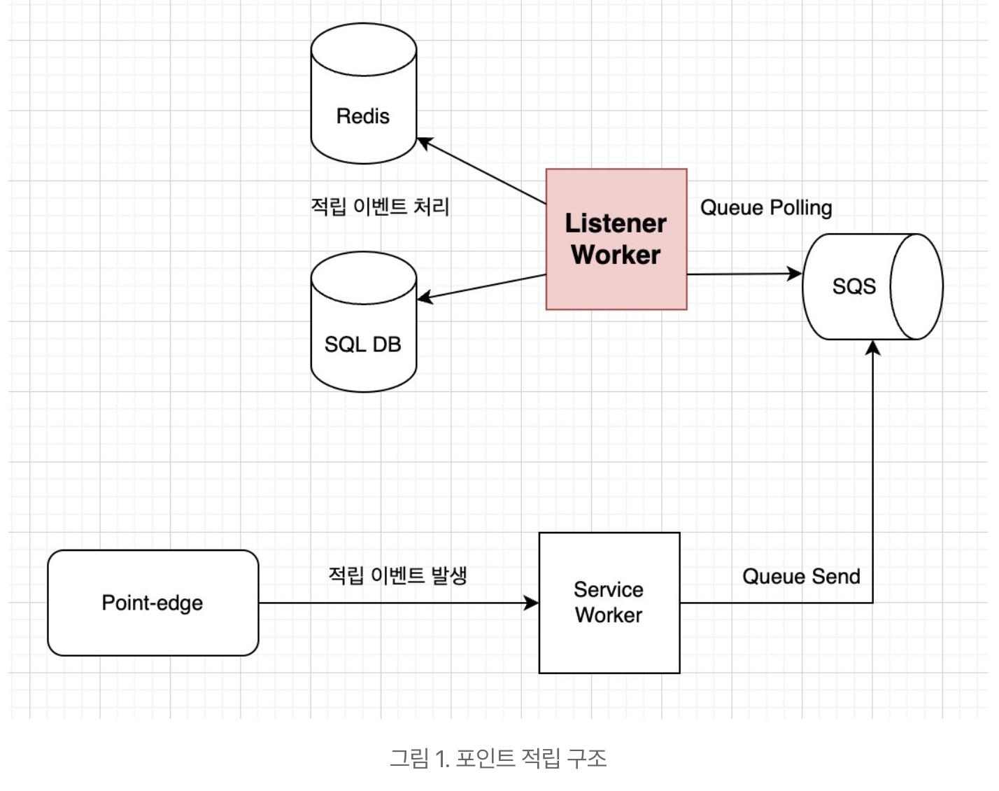

# Ktor 써도 될까요?

-  코틀린 도입 이후 레거시 사용 언어인 Java 로서의 개발은 검토되고 있지 않습니다

-  그러면 코틀린으로 개발할 수 있는 프레임워크에 대한 검토가 필요해 지는 경우인데요 

- 일단 Kotlin 공식문서에 나와 있는 리스트입니다 
	1. [Spring](https://spring.io/) - 생략 
	1. [Vert.x](https://vertx.io/)
		1.  reactive Web applications on the JVM
	2. [Ktor](https://ktor.io/) 
		1. built by JetBrains for creating Web applications in Kotlin
	3. [Micronaut](https://micronaut.io/) 
		1. modern JVM-based full-stack framework for building modular, easily testable microservices and serverless applications
	4. [Javalin](https://javalin.io/)
		1. very lightweight web framework for Kotlin and Java which supports WebSockets, HTTP2, and async requests

- 추가로 검색시 상위에 나오는 내용들을 봤습니다 
(이러이러한게 있다 정도로만 보면 될 듯)

  1. [5 Best Kotlin Server-side Frameworks - <b>2019/12/04</b>](https://javalin.io/)
   
  2. [10 Best Kotlin Web Frameworks - <b>2019/12/20</b>](https://www.dunebook.com/best-kotlin-web-frameworks/)

 
 

 
 

### 현재 필요한 부분은 대량 적립을 처리하기 위한 AWS SQS의 Listener Worker 로서 제공되는 API는 없고 Message를 받아 처리 하기만 하면되는 순수한 Worker 입니다 

### 외부에 공개 되는 부분이 없어 인증 단계도 필요 없고 자기 할 일만 하면 되는 것으로 Full-stack framwork 인 Micronaut 는 제외하기로 했습니다 

### 그리고 레이어 아키텍처로 응집도와 결합도에 대한 고민 안 하려고 Spring boot 보다는 다른 간단한 녀석을 우선적으로 고려하기로 했습니다 

### Javalin 도 제외하기로 했습니다 WebSocket 이나 HTTP2는 현재 고려 대상이 아닙니다 

### 아래의 2가지를 고려해보기로 했습니다

- Vert.x
  - https://github.com/eclipse-vertx/vert.x - Fork: 1.9K Star: 12.8K
    - https://github.com/vert-x3/vertx-lang-kotlin - Fork: 61 Star: 255
  - [Vert.X in Action](https://www.aladin.co.kr/search/wsearchresult.aspx?SearchTarget=All&SearchWord=vert.x&x=0&y=0) - 수 년전부터 출판된 책도 있음
  - [Vertex-awesome](https://github.com/vert-x3/vertx-awesome/blob/master/README.md?fbclid=IwAR18GlHNpQJxQi_RuPZeeY4pq9N2svBNRH2MhFsdlLasf22Ie0zsm959taE#dependency-injection) - 화려한? third party library
  - [Eclipse Foundation](https://www.eclipse.org/) - 바람과 함께 사라질 것 같지는 않음
  - Kotlin 버전의 NodeJS 동작방식으로 보임 - event driven 방식 
- Ktor
  - https://github.com/ktorio/ktor - Fork: 802 Star: 9.7K 
  - <b>Jetbrains</b> 가 버리지 않으면 사라질 것 같지 않음 

### 단순 스펙만 보면 Vert.x 가 더 대기업 같이 있어보이고 event-loop / non-blocking 의 적은 리소스로 더 많은 동시성을 처리할 수 있을 것 같아 더 좋을 수 있을 것 같습니다 

### 뭔가 답정너 인 것 같긴 한데 결론은 중소기업인 Ktor 가 더 적합할 수 있다고 판단되었습니다

### 이유는 github 에서 가장 처음 문구를 보고 생각하게 되었는데요 

- Vert.x
  - This is the repository for Kotlin language support for Vert.x 3. 
    - including support for HTTP, TCP, file system access, and various other features.
  - https://vertx.io/introduction-to-vertx-and-reactive/

이 녀석의 비교대상은 Ktor가 아니라 Spring boot Webflux 로 봐야 하지 않을까? 그리고 Webflux를 쓸 수 있다면 굳이 이걸로 해야 할 필요가 있을까? 

이런 의문이 들었고 국내 환경으로 보면 Webflux 가 개발풀이 더 크지 않을까? 하는 생각이 들었습니다 (아니면 NodeJS로 개발하는 회사도 많을 것 입니다) 

- Ktor
  - Ktor is an asynchronous framework for creating microservices, web applications and more. 

위에서 언급했듯이 단순한 Worker 가 필요한 상황이고 가볍게 구현하고 끝낼 생각이라 개발시간과 조사시간을 적게 들일 녀석을 찾고 있어서 현재 필요한 부분이 Ktor 로 충분할 수 있을 것 같다는 판단이 되었기 때문입니다 

그리고 재미난 글 하나를 발견했는데요 - [클리앙 - Ktor 소감 (2021/07/18)](https://www.clien.net/service/board/cm_app/16328562)

요약하자면 아래의 내용입니다

## 1. 구동속도는 Webflux 와 비교해보면 Ktor 가 압도적으로 빠르다 
## 2. Spring은 필요한 기능은 거의 다 찾으면 있는데 Ktor 는 상황에 따라 직접 구현해서 써야 할 수 있다 
## 3. Spring 에서는 DI를 표준처럼 쓰는 것을 Ktor 에서는 Koin 이라는 모듈로 비슷하게 할 수는 있다 
   

    
## 4. Webflux 나 Ktor 나 비동기 기반을 base로 처리한다 (이 부분이 결정적으로 좋았음) 
## 5. ORM으로 exposed / ktorm 이 있고 exposed는 liquibase 처럼 DB 형상관리가 쉬워 보인다 
   1. 하지만 둘 다 JDBC 기반이라 동기식으로 database 처리 해야 해서 R2DBC 미 지원이 아쉽다 

### 작고 간단하게 라는 방향성을 가지고 갔기 때문에 일단 구현해보기로 했고 필요한 모듈이 있는지도 가볍게 찾아 봤습니다. 

1. AWS SQS SDK
   1. https://github.com/JaidenAshmore/java-dynamic-sqs-listener
   2. https://docs.aws.amazon.com/sdk-for-kotlin/latest/developer-guide/kotlin_sqs_code_examples.html

2. Database
   1. Exposed - https://github.com/JetBrains/Exposed
   2. Redis 
      1. https://github.com/adibfarrasy/ktor-redis
      2. https://mvnrepository.com/artifact/redis.clients/jedis
3. Test
   1. https://ktor.io/docs/testing.html#add-modules
 
전체 구현까지 걸리는 시간은 간단한 문서화 및 프로젝트 구조 설계까지 하면 약 1~2주 정도면 되지 않을가 예상하고 있습니다 

메시지를 보내는 것과 따로 구동해야 해서 로컬에서 서버 포트 충돌이나 (8080 사용 중이니 이 녀석 서비스 포트는 무엇으로 해야할지?) 그리고 분산 환경 테스트가 쉬울까? 에 대한 고민은 되지만 색다른 재미가 될 수 있을 것 같습니다 

Kotlin을 고려 중 이라면 Spring Webflux 쓸거 아니라면 Ktor 로는 어떠실까요? 
