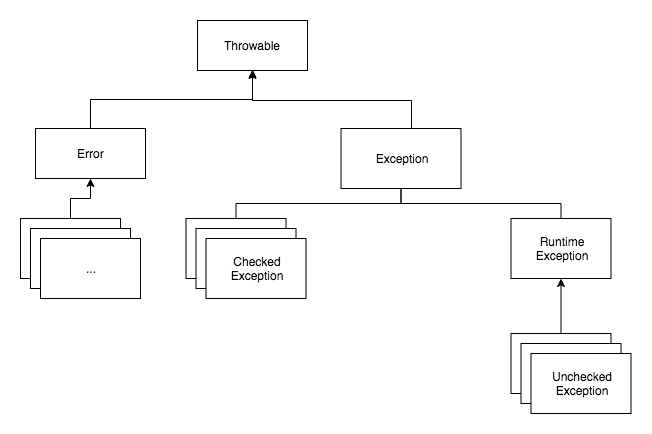
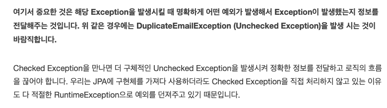

# 200(or 204) vs 404 HTTP Status 논쟁
## (원제: Exception 과 HTTP API)
---
> ## 목적
> ## Excetpion 에 대한 부분을 Spring 의 Grobal Exception Handler 기능과 Error Response Format과 Common Error Code 까지 다루는 목적이었습니다 
> 
> ### 서버의 예외 발송 목적에 대해 다루다 보니 생각보다 길어 져서 연재 형식이 되었고 이번 분량에서는 Exception 발생으로 인한 REST API(HTTP API) 의 HTTP Status 에 대해서만 다루고자 합니다

---
### 일단 Java의 Exception 구조는?



출처: https://cheese10yun.github.io/checked-exception/

Error 는 비정상적인 상황에서 발생하고 시스템 레벨에서 발생하는 심각한 수준의 오류이기 때문에 개발자가 할 수 있는 방법이 거의 없습니다 

그에 반해 Exception 은 개발자가 직접 처리하는 코드에서 발생되는 예외 들로서 예외를 잡아서 정상 처리를 하거나 클라이언트에 통보 할 수 있습니다 

| |Checked Exception|	Unchecked Exception|
|---:|---:|---:|
|처리 여부 |	반드시 예외 처리 해야함	|예외 처리 하지 않아도됨|
|트랜잭션 Rollback 여부|	Rollback 안됨|	Rollback 진행|
|대표 Exception|	IOException, SQLException|	NullPointerException, IllegalArgumentException|

Exception 을 처리 할 때 상황에 따라 예외발생 후 복구가 가능합니다 

예를 들면 Rollback 도 정상적으로 처리하지 못해 예외 발생 후 복구라고 할 수 있습니다 

하지만 현실에서는 예외가 발생 후 꼭 복구가 가능하다고 볼 수는 없습니다  

예외에 대해 복구를 진행하는 것이 아닌 문제에 대해 Exception 을 발생하고 그냥 다시 입력을 가하게 하거나 기본값을 셋팅 해서 예외 발생시에는 기본값으로 진행하게 해서 후속 조치를 받거나 하게 할 순 있습니다  

---
하지만 Exception 이 발생되지 않는 다면? 

Client 는 예외 상황이 발생되었고 후속 조치에 대해 어떻게 반응 할 것인가? 이런 의문이 든다 (<b> 뭐 아무것도 안 하면 서로 편한거 아닌가? 란 반론은 들 수 있겠지만…</b>)

즉, "Not found" or "Duplicate" 와 같은 있거나 없는 상황에 시스템이 그냥 가만이 있을 것인지 아니면 뭔가 프로세스 상 예외라고 볼 수 있는 상황인지에 대해 근본적으로 묻고 싶어 진다 (시스템의 동작은 API가 하는게 아니라 클라이언트 영역에서 이루어진다면 - API는 시스템을 굴러가게 해주는 Helper 로서 주도자가 아니라면)

---
실제 이 부분에서 HTTP API 의 Resource 에 대해 
- 204(No Content), 200(OK but Empty)
- 400(Bad Request), 404(Not Found) 
  
처리에 대한 의견이 불분명해지고 HTTP API or HTTP Request 를 어떻게 구분할지에 대한 혼란도 생겼습니다 

``` 
Resource 를 URI 경로와 data 자원 으로 두 가지 형태로 볼 때 브라우저(클라이언트) 입장에선 자원이 웹 페이지 경로고 존재하지 않는 경로(자원)를 요청했기 때문에 404 상태 코드를 응답했다
```
>출처: https://sanghaklee.tistory.com/61 [이상학의 개발블로그:티스토리]


# 여기서 말하는 명분은 REST 입장에서 생각을 해야 한다는 부분을 주장합니다   


## 또 다른 참조에서 HTTP Status code 에 대한 부분을 보면 결국 서버가 요청 받은 리소스를 찾을 수 없음을 정확히 명시합니다


---
이쯤에서 한번 REST 의 용어 풀이에 대해 짚고 넘어 가보겠습니다

	- REST 약어는 특정한 상태의 자원에 대한 표현 즉 REpresentational State Transfer (표현된 (자원)의 상태 전송)
	- 자원의 상태에 대해 논하고 있고 이 자원은 분명 있을 수도 없을 수도 있다 

그렇다면 결국은 프론트 개발 쪽에 미안해지지만 브라우저에서 URL로 화면에 안 나온다고 Not Found 만 되는걸로 보는게 아니라

프론트 브라우저는 단지 다양한 클라이언트 중에 하나일 뿐..

경로 못 찾았다고 404 보여줬으니 리소스 상태가 없거나 찾을 수 없는 경우는 화면과 관계없는 404로 헷갈림을 준다고 한다면 
> 브라우저 위주의 에러 페이지 보여주기 식 처리라고 밖에 생각할 수 없다 
> 
> 404 에러 페이지 라우팅이 HTTP Status 404를 전체하는가? 

다시 한번 미안한데.. 화면 라우트는 이제 프론트 쪽에서 직접 제어가능 하도록 API 서버에서 분리되어 자유롭게 기능이 많이 위임되었으니 경로 없는거랑 REST API 상태랑 똑같이 보면 안되지 않나 생각이 앞섭니다

---
처음의 Exception 으로 와서 위에 분명 리소스의 상태에 대해 있을 수도 or 없을 수도 있다고 했습니다 
즉 아래와 같은 풀이가 가능하다면 
> (통계적 가설검증에서 1종오류/2종오류가 생각나는 건… 왜 일까..)  
```
있을 거라 생각했는데 예상 못하고 없는 경우?! 
	- 400(Bad Request)
	- 404(Not Found)
```  
```
없을 수도 있다고 생각했는데 진짜 없는 경우!?
	- 204(No Content)
	- 200(OK but Empty)
```

말 장난 같긴 한데… 이게 필요하다고 생각한 이유는 200, 204는 예외로 보지 않는 다는 것이라서 짚은 것 입니다 

## 처음에 가진 궁금증 
> 하지만 Exception 이 발생되지 않는 다면? 
``` 
Client 는 예외 상황이 발생되었고 후속 조치에 대해 스스로 예외 복구를 하는 것과 같은 [있다]/[없다]에 대한 인지 부조화를 타개할 수가 있는지 대한 의문이 든다는 점 (Open API 까지.. 고민해 봅시다(메신저로 대화 못해요..메일 보내거나 해야 해요)) 
```
```
즉, Not found or Duplicate 와 같은 있거나 없는 상황에 시스템이 그냥 가만이 있을 것인지 아니면 뭔가 프로세스 상 예외라고 볼 수 있는 상황인지에 대해 근본적으로 묻고 싶어 진다 (시스템의 동작은 API가 하는게 아니라 클라이언트 영역에서 이루어진다면 - API는 시스템을 굴러가게 해주는 Helper 로서 주도자가 아니라면)
```

이 부분에서 뭔가 클라이언트 스스로 응답에 대해 판단하고 처리 할 수 있겠지만 

서버에서 예외를 만들어 내 뱉는 오버헤드를 겪더라도 클라이언트에 직접 뭐라도 해라 라고 알려줬다는 안도감으로 봐야 하는지 

아래 글을 읽고 곱씹어 보자.. 



예외를 Backend 에서 잡아 처리했을 때 정보를 "전달" 하는 역할에서 Runtime Exception 을 발생하는 명분이 된다면 

> ### 프로세스가 복잡한 화면들인 경우(대출? 구매? 포인트 사용) 예외를 강제함으로  
> 
> ### 로직의 흐름이 올바르지 않을 때 적절하게 끊어 갈 수 있는 부분을 강제한다면  

---
그래서 이런 경우 400 응답을 명시하게 되었고 404의 경우는 경로 없는 거랑 헷갈리고 싶지 않다고 하는 의견도 있어 타협할 수 있는 Bad Request 로 처리하기도 했습니다 

(그런데.. API Backend 는 경로 관여 안 하는 데 언제까지 이 논리를 봐줘야 하는지..)

이렇게 보면 클라이언트(브라우저를 비롯)는 데이터 조작과 같은 행위를 할 때는 해당 Command 를 바로 실행하지 않고 <B>(돌 다리도 두드려 보고 행위를 시작해야 합니다)</b> 

즉, 지금 이 행위의 대상인 리소스가 제대로 되어 있는지 없는지 Get Method로 확인 하고 해야 Exception을 처리한 Error Response 를 만나지 않게 됩니다 

이러면 Request 단위가 ([Get] -> [Command]) 로 2번으로 묶여버리면 프론트 입장에서는 매우 귀찮을 수 있고 

항상 2 Thread 자원을 써야 하는 Spring Boot MVC 는 더 많은 사람을 받는 처리가 어려워 지지 않는 다는 고민도 해볼 수 있습니다 
(성능 테스트를 직접 해야 하나.....)

위에 돌 다리도 두드려 보고 가라와 같은 워딩을 몇 개 더 해보자면 
- 마음대로 하지 말고 물어 보고 해라
- 그냥 막 하지 말고 정확한 것만 해라
- 모르는 상태로 하지 말고 제대로 알고 해라 

# 자자 이제 이걸 Backend 에서 보장해 주는 것이라고 생각 한다면 
```
2번 하지마세요~ Backend 에서 있는 경우만 완벽하게 보장해서 처리해 줄게요 
때로는 재시도까지 몇번 시도해서라도 꼭 되게 해줄게요 
대신에 그럼에도 불구하고 안되면 왜 안되는 지 클라이언트에서도 한번 다시 체크하거나 처음부터 다시 해주세요 
```

이럴려고 4xx 대 오류를 불가피 하게 넘겨주는 경우가 된다면 조금 수긍이 될까요? 

---
너무 오랫동안 이 부분에 대해 고민했는데.. 일단 소규모 조직이라면 쌍방이 협의하는게 제일 정확할 것 같긴합니다

다만 너무 논리적으로만 생각하려고 해서 HTTP의 본질을 놓쳤을까봐 아래 대응을 추가로 남깁니다 

## 링크의 댓글: [HTTP URI 관점](https://laeshiny.medium.com/get-%EC%9A%94%EC%B2%AD-%EC%8B%9C-%EB%8D%B0%EC%9D%B4%ED%84%B0%EA%B0%80-%EC%97%86%EC%9C%BC%EB%A9%B4-200-or-404-4ab7430084af)


---
여기서 URI Path 경로와 Query String에 의한 질의가 있는 경우를 얘기해서 해석이 들어가는데 

## http://localhost:8080/api/goods/:id?type=3

id 까지는 존재하는데 query string 에의한 type=1이 없다면 resouece는 존재하는 것으로 보고 200에 empty 로 처리한다고 합니다 

그러면 id로 찾았는데 없다면!!! 이 때는 확실히 4xx NOT FOUND를 명시하면 될까요? resource가 uri 상 없는게 확실한 경우가 됩니다 

### 결론을 보면 둘 다 비즈니스에 따라 네이밍 된 HTTP API URI 설계 상황에 따라 쓰인다가 맞는것으로 보입니다
## 그러니 API 문서를 작성은 무조건 합시다! (잘 설계하는 것도 포함)

---
일관성 관점에서 그리고 모든 클라이언트와 협의가 어려울 거라는 관점에서 HTTP URI Path 에 존재 여부에 따라 2xx / 4xx 이 분기되고 query string 까지 안 찾아지는 경우는 2xx 으로 정상 처리하는 것으로 제안 해봅니다 

당연히 프론트에서도 있다/없다 판단하고 스스로 완성할 수 있다는 것은 알고 있어요.. 그래도 우리 커뮤니케이션 맞추고 했으면 하는 바람이 있네요

### [추가 적인 제안] 
Http status 는 200,400,500 3개만 있는게 아니에요.. 우리 다같이 공부해야 할 것 같아요... ㅠㅠ  

201, 204, 401, 403, 404 말고도 알아야 하지 않을까? 하는 것들 

* 202 : Accepted
* 405 : Method Not Allowed
* 429 : Too Many Requests
* 기타 3xx 대 관련 Redirection 
* 결국은 다다익선?? 

이 다음에는 Error Response Format 과 Error Logging 에 대해 정리합니다 


