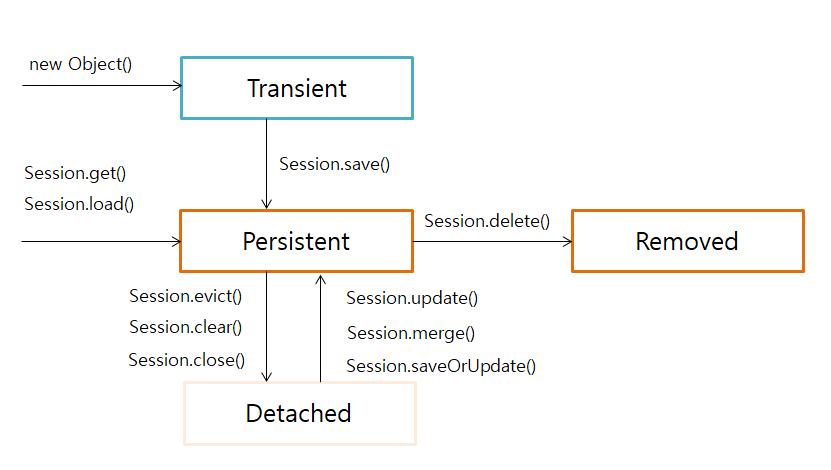

# 엔티티 생명주기

> Entity의 4가지 상태(Transient, Persistent, Detached, Removed)가 어떻게 전이되는지 Life cycle을 알아봅니다.




```java
@Component
@Transactional
public class JpaRunner implements ApplicationRunner{
	@PersistenceContext
	EntityManager entityManager;
	
	@Override
	public void run(ApplicationArguments args) throws Exception {
        Account account = new Account();
        account.setUsername("hyein");
        account.setPassword("jpa");
		
        Study study = new Study();
        study.setName("Spring Data JPA");
        
        Session session = entityManager.unwrap(Session.class);
        session.save(account);
        session.save(study);
	}
}
```
## 엔티티 상태
### 1. Transient (비영속)

```java
        Account account = new Account();
        account.setUsername("hyein");
        account.setPassword("jpa");
        
        Study study = new Study();
        study.setName("Spring Data JPA");
```

인스턴스를 생성했지만(`new Object()`) JPA는 아직 모르는 상태다. 영속화되서 DB에 반영될 수도 있고, 반영되지 않을 수도(garbage) 있다.

### 2. Persistent (영속)

```java
        session.save(account);
        session.save(study);
```
Transient 상태의 인스턴스가 Session에 `save()`되면 이는 Session(영속성 컨텍스트)이 관리하는 인스턴스가 된다. 

> 참고 : 하나의 Session이 내부적으로 하나의 영속성 컨텍스트를 갖는다고 한다.

- **save()한 즉시 insert 쿼리가 발생하지 않는다** : Persistent 상태라는 말만 들으면 DB에 바로 insert해서 영속된다는 의미로 받아들여질 수 있다. 하지만 이는 영속성 컨텍스트에서 관리되고 있는(managed) 상태일뿐 DB에 반영되는 건 아니다. 

- 영속성 컨텍스트는 Persistent 상태의 인스턴스를 캐시에 저장한다. (1차 캐시)
- 영속성 컨텍스트는 인스턴스의 변경사항을 모니터링하고 있다. (Drity checking)

### 3. Detached (준영속)

```java
        session.evict(account);
        session.clear(account);
        session.close(account);
```
위 메서드들이 실행되면 Persistent 상태의 인스턴스가 Session(영속성 컨텍스트)과 연결이 끊기게 되고 Detached 상태가 된다. Detached 상태는 영속성 컨텍스트가 관리하지는 않지만 다시 Session에 연결되서(재진입) 관리 대상이 될 수 있다.


### 4. Removed(삭제)

```java
        session.delete(account);
```
영속성 컨텍스트가 관리하긴 하지만 삭제하기로 한 상태다.
- **delete()한 즉시 delete 쿼리가 발생하지 않는다** : delete 역시 바로 delete되지 않는다. 특정 시점에 DB에 반영된다.


## 그렇다면 언제 변경내용이 DB에 반영이 될까? : 플러시
- `flush()` 직접 호출 
- 트랜잭션이 commit될 때 `flush()` 자동 호출
- JPQL 쿼리 실행시 `flush()` 자동 호출

단, flush()를 호출한다고 해서 영속성 컨텍스트를 비우는 건 아니다. flush가 호출된 시점에는 **영속성 컨텍스트의 변경 내용을 데이터베이스와 동기화**할 뿐이다.


# 참고자료
- [스프링 데이터 JPA](https://www.inflearn.com/course/%EC%8A%A4%ED%94%84%EB%A7%81-%EB%8D%B0%EC%9D%B4%ED%84%B0-jpa/dashboard)
- [JPA 객체를 활용한 개발](https://12bme.tistory.com/492)
